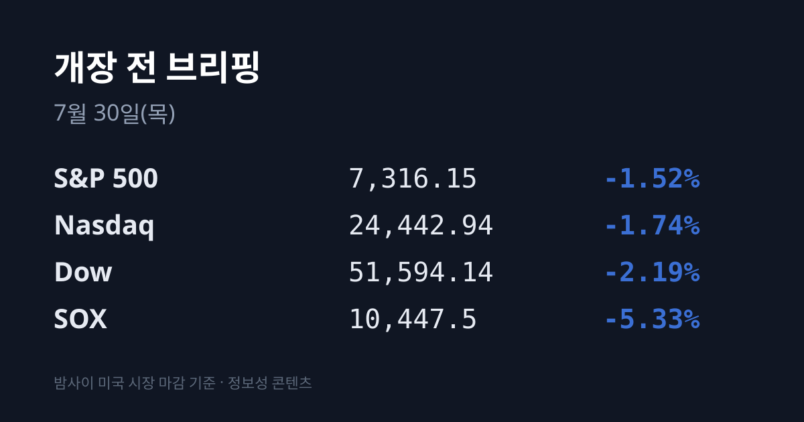
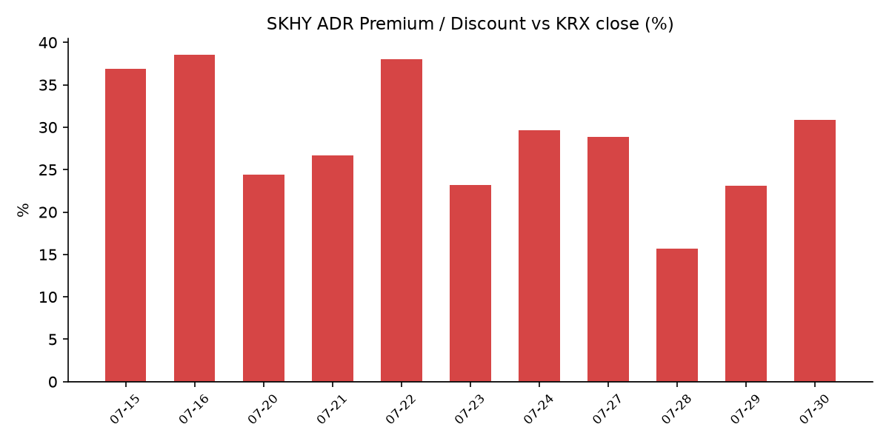
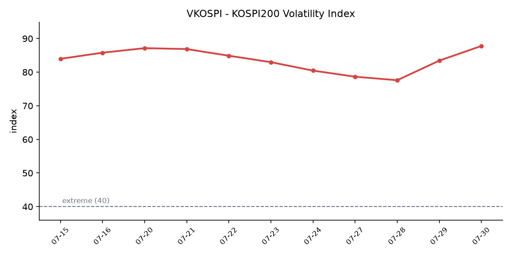

&nbsp;

【① 30초 요약】

- 연준은 기준금리를 **3.50~3.75%로 5회 연속 동결**했으나(발표 KST 07/30 03:00), <mark>3명의 위원이 25bp 인상에 표를 던진 '매파적 동결'</mark>이었다. 미 10년물 금리는 4.70%로 되올랐고 다우는 **−2.19%(51,594.14)** 로 2025년 4월 이후 최악의 하루를 기록했다.

- 중동이 다시 격화됐다. 이란이 요르단 주둔 미군기지에 탄도미사일 기습 공격을 가하고, 친이란 이라크 민병대가 사우디 석유시설에 이틀 연속 드론을 날렸다. <mark>브렌트 9월물은 $90.74(+7.9%)</mark>, WTI 9월물은 $84.46(+6.6%)로 정산됐다.

- 반도체는 다섯째 날도 밀렸다. **SOX 10,447.5(−5.33%)** 로 5거래일 연속 하락했고, 7월 누적 **−18.9%** 는 2008년 이후 최악의 월간 기록이다. 구성종목 전부가 50일 이동평균선을 밑돌고 있다.

- 미 장마감 후 실적은 정확히 갈렸다. <mark>마이크로소프트는 Azure +43%로 시간외 +3%</mark>, 메타는 비용 +55%·EPS 컨센 미달로 시간외 −6.2%였다. 퀄컴은 −4%, 스타벅스는 +5%였다.

- 어제(07/29) 코스피는 **5,663.24(−360.42p, −5.98%)** 로 마감했다. 코스피·코스닥 서킷브레이커가 <mark>이틀 연속 동반 발동된 것은 사상 최초</mark>다. 이틀 누적 하락률은 −16.17%다.

- SK하이닉스는 분기 사상 최대 실적(영업이익 **60조5,426억원**, 영업이익률 76%)을 발표했으나 컨센서스를 약 5% 하회하며 −9.61%로 마감했다. ADR 괴리율은 +23.1%에서 **+30.9%로 재확대**됐다.

&nbsp;

【② 밤사이 미국 시장 📈】

| 지수 | 종가 | 등락률 |
| :--- | :--- | :--- |
| 다우 | 51,594.14 | −2.19% (−1,153.18) |
| S&P 500 | 7,316.15 | −1.52% (−112.63) |
| 나스닥 | 24,442.94 | −1.74% (−433.97) |
| SOX(필라델피아 반도체) | 10,447.5 | −5.33% |

07/29 미국장을 움직인 것은 두 가지였다.

첫째는 연방공개시장위원회(FOMC)다. 연준은 기준금리를 3.50~3.75%로 동결해 5회 연속 동결을 이어갔으나, **위원 3명이 25bp 인상에 표를 던졌다.** 케빈 워시 의장 취임 후 두 번째 회의였다. 채권시장은 이를 "연준이 인플레이션 대응에 뒤처지고 있다"는 신호로 받아들였고, 미 10년물 금리는 **4.70%** 로 올랐다. 회의 전 선물시장이 반영한 확률은 동결 68.5%·25bp 인상 31.5%였다.

둘째는 중동이다. 이란이 요르단에 주둔한 미군 기지에 탄도미사일 기습 공격을 가해 짧았던 휴전 국면이 종료됐고, 친이란 이라크 민병대는 사우디아라비아 리야드·동부 지역 석유시설에 이틀 연속 드론 공격을 감행했다. 미국과 사우디 전투기는 이라크 민병대를 보복 타격했고, 트럼프 대통령은 "이란을 강하게 타격하겠다"고 밝혔다. 이란은 오만이 제시한 호르무즈 해협 50대 50 공동관리안을 거부하고 전 구간 통제권을 주장했다.

브렌트 9월물은 7.9% 올라 $90.74에, WTI 9월물은 6.6% 올라 $84.46에 정산됐다. 미국 주간 원유재고는 720만 배럴 감소해 6월 중순 이후 최대 감소폭을 기록했다. VIX는 **20.66(+13.45%)**, 금은 $4,129.50(+0.79%)이었다.

섹터별로는 산업재(−3.42%)와 기술(−2.36%)이 가장 부진했고 에너지만 강세였다. 캐터필러가 투자의견 하향으로 −6.91%, 디어가 −4.52%였다.

**장마감 후 실적은 AI 투자를 둘러싼 시장의 질문에 서로 다른 답을 내놨다.**

마이크로소프트는 회계연도 4분기 조정 주당순이익 **$4.74**(컨센 $4.24)·매출 **$900.1억**(컨센 $876.2억)을 기록했고, <mark>Azure 매출이 43% 성장</mark>해 컨센(40.2%)을 웃돌았다. Azure의 연간 매출은 처음으로 1,000억 달러를 넘었고 마이크로소프트 클라우드 전체는 $593.0억(+27%)이었다. 2027 회계연도 설비투자 가이던스를 $2,550~2,600억(2026년 $1,900억)으로 올렸음에도 주가는 시간외에서 약 3% 상승했다.

반면 메타는 매출 $608억(+28%)으로 컨센을 약 1% 웃돌았으나 주당순이익이 $6.18로 컨센 대비 $1.04 미달했고, 비용이 **$420억(+55%)** 으로 늘며(소송 관련 $24억·희망퇴직 $12억 포함) 순이익이 $158억으로 14% 감소했다. 3분기 매출 가이던스 $610~640억은 하단이 컨센($631.5억)에 미달했고, 설비투자 가이던스 하단은 $1,250억에서 $1,300억으로 올라갔다 — 주가는 시간외에서 6.2% 하락했다.

그 외 퀄컴이 3분기 EPS $2.21(컨센 $2.23) 미달과 4분기 가이던스 $2.05~2.25로 −4%, 스타벅스가 연간 전망 상향·동일점포 매출 +7.9%·EPS 85센트(컨센 66센트)로 +5%, 카바나가 연간 가이던스 미달로 −14%였다. 직전 세션에 알파벳은 설비투자 상향 후 −7%였다.

&nbsp;

【③ 괴리율 트래커 — SK하이닉스 ADR】

| 항목 | 수치 |
| :--- | :--- |
| SKHY 종가 | $126.79 (−2.60%) |
| 본주 환산가 (×10×환율 1,446.7원) | 1,834,271원 |
| 본주 직전 종가 | 1,401,000원 |
| **괴리율** | **+30.9%** |

괴리율이 이틀 연속 벌어졌고, 벌어진 방식도 이틀 연속 같았다. 07/28에는 ADR이 −8.76%인데 본주가 −14.65%로 5.9%p 더 빠졌고, **07/29에는 ADR이 −2.60%인데 본주가 −9.61%로 7.0%p 더 빠졌다.** 이틀을 합치면 약 13%p다.

07/29가 특별한 이유는 실적이라는 같은 정보가 두 시장에 동시에 주어진 날이었다는 점이다. 같은 회사의 같은 실적을 받아들고 미국 상장 증권은 2.6% 내렸고 한국 본주는 9.6% 내렸다.

괴리율이 벌어지면 구조적으로 차익거래 유인이 커진다. 환산가가 본주보다 비싸다는 것(프리미엄)은 미국에서 사는 것보다 한국에서 사는 것이 싸다는 뜻이고, 두 시장의 증권이 상호 전환 가능하다면 그 격차는 전환 거래를 통해 좁혀지는 방향으로 압력을 받는다.

다만 이 종목의 전환 구조는 대칭이 아니다. **07/29부터 본주와 ADR 사이 양방향 전환 신청이 개시**됐으나, 본주→ADR 전환 총량이 발행주식의 2.5%로 제한돼 있고 초기 발행 쿼터가 이미 소진돼 실질적으로 가능한 방향은 ADR→본주뿐이다. 이 방향의 전환은 결과적으로 본주 매도가 아니라 본주 유통주식 수 증가로 나타난다. 현재 +30.9%는 07/22의 +38.0% 이후 가장 높은 수준이다.

&nbsp;

【④ 변동성 트래커 🌡️】

**판정 한 줄**: <mark>'극단' 심화, 그러나 파는 주체가 외국인에서 개인으로 교체됐다</mark> — VKOSPI가 이틀 연속 올라 90선에 근접했고 서킷브레이커가 사상 최초로 이틀 연속 동반 발동됐으나, 같은 날 외국인 순매도는 84% 줄고 개인이 순매도로 돌아섰다.

**기대 변동성** — VKOSPI **87.79**(07/29, +4.36p, +5.23%). 40 이상은 '극단' 구간이며(25 미만 평온 / 25~40 경계 / 40 이상 극단) 현재는 기준의 약 2.2배다. 07/27 저점 77.55에서 이틀 만에 10.24p 올랐고, 상승은 2거래일 연속이다.

**실현 변동성** — 최근 7거래일 일별 등락률은 07/21 +3.56% → 07/22 +0.74% → 07/23 +4.39% → 07/24 −5.72% → 07/27 +0.97% → 07/28 −10.84% → 07/29 −5.98%다. 이 중 **5일이 ±3.5% 이상**이었다. 07/29 하루 진폭은 약 9.8%로, 장중 고가 6,228.52(+3.40%)에서 장중 저가 5,637.85(−6.41%)까지 벌어졌다. 이틀 누적 −16.17%, 시가총액 921조원이 줄었다.

**매매 정지** — 07/29 코스피·코스닥에서 매도 사이드카가 동반 발동됐고 코스피 서킷브레이커가 10시 55분에 발동됐다. 코스피와 코스닥 서킷브레이커가 이틀 연속 동반 발동된 것은 한국 증시 **사상 최초**다. 7월 코스피 누적으로는 사이드카 13회(매도 8·매수 5), 서킷브레이커 3회다.

**증폭 경로** — 07/29 단일종목 레버리지 ETF 거래 비중·회전율은 집계 시점 기준 미확인이다(직전 확보치는 07/27 비중 31.3%·회전율 77.7%). 삼성전자·SK하이닉스를 기초자산으로 하는 레버리지 상품에서는 하루 **26~29%** 의 손실이 발생했다.

**청산 압력** — 미수거래 반대매매가 **직전 거래일의 3배 이상**으로 급증했다. 잔존 레버리지 규모는 약 6.8조원으로 집계된다. 신용융자 잔액은 작년 말 27조3,000억원 → 3월 말 32조9,000억원 → 6월 말 37조3,000억원으로 늘었다가 07/24 기준 32조6,716억원으로 6/24 연중 최고(38조6,328억원) 대비 15.43% 줄었다. 일평균 미수거래 반대매매 금액은 작년 말 71억원 → 3월 262억원 → 6월 527억원이다.

**하방 포지션** — 코스피 공매도 순잔고 최신 확보치는 **16.85조원(07/22)** 이다. 공매도 잔고는 T+3 공시 지연이 적용되므로 07/28~29 폭락 당일 잔고는 구조적으로 확인할 수 없다.

미확인 항목: 07/29 신용융자 잔고 절대치, 단일종목 레버리지 ETF 거래비중·회전율, 공매도 순잔고 최신치, 코스피200 야간선물, 프로그램 매매 차익/비차익, 선물 베이시스, 달러인덱스, 미 2년물 금리.

&nbsp;

【⑤ 어제 한국장 리뷰】

| 지수 | 종가 | 등락률 |
| :--- | :--- | :--- |
| 코스피 | 5,663.24 | −5.98% (−360.42) |
| 코스닥 | 662.68 | −6.12% (−43.17) |

코스피는 6,089.11(+1.09%)로 상승 출발해 장중 6,228.52까지 올랐으나 이후 5,637.85까지 밀렸고 5,663.24로 마감했다. 시가에서 종가까지의 경로가 완전히 뒤집힌 하루였다.

수급의 구성이 전날과 정반대로 바뀌었다. 코스피에서 **외국인은 −7,911억원**을 순매도했는데, 이는 07/28의 −4조9,592억원에서 84% 줄어든 규모다. 대신 **기관이 +3조6,301억원**을 순매수했고, 07/28에 4조3,180억원을 순매수했던 **개인은 −2조9,265억원으로 순매도로 돌아섰다.** 미수거래 반대매매가 직전 거래일의 3배 이상으로 급증한 것이 개인 순매도의 기계적 배경이다.

시총 상위에서는 삼성전자가 **208,500원(−5.23%)**, SK하이닉스가 **1,401,000원(−9.61%)** 으로 마감했다.

SK하이닉스는 이날 오전 9시 2분기 실적을 발표해 매출 79조3,187억원·영업이익 60조5,426억원·순이익 93조9,226억원·영업이익률 76%로 전년 동기 대비 각각 256.8%·557.2% 증가한 분기 사상 최대 실적을 기록했으나, 증권가 컨센서스를 약 5% 하회했다. 컨퍼런스콜에서는 2026년 투자 규모를 40조원 후반으로, M15X 양산 일정을 앞당기고 2027년 초 용인 1기 클린룸을 여는 계획을 제시했다.

증권가에서는 범용 메모리 단가 상승에 기대 높아진 시장 눈높이와 HBM 위주로 재편된 사업 구조 사이의 간극을 하락 배경으로 지목했고, 목표가를 낮추면서도 HBM 중심 생산전략과 장기공급계약 확대로 메모리 부족이 장기화될 가능성은 유지했다. 같은 기간 삼성전자가 차세대 **HBM4** 를 공개해 HBM 시장 구도에 변화 요인이 추가됐다.

시총 10위권에서 오른 종목은 셀트리온(+1.47%) 하나였다. 에코프로비엠은 −9.04%, PSK는 −8.45%였다.

**지수가 −5.98% 내린 장에서 상한가가 나온 곳은 로봇 섹터였다.** 미 연방통신위원회(FCC)가 사이버·국가안보를 이유로 외국산 휴머노이드 로봇·4족 로봇·전력 인버터의 신규 수입을 금지하기로 의결한 것이 배경으로 거론됐다. 코스닥에서 엔젤로보틱스가 상한가를 기록했고, 티엑스알로보틱스가 +24.62%(13,870원), 에스피지가 +20.29%(81,800원), 나우로보틱스가 +18.33%(14,200원), 아이로보틱스가 +12.71%(2,040원)로 마감했다. 코스피에서는 한화갤러리아우가 유일한 상한가였다.

원/달러 환율은 **1,446.7원(−15.8원)** 으로 주간거래를 마쳤다. 2월 27일(1,439.7원) 이후 약 5개월 만의 최저 종가다. 주식이 이틀에 16.17% 내리는 동안 환율은 이틀 연속 하락했다.

아시아 주요 지수는 닛케이 61,434.19(−1.49%), 대만 가권 약 −4%, 상해종합 +0.2%였고 항셍은 IPO 효과로 아시아 주요 지수 중 가장 크게 올랐다.

&nbsp;

【⑥ 오늘의 캘린더 & 관전 포인트 📅】

| 시각(KST) | 이벤트 |
| :--- | :--- |
| 10:00 | **삼성전자 2분기 확정 실적 컨퍼런스콜** (잠정치 매출 171조원·영업이익 89.4조원) |
| 21:30 | 미 2분기 GDP 속보치(컨센 연율 +2.3%, 전분기 +2.1%), 6월 PCE·근원 PCE, 개인소득·개인소비, 신규 실업수당 청구 |
| 07/31 새벽 | 미 장마감 후 **애플·아마존** 실적 발표 |
| 07/31 | 단일종목 레버리지 상품 기본예탁금 현금 3,000만원 시행, 한국 6월 광공업생산 |

**07/30:** 삼성전자의 2분기 잠정 실적은 매출 171조원·영업이익 89.4조원으로, 전분기 대비 27.74%·56.21%, 전년 동기 대비 129.31%·1,810.26% 증가한 수치였다. 오늘 10시 컨퍼런스콜에서 확정치와 HBM4 관련 로드맵·설비투자 계획이 확인된다.

시장 참가자들이 주시하는 레벨은 다음과 같다. VKOSPI **90선**(현재 87.79), 미 10년물 **4.70%** 수준, 브렌트유 **$90.74** 와 호르무즈 해협 상황, ADR 괴리율 **+30.9%**, 그리고 외국인 순매도 규모가 07/29의 −7,911억원에서 어느 방향으로 움직이는지다.

미 지수선물은 이 글 작성 시점 기준 S&P 500 7,366.75(+0.21%)·나스닥100 27,441.00(+0.36%)·다우 51,922.00(+0.30%)에 있다.

&nbsp;

【⑦ 정책 워치】

금융위원회는 단일종목 레버리지 상품에 대한 조치를 단계적으로 시행하고 있다. **기본예탁금을 현금 3,000만원으로 강화하는 조치는 당초 일정보다 앞당겨 07/31부터 시행**된다. 신규 상품 상장 중단과 광고 금지는 이미 적용 중이며, 개인별 투자한도를 금융투자상품 총투자금액의 일정 비율(예시 20%) 이내로 제한하는 방안이 검토되고 있다. 투자자 보호 체계 개선 방안은 8월 중 시행 예정이고, 레버리지 배수 조정과 전문투자자 한정 방안도 검토 대상에 올랐다.

김용범 대통령실 정책실장은 "레버리지 ETF가 변동성을 두드러지게 보이게 할 수는 있으나 유일한 원인은 아니다"라며 한국 시장 특유의 높은 변동성에 대한 구조적 원인 조사가 필요하다고 밝혔다. 금융위원회와 금융감독원이 그 점검에 착수한다.

시장에서는 증시안정펀드 투입과 공매도 금지 요구가 확산됐으나 당국이 결정한 사항은 없다. 공매도 제도는 2026년 3월 31일 전 종목 전면 재개 상태가 유지되고 있으며 변경 사항은 없다.

&nbsp;

【⑧ 오늘의 질문】

같은 회사의 같은 실적을 두고 미국 상장 증권은 2.6% 내리고 한국 본주는 9.6% 내린 이틀간의 격차를, 오늘 삼성전자 컨퍼런스콜은 어떻게 설명해줄 것인가.

&nbsp;

#개장전브리핑 #미국증시마감 #하이닉스ADR #괴리율 #코스피 #FOMC #서킷브레이커 #VKOSPI #반도체 #삼성전자실적

&nbsp;

본 글은 공개된 시장 데이터를 정리한 정보성 콘텐츠이며, 특정 종목·상품의 매매 권유가 아닙니다. 모든 투자 판단과 책임은 투자자 본인에게 있습니다. 수치는 작성 시점 기준이며 이후 변동될 수 있습니다.