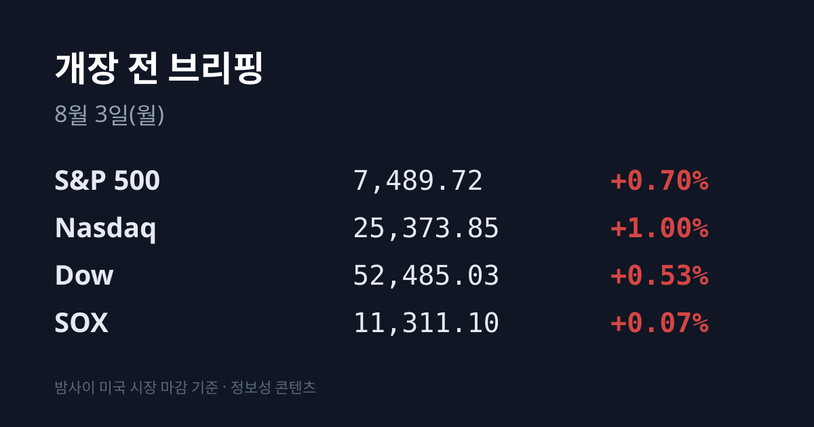
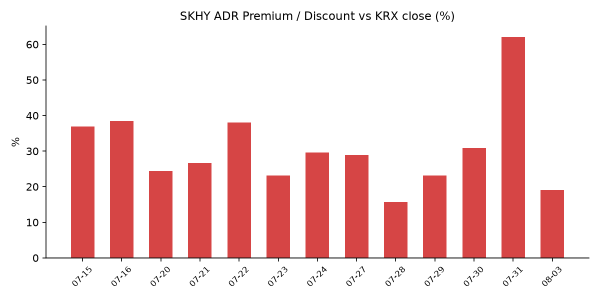
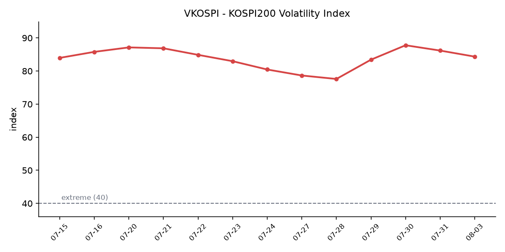

&nbsp;

【① 30초 요약 📈】

코스피가 7월 31일 <mark>1,001.89포인트(+17.91%) 올라 6,595.45로 마감</mark>했습니다. 개장 이래 사상 최대 상승폭이자 상승률입니다. 코스닥은 719.76(+11.63%)이었습니다.

SK하이닉스는 **1,718,000원(+29.95%)** 상한가로 마감했습니다. 상한가는 2009년 이후 약 17년 만이며, 가격제한폭이 15%에서 30%로 확대된 2015년 이후로는 처음입니다. 삼성전자도 262,500원(**+26.81%**)으로 일간 기준 역대 최고 상승률을 기록했습니다.

외국인이 **7조5,700억원 이상**을 순매수했습니다. 기관은 2조1,000억원 이상, 개인은 5조2,000억원 이상 순매도했습니다.

금요일 미국장은 S&P 500 +0.70%, 나스닥 +1.00%, 다우 +0.53%로 마감했습니다. 아마존이 +15.32%, 애플이 −7.35%였고 SOX는 +0.07%로 보합이었습니다.

8월 1일 발표된 7월 수출은 988억9,000만달러(+62.8%)로 역대 2위였고, <mark>반도체 수출은 410억1,000만달러로 전년 대비 +178.8%</mark> 급증해 2개월 연속 400억달러를 넘었습니다.

&nbsp;

【② 밤사이 미국 시장 🌙】

7월 31일(현지) 미국 증시는 상승 마감했습니다. 한국 증시가 쉬는 동안 미국은 1세션이 지나갔습니다.

| 지수 | 종가 | 등락률 |
| :--- | ---: | ---: |
| S&P 500 | 7,489.72 | +0.70% |
| 나스닥 | 25,373.85 | +1.00% |
| 다우 | 52,485.03 | +0.53% |
| SOX(필라델피아 반도체) | 11,311.1 | +0.07% |
| 러셀 2000 | 2,931.34 | −0.50% |

7월 월간으로는 S&P 500 +1.0%, 다우 +1.0%(4개월 연속 상승), 나스닥 +1.6%였습니다.

개별 종목에서는 **아마존이 +15.32%** 로 급등했습니다. 전날 장 마감 후 발표한 2분기 실적에서 AWS 매출이 전년 대비 +37% 성장한 것이 시간외 +8~9%에 이어 정규장에서 더 크게 반영됐습니다. 알파벳 +6.9%, 메타 +3.3%, 마이크로소프트는 전날 +15.5%에 이어 +3% 추가 상승했습니다.

반면 <mark>애플은 −7.35%로 낙폭을 키웠습니다</mark>. 서비스 매출과 중화권 매출이 컨센서스를 밑돌면서 시간외 −4%였던 낙폭이 정규장에서 더 확대됐습니다.

SOX는 +0.07%로 사실상 제자리였습니다. 직전 세션(7월 30일)에 +8.19% 급등해 1년 3개월 만의 최대 상승폭을 기록한 뒤 하루를 쉬어간 형태입니다.

시장에서는 마이크로소프트·아마존·알파벳·메타 등 4대 클라우드 사업자의 2026년 자본지출 계획 합계가 **7,200억~7,450억달러** 수준으로 제시되며 하향 조정 없이 오히려 상향됐다는 점이 AI 인프라 수요 확인 신호로 해석됐습니다.

채권 시장은 반대 방향이었습니다. 미 10년물 국채금리는 **4.712%**, 2년물은 4.268%로 인플레이션 경계 속에 상승했습니다. VIX는 17.09로 마감했습니다.

국제유가는 브렌트 9월물이 배럴당 $90.12(+1.22%), WTI 9월물이 $84.67(+1.29%)로 올랐습니다. 이란혁명수비대가 호르무즈 해협에서 유조선 2척의 통과를 저지했다는 보도가 나오면서입니다. 주간으로 브렌트 +6.9%·WTI +5.2%, 월간으로는 브렌트 +24%·WTI +21%였습니다. 금은 온스당 약 $4,062였습니다.

다만 이후 이스라엘 채널12 보도 기준으로 이란 외무장관이 호르무즈 해협 완전 개방 타협안에 동의했고, 트럼프 대통령이 예정했던 추가 공습을 취소했다는 소식이 전해졌습니다. 8월 2일에는 이란 외무부 대변인이 국영방송에서 오만과의 해협 관리 합의에 도달할 것이라고 밝혔습니다. 미국과 카타르가 조율한 타협안은 선박이 이란 통제 구역으로 진입하고 오만 측 해역으로 빠져나가는 방식입니다. 이란 측은 "어떤 경우에도 해협이 과거 상태로 되돌아가지는 않는다"는 입장도 함께 밝혔습니다.

&nbsp;

【③ 괴리율 트래커 — SK하이닉스 ADR 📊】

| 항목 | 수치 |
| :--- | :--- |
| SKHY 종가 | $143.73 (−3.54%) |
| 본주 환산가 (×10×환율 1,424.0원) | 2,046,715원 |
| 본주 직전 종가 | 1,718,000원 |
| **괴리율** | **+19.1%** |

전 거래일 기준 +62.0%였던 괴리율이 **+19.1%** 로 좁혀졌습니다. 하루 만에 42.9%p가 압축된 것으로, 이 트래커 집계 이래 최대 압축폭입니다.

주목할 것은 압축이 일어난 경로입니다. <mark>SKHY(ADR)는 −3.54% 내렸고 본주는 +29.95% 올랐습니다</mark>. 즉 좁혀진 42.9%p 중 대부분을 본주 상승이 만들었고, ADR 하락 기여는 상대적으로 작았습니다.

괴리율이 프리미엄(+)이라는 것은 미국에 상장된 주식예탁증서를 원화로 환산한 값이 국내 본주 가격보다 높다는 뜻입니다. 구조적으로는 두 가격이 같은 회사의 같은 지분을 나타내므로 차이가 벌어지면 전환·차익거래 유인이 생깁니다. 다만 SK하이닉스의 경우 ADR을 본주로 전환할 수 있는 물량이 1,779만주(발행주식의 2.5%)로 제한돼 있고 전환 절차에도 수 주 이상이 걸립니다. 이 마찰 때문에 괴리가 즉시 메워지지 않는 구조라는 해석이 시장에서 나옵니다.

참고로 이번 국면에서 이 트래커가 기록한 괴리율은 7월 28일 +15.7%가 최저, 7월 31일 +62.0%가 최고였습니다. 현재 +19.1%는 국면 저점권에 가까운 수치입니다.

괴리율 추이: 7/22 +38.0 → 7/23 +23.2 → 7/24 +29.6 → 7/27 +28.9 → 7/28 +15.7 → 7/29 +23.1 → 7/30 +30.9 → 7/31 +62.0 → 8/3 +19.1

&nbsp;

【④ 변동성 트래커 🌡️】

판정 한 줄: <mark>'극단' 유지, 그러나 증폭 장치가 실제로 꺼졌다</mark> — VKOSPI 이틀 연속 하락(84.35), 매매정지 장치의 방향이 매도에서 매수로 전환, 단일종목 레버리지 ETF 거래대금 1/5 축소가 모두 같은 방향을 가리킵니다. 다만 7월 31일 하루 진폭이 +17.91%로 사상 최대였다는 사실은 변하지 않습니다.

**기대 변동성** — VKOSPI **84.35**(7/31, −1.83p, −2.12%)로 이틀 연속 하락했습니다. 7/29 87.79 → 7/30 86.18 → 7/31 84.35의 경로입니다. 기준 40의 약 2.1배로 '극단' 구간(25 미만 평온 / 25~40 경계 / 40 이상 극단)이며, 6월 기록한 역대 최고 96.94보다는 낮습니다. 같은 날 미국 VIX는 17.09로 평온 구간이었습니다.

**실현 변동성** — 최근 7거래일 등락률은 7/23 +4.39% → 7/24 −5.72% → 7/27 +0.97% → 7/28 −10.84% → 7/29 −5.98% → 7/30 −1.23% → 7/31 +17.91%입니다. 이 중 ±3.5% 이상인 날이 5일입니다. 7월(1~30일) 코스피 평균 일중 지수 변동폭은 468.2포인트로 올해 최대였습니다(6월 422.0, 5월 306.6). 7월 코스피는 1일 8,303.41에서 30일 5,593.56까지 −32.6% 하락한 뒤 마지막 날 반등해 월간 −20.6%로 마감했습니다.

**매매 정지** — 7월 31일 코스피·코스닥에 매수 사이드카가 동시 발동됐습니다. 코스피는 09시 06분 02초(코스피200선물 997.50, 전일 대비 +129.90p·+14.97%), 코스닥은 1초 뒤인 09시 06분 03초(코스닥150선물 1,163.80, +99.40p·+9.33%)에 각각 5분간 프로그램 매수호가 효력이 정지됐습니다. 직전 흐름은 7/28·7/29 동반 서킷브레이커(하락), 7/30 무발동이었습니다. 7/31 서킷브레이커 발동은 없었습니다.

**증폭 경로** — 단일종목 레버리지 ETF 거래대금이 7/29 15조원 → 7/30 12조4,000억원 → **7/31 약 3조원**으로 줄었습니다. 전일 대비 약 4분의 1, 7/29 대비 약 5분의 1 수준입니다. 7월 31일부터 기본예탁금 현금 3,000만원 규제가 시행됐습니다(대용증권 불인정, 현금 인정 시점 T→T+2). 지수가 +17.91% 오른 날 레버리지 거래대금은 오히려 급감했습니다. 거래 비중·회전율은 집계 시점 기준 미확인입니다.

**청산 압력** — 신용거래융자 잔액은 32조9,950억원(7/29 기준)으로 6월 24일 역대 최대 38조6,328억원 대비 약 −14.6% 줄었습니다. 위탁매매 미수금 대비 반대매매 금액은 7/30 1,038억원으로 7/29 611억원에서 증가했습니다. 위탁매매 미수금은 1조2,000억원입니다. 7/31 당일 수치는 집계 시점 기준 미확인입니다.

**하방 포지션** — 코스피 공매도 순잔고는 최신 확보치가 7/22 기준 16.85조원입니다. 공매도 순보유잔고는 T+3 공시 지연이 있어 7/28~7/31 구간의 잔고는 구조적으로 확인되지 않습니다. 제도는 2026년 3월 31일 차입공매도 전 종목 전면 재개 상태가 유지되고 있으며 무차입 공매도는 계속 금지입니다.

집계 시점 기준 미확인: 코스피200 야간선물, 공매도 순잔고 최신치, 프로그램 매매 차익/비차익, 선물 베이시스, 레버리지 ETF 회전율·거래비중, 7/31 신용융자·반대매매 당일치.

&nbsp;

【⑤ 어제 한국장 리뷰 🇰🇷】

| 지수 | 종가 | 등락률 |
| :--- | ---: | ---: |
| 코스피 | 6,595.45 | +17.91% |
| 코스닥 | 719.76 | +11.63% |

코스피는 1,001.89포인트 올라 개장 이래 사상 최대 상승폭과 상승률을 동시에 기록했습니다. 주간으로는 −1.42%(−95.17p)였습니다. 7월 29일 장중 5,262.77까지 밀렸던 지수가 이틀 만에 6,595.45로 돌아온 흐름입니다.

수급은 외국인 +7조5,700억원 이상 순매수, 기관 −2조1,000억원 이상, 개인 −5조2,000억원 이상 순매도였습니다. 지수가 사상 최대폭으로 오른 날 개인과 기관이 대규모 순매도했고 외국인이 이를 전부 받아냈습니다.

시가총액 상위 종목은 SK하이닉스 1,718,000원(+29.95%, 상한가), 삼성전자 262,500원(+26.81%)이었습니다. SK스퀘어와 삼성전기도 상한가로 마감했고, 코스닥에서는 반도체 소부장·전력기기·전선 업종이 동반 급등했습니다.

원/달러 환율은 주간거래 종가 기준 **1,424.0원**으로 13.4원 내렸습니다. 나흘 연속 하락으로 누적 약 44원 내린 것이며, 2월 26일(1,425.8원) 이후 최저권입니다. 외국인의 사상 최대 규모 순매수가 원화 강세와 같은 방향을 가리켰습니다.

배경으로는 직전 미국장(7/30)에서 SOX가 +8.19%, 마이크론 +18.36%, 샌디스크 +25.99%, 마이크로소프트 +15.5%를 기록한 점, 7월 30일 삼성전자 컨퍼런스콜에서 "2027년 공급 부족이 올해보다 심화되고 2028년까지 지속된다"는 가이던스가 제시된 점, 최태원 SK 회장이 7월 30일 SK하이닉스 보통주 3,620주(약 48억원)를 처음으로 장내매수한 점이 함께 거론됐습니다.

아시아 증시도 같은 날 동반 상승했습니다. 대만 TAIEX는 43,119.75로 3,186.45포인트(+7.98%) 올라 사상 최대 포인트 상승을 기록했고, 닛케이 225는 64,362.02(+4.03%), 상해종합은 3,832(+0.72%)였습니다. 홍콩 항셍지수 7/31 종가는 집계 시점 기준 미확인입니다.

&nbsp;

【⑥ 오늘의 캘린더 & 관전 포인트 📅】

오늘(8/3, 월)

**08/03:** 미 ISM 제조업 PMI 7월 — 시장 예상 54.0(전월 53.3), ISM 물가지불 예상 70.0(전월 73.0), 신규주문 예상 57.0(전월 56.0). 23:00 KST 전후, 한국장 마감 후

S&P글로벌 미 제조업 PMI 확정치(잠정 53.8), 미 6월 건설지출(예상 +0.2%), 호르무즈 해협 관련 이란-오만 협상 진행 상황, 7월 31일 확정 수급·신용융자·반대매매 집계치 공표

이번 주

**08/04:** 미 JOLTS 구인이직, AMD 실적(미 현지 장 마감 후 → KST 8/5 새벽)

**08/05:** ADP 민간고용, 샌디스크 실적(미 현지 장 마감 후) — 7/30 +25.99% 급등 종목

**08/07:** 미 7월 고용보고서(비농업). 팔란티어(PLTR) 등 실적도 이번 주 예정

이미 발표된 것 — 한국장 미반영

8/1(토) 한국 7월 수출입 동향: 수출 988억9,000만달러(+62.8%)로 역대 2위·7월 기준 역대 최대, 반도체 410억1,000만달러(+178.8%)로 2개월 연속 400억달러 돌파, 수입 685억6,000만달러(+26.5%), 무역수지 +303억2,000만달러로 2개월 연속 300억달러 초과. 반도체가 전체 수출의 약 40%를 차지했습니다.

7/31 일본은행 금융정책결정회의: 기준금리 1.0% 동결(정책위원 9명 중 8명 찬성, 1명 0.25%p 인상 주장). 9월 회의 이후 추가 금리인상 본격 논의를 시사했고 엔 약세와 AI를 인플레이션 상승 압력 요인으로 지목했습니다. FY2026 실질 GDP 전망 0.6%, FY2027 0.8%.

시장이 주시하는 레벨 — 시장 참가자들은 미 10년물 국채금리 4.80% 선과 30년물 5.30% 선, 브렌트유 $95 선, VKOSPI 90 선, 그리고 ADR 괴리율의 이번 국면 저점이었던 +15% 선을 함께 지켜보고 있습니다. 증권가에서는 NH투자증권이 이번 주 코스피 예상 범위로 5,200~6,500선을 제시했고, 삼성증권 김종민 수석연구위원은 최근 장세를 "비정상의 정상화" 과정으로 평가했습니다.

&nbsp;

【⑦ 정책 워치 ⚡】

단일종목 레버리지 ETF·ETN 기본예탁금 규제가 7월 31일 시행됐습니다. 현금 3,000만원 기준이며 대용증권은 인정되지 않고, 현금 인정 시점도 매도 당일(T)에서 결제 완료일(T+2)로 강화됐습니다. 시행 첫날 해당 상품군 거래대금은 전일 12조4,000억원에서 약 3조원으로 줄었습니다.

8월 중 투자자 보호 체계 개선 방안 시행이 예정돼 있으며, 개인별 투자한도(금융투자상품 총투자금액의 예시 20% 이내) 도입은 검토 단계입니다. 신규 상품 상장 중단·광고 금지는 이미 시행 중입니다.

공매도 제도는 2026년 3월 31일 차입공매도 전 종목 전면 재개 이후 변경 사항이 없습니다. 무차입 공매도는 계속 금지입니다.

&nbsp;

【⑧ 오늘의 질문 ❓】

7월 31일의 사상 최대 폭등이 3거래일간 −17.2% 하락에 대한 되돌림이었는지, 아니면 8월 1일 발표된 반도체 수출 +178.8%가 뒷받침하는 재평가의 시작이었는지 — 외국인 순매수가 이틀 연속 이어지는지가 그 구분점이 될 수 있습니다.

&nbsp;

본 글은 공개된 시장 데이터를 정리한 정보성 콘텐츠이며, 특정 종목·상품의 매매 권유가 아닙니다. 모든 투자 판단과 책임은 투자자 본인에게 있습니다. 수치는 작성 시점 기준이며 이후 변동될 수 있습니다.

&nbsp;

#개장전브리핑 #미국증시마감 #하이닉스ADR #괴리율 #코스피 #코스닥 #반도체수출 #VKOSPI #삼성전자 #SK하이닉스 #증시일정

&nbsp;