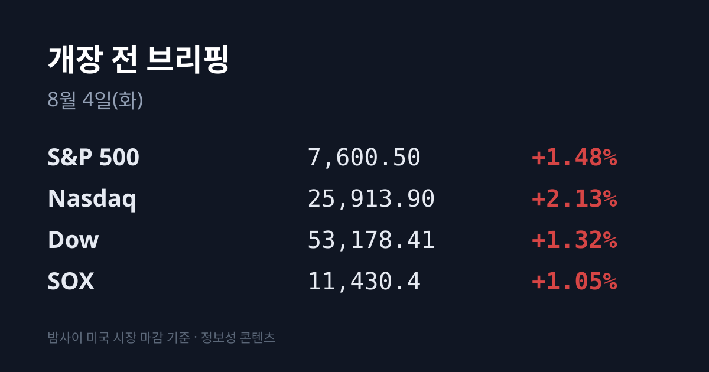
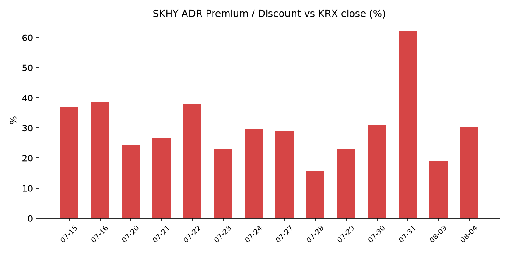
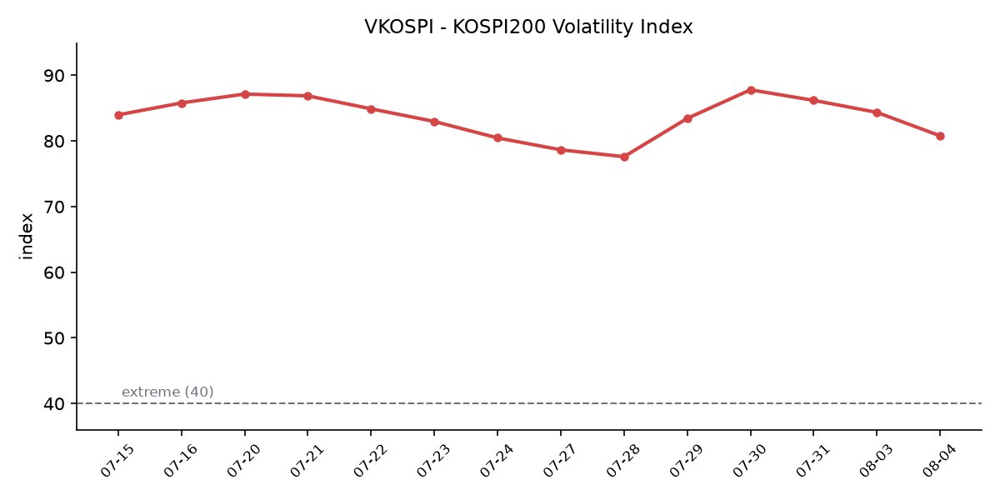

&nbsp;

【① 30초 요약 📈】

코스피가 8월 3일 <mark>338.00포인트(−5.12%) 내린 6,257.45로 마감</mark>했습니다. 직전 거래일(7월 31일) +17.91% 사상 최대 급등에 대한 차익실현 매물이 나왔습니다. 반면 코스닥은 737.35(**+2.44%**)로 이틀 연속 올랐고, 오전 10시 28분에 매수 사이드카가 발동됐습니다.

삼성전자가 239,500원(**−8.76%**), SK하이닉스가 1,567,000원(**−8.79%**)으로 마감했습니다. 외국인은 SK하이닉스를 1조7,744억원, 삼성전자를 9,521억원 순매도했습니다(순매도 1·2위).

같은 자산인 <mark>SK하이닉스 ADR(SKHY)은 −0.70%($142.72)에 그쳤습니다</mark>. 본주 −8.79%와의 격차 때문에 괴리율은 +19.1%에서 **+30.2%** 로 되돌아왔습니다.

밤사이 미국장은 다우가 53,178.41(+1.32%)로 **종가 사상 최고**를 새로 썼고 나스닥은 +2.13%였습니다. 트럼프 대통령이 이란 공습을 취소하면서 <mark>브렌트유가 −7.0%($83.77) 급락</mark>했고, 미 10년물 금리도 4.686%로 5.9bp 내렸습니다.

미 장 마감 후 팔란티어가 2분기 실적을 발표해 시간외 +10% 올랐습니다. 미국 상업부문 매출이 전년 대비 **+149%** 였고 연간 가이던스를 $8.16B로 상향했습니다.

&nbsp;

【② 밤사이 미국 시장 🌙】

8월 3일(현지) 미국 증시는 3대 지수가 모두 상승 마감했습니다.

| 지수 | 종가 | 등락률 |
| :--- | ---: | ---: |
| S&P 500 | 7,600.50 | +1.48% |
| 나스닥 | 25,913.90 | +2.13% |
| 다우 | 53,178.41 | +1.32% |
| SOX(필라델피아 반도체) | 11,430.4 | +1.05% |
| 러셀 2000 | 2,981.91 | +1.73% |

다우는 7월 6일 기록한 종가 사상 최고치 53,055.91을 한 달 만에 넘어섰고, S&P 500은 6월 2일의 사상 최고치 7,609.90에 근접했습니다.

상승의 직접 배경은 국제유가였습니다. 트럼프 대통령은 "사우디아라비아·UAE, 그리고 이란으로부터 공격을 취소해달라는 요청을 받았다"며 예정됐던 이란 공습을 취소하고, "호르무즈에 관한 합의가 있다. 그다음 핵 문제에 관한 합의가 있을 것"이라고 밝혔습니다.

<mark>브렌트유는 배럴당 $83.77로 −7.0%, WTI는 $80.34로 −5.1%</mark> 급락해 3주 최저권으로 내려왔습니다. 7월 한 달 두 유종이 모두 20% 넘게 올랐던 것의 되돌림입니다. 유가와 함께 미 10년물 국채금리는 **4.686%(−5.9bp)**, 30년물은 5.232%(−4.3bp)로 내렸습니다. VIX는 15.73(−1.63%), 금은 온스당 $4,106.70(+0.40%)이었습니다.

한편 이란 외무부 대변인은 "오만과의 협상은 호르무즈 통과 선박의 안전 보장 경로 합의에 초점을 맞추고 있으며, 가능한 한 빨리 임시 경로를 확정하는 것이 목표"라고 설명하면서 "이는 온전히 이란과 오만 사이의 양자 협상이며 미국 관련 사안은 추후 단계에서 다뤄질 것"이라고 선을 그었습니다. 호르무즈 통제권 자체는 놓지 않겠다는 입장도 유지했습니다.

개별 종목은 빅테크 중 애플만 약세였습니다(애플 등락률은 집계 시점 기준 미확인). 메타 +6.02%, 마이크로소프트 +4.93%, 알파벳 +4.88%, **아마존 +4.58%($284.02)** 였고 아마존은 시가총액 3조달러를 넘어섰습니다. 엔비디아는 +2.93%($206.64), AMD +1.78%($484.64), 마이크론 +0.74%($829.11), 인텔 +0.89%($91.00)였습니다.

다만 **SOX(+1.05%)는 나스닥(+2.13%)의 절반 수준**으로, 이날 랠리에서 반도체는 상대적으로 뒤처졌습니다.

경제지표에서는 7월 ISM 제조업 PMI가 **55.6**으로 나와 시장 예상(54.0)과 전월(53.3)을 모두 넘었습니다. 2022년 5월 이후 최고치이며, 신규주문 지수는 56.7, 고용 지수는 52.8로 33개월 만에 확장 국면으로 전환했습니다.

미 정규장 마감 후에는 팔란티어가 2분기 실적을 발표했습니다. 조정 EPS $0.41(컨센서스 $0.35), 매출 $1.94B(컨센서스 $1.8B)로 모두 상회했고, 미국 상업부문 매출이 전년 대비 +149%, 전체 매출이 +93% 늘었습니다. 연간 매출 가이던스는 기존 $7.65~7.66B에서 $8.16B로 올렸습니다. 시간외에서 +10%(장중 최고 +13%, $142.01) 올랐습니다.

같은 시간대에 스냅이 +11%(2분기 매출 $1.6B, 컨센서스 $1.54B), ON세미컨덕터가 +5%(EPS $0.74, 컨센서스 $0.71) 올랐고 월풀은 −3%였습니다.

리서치 시점(8월 4일 07:20 KST) 미 지수선물은 S&P 500 7,608.10(+0.10%), 나스닥100 28,829.50(+0.18%), 다우 53,272.90(+0.18%)이었습니다.

&nbsp;

【③ 괴리율 트래커 — SK하이닉스 ADR 🔍】

| 항목 | 수치 |
| :--- | ---: |
| SKHY 종가 (8/3) | $142.72 (−0.70%) |
| 원/달러 (8/3 종가) | 1,429.80원 |
| 본주 환산가 (×10×환율) | 2,040,611원 |
| 본주 직전 종가 (8/3) | 1,567,000원 |
| **괴리율** | **+30.2%** |

전일 브리핑의 +19.1%에서 **+11.1%p 재확대**됐습니다. 특징은 재확대의 경로입니다. ADR은 $143.73에서 $142.72로 −0.70% 움직였을 뿐이고, 본주가 −8.79% 빠지면서 격차가 벌어졌습니다. 즉 <mark>이번 재확대는 사실상 전부 본주 하락이 만들었습니다</mark>.

괴리율이 왜 생기고 왜 좁혀지는지는 구조로 설명됩니다. SKHY는 SK하이닉스 보통주 10주를 예탁한 증서이므로, ADR 가격 × 10 × 원/달러 환율이 이론상 본주 가격과 같아야 합니다. 프리미엄(+)이 크면 ADR을 팔고 본주를 사는 전환 차익거래 유인이, 디스카운트(−)면 그 반대 유인이 구조적으로 생깁니다. 다만 ADR→본주 전환 한도는 발행주식의 2.5%(1,779만주)이고 전환 절차에 수 주 이상 걸리므로, 괴리가 즉시 해소되지는 않습니다.

이번 국면의 괴리율 범위는 7월 28일 +15.7%(저점)에서 7월 31일 +62.0%(고점)까지였습니다. **+30.2%는 7월 30일의 +30.9%와 거의 같은 수준**입니다.

괴리율 추이: 7/22 +38.0 → 7/23 +23.2 → 7/24 +29.6 → 7/27 +28.9 → 7/28 +15.7 → 7/29 +23.1 → 7/30 +30.9 → 7/31 +62.0 → 8/3 +19.1 → **8/4 +30.2**

&nbsp;

【④ 변동성 트래커 🌡️】

판정 한 줄: <mark>'극단' 유지, 방향은 사흘 연속 진정 — 지수가 5% 급락한 날에 기대 변동성이 오히려 4% 넘게 내렸습니다</mark>. VKOSPI 사흘 연속 하락·레버리지 거래대금 억제 지속·신용융자 30조원 하회·코스닥 매수 사이드카가 모두 같은 방향을 가리킵니다.

**기대 변동성** — VKOSPI 8월 3일 종가 **80.78**(전일 84.35 대비 −3.57p, −4.23%)로 사흘 연속 하락했습니다. 40 이상은 '극단' 구간이므로 기준의 약 2.0배이며, 6월 역대 최고 96.94 대비로는 −16.2p입니다. 통상 지수 급락일에는 VKOSPI가 급등하고 실제로 7월 28일(−10.84%)·29일(−5.98%)에는 급등했는데, 8월 3일에는 반대로 움직였습니다. 같은 날 미국 VIX는 15.73이었습니다.

**실현 변동성** — 최근 7거래일 일별 등락률은 7/24 −5.72% → 7/27 +0.97% → 7/28 −10.84% → 7/29 −5.98% → 7/30 −1.23% → 7/31 **+17.91%** → 8/3 **−5.12%** 입니다. 이 중 **±3.5% 이상이 5일**입니다. 방향은 계속 뒤집히고 있고 진폭 자체는 줄지 않았습니다.

**매매 정지** — 8월 3일 오전 10시 28분 코스닥에 기관 프로그램 매수호가를 5분간 정지하는 **매수 사이드카**가 발동됐습니다. 올해 29번째 매수 사이드카입니다. 코스피는 −5.12% 하락에도 발동되지 않았습니다. 최근 5거래일 이력은 7/28·7/29 동반 서킷브레이커(하락) → 7/30 무발동 → 7/31 코스피·코스닥 동반 매수 사이드카 → 8/3 코스닥 매수 사이드카입니다.

**증폭 경로** — 삼성전자·SK하이닉스 기초 단일종목 레버리지·인버스 ETF·ETN 16종의 8월 3일 거래대금은 **1조2,388억원**이었습니다. 규제 시행 직전 거래일인 7월 30일(12조4,485억원)의 약 10% 수준이고, 7월 31일(2조9,907억원) 대비로도 −58.6%입니다. 거래량은 7/31 2억4,193만주 → 8/3 1억1,242만주로 −53.5% 줄었습니다. 개인 거래액은 2,507억원으로 5월 27일~7월 30일 일평균 4조272억원 대비 **−93.8%** 입니다.

방향도 특이했습니다 — 본주가 8%대 급락한 날 개인은 레버리지를 순매도했습니다(삼성전자 레버리지 −160억원, SK하이닉스 레버리지 −281억원). 삼성증권 집계로는 SK하이닉스 레버리지를 매도한 투자자 중 29%가 삼성전자 현물주를 매수했습니다. 거래 비중·회전율은 집계 시점 기준 미확인입니다(직전 확보치는 7/27 비중 31.3%·회전율 77.7%).

**청산 압력** — 신용거래융자 잔고는 7월 31일 **28조9,349억원**으로 전 거래일보다 3조2,181억원 줄어 6개월 만에 30조원을 하회했습니다. 하루 3조원 넘는 감소는 최근 1년간 없었습니다. 6월 24일 역대 최대 38조6,328억원 대비 −25.1%입니다(유가증권 22조8,405억원·코스닥 6조943억원). 위탁매매 반대매매는 7월 31일 1,220억원으로 7월 30일 1,037억원에 이어 이틀 연속 1,000억원대였고, 7월 29일(611억원) 이후 3거래일 합계 약 2,900억원입니다.

**하방 포지션** — 코스피 공매도 순잔고는 최신 확보치가 7월 22일 기준 16.85조원입니다. 공매도 잔고 공시는 T+3 시차가 있어 7월 28일~8월 3일 급락·급등·재하락 구간의 잔고는 구조적으로 확인되지 않습니다.

미확인 항목: 8월 3일 신용융자·반대매매 집계치, 코스피200 야간선물 방향, 레버리지 ETF 회전율·거래 비중, 프로그램 매매 차익/비차익, 선물 베이시스, 미 2년물 8월 3일 종가.

&nbsp;

【⑤ 어제 한국장 리뷰 🇰🇷】

| 지수 | 종가 | 등락 |
| :--- | ---: | ---: |
| KOSPI | 6,257.45 | −338.00 (−5.12%) |
| KOSDAQ | 737.35 | +17.59 (+2.44%) |

코스피는 6,358.27(−3.60%)로 출발해 장중 낙폭을 키웠습니다. 7월 31일 1,001.89포인트(+17.91%) 급등에 따른 차익실현 매물이 나왔습니다. 반면 코스닥은 이틀 연속 상승했습니다. **두 지수의 등락률 격차는 7.6%p**였습니다.

코스피 투자자별 순매수는 개인 **+6조4,338억원**, 외국인 **−3조8,708억원**, 기관 **−2조6,600억원**이었습니다. 종목별로는 외국인 순매도 1위가 SK하이닉스(−1조7,744억원), 2위가 삼성전자(−9,521억원)였고, 기관은 삼성전자 −1조2,192억원·SK하이닉스 −4,500억원을 팔았습니다. 두 종목에 대한 외국인·기관 순매도 합계는 약 4조4,000억원으로, 코스피 전체 외국인 순매도액(−3조8,708억원)보다 큽니다.

삼성전자는 239,500원(−8.76%), SK하이닉스는 1,567,000원(−8.79%)으로 마감했습니다. 7월 31일에는 SK하이닉스가 +29.95% 상한가(2009년 이후 17년 만, 가격제한폭 30% 확대 후 최초), 삼성전자가 +26.81%(일간 역대 최고)였습니다.

코스닥에서는 자금이 반도체에서 다른 업종으로 옮겨간 흐름이 나타났습니다. 코스피 상한가 3개, 코스닥 상한가 11개였습니다. 비만치료제 기대감으로 펩트론이 상한가였고 삼천당제약 +5.82%, 바이오에서 리가켐바이오 +9.03%·ABL바이오 +6.29%, 로봇에서 로보티즈 +17.25%·SPG +14.90%·현대무벡스 +8.96%·레인보우로보틱스 +5.89%였습니다. 생성형 의료 AI 첫 상용화 공급 소식에 딥노이드가 상한가로 마감했습니다.

그 밖에 레이 +24.75%, 세진티에스 +23.32%, 위닉스 +21.45%, 코스모로보틱스 +21.30%였고, IT부품에서는 삼성전기가 강세였습니다. 코스닥 투자자별 확정 순매수는 집계 시점 기준 미확인입니다.

원/달러 환율은 오후 3시 30분 기준 **1,429.80원**으로 5.8원 올라 닷새 만에 반등했습니다. 다만 같은 시각 달러인덱스는 99.72로 전 거래일(99.91)보다 내렸습니다. 원/엔 재정환율은 100엔당 915.39원(−6.52원), 엔/달러는 156.203엔이었습니다.

같은 날 아시아 증시는 방향이 갈렸습니다. 대만 TAIEX는 43,386.41(+266.66, **+0.62%**)로 하락 출발 뒤 반등 마감했고(미디어텍·ASE 상한가), 홍콩 항셍은 26,038.92(+0.6%), 중국 상해종합은 3,812.97(−0.5%), 일본 닛케이는 엔 강세 영향으로 63,140.68(−1.9%)였습니다.

&nbsp;

【⑥ 오늘의 캘린더 & 관전 포인트 📅】

오늘(8월 4일)

**23:00 KST** — 미 6월 JOLTS 구인·이직 보고서

미 장 마감 후(결과는 8월 5일 06:00 KST 전후) — **AMD 2분기 실적**. 회사 가이던스는 매출 $11.2B ±$300M, 컨센서스 EPS는 $1.34(전년 동기 $0.27)입니다. 콘퍼런스콜은 현지 17:00(ET)에 예정돼 있습니다.

이란-오만 호르무즈 통항 협상 및 미-이란 대화 진행 상황

8월 3일 확정 수급·신용융자 잔고·반대매매 집계치 공표

이번 주

**08/05(수)** — 미 ADP 민간고용, 샌디스크 실적(미 장 마감 후)

**08/07(금)** — 미 7월 고용보고서(비농업)

그 이후

**08/21** — 미 상원이 애플에 요구한 중국 CXMT·YMTC 메모리 미사용 확약 시한

8월 중 — 단일종목 레버리지 개인별 총량규제 시행, 괴리율 관리의무 3%→2% 강화, MSCI 분기 리뷰, 금통위(경제전망), 잭슨홀 회의

8월 중순 — 8월 1~20일 수출 잠정치

9월 — FOMC(스왑시장 기준 인상 확률 약 60%), BOJ 추가 인상 논의

시장 참가자들이 주시하는 레벨

SK하이닉스 ADR 괴리율 +30.2% — 이번 국면 저점은 7월 28일 +15.7%, 고점은 7월 31일 +62.0%였습니다

VKOSPI 80.78 — '극단' 기준선은 40, 6월 역대 최고치는 96.94입니다

미 10년물 4.686%, 30년물 5.232% — 지난주 고점은 10년물 4.712%였습니다

브렌트유 $83.77 — 7월 31일 종가는 $90.12였고 7월 월간 상승률은 20%를 넘었습니다

원/달러 1,429.80원 — 7월 27일 이후 나흘간 약 44원 하락한 뒤 닷새 만에 반등했습니다

신용거래융자 28조9,349억원 — 6월 24일 역대 최대치는 38조6,328억원이었습니다

&nbsp;

【⑦ 정책 워치 ⚡】

8월 2일 열린 긴급 시장상황점검회의(F4 회의)에서 단일종목 레버리지 상품 관련 추가 보완책이 논의됐습니다. 개인별 레버리지 투자한도를 제한하는 **총량규제를 즉시 추진**하기로 했고, 8월 중 증권사(유동성공급자)의 **괴리율 관리의무 기준을 국내 3%에서 2%로 강화**합니다. 금융당국은 시장 안정이 이뤄지지 않을 경우 배율 조정과 개인투자자 신규 매수 금지까지 검토 대상에 올려두고 있으며, 증시 불안 시 레버리지를 조정할 수 있는 긴급조치권 도입도 추진 중입니다.

7월 31일 시행된 기본예탁금 현금 3,000만원 규제는 이틀째 효과가 수치로 확인됐습니다. 해당 상품군 거래대금은 시행 직전 12조4,485억원에서 8월 3일 1조2,388억원으로 줄었습니다.

메모리 가격 쪽에서는 애플 팀 쿡 CEO가 메모리 가격 상승을 "100년 홍수"에 비유하며 9월 분기에 더 높은 가격을 지불하게 될 것이라고 밝혔습니다. 시장조사기관 트렌드포스는 3분기 범용 DRAM 계약가격이 **13~18% 추가 상승**할 것으로 제시했고, 2분기 LPDDR5X 계약가격은 전 분기 대비 78~83% 올랐다고 집계했습니다. DDR4 8Gb 6월 고정거래가는 $21(+5%)로 집계 이후 최고치였습니다. 한편 미 상원은 초당적으로 애플에 8월 21일까지 중국 CXMT·YMTC 메모리를 사용하지 않겠다는 확약을 요구했습니다.

공매도 제도는 2026년 3월 31일 차입공매도 전 종목 전면 재개 이후 변경 사항이 없습니다. 무차입 공매도는 계속 금지입니다.

&nbsp;

【⑧ 오늘의 질문 ❓】

8월 3일에 SK하이닉스 본주는 −8.79%, 같은 자산인 미국 ADR은 −0.70%로 8.1%p의 가격 격차가 벌어졌습니다 — 이 격차를 본주 상승이 좁히는지, 아니면 본주가 더 내려 괴리율이 더 벌어지는지.

&nbsp;

본 글은 공개된 시장 데이터를 정리한 정보성 콘텐츠이며, 특정 종목·상품의 매매 권유가 아닙니다. 모든 투자 판단과 책임은 투자자 본인에게 있습니다. 수치는 작성 시점 기준이며 이후 변동될 수 있습니다.

&nbsp;

#개장전브리핑 #미국증시마감 #하이닉스ADR #괴리율 #코스피 #코스닥 #반도체 #VKOSPI #삼성전자 #SK하이닉스 #증시일정

&nbsp;