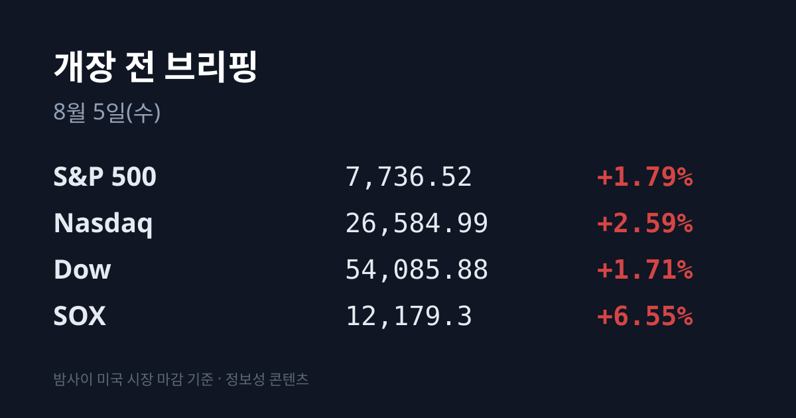
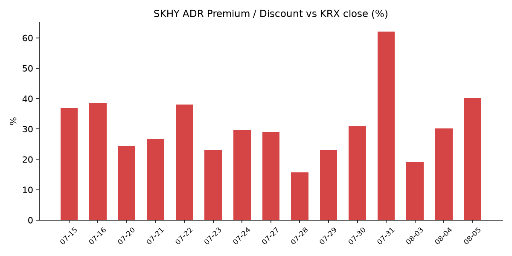
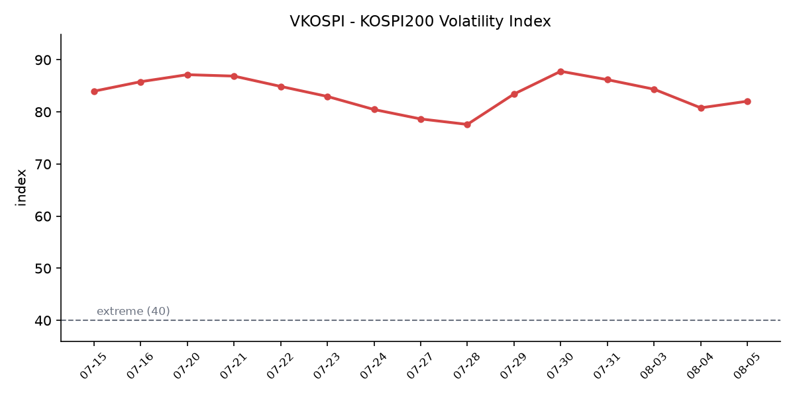

&nbsp;

【① 30초 요약 📈】

코스피가 8월 4일 101.50포인트(**+1.62%**) 오른 6,358.95로 마감했습니다. 다만 경로가 특이했습니다 — <mark>+1.50%로 출발해 장중 6,080.25(−2.83%)까지 밀린 뒤 되돌아온 V자 흐름</mark>이었습니다. 코스닥은 780.72(**+5.88%**)로 3거래일 연속 올랐고 오전 10시 47분에 올해 17번째 매수 사이드카가 발동됐습니다.

장중 급락의 계기는 중국 최대 메모리 업체 <mark>창신메모리(CXMT)의 베이징 2공장 증설 추진 소식</mark>이었습니다. CXMT는 상하이·허페이 공장까지 가동되면 생산능력이 현재의 2배 이상인 월 60만장 웨이퍼에 이르고, 1분기 D램 점유율은 3%에서 8%로 올랐습니다.

밤사이 미국장은 S&P 500이 7,736.52(+1.79%), 다우가 54,085.88(+1.71%)로 **모두 종가 사상 최고**였고, 무엇보다 필라델피아 반도체지수(SOX)가 **+6.55%** 로 4거래일 연속 올랐습니다. 나스닥(+2.59%)의 2.5배입니다.

SK하이닉스 ADR(SKHY)이 **+8.17%($154.38)** 급등한 반면 본주는 +0.64%였습니다. 그 격차로 괴리율은 +30.2%에서 **+40.2%** 로 벌어져 이번 국면 최고치를 경신했습니다.

미 장 마감 후 AMD가 매출·EPS·데이터센터·3분기 가이던스를 모두 상회했는데도 시간외 −7%였습니다. 사유는 실적이 아니라 <mark>"메모리 가격 상승이 PC 수요를 꺾는다"는 PC 시장 둔화 우려</mark>였습니다. 같은 시간 스페이스X는 첫 실적에서 매출 +92%를 기록했으나 AI 설비투자 급증에 시간외 −8%였습니다.

&nbsp;

【② 밤사이 미국 시장 🌙】

8월 4일(현지) 미국 증시는 3대 지수가 모두 올랐고, 반도체가 랠리를 주도했습니다.

| 지수 | 종가 | 등락률 |
| :--- | ---: | ---: |
| S&P 500 | 7,736.52 | +1.79% |
| 나스닥 | 26,584.99 | +2.59% |
| 다우 | 54,085.88 | +1.71% |
| SOX(필라델피아 반도체) | 12,179.3 | +6.55% |

S&P 500과 다우는 나란히 종가 사상 최고를 새로 썼습니다. 나스닥100은 +3.27%였습니다. 섹터별로는 기술이 +4.20%, 산업재가 +3.42%였고 에너지·유틸리티는 부진했습니다.

이날의 특징은 SOX가 나스닥보다 훨씬 강했다는 점입니다. 전날(8월 3일)에는 SOX +1.05%가 나스닥 +2.13%의 절반이었는데, 하루 만에 관계가 뒤집혀 SOX +6.55%가 나스닥 +2.59%의 2.5배가 됐습니다. 개별 반도체는 인텔 +10.92%, 마벨 테크놀로지 +12.81%, AMD 정규장 +7.00%였습니다. SOX는 이날로 4거래일 연속 상승했습니다.

상승 배경은 이틀 연속 국제유가였습니다. 스콧 베센트 미 재무장관이 <mark>호르무즈 해협 재개 합의가 "이틀 내 가능하다"고 밝히면서</mark> 브렌트유는 배럴당 **$78.74(−6.00%)** 로 $80선을 깨고 7월 13일 이후 최저로 내려왔습니다. WTI는 $75.14(−6.47%)였습니다. 이틀 누적으로 브렌트는 −12.6%, WTI는 −11.3%입니다.

유가와 함께 미 10년물 국채금리는 4.63%, 2년물은 4.21%로 내렸고, 금리선물에 반영된 **9월 FOMC 인상 확률은 67.2%에서 56.9%로** 낮아졌습니다. 금은 온스당 $4,075.26(+1.01%), 달러인덱스는 99.89(−0.01%)였습니다.

다만 사상 최고 경신일인데 VIX는 16.50으로 +4.04% 올랐습니다. 실적 발표를 앞둔 시간외 리스크가 반영된 결과입니다.

개별 종목에서는 팔란티어가 전날 실적 발표 뒤 이날 정규장에서 **+29%** 급등했고, 캐터필러는 AI 데이터센터 인프라 수요를 근거로 연간 매출 성장 전망을 올리며 +5.60%였습니다. 아리스타 네트워크스 +11%, 코어위브 +9%(인도네시아 AI 시장 진입·360MW 계약전력), 윈리조트 +7%, 부킹홀딩스 +5%였고 테라데이타는 −17%였습니다.

경제지표에서는 미 6월 JOLTS 구인건수가 740만건으로 사실상 변화가 없었습니다. 고용률 3.4%, 자발적 퇴직률 2%, 해고율 1.1%로 '저고용·저해고' 상태가 이어졌습니다.

&nbsp;

【②-1 미 정규장 마감 후 실적 ⚡】

**AMD**는 2분기 매출 $11.536B(컨센서스 $11.284B, 전년 대비 +50%), 조정 EPS $1.66(컨센서스 $1.62, 전년 $0.48)으로 상회했습니다. 데이터센터 부문이 **$6.72B로 전년 대비 +107%** 늘어 사상 최대였고(컨센서스 $6.5B), 클라이언트(PC 프로세서) $3.1B(컨센서스 $3.0B), 게이밍 $779M(컨센서스 $781M)였습니다. 3분기 가이던스도 $12.7~13.3B로 컨센서스($12.5B)를 넘겼습니다.

그런데도 시간외에서 −6.6~7% 빠졌습니다. 시장이 지적한 사유는 실적이 아니라 메모리 가격 상승이 PC 수요를 둔화시킬 수 있다는 우려였습니다. AMD 주가는 2026년 들어 이미 140% 오른 상태였습니다.

**스페이스X**는 상장 후 첫 실적에서 매출 $7.8B(전년 대비 **+92%**, 컨센서스 $6.8B)를 기록했습니다. 순손실은 −$541M으로 전년 동기 −$10억에서 줄었고 조정 EBITDA는 $3.5B(+191%)였습니다. 다만 설비투자가 **$18.37B**(전분기 $10.1B, 컨센서스 약 $13B)로 급증했고 그중 $15.83B가 AI 관련이었습니다. 정규장에서 +9.43% 오른 뒤 시간외에서 −8% 내렸습니다.

리서치 시점(8월 5일 07:11 기준) 미 지수선물은 S&P 500 7,776.75(+0.14%), 다우 54,352.00(+0.15%)이었고 나스닥100만 29,827.50(−0.12%)으로 마이너스였습니다.

&nbsp;

【③ 괴리율 트래커 — SK하이닉스 ADR 📊】

| 항목 | 수치 |
| :--- | ---: |
| SKHY 종가 (8/4) | $154.38 (+8.17%) |
| 원/달러 (8/4 종가) | 1,432.50원 |
| 본주 환산가 (×10×환율) | 2,211,494원 |
| 본주 직전 종가 (8/4) | 1,577,000원 |
| **괴리율** | **+40.2%** |

전일 브리핑의 +30.2%에서 **+10.0%p 재확대**됐고, 이번 국면 최고치를 경신했습니다. 종전 정상 구간 고점은 7월 16일 +38.5%, 7월 22일 +38.0%였습니다(7월 31일 +62.0%는 상한가 직후의 일시적 왜곡이었습니다).

주목할 점은 확대 경로가 <mark>전날과 정확히 반대</mark>라는 것입니다. 8월 3일에는 ADR이 −0.70%로 거의 움직이지 않고 본주가 −8.79% 빠져서 격차가 벌어졌습니다. 8월 4일에는 ADR이 +8.17% 급등하고 본주는 +0.64%밖에 오르지 않아서 벌어졌습니다. 경로는 반대지만 결과는 이틀 연속 같은 방향입니다 — 두 날 모두 미국 시장이 같은 자산에 한국보다 높은 값을 매겼습니다.

ADR이 급등한 배경은 두 가지로 확인됩니다. 하나는 SOX +6.55%라는 반도체 섹터 전반의 강세입니다. 다른 하나는 공시 제약 해제입니다. SKHY는 미국 기준 7월 10일 상장했고, 미 증권법상 신주 공모 상장사는 거래 시작일로부터 주말을 포함해 25일간 투자설명서 교부 의무를 적용받습니다. 이 기간에 상장 시점 투자설명서에 없던 대규모 자사주 매입이나 특별배당 같은 중대 정보를 공개하면 집단소송 리스크가 있어, 회사가 주주환원 방안을 밝히기 어려운 구조였습니다.

**그 25일이 한국시간 8월 4일 밤에 지났습니다.** SK하이닉스는 2분기 실적 콘퍼런스콜에서 "다양한 방식의 추가 주주환원 방안을 검토 중이며 확정되는 대로 연내 시장과 공유하겠다"고 밝혔고, 시장에서는 연간 주주환원 규모를 70조~100조원, 자사주 매입 규모를 최대 40조원으로 보는 전망이 나옵니다.

괴리율이 왜 생기고 왜 좁혀지는지는 구조로 설명됩니다. SKHY는 SK하이닉스 보통주 10주를 예탁한 증서이므로, ADR 가격 × 10 × 원/달러 환율이 이론상 본주 가격과 같아야 합니다. 프리미엄(+)이 크면 ADR을 팔고 본주를 사는 전환 차익거래 유인이, 디스카운트(−)면 그 반대 유인이 구조적으로 생깁니다. 다만 ADR→본주 전환 한도는 발행주식의 2.5%(1,779만주)이고 전환 절차에 수 주 이상 걸리므로 괴리가 즉시 해소되지는 않습니다.

괴리율 추이: 7/22 +38.0 → 7/23 +23.2 → 7/24 +29.6 → 7/27 +28.9 → 7/28 +15.7 → 7/29 +23.1 → 7/30 +30.9 → 7/31 +62.0 → 8/3 +19.1 → 8/4 +30.2 → **8/5 +40.2**

&nbsp;

【④ 변동성 트래커 🌡️】

**판정 한 줄**: <mark>'극단' 유지, 종가 변동성은 진정됐지만 일중 변동성과 유동성이 새 변수로 올라왔습니다</mark>. VKOSPI가 나흘 만에 반등한 반면 레버리지 거래 비중·회전율·신용융자는 모두 축소를 가리키고, 예탁금과 거래대금은 반등 체력이 줄었음을 보여줍니다.

**기대 변동성** — VKOSPI 8월 4일 종가 **82.05**(전일 80.78 대비 +1.27p, +1.57%)로 사흘 연속 하락 뒤 나흘 만에 올랐습니다. 40 이상은 '극단' 구간이므로 기준의 약 2.05배입니다. 다만 오른 맥락을 봐야 합니다 — 8월 4일은 코스피가 +1.50%로 출발해 장중 −2.83%까지 밀린 뒤 +1.62%로 마감한 날이었고, VKOSPI가 반영한 것은 방향이 아니라 일중 진폭입니다. 같은 날 미국 VIX도 사상 최고 경신에도 16.50(+4.04%)으로 올랐습니다.

**실현 변동성** — 최근 7거래일 일별 등락률은 7/27 +0.97% → 7/28 −10.84% → 7/29 −5.98% → 7/30 −1.23% → 7/31 **+17.91%** → 8/3 −5.12% → 8/4 +1.62%입니다. 이 중 ±3.5% 이상이 4일입니다. 8월 4일은 6거래일 만에 처음 나온 ±2% 이내 종가였습니다. 다만 일중으로는 여전히 4.96% 진폭이었습니다.

**매매 정지** — 8월 4일 오전 10시 47분 코스닥에 매수 사이드카가 발동됐습니다. **3거래일 연속이며 올해 17번째 매수 사이드카**입니다(코스닥150 선물 +6.09%·현물 +6.5% 동반 급등). 코스피는 장중 −2.83%에도 발동되지 않았습니다. 최근 5거래일 이력은 7/29 서킷브레이커(하락) → 7/30 무발동 → 7/31 코스피·코스닥 동반 매수 사이드카 → 8/3 코스닥 매수 사이드카 → 8/4 코스닥 매수 사이드카입니다. 발동 방향이 4거래일 연속 '매수' 쪽입니다.

**증폭 경로** — 삼성전자·SK하이닉스 기초 단일종목 레버리지·인버스 ETF·ETN 16종의 8월 4일 거래대금은 **1조2,556억원**이었습니다(8/3 1조3,872억원, 7/31 3조313억원, 7/30 12조4,485억원). 코스피 전체 거래대금 대비 비중은 7/30 33.4% → 7/31 6.6% → 8/3 5.4% → 8/4 **4.5%** 로 내려왔고, 시가총액 대비 거래대금(회전율)은 7/30 219.1%에서 8/4 15.7%로 14분의 1이 됐습니다. 그 결과가 지수에 나타났습니다 — 코스피 일중 변동폭은 7/30 7.45%에서 8/4 4.96%로 줄었습니다. 단일종목 레버리지 상품군 시가총액도 16.6조원에서 8.7조원으로 −47.6%입니다. 8월 4일 개인 순매수 방향은 집계 시점 기준 미확인입니다.

**청산 압력** — 신용거래융자 잔고는 7월 31일 **28조9,350억원**으로 7월 1일 37조3,393억원 대비 8조4,043억원 줄었습니다. 유가증권시장만 보면 7월 31일 하루에 **2조6,681억원(−10.46%)** 감소해 관련 통계가 작성된 **1998년 7월 이후 최대 감소폭**이었습니다(종전 최대 감소율은 코로나 국면인 2020년 3월 23일 −9.7%). 6월 24일 역대 최대 38조6,328억원 대비로는 −25.1%입니다.

위탁매매 반대매매는 7월 31일 1,220억원(7/29 611억원·7/30 1,038억원), 위탁매매 미수금은 1조6,615억원으로 미수금 대비 반대매매 비중은 7.1%였습니다. 한편 투자자예탁금은 104조1,350억원으로 연고점(6월 4일 139조6,948억원) 대비 −25.5%이고, 코스피 일평균 거래대금은 80조원대에서 20조원대로 줄었습니다.

**하방 포지션** — 코스피 공매도 순잔고는 최신 확보치가 7월 22일 기준 16.85조원입니다. 공매도 잔고 공시는 **T+3 시차**가 있어 7월 28일~8월 4일의 급락·급등·재하락·반등 구간 잔고는 구조적으로 확인되지 않습니다.

**참고 — 야간선물** — 8월 4일 22시 20분 기준 코스피200 야간선물 9월물은 **1,029.95**로 주간 현물 종가 1,000.03 대비 29.92포인트 높았습니다. 같은 시각 EWY(MSCI 한국 1배 ETF)는 +4.50%, KORU(3배)는 +13.36%였습니다. 다만 이 시각은 AMD·스페이스X 시간외 하락이 나오기 전입니다.

미확인 항목: 8월 3~4일 신용융자·반대매매 집계치, 레버리지 ETF 개인 순매수 방향·회전율, 프로그램 매매 차익/비차익, 선물 베이시스, DRAM·NAND 당일 현물가, 구리, 8월 1~10일 수출 잠정치.

&nbsp;

【⑤ 어제 한국장 리뷰 🇰🇷】

| 지수 | 종가 | 등락 |
| :--- | ---: | ---: |
| KOSPI | 6,358.95 | +101.50 (+1.62%) |
| KOSDAQ | 780.72 | +43.37 (+5.88%) |

코스피는 6,351.38(+1.50%)로 출발해 장중 **6,080.25(−2.83%)** 까지 밀린 뒤 오후에 되돌아 상승 마감했습니다. 시가에서 장중 저점까지 4.3%포인트를 반납한 흐름입니다. 상승 종목은 788개, 하락 종목은 96개로 상승 비율이 89%였습니다.

코스피 투자자별 순매수는 개인 **+8,184억원**, 기관 −5,392억원, 외국인 −3,705억원이었습니다. 직전 거래일(8월 3일) 외국인 순매도가 −3조8,708억원이었던 것과 비교하면 <mark>외국인 순매도 규모가 10분의 1로 줄었습니다</mark>. 반면 기관은 코스피에서 순매도로 돌아섰고, 같은 날 코스닥에서는 +5,434억원을 순매수했습니다(코스닥 개인 −2,586억원·외국인 −2,772억원).

삼성전자는 240,000원(+500원, +0.21%), SK하이닉스는 1,577,000원(+10,000원, **+0.64%**)으로 사실상 보합 마감했습니다. 직전 거래일 −8.76%·−8.79% 급락 뒤의 반등 시도였으나 폭이 거의 없었습니다. 장중 두 종목이 약세로 돌아선 계기는 중국 창신메모리(CXMT)의 베이징 2공장 증설 추진 소식이었습니다. 다만 오후 반등은 반도체가 아니라 다른 업종에서 나왔습니다.

업종별로는 **건설이 +8.87%** 로 가장 강했습니다. 미국 원전 투자와 AI 데이터센터, 대형 프로젝트 수주 기대가 배경으로 거론됐고 GS건설 +10.81%, HDC현대산업개발 +13.70%, DL이앤씨 +4.98%였습니다. IT서비스·통신·금속은 각각 5%대 올랐습니다.

개별 종목은 LIG넥스원 +14.59%, SK텔레콤 +11.46%, 네이버 +9.16%(엔비디아·브룩필드와 추진하는 AI 팩토리 사업 및 글로벌 AI 설비투자 확대 전망), 한화에어로스페이스 +9.25%, 삼성SDS +8.13%였고 LG에너지솔루션·삼성바이오로직스·SK스퀘어는 3%대였습니다.

코스닥은 3거래일 연속 올랐고 상승 1,505개 : 하락 175개였습니다. 알테오젠이 347,000원(+9.29%), 에코프로 82,000원(+5.94%), 에코프로비엠 102,500원(+5.89%), 레인보우로보틱스 467,000원(+1.85%)이었습니다. 바이오·2차전지·로봇이 지수를 끌었고, 로봇 업종에는 미국의 중국산 규제가 별도 재료로 작용했습니다.

원/달러 환율은 오후 3시 30분 기준 1,432.50원으로 2.70원 올랐습니다. 다만 장중 레인지가 1,419.01~1,448.11원, 시가가 1,443.10원으로 개장 갭이 하루 동안 되밀린 경로였습니다. 엔/달러는 157.39엔으로 엔이 다시 약해졌습니다.

같은 날 아시아 증시에서는 한국만 크게 올랐습니다. 일본 닛케이는 63,957.53(+0.32%)으로 코스피 반등에 상승 전환했고, 중국 상해종합은 3,822.28(+0.33%), 홍콩 항셍은 −0.68%, 대만 TAIEX는 43,360.66(−0.06%)으로 장중 1,000포인트 이상 진폭 뒤 보합 마감했습니다.

&nbsp;

【⑥ 오늘의 캘린더 & 관전 포인트 📅】

▶ 오늘(8월 5일)

- **22:15 KST** — 미 7월 ADP 민간고용
- 미 장 마감 후(결과는 8월 6일 새벽 KST) — 샌디스크(SNDK)·웨스턴디지털 실적. 낸드 업황을 직접 확인하는 지표입니다.
- SK하이닉스 주주환원 방안 공시 가능 시점(ADR 25일 제약이 8월 4일 밤 해제됨) — 수시 공시이므로 시각은 정해져 있지 않습니다
- 호르무즈 해협 재개 합의 진행 상황 — 베센트 미 재무장관이 "이틀 내 가능"이라고 언급했습니다
- 8월 3~4일 확정 신용융자 잔고·반대매매 집계치 공표
- IPO 수요예측(8월 첫째 주) — 니어스랩(AI 드론), 해치텍(반도체·디스플레이 공정 소재, 희망 공모가 23,000~28,000원), 빅웨이브로보틱스(로봇), 기도산업

▶ 이번 주

- **08/06(목)** — 미 신규 실업수당 청구
- **08/07(금)** — 미 7월 고용보고서(비농업·실업률)

▶ 그 이후

- **08/21** — 미 상원이 애플에 요구한 중국 CXMT·YMTC 메모리 미사용 확약 시한
- 8월 중 — 단일종목 레버리지 개인별 총량규제 시행, 괴리율 관리의무 3%→2% 강화, MSCI 분기 리뷰, 금통위(경제전망), 잭슨홀 회의
- 8월 중순 — 8월 1~20일 수출 잠정치
- 9월 — FOMC(금리선물 기준 인상 확률 약 56.9%), BOJ 추가 인상 논의

▶ 시장 참가자들이 주시하는 레벨

- SK하이닉스 ADR 괴리율 +40.2% — 이번 국면 저점은 7월 28일 +15.7%, 정상 구간 종전 고점은 7월 16일 +38.5%였습니다
- VKOSPI 82.05 — '극단' 기준선은 40, 6월 역대 최고치는 96.94입니다
- 브렌트유 $78.74 — 8월 3일 종가는 $83.77, 7월 31일은 $90.12였습니다
- 미 10년물 4.63%, 2년물 4.21% — 지난주 10년물 고점은 4.712%였습니다
- 원/달러 1,432.50원 — 8월 4일 장중 고점은 1,448.11원, 저점은 1,419.01원이었습니다
- 신용거래융자 28조9,350억원 — 6월 24일 역대 최대치는 38조6,328억원이었습니다
- 한국투자증권은 8월 코스피 변동 범위를 5,500~7,500으로 제시했습니다

&nbsp;

【⑦ 정책 워치 ⚡】

중국 메모리 공급 측에서 새 사실이 확인됐습니다. 중국 최대 메모리 업체 창신메모리(CXMT)가 베이징에 두 번째 D램 공장 건설을 추진하고 있고, 상하이·허페이에도 신규 공장을 짓는 중이며 추가 부지도 협의 중입니다. 이들이 모두 가동되면 CXMT의 생산능력은 현재의 2배 이상인 **월 60만장 웨이퍼**에 이릅니다. CXMT의 D램 시장 점유율은 2026년 1분기에 3%에서 **8%** 로 올랐습니다. 한편 미 상원은 초당적으로 애플에 8월 21일까지 중국 CXMT·YMTC 메모리를 사용하지 않겠다는 확약을 요구한 상태입니다.

한국 수출 통계는 반대 방향을 보여줍니다. 7월 총수출은 989억달러(전년 대비 +62.8%)로 역대 2위였고, 반도체 수출은 **410억달러(+178.8%)** 로 2개월 연속 400억달러를 넘었습니다. 8월 1~10일 잠정치는 아직 발표되지 않았습니다.

단일종목 레버리지 규제는 7월 31일 시행된 내용이 사흘째 수치로 확인됐습니다. 기본예탁금 요건이 상품별 1,000만원에서 3,000만원으로 올랐고, 매도대금을 현금으로 인정하는 시점이 T일에서 T+2일로 바뀌었습니다. 8월 중에는 개인별 레버리지 총량규제가 시행되고 증권사(유동성공급자)의 괴리율 관리의무 기준이 국내 3%에서 2%로 강화됩니다. 금융당국은 배율 조정과 개인투자자 신규 매수 금지도 검토 대상에 두고 있으며 긴급조치권 도입도 추진 중입니다.

지정학 쪽에서는 방향이 갈렸습니다. 중동은 완화가 한 단계 더 진전됐습니다 — 베센트 미 재무장관이 호르무즈 재개 합의를 "이틀 내 가능"이라고 했고, 마코 루비오 국무장관은 "비핵화 장기 협상을 진행하는 동안 단기적으로 더 많은 선박이 안전하게 호르무즈를 통과할 방안과 관련해 우리가 관여 중인 오만-이란 대화가 진행 중"이라고 밝혔습니다. 반면 이란 외무부 대변인 에스마일 바가이는 "현재 우리는 미국과 대화하고 있지 않다"며 "오만과의 새로운 항로 합의가 곧 호르무즈 재개방을 의미하는 것은 아니다"라고 선을 그었습니다.

러시아 쪽에서는 8월 4일 밤 우크라이나가 러시아 전역에 광범위한 드론 공격을 실행해 물류·석유 인프라를 타격했고, 미국은 이란·북한·시리아 연계를 이유로 러시아군 미사일포병국 등에 제재를 부과했습니다.

공매도 제도는 2026년 3월 31일 차입공매도 전 종목 전면 재개 이후 변경 사항이 없습니다. 무차입 공매도는 계속 금지입니다.

&nbsp;

【⑧ 오늘의 질문 ❓】

8월 3일에는 본주만 −8.79% 빠졌고 8월 4일에는 ADR만 +8.17% 올라, 이틀 연속 서로 반대 경로로 괴리율이 +40.2%까지 벌어졌습니다 — 미국이 매긴 이 값에 본주가 따라붙는지, 아니면 8월 4일처럼 개장 갭이 다시 오전에 반납되는지.

&nbsp;

본 글은 공개된 시장 데이터를 정리한 정보성 콘텐츠이며, 특정 종목·상품의 매매 권유가 아닙니다. 모든 투자 판단과 책임은 투자자 본인에게 있습니다. 수치는 작성 시점 기준이며 이후 변동될 수 있습니다.

&nbsp;

#개장전브리핑 #미국증시마감 #하이닉스ADR #괴리율 #코스피 #코스닥 #반도체 #VKOSPI #삼성전자 #SK하이닉스 #증시일정

&nbsp;