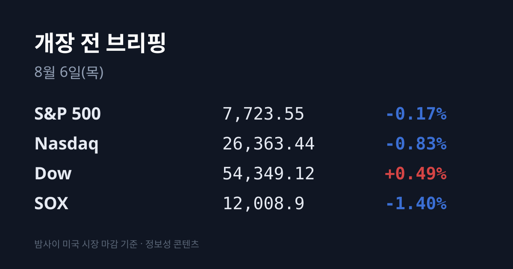
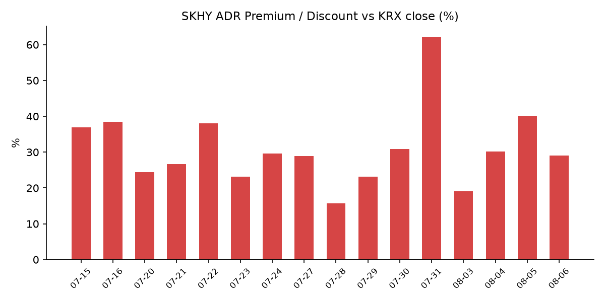
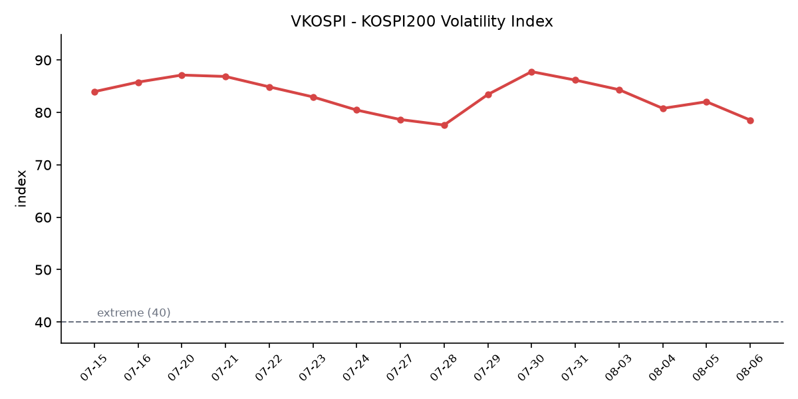

&nbsp;

【① 30초 요약 📈】

미국 08/05 마감은 갈렸습니다. **다우 54,349.12(+0.49%)** 로 사상 최고 종가·5거래일 연속 랠리, 반면 **나스닥 26,363.44(−0.83%)** 로 5거래일 만에 하락, S&P 500은 7,723.55(−0.17%)였습니다.

<mark>필라델피아 반도체지수(SOX)는 12,008.9(−1.40%)로 4거래일 연속 상승을 마감</mark>했습니다. 스페이스X의 엔비디아 칩 독점 사용 발표로 **엔비디아 +3.43%**, **AMD −7.04%** 로 갈렸고, 스페이스X 자신은 −13.6%였습니다.

<mark>낸드 양대 업체가 실적을 전부 상회하고도 하락</mark>했습니다. 샌디스크는 매출 **+372%**·조정 EPS 39.25달러·총이익률 84.6%를 기록했으나 다음 분기 가이던스가 컨센을 밑돌며 시간외 약 −4%(한때 −8%), 웨스턴디지털은 매출·EPS·영업이익·가이던스를 모두 넘기고도 **−10%** 였습니다.

코스피는 08/05 **6,598.26(+3.76%)** 로 마감했고 09:24:56 유가증권시장 매수 사이드카가 발동했습니다. <mark>외국인이 1조4,463억원을 순매수</mark>하며 사흘 만에 방향을 바꿨고, 원·달러는 1,424.5원(−8.00원)으로 내렸습니다.

SK하이닉스 ADR 괴리율은 **+40.2% → +29.0%** 로 11.2%p 압축됐습니다. 압축의 주된 축은 **본주 +5.77%** 상승이었습니다.

&nbsp;

【② 밤사이 미국 시장 🌙】

| 지수 | 종가 | 등락률 |
| :--- | ---: | ---: |
| 다우존스 | 54,349.12 | **+0.49%** |
| S&P 500 | 7,723.55 | −0.17% |
| 나스닥 | 26,363.44 | −0.83% |
| **SOX(필라델피아 반도체)** | **12,008.9** | **−1.40%** |

지수가 갈라진 날이었습니다. 다우는 263.24포인트 올라 사상 최고 종가를 5거래일 연속 새로 썼지만, 나스닥은 221.55포인트 내리며 5거래일 만에 하락했습니다. SOX는 12,008.9로 −1.40%, 4거래일 연속 상승을 마감했습니다. 직전 세션(08/04) SOX가 +6.55%였던 것과 대비됩니다.

갈라진 원인은 한 건의 뉴스로 모입니다. 스페이스X가 엔비디아 칩을 독점적으로 사용하겠다고 발표하면서 엔비디아는 +3.43% 오른 반면 AMD는 −7.04%로 밀렸습니다.

스페이스X 자신은 −13.6%였습니다. 2분기 매출이 78억1,000만달러로 예상치 69억3,000만달러를 넘겼지만, 자본지출이 전년 대비 6배인 **184억달러**였고 상반기 AI 관련 지출이 **230억달러**(전년 동기 33억달러)로 급증한 점, 대규모 락업 해제 물량이 예정돼 있다는 점이 함께 작용했습니다.

그 밖에 일라이릴리 +4.86%, 암젠 +4.57%, 부킹홀딩스 +6.2%, 디즈니 +3.65%였습니다.

장 마감 후 낸드 2사 실적이 나왔습니다. 샌디스크는 매출 89억6,500만달러(전년 대비 +372%, 컨센 83억9,400만달러 상회), 조정 EPS 39.25달러(컨센 34.37달러), 총이익률 84.6%를 기록했습니다. 그런데 다음 분기 매출 가이던스가 103억~108억달러로 컨센 111억6,000만달러를 밑돌면서 시간외에서 한때 8% 넘게 빠졌다가 약 −4%(1,287.67달러)로 좁혔습니다. 회사는 동시에 140억달러 규모 자사주 매입을 발표했습니다.

웨스턴디지털은 매출 37억5,000만달러(+43.8%), 조정 EPS 3.56달러(컨센 3.30달러), 조정 영업이익 16억6,000만달러(컨센 15억2,000만달러), 영업마진 41.7%(전년 26.1%)에 다음 분기 가이던스까지 컨센을 넘겼습니다. 그럼에도 주가는 −10%(467.34달러)였습니다. 시장이 "더 나은 성과를 기대했다"는 것이 하락 사유로 전해졌습니다.

매크로는 완화 쪽이었습니다. 미 10년물 국채 **4.615%**, 2년물 4.185%로 함께 내렸고, VIX 15.81(−4.18%), 달러인덱스 99.550(−0.19%)이었습니다. WTI 75.08달러(−0.91%), 브렌트 79.42달러(+0.08%)로 유가는 이틀간의 급락 뒤 낮은 자리에서 멈췄습니다. 미 7월 ADP 민간고용은 **44,000명 증가**에 그쳤고, ISM 비제조업 PMI는 54.1이었습니다.

&nbsp;

【③ 괴리율 트래커 — SK하이닉스 ADR 📊】

| 항목 | 수치 |
| :--- | :--- |
| SKHY 종가 | $151.05 (−2.16%) |
| 본주 환산가 (×10×환율 1,424.50원) | 2,151,707원 |
| 본주 직전 종가 | 1,668,000원 |
| **괴리율** | **+29.0%** |

전일 +40.2%에서 **11.2%p 압축**됐습니다. 압축의 경로가 이 지표의 오늘 기록입니다. 본주가 1,577,000원에서 1,668,000원으로 **+5.77%** 오르고, ADR이 154.38달러에서 151.05달러로 −2.16% 내렸습니다. 즉 한국 본주가 미국 ADR 가격을 향해 올라가면서 격차가 메워졌습니다.

08/03에는 본주만 −8.79% 빠져 벌어졌고, 08/04에는 ADR만 +8.17% 올라 벌어졌으며, 08/05에는 본주가 따라 올라갔습니다.

괴리율의 구조는 이렇습니다. ADR 프리미엄(+)은 미국에서 거래되는 가격이 본주보다 높다는 뜻이고, 전환 차익거래 구조상 본주 쪽에 매수 유인이 생기는 방향으로 작동합니다. 디스카운트(−)면 반대입니다.

다만 이 프리미엄이 즉시 무위험 차익으로 실현되지는 않습니다. ADR→본주 전환 한도가 1,779만주(발행주식의 2.5%)로 제한돼 있고, 전환 절차에 수 주 이상이 걸리기 때문입니다. 그래서 이 지표는 차익거래 기회라기보다 한·미 두 시장이 같은 자산에 매기는 값의 격차를 보여주는 계기판에 가깝습니다.

+29.0%는 이번 국면의 평균대입니다. **07/24 +29.6%**, **07/27 +28.9%** 와 거의 같은 수준이며, 이번 국면 고점인 08/05 +40.2%와 07/16 +38.5%의 극단 구간에서는 벗어났습니다.

ADR이 내린 배경은 확인됩니다. SK하이닉스 ADR의 미 증권법상 25일 투자설명서 교부 의무가 08/04 밤 해제되면서 대규모 주주환원 공시가 법적으로 가능해졌지만, 08/05에 자사주 매입·특별배당 공시는 나오지 않았습니다. 회사는 로이터에 "연말까지 구체적인 주주환원 계획을 마련하겠다"고 밝혔고, 삼성전자는 "조만간"이라고 답했습니다.

&nbsp;

【④ 변동성 트래커 🌡️】

**판정 한 줄**: <mark>'극단' 유지, 그러나 6개 축 중 5개가 처음으로 같은 방향을 가리켰다</mark> — VKOSPI가 07/30 이후 처음 80선을 깼고, VIX와 같은 날 같은 방향으로 내렸으며, 레버리지 ETF 거래대금은 상장 이후 처음 1조원을 하회했습니다.

**기대 변동성** — VKOSPI **78.55**(08/05, 전일 대비 −3.50p, −4.27%). 25 미만 평온 / 25~40 경계 / 40 이상 극단 기준에서 '극단' 구간이며, 기준 40의 약 1.96배입니다. 07/30 87.79 → 07/31 86.18 → 08/03 84.35 → 08/04 80.78 → 08/05 82.05 → 78.55로, 07/30 이후 처음 80선을 하회했습니다. 같은 날 미국 VIX는 **15.81(−4.18%)** 로 함께 내렸습니다. 이번 국면 들어 한·미 변동성이 같은 날 같은 방향으로 움직인 첫 사례입니다. 다만 두 지수의 격차는 여전히 약 5배입니다.

**실현 변동성** — 최근 7거래일 코스피 일별 등락률: 07/28 −10.84% → 07/29 −5.98% → 07/30 −1.23% → 07/31 **+17.91%** → 08/03 −5.12% → 08/04 +1.62% → 08/05 +3.76%. ±3.5% 이상이 5일입니다. 다만 최근 3거래일은 절대 진폭이 줄었고, 08/05은 시가 +3.85%에서 종가 +3.76%로 하루 종일 방향을 유지했습니다(08/04은 장중 −2.83%까지 밀렸다가 +1.62%로 마감한 V자였습니다).

**매매 정지** — **08/05 09시 24분 56초 유가증권시장 매수 사이드카 발동**. 미니 코스피200 선물 최근월물이 기준가 998.08에서 1,049.28(+5.12%)로 오른 상태가 1분간 지속된 데 따른 것입니다. 최근 6거래일: 07/29 서킷브레이커(하락) → 07/30 무발동 → 07/31 코스피·코스닥 동반 매수 사이드카 → 08/03 코스닥 매수 → 08/04 코스닥 매수 → 08/05 코스피 매수. 발동 방향이 **5거래일 연속 '매수'** 쪽입니다.

**증폭 경로** — 단일종목 레버리지·인버스 16종 거래대금 08/05 **9,198억원**. 5월 27일 상장 이후 처음으로 1조원을 하회했습니다(08/04 1조2,556억 → 07/31 3조313억 → 07/30 12조4,485억). 코스피 전체 거래대금 비중은 **3.65%** 로, 07/30 33.4% → 07/31 6.6% → 08/03 5.4% → 08/04 4.5%에 이어 5거래일 연속 축소입니다. 배경은 기본예탁금 1,000만원 → 3,000만원 상향(07/31 조기 시행), 매도대금 현금 인정 시점 T일 → T+2일, 신규 상품 출시 중단입니다.

**청산 압력** — 신용거래융자 07/31 **28조9,350억원**으로 6개월여 만에 30조원을 하회했습니다. 7월 1일 37조3,393억원 대비 8조4,043억원(−22.5%) 감소이며, 유가증권시장만 07/31 하루에 −10.46%로 1998년 7월 통계 작성 이후 최대 감소폭이었습니다. 반대매매는 07/31 1,220억원이 최신 확인치입니다. 7월 투자자예탁금은 109조7,000억원으로 전월 대비 −15.5%입니다.

**하방 포지션** — 코스피 공매도 순잔고는 집계 시점 기준 미확인입니다. **T+3 공시 지연** 때문에 07/28~08/05의 급락·급등 구간 잔고는 구조적으로 확인되지 않습니다. 제도는 2026년 3월 31일 차입공매도 전 종목 전면 재개 상태가 유지 중이며 변경 사항은 없습니다.

미확인 항목: 코스피200 야간선물 08/05 종가, 08/03~08/05 신용융자·반대매매 집계, 공매도 순잔고 최신치, FedWatch 9월 금리 확률, 08/05 금 종가, 프로그램 매매 차익/비차익, 선물 베이시스.

&nbsp;

【⑤ 어제 한국장 리뷰 🇰🇷】

| 지수 | 종가 | 등락률 |
| :--- | ---: | ---: |
| KOSPI | 6,598.26 | **+3.76%** |
| KOSDAQ | 799.59 | +2.42% |

코스피는 6,603.48(+3.85%)로 출발해 6,598.26(+239.31, +3.76%)으로 마감했습니다. 상승 675 : 하락 197 : 보합 43이었습니다. 코스닥은 799.59(+18.87, +2.42%)로 4거래일 연속 상승했고 장중 800선을 회복했습니다(상승 1,346 : 하락 301).

수급이 어제의 전부입니다. 코스피에서 <mark>외국인이 1조4,463억원을 순매수</mark>하며 사흘 만에 방향을 바꿨습니다(08/03 −3조8,708억 → 08/04 −3,705억 → 08/05 +1조4,463억). 반대편에서 개인이 **−1조1,832억원**, 기관이 −2,835억원을 순매도했습니다. 코스닥은 반대로 개인이 +3,950억원을 사고 외국인(−2,980억원)·기관(−1,108억원)이 팔았습니다.

원·달러는 **1,424.5원으로 8.00원** 내렸습니다. 08/04 종가 1,432.50원에서 하락 전환한 것으로, 외국인 순매수와 방향이 맞물렸습니다.

시가총액 상위에서는 **삼성전기 +14.43%**, SK하이닉스 +5.77%(1,668,000원), 삼성생명 +5.76%, 삼성전자우 +4.25%, 삼성전자 +2.50%(246,000원)였습니다. 반도체·전기장비·조선이 함께 올랐습니다.

국내발 재료도 있었습니다. 삼성전자·SK하이닉스·마이크론의 **2027년 D램·HBM 공급 물량이 사실상 모두 배정 완료**됐고 구매 업체들이 계약금을 선납한 것으로 보도됐습니다. 삼성전자·마이크론·샌디스크의 연간 낸드 물량도 이미 팔렸으며, HBM과 AI 서버용 제품이 전체 D램 생산능력의 약 **70%** 를 차지해 2027년 PC·스마트폰용 D램 공급이 제한된다는 내용입니다.

코스닥에서는 알테오젠이 **5,200억원 규모 기술수출**을 공시했고, 에코프로·에코프로비엠이 2분기 흑자 및 호실적을 발표했습니다. 윤성에프앤씨가 상한가를 기록하는 등 양극재·전해액·장비·폐배터리 리사이클링 등 2차전지 생태계 전반과 반도체 소부장으로 매수세가 확산됐습니다.

중국 CXMT 관련 후속도 나왔습니다. HP·에이수스·에이서 등 주요 PC 제조사가 CXMT D램 인증 절차를 마치고 일부 노트북에 적용을 시작했으며, CXMT는 차세대 저전력 D램 표준인 LPDDR6 개발을 거의 마치고 양산 전 검증 단계에 들어간 것으로 전해졌습니다. 한편 08/04 장중 지수를 끌어내린 베이징 이좡 지역 12인치 공장은 자금 조달 협의가 초기 단계이며 투자 규모와 생산능력이 공개되지 않았다는 점도 함께 보도됐습니다.

아시아 증시는 08/05 전반이 올랐습니다. 닛케이 66,300.44(+3.66%), TOPIX 4,046.17(+2.13%), 상해종합 3,878.43(+1.47%), TAIEX 43,386.41(+0.62%), 항셍 25,915.82(+0.24%)였습니다.

&nbsp;

【⑥ 오늘의 캘린더 & 관전 포인트 📅】

오늘(08/06)

**22:30 KST** 미 주간 신규 실업수당 청구 — 08/07 고용보고서의 선행 지표

호르무즈 해협 임시 합의 최종 발표 여부 — 미·이란·오만이 **60일간 통행료 없는 개방**, 30일 이내 중앙항로 기뢰 제거 착수, 인도양→페르시아만 진입 선박은 이란 연안 북측·반대 방향은 오만 연안 남측 항로를 담은 합의안에 근접했고, 미 정부가 08/05(현지) 발표를 목표로 했습니다. 트럼프 대통령은 "많은 진전이 있었다"고 밝혔으나 최종 발표 여부는 확인되지 않았습니다.

SK하이닉스 주주환원 공시 — ADR 25일 제약은 08/04 밤 해제됐고, 회사는 "연말까지 구체화"라고 밝힌 상태입니다(수시 공시 사안).

08/03~08/05 신용융자·반대매매 집계 공표 — 사흘째 미확인 구간입니다.

코스닥 공시: 산일전기 보통주 추가상장, 뉴로메카·알테오젠 신주배정기준일, 페니트리움바이오 구주주 유상청약.

이번 주 이후

**08/07(금):** 미 7월 고용보고서(비농업·실업률) — 이번 주 최대 지표. 08/05 ADP는 44,000명 증가에 그쳤습니다.

**08/11:** 반도체산업 경쟁력 강화 및 지원에 관한 특별법 시행

**08/21:** 미 상원이 애플에 요구한 CXMT·YMTC 미사용 확약 시한

**08/26:** 미 7월 PCE 물가 + 엔비디아 실적

**08/27:** 한국은행 금통위(경제전망) + 잭슨홀 심포지엄

**8월 중:** 단일종목 레버리지 개인별 총량규제 시행, 괴리율 관리의무 3%→2% 강화, MSCI 분기 리뷰, 8월 1~20일 수출 잠정치

시장이 주시하는 레벨

원·달러 1,424.5원(08/05 종가)과 1,432.50원(08/04 종가) — 외국인 수급과 방향이 맞물려 움직여 온 구간입니다.

SK하이닉스 ADR 괴리율 +29.0% — 이번 국면 평균대(07/24 +29.6%, 07/27 +28.9%)와 고점(08/05 +40.2%).

VKOSPI 78.55와 80선 — 07/30 이후 처음 하회한 자리입니다.

미 10년물 4.615%, 브렌트 79.42달러.

코스닥 800선 — 08/05 장중 회복했으나 종가는 799.59였습니다.

&nbsp;

【⑦ 정책 워치 ⚡】

단일종목 레버리지 상품(ETF·ETN) 규제: 기본예탁금 1,000만원 → 3,000만원 상향이 07/31 조기 시행됐고, 매도대금 현금 인정 시점이 T일 → T+2일로 변경됐으며 신규 상품 출시가 중단됐습니다. 8월 중 개인별 총량규제 시행과 괴리율 관리의무 3% → 2% 강화가 예정돼 있습니다.

공매도: 2026년 3월 31일 차입공매도 전 종목 전면 재개 상태가 유지되고 있으며 제도 변경은 없습니다. 무차입 공매도는 계속 금지입니다.

반도체산업 경쟁력 강화 및 지원에 관한 특별법이 08/11 시행됩니다.

미 상원이 애플에 요구한 CXMT·YMTC 미사용 확약 시한은 08/21입니다.

&nbsp;

【⑧ 오늘의 질문 ❓】

실적을 전부 상회하고도 −4%·−10%였던 낸드 2사의 반응을, 한국 메모리 시장은 '업황 확인'으로 읽을 것인가 '좋은 실적도 값을 못 받는 국면'으로 읽을 것인가.

&nbsp;

본 글은 공개된 시장 데이터를 정리한 정보성 콘텐츠이며, 특정 종목·상품의 매매 권유가 아닙니다. 모든 투자 판단과 책임은 투자자 본인에게 있습니다. 수치는 작성 시점 기준이며 이후 변동될 수 있습니다.

&nbsp;

#개장전브리핑 #미국증시마감 #하이닉스ADR #괴리율 #코스피 #코스닥 #반도체 #VKOSPI #샌디스크 #웨스턴디지털

&nbsp;