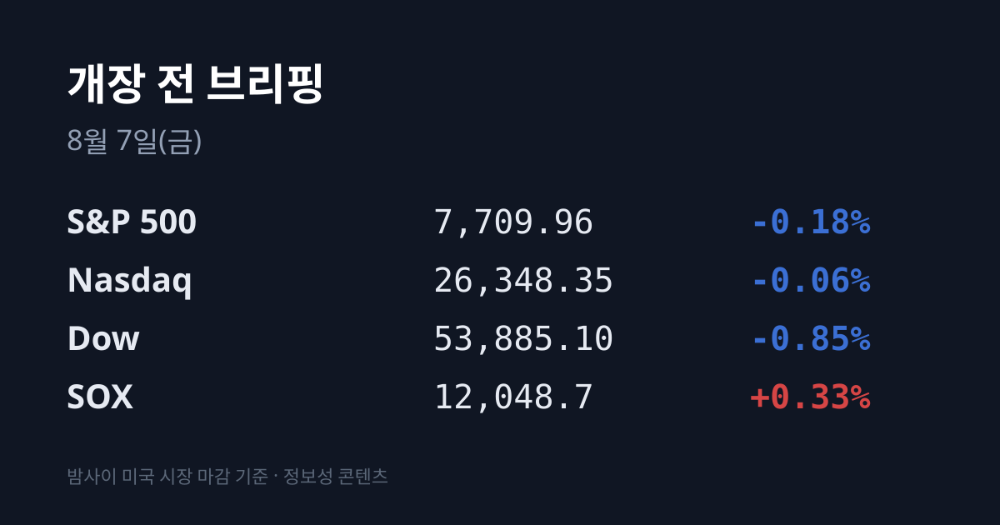
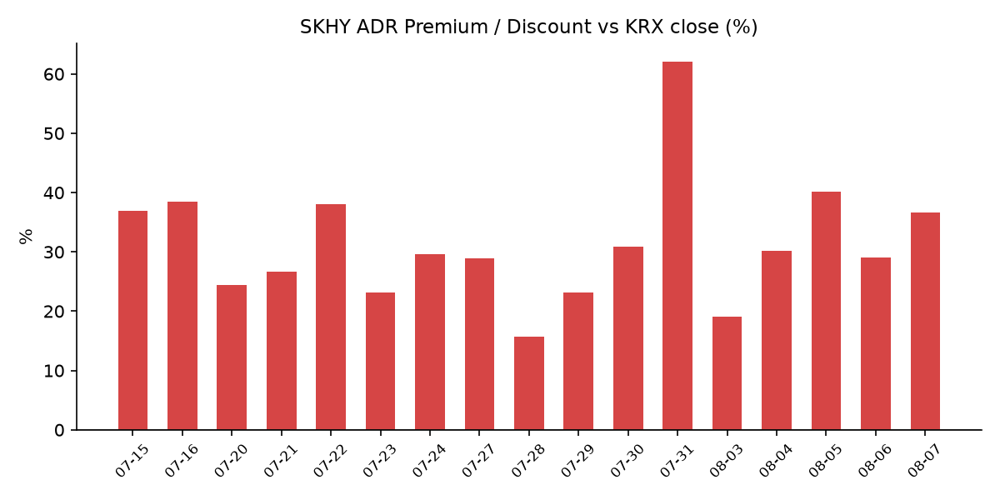
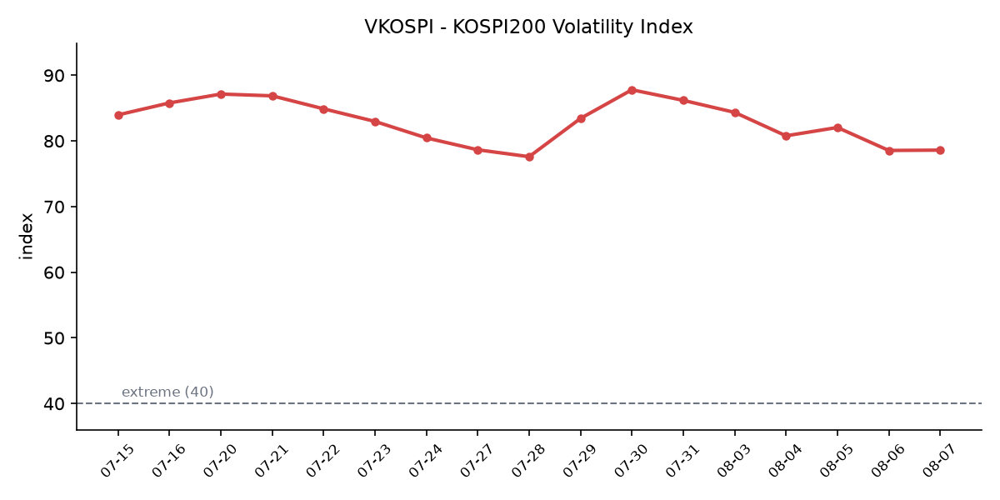

&nbsp;

【① 30초 요약 📈】

미국 08/06 마감은 지수와 반도체가 갈렸습니다. **다우 53,885.10(−0.85%)** 로 5거래일 연속 상승을 마감했고, S&P 500 7,709.96(−0.18%), 나스닥 26,348.35(−0.06%)였습니다. 그런데 <mark>필라델피아 반도체지수(SOX)는 12,048.7(+0.33%)로 홀로 올랐습니다</mark>.

지수를 누른 것은 반도체가 아니라 중동이었습니다. <mark>이란 의회 위원회가 미국·이스라엘 등 '적대국' 선박의 호르무즈 통항을 제한하는 예비법안을 심사</mark> 중이라는 보도에 브렌트 **82.49달러(+3.83%)**, WTI 77.29달러(+2.75%)로 유가가 튀었고, 미 10년물 국채가 **4.67%**, 30년물 5.21%로 올랐습니다.

코스피는 08/06 **6,296.38(−4.58%)** 로 마감했고 10시 18분 유가증권시장 매도 사이드카가 발동했습니다. SK하이닉스 **−10.37%**, 삼성전자 **−6.30%** 였습니다. 다만 코스피 상승 종목은 490개로 하락 381개보다 많았고, 코스닥은 801.67(+0.26%)로 5거래일 연속 올라 15거래일 만에 800선을 회복했습니다.

외국인이 코스피에서 **3조3,285억원**을 순매도했지만 <mark>원·달러는 1,423.8원으로 0.70원 내리는 데 그쳤습니다</mark>. 같은 날 기관은 코스닥을 1,614억원 순매수했습니다.

SK하이닉스 ADR 괴리율은 **+29.0% → +36.7%** 로 7.7%p 재확대됐습니다. 본주 −10.37%, ADR −4.97%로 본주가 5.4%p 더 빠진 결과입니다. SKHY는 시간외에서 **+0.91%**, EWY는 +1.18%였습니다.

&nbsp;

【② 밤사이 미국 시장 🌙】

| 지수 | 종가 | 등락률 |
| :--- | ---: | ---: |
| 다우존스 | 53,885.10 | **−0.85%** |
| S&P 500 | 7,709.96 | −0.18% |
| 나스닥 | 26,348.35 | −0.06% |
| **SOX(필라델피아 반도체)** | **12,048.7** | **+0.33%** |

세 지수가 모두 내린 날 반도체만 올랐습니다. 다우는 464.02포인트(−0.85%) 내려 5거래일 연속 상승 행진을 멈췄고, S&P 500은 13.59포인트, 나스닥은 15.09포인트 밀렸습니다. 러셀2000도 3,001.55(−0.58%)였습니다.

반면 SOX는 12,048.7로 +0.33% 올랐습니다. 다만 일중 레인지가 **11,707.8~12,288.6**(진폭 4.8%)으로, 하루 안에 −2.5%와 +2.3%를 모두 오간 자리였습니다.

지수를 끌어내린 것은 중동이었습니다. 이란 의회 위원회가 미국·이스라엘 등 '적대국' 선박의 호르무즈 해협 통과를 제한하는 예비법안을 심사 중이며, 위반 선박에 **화물 가치 최대 20%의 벌금**을 부과하는 조항이 포함된 것으로 전해졌습니다. 이 소식에 브렌트유는 82.49달러(+3.83%), WTI는 77.29달러(+2.75%)로 급등했습니다.

같은 날 예멘 후티 반군이 마리브주·하드라마우트주의 정부군 기지에 미사일 공격을 감행했습니다. 직전까지 시장이 반영해 온 것은 정반대 시나리오였습니다 — 미·이란·오만이 60일간 통행료 없는 개방과 30일 이내 기뢰 제거 착수를 담은 임시 합의안에 근접했다는 내용이었고, 그 합의의 최종 발표 여부는 확인되지 않았습니다.

유가 상승은 인플레이션 우려로 이어졌습니다. 미 10년물 국채금리가 4.67%(08/05 4.615%), 30년물이 5.21%로 올랐습니다. 금은 COMEX 12월물 4,299.60달러(−0.1%), 현물 4,244.29달러로, 장중 올랐다가 연준 금리 인상 가능성 신호에 상승분을 반납했습니다.

반면 VIX는 15.15(−4.17%)로 내렸고 달러인덱스는 99.727(08/06 장중)이었습니다. 즉 <mark>어제 미국 시장의 하락은 공포가 아니라 금리·원가 리프라이싱</mark>이었습니다.

개별 종목에서는 낸드 2사가 이틀째 밀렸습니다. 전일 실적 발표 후 하락했던 샌디스크가 **−6.81%**, 웨스턴디지털이 **−13.03%** 로 추가 하락했습니다. 그 밖에 앱러빈 −19.66%, 세일즈포스 −3.22%였고, 스페이스X는 +6.14%로 반등했습니다. 워너브러더스디스커버리(+1.3%)와 몰슨쿠어스(+1.8%)는 실적 호조로 올랐습니다.

고용 지표는 견조했습니다. 주간 신규 실업수당 청구는 **199,000건**으로 예상치 204,000건을 밑돌며 3주 연속 20만 건을 하회했고, 7월 감원은 2년 만의 최저치였습니다.

장 마감 후 실적에서 한국 반도체로 이어지는 재료는 없었습니다. 에어비앤비는 2분기 EPS 1.37달러(컨센 1.25달러), 매출 36억1,000만달러(컨센 35억8,000만달러)로 모두 상회했고 연간 가이던스를 상향해 시간외에서 **7~8.5% 상승**(164.48달러)했습니다. 리프트는 매출은 넘겼으나 EPS가 13센트로 컨센 14센트를 밑돌며 시간외 소폭 상승에 그쳤습니다. 클라우드플레어는 08/06 미 동부시간 17시에 발표했으나 시간외 반응은 집계 시점 기준 미확인입니다.

미 지수선물은 08/07 07시 48분~51분 KST 기준 다우 53,991.00(−0.04%), S&P 500 7,737.00(+0.03%), 나스닥100 29,553.25(+0.22%)로 보합권이었습니다.

&nbsp;

【③ 괴리율 트래커 — SK하이닉스 ADR 📊】

| 항목 | 수치 |
| :--- | :--- |
| SKHY 종가 | $143.53 (−4.97%) |
| 본주 환산가 (×10×환율 1,423.80원) | 2,043,580원 |
| 본주 직전 종가 | 1,495,000원 |
| **괴리율** | **+36.7%** |

전일 +29.0%에서 **7.7%p 재확대**됐습니다. 확대의 경로가 이 지표의 오늘 기록입니다. 본주가 1,668,000원에서 1,495,000원으로 −10.37% 내리고, ADR이 151.05달러에서 143.53달러로 −4.97% 내렸습니다. 즉 둘 다 빠졌는데 본주가 **5.4%p 더** 빠졌습니다.

환율은 1,424.50원에서 1,423.80원으로 0.70원 움직여 계산에 거의 영향을 주지 않았습니다. 따라서 이번 확대분은 한국이 미국보다 더 팔았다는 사실 하나로 설명됩니다.

괴리율의 구조는 이렇습니다. ADR 프리미엄(+)은 미국에서 거래되는 가격이 본주보다 높다는 뜻이고, 전환 차익거래 구조상 본주 쪽에 매수 유인이 생기는 방향으로 작동합니다. 디스카운트(−)면 반대입니다.

다만 이 프리미엄이 즉시 무위험 차익으로 실현되지는 않습니다. ADR→본주 전환 한도가 **1,779만주**(발행주식의 2.5%)로 제한돼 있고 전환 절차에 수 주 이상이 걸리기 때문입니다. 그래서 이 지표는 차익거래 기회라기보다 한·미 두 시장이 같은 자산에 매기는 값의 격차를 보여주는 계기판에 가깝습니다.

+36.7%는 이번 국면의 상단대에 근접한 수준입니다. 이번 국면 고점은 08/05의 +40.2%, 그 이전 고점은 07/16의 +38.5%였고, 평균대는 07/24 +29.6%·07/27 +28.9%·08/06 +29.0% 구간이었습니다. 어제 하루 만에 평균대에서 상단대로 이동했습니다.

ADR이 내린 배경으로는 회사 고유의 악재가 아니라 광범위한 기술주 매도와 위험회피 심리가 지목됐습니다. 현지 보도는 종목 특정 뉴스가 없었다고 명시했습니다.

한편 <mark>SKHY는 정규장 마감 후 시간외에서 144.84달러(+0.91%)로 되사졌습니다</mark>. 같은 날 EWY(MSCI 한국 ETF)도 164.12달러(−2.97%)로 코스피 −4.58%보다 덜 빠진 뒤 시간외에서 166.05달러(+1.18%)를 기록했습니다.

&nbsp;

【④ 변동성 트래커 🌡️】

판정 한 줄: <mark>'극단' 유지, 그런데 지수가 −4.58% 무너진 날 VKOSPI가 오르지 않았습니다</mark> — 증폭 장치(레버리지·신용)는 계속 꺼져 있고, 대신 매매정지 방향이 5거래일 만에 '매수'에서 '매도'로 뒤집혔습니다.

**기대 변동성** — VKOSPI **78.6**(08/06). 전일 78.55와 사실상 동일합니다(정밀 전일비는 집계 시점 기준 미확인). 25 미만 평온 / 25~40 경계 / 40 이상 극단 기준에서 '극단' 구간이며, 기준 40의 약 1.97배입니다. 07/30 87.79 → 07/31 86.18 → 08/03 84.35 → 08/04 80.78 → 08/05 82.05 → 78.55 → 78.6입니다. 코스피가 −4.58% 급락하고 장중 −5.46%까지 밀리며 매도 사이드카까지 발동한 날에 기대 변동성이 움직이지 않은 것은 흔한 조합이 아닙니다. 같은 날 미국 VIX도 15.15(−4.17%)로 내렸습니다.

**실현 변동성** — 최근 7거래일 코스피 일별 등락률: 07/29 −5.98% → 07/30 −1.23% → 07/31 **+17.91%** → 08/03 −5.12% → 08/04 +1.62% → 08/05 +3.76% → 08/06 −4.58%. ±3.5% 이상이 5일입니다. 08/06 일중 경로는 시가 −1.81%(6,478.75) → 장중 저점 −5.46%(6,238.32) → 종가 −4.58%(6,296.38)였습니다.

**매매 정지** — **08/06 10시 18분** 유가증권시장 매도 사이드카 발동. 미니 코스피200 선물 최근월물이 기준가 대비 −5.04%(발동 시점 987.24) 하락한 상태가 1분간 지속돼 프로그램 매도호가 효력이 5분간 정지됐습니다. 최근 6거래일: 07/31 코스피·코스닥 동반 매수 → 08/03 코스닥 매수 → 08/04 코스닥 매수 → 08/05 코스피 매수 → 08/06 코스피 **매도**. 5거래일 연속 '매수' 쪽이던 발동 방향이 어제 뒤집혔습니다.

**증폭 경로** — 단일종목 레버리지·인버스 상품의 거래대금은 07/31 이후 3거래일 평균 약 **1조원**으로, 7월 일평균 12조3,000억원의 약 10분의 1 수준입니다. 코스피 거래대금 비중은 7월 30% → 8월 5% 미만이고, 회전율은 레버리지 150% → 10%, 인버스 2,400% → 100%로 축소됐습니다.

**청산 압력** — 신용거래융자와 신용대주 합산 잔액이 6월 42조원에서 최근 **29조원**으로 줄었습니다. 신용비율은 코스피 0.42%(1주 전 −0.15%p), 코스닥 1.34%(−0.51%p)로 양 시장 모두 축소 중입니다. 08/03~08/06 일별 확정 집계와 반대매매 금액 최신치는 집계 시점 기준 미확인입니다.

**하방 포지션** — 코스피 공매도 순잔고는 집계 시점 기준 미확인입니다. T+3 공시 지연 때문에 07/28~08/06의 급락·급등 구간 잔고는 구조적으로 확인되지 않습니다. 제도는 2026년 3월 31일 차입공매도 전 종목 전면 재개 상태가 유지 중이며 변경 사항은 없습니다.

미확인 항목: 코스피200 야간선물 08/06 종가, VKOSPI 정밀 전일비, 08/03~08/06 신용융자·반대매매 일별 집계, 공매도 순잔고 최신치, FedWatch 9월 금리 확률, 미 2년물 08/06 종가, 선물 베이시스, 구리, DRAM·NAND 당일 현물가.

&nbsp;

【⑤ 어제 한국장 리뷰 🇰🇷】

| 지수 | 종가 | 등락률 |
| :--- | ---: | ---: |
| KOSPI | 6,296.38 | **−4.58%** |
| KOSDAQ | 801.67 | +0.26% |

코스피는 6,478.75(−1.81%)로 출발해 장중 6,238.32(−5.46%)까지 밀린 뒤 6,296.38(−301.88, −4.58%)로 마감했습니다. **상승 490 : 하락 381**로, 지수가 4% 넘게 빠진 날인데도 오른 종목이 더 많았습니다. 코스닥은 801.67(+2.08, +0.26%)로 5거래일 연속 상승했고 지난달 15일 이후 15거래일 만에 종가 기준 800선을 회복했습니다.

시가총액 상위 반도체가 지수를 끌고 내려갔습니다. SK하이닉스 1,495,000원(**−10.37%**), 삼성전자 230,500원(**−6.30%**), SK스퀘어 −13.32%, 삼성전기 −9.37%였습니다.

배경으로는 밤사이 뉴욕에서 나온 알파벳의 AI 핵심 인력 이탈과 샌디스크의 가이던스 하회, 그리고 차세대 AI 반도체 공급 일정 연기 가능성과 HBM 단기 과열 경고가 지목됐습니다. 셀사이드에서는 모건스탠리가 D램 계약가격의 전년 대비 상승률이 **2026년 4분기에 정점**을 찍고 2027년 큰 폭으로 둔화할 것으로 전망했습니다.

반대편에서는 LG에너지솔루션 +2.83%, 삼성바이오로직스 +1.54%, KB금융 +0.47%가 올랐습니다. 코스닥 시총 상위에서는 알테오젠 **+5.96%**, 에이비엘바이오 +3.87%, 펩트론 +3.79%, 에코프로 +1.58%, 레인보우로보틱스 +1.14%로 바이오·2차전지·로보틱스 3축이 하방을 받쳤습니다.

수급에서 눈에 띄는 것은 규모가 아니라 환율입니다. 코스피에서 <mark>외국인이 3조3,285억원을 순매도</mark>했고 기관이 −1,229억원, 개인이 +3조3,412억원을 순매수했습니다. 프로그램 매매는 2조1,272억원 매도 우위(비차익 −2조3,027억원)였습니다. 코스닥에서는 기관 +1,614억원, 개인 +858억원, 외국인 −2,480억원이었습니다.

그런데 원·달러는 **1,423.8원**으로 0.70원 내렸습니다. 개장 시점에는 원화 강세가 확대되며 1,410원대에 진입하기도 했습니다. 08/03에 외국인이 3조8,708억원을 순매도했을 때 환율이 급등했던 것과 다른 조합입니다.

아시아 증시는 08/06 갈렸습니다. 닛케이 65,683.26(−0.93%)으로 3거래일 만에 반락했고, 항셍 25,476.58(−1.69%), 대만 가권 44,396.70(**−0.48%**)였습니다. 상하이종합은 3,900.35(+0.57%)로 3거래일 연속 올랐습니다 — 저가 매수세와 폭염발 전력 수요로 석탄주가 강세였습니다.

구조 지표도 기록해 둡니다. 삼성전자와 SK하이닉스가 코스피 시가총액에서 차지하는 비중은 2025년 초 23%에서 2026년 6월 말 **55%** 로 커졌고, 두 종목의 상관계수는 **0.82** 입니다. 일간 수익률 변동성도 삼성전자 2.2% → 4.9%, SK하이닉스 3.4% → 5.6%로 확대됐습니다.

중국 CXMT 관련 정보도 갱신됐습니다. HP·에이수스·에이서 등 글로벌 PC 제조사가 올해 중반 CXMT D램 품질 인증을 마치고 일부 노트북에 탑재를 시작했으며, CXMT는 향후 6개 팹·월 60만장 규모 생산능력에 도달할 것으로 관측됩니다. 다만 삼성전자·SK하이닉스·마이크론이 이미 **HBM4를 출하 중인 반면 CXMT는 HBM3 양산을 준비하는 단계**이며, 독립 분석가 앤드루 루는 CXMT의 D램 기술이 업계 주류보다 2~3년 뒤졌고 HBM에서는 격차가 더 크다고 평가했습니다.

주주환원은 아직 공시 전입니다. SK하이닉스는 "다양한 방안을 검토 중", 삼성전자 박순철 CFO는 "특별배당을 포함한 구체적인 실행 방안과 차기 주주환원 정책을 이사회와 경영진이 논의하고 있다"고 언급했습니다.

&nbsp;

【⑥ 오늘의 캘린더 & 관전 포인트 📅】

오늘(08/07)

**21:30 KST** 미 7월 고용보고서(비농업 부문 고용·실업률) — 이번 주 최대 지표입니다. 블룸버그 설문 중간값은 비농업 **+8만5,000명**(6월 +5만7,000명), 실업률 4.2% 유지입니다. 08/05 ADP 민간고용은 +4만4,000명으로 6개월 만의 최소치였던 반면, 08/06 신규 실업수당 청구는 199,000건으로 3주 연속 20만 건을 밑돌아 두 선행 지표가 엇갈린 상태입니다.

· 호르무즈 통항 제한 법안 진행 상황 — 이란 의회 위원회 심사 단계이며, 직전에 보도된 60일 개방·30일 내 기뢰 제거 임시 합의의 최종 발표 여부는 확인되지 않았습니다
· SK하이닉스·삼성전자 주주환원 공시 — 양사 모두 "검토 중"·"논의 중" 단계이며 수시 공시 사안입니다
· 08/03~08/06 신용융자·반대매매 집계 공표 — 나흘째 미확인 구간입니다
· 클라우드플레어 실적 시간외 반응 — 08/06 미 동부시간 17시 발표, 반응 미확인

이번 주 이후

**08/11:** 반도체산업 경쟁력 강화 및 지원에 관한 특별법 시행
**08/12:** 미 7월 소비자물가지수(CPI) — 유가가 튄 뒤 나오는 첫 물가 지표입니다
**08/14:** 빅웨이브로보틱스(로봇 플랫폼) 수요예측
**08/21:** 미 상원이 애플에 요구한 CXMT·YMTC 미사용 확약 시한
**08/26:** 미 7월 PCE 물가 + 엔비디아 실적
**08/27:** 한국은행 금통위(경제전망) + 잭슨홀 심포지엄
8월 중: 단일종목 레버리지 개인별 총량규제 시행, 괴리율 관리의무 3%→2% 강화, MSCI 분기 리뷰, 8월 1~10일·1~20일 수출 잠정치, 해치텍(반도체 센서) 등 코스닥 8개사 상장 절차

시장이 주시하는 레벨

· 원·달러 1,423.8원(08/06 종가) — 외국인이 3조원대를 순매도한 날에도 0.70원 움직인 자리입니다
· SK하이닉스 ADR 괴리율 +36.7% — 이번 국면 고점(08/05 +40.2%, 07/16 +38.5%)과 평균대(+29% 구간)
· VKOSPI 78.6과 80선
· 미 10년물 4.67%, 30년물 5.21%, 브렌트 82.49달러
· 코스피 장중 저점 6,238.32, 코스닥 800선
· SOX 12,048.7과 일중 레인지 하단 11,707.8

&nbsp;

【⑦ 정책 워치 🏛️】

· 공매도: 2026년 3월 31일 차입공매도 전 종목 전면 재개 상태가 유지되고 있으며 제도 변경은 없습니다. 무차입 공매도는 계속 금지입니다. 다만 세부 규정은 강화되는 방향입니다 — 모든 기관 투자자의 실시간 잔고 관리 및 NSDS 연동 의무화, 기관 상환기간 최대 12개월 제한, 공매도 목적 대차 후 90일 경과 시 금융당국 보고 의무 신설이 시행·추진 중입니다.
· 단일종목 레버리지 상품(ETF·ETN) 규제: 기본예탁금 1,000만원 → 3,000만원 상향이 07/31 조기 시행됐고, 매도대금 현금 인정 시점이 T일 → T+2일로 변경됐으며 신규 상품 출시가 중단됐습니다. 8월 중 개인별 총량규제 시행과 괴리율 관리의무 3% → 2% 강화가 예정돼 있습니다.
· 반도체산업 경쟁력 강화 및 지원에 관한 특별법이 08/11 시행됩니다.
· 미 상원이 애플에 요구한 CXMT·YMTC 미사용 확약 시한은 08/21입니다.

&nbsp;

【⑧ 오늘의 질문 ❓】

같은 재료를 받은 대만이 −0.48%, 중국이 +0.57%였던 날 홀로 −4.58%였던 한국 시장을, 역내·ADR·환율 세 지표가 남긴 흔적은 무엇으로 설명할 것인가.

&nbsp;

본 글은 공개된 시장 데이터를 정리한 정보성 콘텐츠이며, 특정 종목·상품의 매매 권유가 아닙니다. 모든 투자 판단과 책임은 투자자 본인에게 있습니다. 수치는 작성 시점 기준이며 이후 변동될 수 있습니다.

&nbsp;

#개장전브리핑 #미국증시마감 #하이닉스ADR #괴리율 #코스피 #코스닥 #반도체 #VKOSPI #호르무즈 #고용보고서

&nbsp;