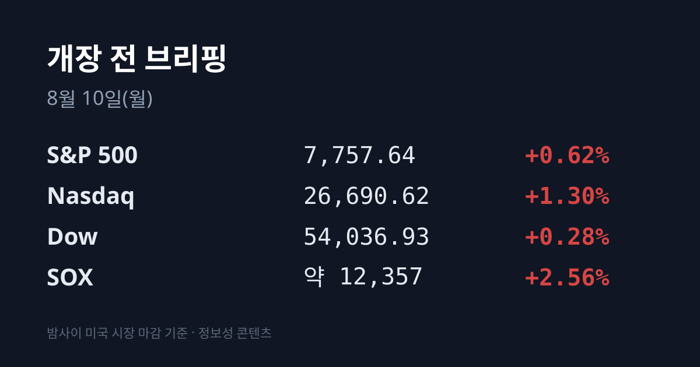
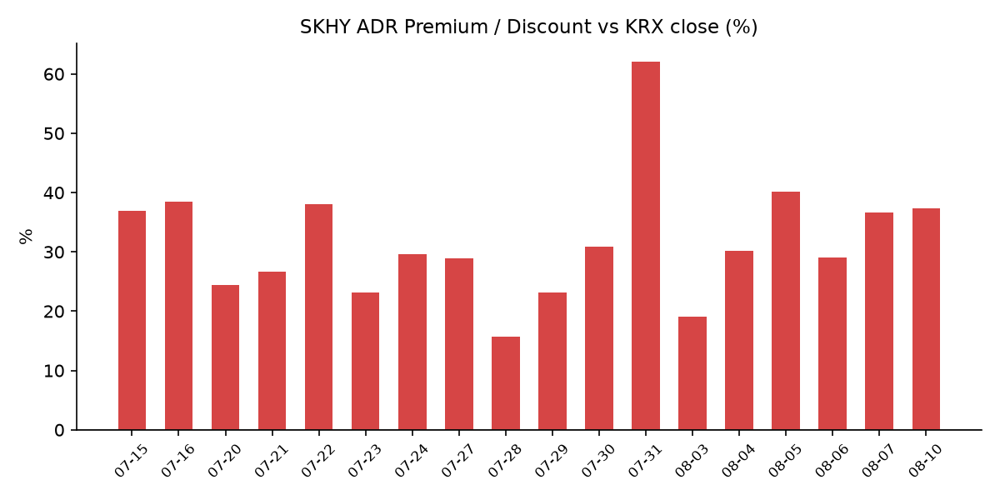
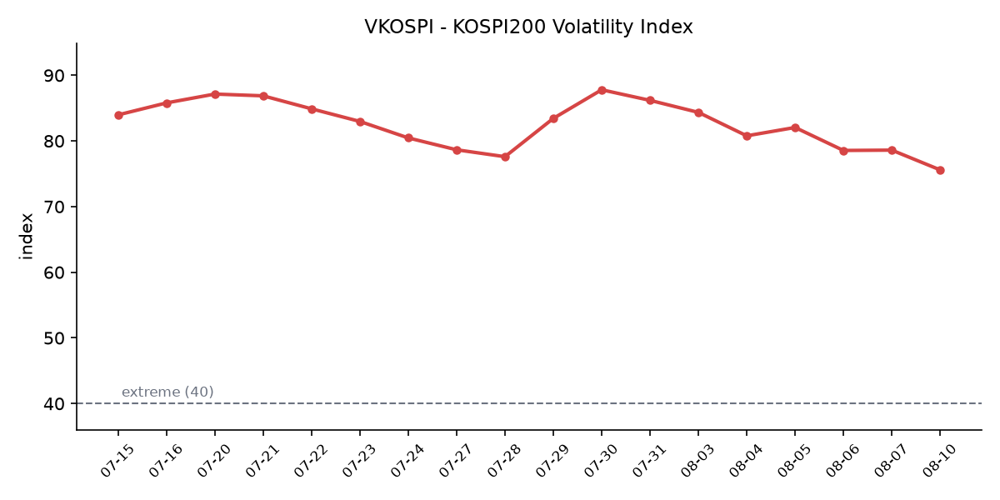

&nbsp;

【① 30초 요약 📈】

한국은 금요일 15시 30분에 문을 닫았고, <mark>미 7월 고용보고서는 그로부터 6시간 뒤인 금요일 21시 30분(KST)에 나왔습니다</mark>. **비농업 부문 고용이 23,000명 감소**했습니다. 시장 예상은 **8만~8만5,000명 증가**였습니다. 한국 시장이 아직 한 번도 반영하지 못한 재료입니다.

미국 증시는 이 숫자에 상승으로 답했습니다. **S&P 500 7,757.64(+0.62%)로 사상 최고 종가**, 나스닥 26,690.62(**+1.30%**), 다우 54,036.93(+0.28%)입니다. <mark>CME FedWatch 기준 9월 금리 인상 확률은 44.1%</mark>로, 직전 거래일 55%·1주 전 67%에서 내려왔습니다.

반도체가 랠리를 이끌었습니다. **SOX +2.56%**, 인텔 +10.8%, 마벨 +13%, 마이크로칩테크 +13.89%, **마이크론 +7.6%**, 브로드컴 +6.6%였습니다.

코스피는 08/07 **6,258.77(−0.60%)** 로 마감했습니다. 다만 주간으로 보면 그림이 다릅니다 — <mark>코스피 −5.10%인 한 주에 코스닥은 +10.98% 올랐습니다</mark>. 삼성전자·SK하이닉스의 코스피 시총 비중은 **58.9%에서 46.3%** 로 내려왔습니다.

SK하이닉스 ADR 괴리율은 **+36.7% → +37.3%** 입니다. 다만 구성이 달라졌습니다 — 본주 −4.88%, ADR −3.92%로 낙폭 차이가 **1.0%p**에 그쳤고(전일은 5.4%p), <mark>SOX가 +2.56% 오른 날 SKHY만 −3.92%였습니다</mark>.

&nbsp;

【② 밤사이 미국 시장 🌙】

| 지수 | 종가 | 등락률 |
| :--- | ---: | ---: |
| 다우존스 | 54,036.93 | +0.28% |
| **S&P 500** | **7,757.64** | **+0.62%** |
| 나스닥 | 26,690.62 | **+1.30%** |
| **SOX(필라델피아 반도체)** | 종가 미확인 | **+2.56%** |

<mark>S&P 500이 7,757.64로 사상 최고 종가를 새로 썼습니다</mark>. 나스닥은 342.26포인트(+1.30%), 다우는 151.83포인트(+0.28%) 올랐습니다. SOX는 +2.56% 상승했습니다(정확한 종가는 집계 시점 기준 미확인이며, 08/06 종가 12,048.69 기준으로 환산하면 약 12,357입니다).

주간 누적으로는 다우 **+2.96%**, S&P 500 **+3.53%**, 나스닥 **+5.19%** 였습니다.

이 상승의 출발점은 고용 지표입니다. 미 노동부가 발표한 7월 비농업 부문 고용은 **23,000명 감소**로, 로이터 조사 전문가 전망치 8만명 증가를 크게 밑돌았을 뿐 아니라 방향 자체가 순감소로 뒤집혔습니다. 감소분 중 정부부문이 **53,000명**이었고 소매·레저·숙박이 부진했습니다.

실업률은 **4.1%** 로 전월 4.2%에서 내렸지만, 이는 구직 활동을 하는 사람이 줄어든 결과이기도 합니다 — 경제활동참가율이 **61.4%로 5년여 만의 최저**로 떨어졌습니다. 시간당 평균임금 상승률은 **3.2%**(전년 대비)로 2021년 5월 이후 가장 낮았습니다.

<mark>고용이 꺾인 지표에 주식이 오른 이유는 금리에 있습니다</mark>. CME FedWatch 기준 9월 금리 인상 확률이 **44.1%** 로 내려왔습니다(직전 거래일 55%, 1주 전 67%). 미 10년물 국채금리는 **4.641%(−2.9bp)**, 2년물 4.191%(−5.4bp), 30년물 5.192%(−2.0bp)로 일제히 하락했고, 주간으로는 10년물이 4.745%에서 4.642%로 **10.3bp** 내렸습니다. VIX는 **14.88(−1.78%)** 로 더 낮아졌습니다.

반도체가 지수를 끌어올렸습니다. <mark>인텔 +10.8%, 마벨 +13%, 마이크로칩테크 +13.89%, 마이크론 +7.6%, 브로드컴 +6.6%</mark>였고 엔비디아는 +2.27%였습니다.

그 밖에 스페이스X가 **+15.83%** 로 급등했는데, 6월 IPO 이후 락업 물량이 해제된 첫날이었습니다. 아틀라시안 +35.31%, 에어비앤비 +17.43%, 아마존 +0.82%였고 트레이드데스크는 **−21.90%** 로 크게 밀렸습니다.

원자재는 브렌트 **83.55달러(+1%)**, WTI 78.18달러(+1%)로 이틀 연속 올랐습니다. 다만 주간으로는 WTI가 **10.00% 하락**(주간 종합 기준 76.18달러)했습니다. 주 초반 급락 뒤 주 후반 반등한 경로입니다. 금은 **4,344.29달러로 주간 7.46%** 올랐고, 구리는 파운드당 6.5893달러(주간 +1.91%), 비트코인은 64,998달러(주간 +3.34%)였습니다.

08/07 미 정규장 마감 후 한국 증시와 연동되는 대형 실적 발표는 확인되지 않았습니다. 금요일 마감은 곧 주말 진입이라 구조적으로 발표가 비는 구간입니다. 직전 브리핑이 예고했던 클라우드플레어 시간외 반응은 이번에도 집계 시점 기준 미확인입니다.

참고로 08/07 미 정규장 개장 전 선물은 다우 +0.24%, S&P 500 +0.46%, 나스닥100 +1.09%였고, 실제 마감은 그보다 강했습니다. 월요일 현재 시점 미 지수선물은 집계 시점 기준 미확인입니다.

&nbsp;

【③ 괴리율 트래커 — SK하이닉스 ADR 📊】

| 항목 | 수치 |
| :--- | :--- |
| SKHY 종가 | $137.91 (−3.92%) |
| 본주 환산가 (×10×환율 1,416.10원) | 1,952,944원 |
| 본주 직전 종가 | 1,422,000원 |
| **괴리율** | **+37.3%** |

전일 **+36.7%** 에서 **0.6%p** 확대됐습니다. 숫자의 변화는 작지만 그 안의 구성이 완전히 달라졌습니다.

08/06에는 본주 −10.37%, ADR −4.97%로 낙폭 차이가 **5.4%p** 였습니다. 즉 괴리 확대의 원인이 "한국이 미국보다 두 배 더 팔았다"는 데 있었습니다. 08/07에는 본주 **−4.88%**, ADR **−3.92%** 로 차이가 **1.0%p** 에 그쳤습니다.

여기에 환율이 1,423.80원에서 1,416.10원으로 **7.70원** 내려 환산가를 눌렀습니다. 세 요인(본주 하락·ADR 하락·원화 강세)이 서로 상쇄되면서 괴리율은 0.6%p만 움직였습니다.

괴리율의 구조는 이렇습니다. ADR 프리미엄(+)은 미국에서 거래되는 가격이 본주보다 높다는 뜻이고, 전환 차익거래 구조상 본주 쪽에 매수 유인이 생기는 방향으로 작동합니다. 디스카운트(−)면 반대입니다.

다만 이 프리미엄이 즉시 무위험 차익으로 실현되지는 않습니다. ADR→본주 전환 한도가 **1,779만주**(발행주식의 2.5%)로 제한돼 있고 전환 절차에 수 주 이상이 걸리기 때문입니다. 그래서 이 지표는 차익거래 기회라기보다 한·미 두 시장이 같은 자산에 매기는 값의 격차를 보여주는 계기판에 가깝습니다.

+37.3%는 이번 국면의 상단대에 근접한 수준입니다. 국면 고점은 08/05의 **+40.2%**, 그 이전 고점은 07/16의 +38.5%였고(07/31의 +62.0%는 상한가 직후 왜곡), 평균대는 +29% 구간입니다.

한편 <mark>같은 밤 SOX가 +2.56% 오르고 마이크론이 +7.6% 올랐는데 SKHY만 −3.92%였습니다</mark>. SKHY는 07/29 126.79달러(사상 최저)에서 08/04 154.38달러(국면 최고)까지 올랐다가 현재 137.91달러로, 국면 최고 대비 **10.7% 낮은** 수준입니다.

&nbsp;

【④ 변동성 트래커 🌡️】

판정 한 줄: <mark>'극단' 유지, 다만 6개 축 중 5개가 진정 방향이고 그중 하나는 구조 축입니다</mark> — VKOSPI가 8월 들어 처음 78 아래로 내려왔고, 삼성전자·SK하이닉스의 코스피 시총 비중이 **58.9%에서 46.3%로 12.6%p** 낮아졌습니다.

**기대 변동성** — VKOSPI **75.59**(08/07, 주간 −10.39%). 25 미만 평온 / 25~40 경계 / 40 이상 극단 기준에서 '극단' 구간이며, 기준 40의 약 **1.89배**입니다. 추이는 07/30 87.79 → 07/31 86.18 → 08/03 84.35 → 08/04 80.78 → 08/05 82.05 → 08/06 78.6 → 08/07 **75.59** 로, 7월 30일 고점 대비 12.2포인트 내려왔고 8월 들어 처음으로 78 아래입니다. 같은 날 미국 VIX도 **14.88(−1.78%)** 로 내려 한·미 변동성이 사흘 연속 같은 방향입니다. 두 지수의 격차는 여전히 약 5.1배입니다.

**실현 변동성** — 최근 8거래일 코스피 일별 등락률: 07/29 −5.98% → 07/30 −1.23% → 07/31 +17.91% → 08/03 −5.12% → 08/04 +1.62% → 08/05 +3.76% → 08/06 −4.58% → 08/07 **−0.60%**. 금요일은 **8거래일 만에 처음으로 종가 등락률이 ±1% 안에 들어온 날**입니다. 다만 일중 진폭은 줄지 않았습니다 — 08/07 경로는 시가 6,365.07(+1.09%) → 장중 고점 6,415.60 → 장중 저점 6,158.73 → 종가 6,258.77로, 고점과 저점 사이가 약 **4.2%** 였습니다. 주간 누적은 −5.10%, 07/30 저점 5,593.56 대비로는 +11.9%입니다.

**매매 정지** — 08/07 사이드카·서킷브레이커 발동 여부는 집계 시점 기준 미확인입니다. 확인된 최근 이력은 07/31 코스피·코스닥 동반 매수 사이드카 → 08/03 코스닥 매수 → 08/04 코스닥 매수 → 08/05 코스피 매수 → **08/06 10시 18분 코스피 매도 사이드카**입니다. 앞서 07/29에는 하락 서킷브레이커가 있었습니다.

**증폭 경로** — <mark>단일종목 레버리지 ETF 거래대금이 7조5,000억원에서 6,000억원으로 줄었습니다</mark>(주간 비교). 7월 일평균 12조3,000억원과 비교하면 약 **20분의 1** 수준이며, 코스피 거래대금 비중도 7월 30%에서 8월 5% 미만으로 내려왔습니다. 회전율은 레버리지 150%→10%, 인버스 2,400%→100%입니다.

**청산 압력** — 신용거래융자 잔고가 **28조9,349억원**(07/31 기준)으로 올해 1월 28일 이후 처음 30조원을 밑돌았습니다. 6월 24일 역대 최고치 38조6,328억원 대비 약 **10조원** 감소입니다. 반대매매 금액은 07/31 **1,220억원**, 07/30 1,037억원으로 이틀 연속 1,000억원을 넘었습니다. 08/03~08/07 일별 확정 집계는 닷새째 집계 시점 기준 미확인입니다.

**하방 포지션** — 코스피 공매도 순잔고는 집계 시점 기준 미확인입니다. **T+3 공시 지연** 때문에 07/28~08/07 구간의 잔고는 구조적으로 확인되지 않습니다. 제도는 2026년 3월 31일 차입공매도 전 종목 전면 재개 상태가 유지 중이며 변경 사항은 없습니다.

**집중도(신규 축)** — <mark>삼성전자와 SK하이닉스가 코스피 시가총액에서 차지하는 비중이 58.9%에서 46.3%로 12.6%p 낮아졌습니다</mark>. 대형 반도체의 하락과 중소형주의 상승이 동시에 일어난 결과입니다.

미확인 항목: SOX 08/07 정확한 종가, 코스피200 야간선물, 월요일 현재 시점 미 지수선물, 08/07 사이드카 발동 여부, 08/03~08/07 신용융자·반대매매 일별 집계, 공매도 순잔고, 상하이종합·항셍 08/07 종가, 달러인덱스 08/07 종가, 프로그램 매매 08/07, 8월 1~10일 수출 잠정치, 클라우드플레어 시간외 반응.

&nbsp;

【⑤ 어제 한국장 리뷰 🇰🇷】

| 지수 | 종가 | 등락률 |
| :--- | ---: | ---: |
| KOSPI | 6,258.77 | −0.60% |
| KOSDAQ | 798.81 | −0.36% |

코스피는 6,365.07(+1.09%)로 출발해 장중 6,415.60까지 올랐다가 오후에 6,158.73까지 밀린 뒤 **6,258.77(−0.60%)** 로 마감했습니다. 코스닥은 798.81(−0.36%)로 **6거래일 만에 반락**하며 800선을 내줬습니다. 시장에서는 하락 요인으로 중동 지정학 리스크, 미 고용보고서 발표를 앞둔 관망, 엔비디아의 HBM 사양 하향 검토 가능성이 함께 지목됐습니다.

주간으로 보면 두 지수가 정반대였습니다. <mark>코스피는 6,595.45에서 6,258.77로 −5.10%, 코스닥은 719.76에서 798.81로 +10.98%</mark>입니다. 한 주에 두 지수가 **16%p** 벌어졌습니다. 시장에서는 대형주가 조정을 받는 사이 중소형 성장주에 반발 매수세가 유입된 결과라는 해석이 나옵니다.

시가총액 상위 반도체 두 종목이 갈렸습니다. **SK하이닉스 1,422,000원(−4.88%)**, **삼성전자 231,000원(+0.22%)** 입니다. 8월 들어 두 종목이 갈라진 것은 처음입니다.

SK하이닉스 하락 배경으로는 세 가지가 함께 지목됐습니다. 첫째, <mark>엔비디아가 차세대 AI 칩 '루빈 울트라'의 메모리 구성을 12단 HBM4E 외에 8단 HBM4E·12단 HBM4·8단 HBM4까지 넓혀 평가 중</mark>이라는 소식입니다(최종 사양 미확정). 시장은 이를 납품 단가 관련 부담으로 해석했으며, HBM 노출도가 높은 SK하이닉스의 약세가 지수 하락을 주도했다는 것이 현지 애널리스트 평가입니다.

둘째, 주주환원입니다. 회사는 08/07 보통주 1주당 **375원 분기 배당**(배당기준일 08/31)을 결의했으나, 확대 방안의 구체적 규모와 방식은 **"연말까지 마련 중"** 이라고 밝혔고 3분기 중 세부 발표 계획을 언급했습니다.

셋째, 미국 낸드 자회사 **솔리다임의 나스닥 상장 추진 관측**(프리IPO를 통한 약 5조원 조달설)이며, 회사는 "현재까지 확정된 사항은 없다"고 해명했습니다. 여기에 충칭 공장 지분 매각 관측도 함께 거론됐습니다.

네이버는 **−7.08%** 였습니다. 2분기 영업이익이 전년 동기 대비 0.2% 감소한 실적을 발표한 직후였습니다.

반대편에서는 태양광 밸류체인이 급등했습니다. <mark>OCI홀딩스가 272,500원(+11.68%), 한화솔루션이 13%대 상승</mark>했습니다. 트럼프 미국 대통령이 폴리실리콘과 파생제품에 대한 수입 규제 행정명령에 서명한 데 따른 것입니다. 2차전지와 제약·바이오도 상대적 강세였습니다.

수급은 지난주보다 온건했습니다. 코스피에서 **외국인이 8,633억원을 순매도**했고 기관이 **5,789억원**, 개인이 2,669억원을 순매수했습니다(15시 35분 기준). 08/03의 3조8,708억원, 08/06의 3조3,285억원 순매도와 비교하면 약 **4분의 1** 수준입니다. 코스닥에서는 개인 +3,405억원, 외국인 −2,539억원, 기관 −1,030억원으로, 08/06에 매수 주체였던 기관이 하루 만에 순매도로 돌아섰습니다.

원·달러는 **1,416.10원으로 7.70원** 내렸습니다. 08/06의 −0.70원과 달리 실질적인 폭이며, <mark>주간으로는 35.20원 절상</mark>됐습니다(주간 종합 기준 1,407.74원). 외국인이 순매도한 날에 환율이 내렸다는 점에서, 지난 3주간 원·달러를 움직여 온 축이 외국인 수급에서 미 금리로 옮겨간 흐름으로 읽힙니다.

아시아 증시는 08/07 대체로 소폭 약세였습니다. 닛케이 **65,606.71(−0.12%)**, 대만 가권 **44,225.91(−0.38%)** 였습니다. 대만은 장중 44,827까지 올랐다가 차익실현에 반락했으나 주간으로는 **1,106포인트 상승**했습니다. 상하이종합과 항셍은 08/07 상승을 주도했다고 보도됐으나 정확한 종가는 집계 시점 기준 미확인입니다.

주말(08/08~08/09)에는 중동에서 큰 변화가 있었습니다. <mark>08/08 이란 최고국가안보회의 졸가드르 사무총장이 호르무즈 해협 재개방을 위한 6대 조건을 담은 성명을 발표</mark>했습니다. 조건은 이란 및 이란 연계 단체에 대한 미국의 전쟁 영구 종식, 이란 주변 해상 봉쇄 해제, 이란 주변 해역에서 미군 철수, 미국의 모든 제재 해제, 동결된 이란 자산 해제, **전쟁 배상금 지불**입니다. 졸가드르는 "미국이 행동을 바로잡기 전까지 호르무즈 해협은 재개방되지 않을 것"이라고 밝혔습니다. 이는 앞서 미국과 이란이 합의했던 종전 양해각서보다 강경한 내용입니다.

한편 이란과 오만은 호르무즈 통과 신규 항로의 좌표에 합의했으나, 화물 운임·검사·전반적 보안 조치 협상은 아직 해결되지 않았습니다. 러시아-우크라이나, 미중, 북한 관련해서는 공백 기간 특이 동향이 확인되지 않았습니다.

그 밖에 기록해 둘 두 가지가 있습니다. 하나는 신용시장입니다 — 오라클의 5년물 CDS 프리미엄이 **203bp로 2008년 말 이후 최고**, 엔비디아 79bp·알파벳 67bp로 각각 사상 최고를 기록했습니다. 오라클의 발행 잔액은 약 1,200억 달러입니다. 다른 하나는 한국 대외 부문입니다 — 6월 경상수지가 **497억3,000만 달러 흑자**로 두 달 연속 월간 최대를 경신했고, 월간 상품수출이 처음으로 **1,000억 달러**를 넘었습니다.

&nbsp;

【⑥ 오늘의 캘린더 & 관전 포인트 📅】

오늘(08/10)
· **12:00 KST** 금융감독원 해외부동산 공모펀드 관련 주요 분쟁사례 및 투자자 유의사항 안내
· **12:00 KST** 한국은행 통화안정증권 발행제도 개선
· 이란 6대 조건에 대한 미국 측 반응 — 주말 성명의 후속이며, 이란·오만 신규 항로의 운임·검사·보안 협상도 진행 중입니다
· SK하이닉스·삼성전자 주주환원 공시 — SK하이닉스가 "3분기 중 세부 발표"를 언급한 상태이며 수시 공시 사안입니다
· 08/03~08/07 신용융자·반대매매 집계 공표 — 닷새째 미확인 구간입니다
· 미 의회 여름 휴회 시작(8/10~9/11)

이번 주
· **08/11(화):** 반도체산업 경쟁력 강화 및 지원에 관한 특별법 시행 / 코어위브·슈퍼마이크로컴퓨터(SMCI) 실적 / 한국은행 제14차 금통위 의사록 공개(16:00) / 금융위 특정금융정보법 시행령 개정안 국무회의 의결
· **08/12(수):** 미 7월 소비자물가지수(CPI) — **21:30 KST**. 6월 CPI는 전년 대비 3.5%였고, 유가가 튄 뒤 나오는 첫 물가 지표입니다 / MSCI 분기 리뷰
· **08/13(목):** 미 7월 생산자물가지수(PPI) / 한국 옵션만기일 / 한국은행 금통위 본회의(10:00) / 7월 가계대출 동향(12:00) / 어플라이드머티어리얼즈(AMAT) 실적
· **08/14(금):** 미 7월 소매판매 / 한국은행 7월 수출입물가지수 및 무역지수(06:00)

이후
· **08/21:** 미 상원이 애플에 요구한 CXMT·YMTC 미사용 확약 시한
· **08/26:** 미 7월 PCE 물가 + 엔비디아 실적
· **08/27:** 한국은행 금통위(경제전망) + 잭슨홀 심포지엄
· **09/15~16:** FOMC
· 8월 중: 단일종목 레버리지 개인별 총량규제 시행, 괴리율 관리의무 3%→2% 강화, 8월 1~10일·1~20일 수출 잠정치

시장이 주시하는 레벨
· 원·달러 **1,416.10원**(08/07 종가)과 1,410원 선 — 주간 35.20원 절상된 자리입니다
· SK하이닉스 ADR 괴리율 **+37.3%** — 국면 고점(08/05 +40.2%, 07/16 +38.5%)과 평균대(+29% 구간)
· VKOSPI **75.59** 와 80선
· 미 10년물 **4.641%**, 브렌트 83.55달러
· 코스피 장중 저점 6,158.73, 코스닥 **800선**
· CME FedWatch 9월 인상 확률 **44.1%**
· 삼성전자·SK하이닉스 코스피 시총 비중 **46.3%**

&nbsp;

【⑦ 정책 워치 ⚡】

**미국 폴리실리콘·태양광 수입 규제:** 트럼프 대통령이 폴리실리콘과 파생제품에 대한 무역확장법 232조 관세 행정명령에 서명했습니다. 시행일은 **2026년 12월 4일 00시 01분**(미 동부시간)입니다. 최저수입가격(MIP)은 폴리실리콘 킬로그램당 **21달러**, 폴리실리콘 잉곳·웨이퍼 킬로그램당 100달러, 태양광 셀 와트당 0.22달러, 모듈 와트당 0.38달러이며, 파생상품에는 **15%의 추가 종가세**가 부과됩니다. 한국은 무역협정 파트너로 분류돼 기존 관세와 신규 관세를 합산한 **상한 15%** 가 적용되고, 한국산 폴리실리콘을 100% 사용한 제품(중국산 원료 제외)은 제조 환급 대상이 될 수 있습니다. 폴리실리콘은 태양광뿐 아니라 **반도체 공급망의 출발점**이어서 반도체용도 규제 범위에 포함됩니다.

**공매도:** 2026년 3월 31일 차입공매도 전 종목 전면 재개 상태가 유지되고 있으며 제도 변경은 없습니다. 무차입 공매도는 계속 금지입니다. 세부 규정은 강화되는 방향입니다 — 모든 기관 투자자의 실시간 잔고 관리 및 NSDS 연동 의무화, 기관 상환기간 최대 **12개월** 제한, 공매도 목적 대차 후 90일 경과 시 금융당국 보고 의무 신설이 시행·추진 중입니다.

**단일종목 레버리지 상품(ETF·ETN) 규제:** 기본예탁금 1,000만원 → **3,000만원** 상향이 07/31 조기 시행됐고, 매도대금 현금 인정 시점이 T일 → T+2일로 변경됐으며 신규 상품 출시가 중단됐습니다. 8월 중 개인별 총량규제 시행과 괴리율 관리의무 3% → 2% 강화가 예정돼 있습니다.

**반도체산업 경쟁력 강화 및 지원에 관한 특별법**이 08/11 시행됩니다.

**금융위원회 특정금융정보법 시행령 개정안**이 08/11 국무회의에 상정되며, 08/13에는 개정 특금법 시행에 따른 가상자산사업자 신고 매뉴얼 개정 설명회가 열립니다.

&nbsp;

【⑧ 오늘의 질문 ❓】

필라델피아 반도체지수가 +2.56% 오르고 마이크론이 +7.6% 오른 밤에 SK하이닉스 ADR만 −3.92%로 마감한 것을, 업황과 개별 종목 사안 중 어느 쪽으로 읽을 것인가.

&nbsp;

#개장전브리핑 #미국증시마감 #하이닉스ADR #괴리율 #코스피 #코스닥 #반도체 #미국고용지표 #VKOSPI #폴리실리콘관세

&nbsp;

본 글은 공개된 시장 데이터를 정리한 정보성 콘텐츠이며, 특정 종목·상품의 매매 권유가 아닙니다. 모든 투자 판단과 책임은 투자자 본인에게 있습니다. 수치는 작성 시점 기준이며 이후 변동될 수 있습니다.