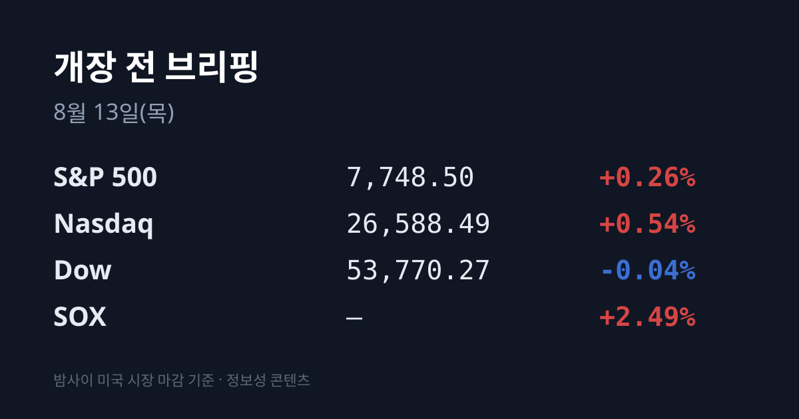
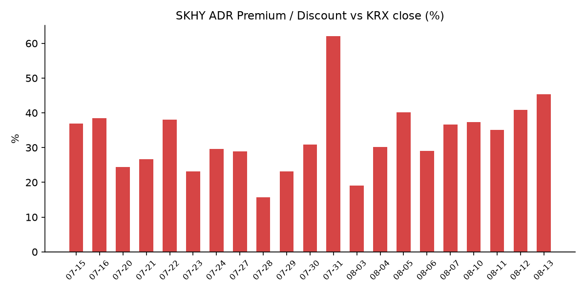
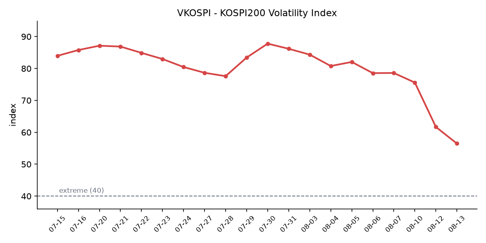

&nbsp;

【① 30초 요약 📈】

미 7월 CPI가 네 항목 모두 컨센서스에 정확히 부합했습니다. 헤드라인 전월비 +0.1%·전년비 3.4%, 코어 전월비 +0.2%·전년비 2.5%였습니다.

미 3대 지수는 갈렸지만 반도체가 강했습니다. S&P 500 7,748.50(+0.26%) · 나스닥 26,588.49(+0.54%) · 다우 53,770.27(−0.04%)에 <mark>필라델피아 반도체 지수 +2.49%</mark>였습니다.

AI 인프라가 밸류체인 전 구간에서 움직였습니다. 네비우스 +34.14%, 코어위브 +19.28%, SMCI +19.02%, 마이크론 **+4.92%**, 엔비디아 +3.03%였습니다.

**VIX 14.46(−5.37%)으로 7개월 최저를 기록**했고, 미 10년물은 4.682%로 보합이었습니다. CME FedWatch 9월 인상 확률은 42%(전일 45%)로 내렸습니다.

어제 코스피는 **6,579.04(+3.68%)** 로 마감했고 외국인이 2조8,357억원을 순매수했습니다. 11시 57분에 매수 사이드카가 발동했습니다.

<mark>SK하이닉스 ADR 괴리율 +45.3%</mark> — 이틀 연속 이번 국면 신고점입니다.

&nbsp;

【② 밤사이 미국 시장 🌙】

| 지수 | 종가 | 등락률 |
| :--- | ---: | ---: |
| S&P 500 | 7,748.50 | +0.26% |
| 나스닥 | 26,588.49 | +0.54% |
| 다우 | 53,770.27 | −0.04% |
| 필라델피아 반도체(SOX) | 지수 레벨 미확인 | +2.49% |

미국 노동통계국이 발표한 7월 소비자물가지수는 헤드라인 전월비 +0.1%·전년비 3.4%, 코어 전월비 +0.2%·전년비 2.5%로 네 항목이 모두 시장 예상치와 같았습니다.

브렌트유가 배럴당 90달러를 터치한 직후에 나온 물가 지표였는데도 유가가 소비자물가로 전이된 흔적은 나타나지 않았습니다.

발표 직후 3대 지수는 모두 크게 오른 채 출발했다가 오전 중 상승폭을 반납했습니다. 보도에서는 "지표가 이미 가격에 반영돼 있었다"는 해석이 나왔습니다.

CME FedWatch 기준 9월 인상 확률은 42%로 전일 45%에서 내렸습니다. 미 10년물 금리는 4.682%로 사실상 보합이었고, VIX는 14.46(−5.37%)으로 7개월 최저를 기록했습니다. 달러인덱스는 99.85였습니다.

지수보다 강했던 것은 반도체와 AI 인프라입니다. 필라델피아 반도체 지수가 +2.49%로 전일(+0.87%)의 약 3배 상승폭을 기록했고, 마이크론 +4.92%, 엔비디아 +3.03%였습니다.

AI 인프라 쪽에서는 네비우스가 2분기 매출 전년 대비 +454%를 발표하고 연말 계약 전력 가이던스를 4GW에서 5GW로 상향하면서 **+34.14% 급등**했습니다. 전날 시간외에서 올랐던 코어위브(+19.28%)와 슈퍼마이크로컴퓨터(+19.02%)는 정규장에서 상승폭을 확정했고, iREN +9.86%, 루멘텀 +13.63%, 어플라이드디지털 +4.92%도 함께 올랐습니다.

정규장 마감 후에는 시스코가 실적을 발표했습니다. 4분기 매출 173억 달러, 제품 총수주 전년 대비 +35%, 네트워킹 수주 +40%(8분기 연속 두 자릿수)였고, FY26 AI 인프라 수주는 93억 달러로 회사 목표 90억 달러를 넘겼습니다.

FY27 가이던스는 매출 722~734억 달러(FactSet 컨센 691.2억 달러), 조정 EPS 5.05~5.11달러(컨센 4.64달러)로 제시됐습니다. <mark>FY27 AI 하이퍼스케일러 매출 목표는 75억 달러로 FY26 추정 40억 달러 대비 +87.5%</mark>입니다. 시간외에서 +2.85%(123.86달러)를 기록했습니다.

원자재는 브렌트유(10월물) 88.98달러(+0.07달러), WTI(9월물) 83.27달러(+0.07달러)로 이틀간의 상승이 멈췄고, 금 현물은 2개월 최고에서 되밀려 4,368.25달러(−0.50%)였습니다.

&nbsp;

【③ 괴리율 트래커 — SK하이닉스 ADR 📊】

| 항목 | 수치 |
| :--- | ---: |
| SKHY 종가 | $154.41 (+9.01%) |
| 본주 환산가 (×10×환율) | 2,185,982원 |
| 본주 직전 종가 | 1,504,000원 |
| **괴리율** | **+45.3%** |

SKHY는 8월 12일 뉴욕장에서 12.76달러 오른 154.41달러에 마감했습니다. 종전 이번 국면 최고 종가인 8월 4일 154.38달러를 넘어선 수치입니다.

같은 날 필라델피아 반도체 지수는 +2.49%였으므로 SKHY가 섹터를 6.52%p 상회했습니다. 섹터 대비 상회 폭은 8월 10일 1.0%p, 8월 11일 3.83%p, 8월 12일 6.52%p로 사흘 연속 커졌습니다.

괴리율 계산의 구조가 전날과 다릅니다. 8월 11일에는 본주가 +0.35%에 그쳐서 괴리가 벌어졌지만, 8월 12일에는 본주가 **+5.54% 상승**했는데도 괴리가 4.5%p 더 벌어졌습니다. 환율은 0.3원 내려 환산가에 미치는 영향이 거의 없었습니다. 한국이 5.54%를 사는 동안 미국이 9.01%를 산 결과입니다.

괴리율의 의미는 구조에서 나옵니다. ADR과 본주는 원칙적으로 같은 회사의 같은 지분이므로, 환산가가 본주보다 높은 프리미엄 상태에서는 전환 차익거래 구조상 본주 쪽에 매수 유인이, 낮은 디스카운트 상태에서는 매도 유인이 생깁니다.

다만 SK하이닉스 ADR의 본주 전환 한도는 1,779만주(발행주식의 2.5%)이고 전환 절차에 수 주 이상이 걸리므로, 괴리가 즉시 무위험 차익으로 실현되는 구조는 아닙니다. 또한 수렴은 본주 상승으로도 ADR 하락으로도 일어납니다. 8월 5일 +40.2%를 기록한 다음 날인 8월 6일에는 ADR이 −5.0% 내리며 +29.0%로 압축된 사례가 있었습니다.

괴리율 추이(브리핑 발행일 기준): 07/24 +29.6 → 07/27 +28.9 → 07/28 +15.7 → 07/29 +23.1 → 07/30 +30.9 → 07/31 +62.0 → 08/03 +19.1 → 08/04 +30.2 → 08/05 +40.2 → 08/06 +29.0 → 08/07 +36.7 → 08/10 +37.3 → 08/11 +35.1 → 08/12 +40.8 → 08/13 +45.3

&nbsp;

【④ 변동성 트래커 🌡️】

판정 한 줄: <mark>'극단' 유지, 방향은 진정 — 다만 기대 변동성과 실현 변동성이 어제 처음으로 엇갈렸다</mark>. VKOSPI는 사흘 연속 내려 56.48까지 왔지만, 같은 날 코스피가 +3.68% 움직이며 매수 사이드카가 발동했습니다.

기대 변동성 — VKOSPI **56.48**(전일 대비 −5.20p, **−8.43%**)로 기준 40의 약 1.41배입니다. 40 이상은 '극단' 구간이므로 레짐은 유지됩니다. 추이는 07/30 87.79 → 07/31 86.18 → 08/03 84.35 → 08/04 80.78 → 08/05 82.05 → 08/06 78.6 → 08/07 75.59 → 08/10 69.55 → 08/11 61.68 → 08/12 56.48입니다.

사흘 연속 하락(−7.99%, −11.32%, −8.43%)으로 누적 −18.8%이며, 7월 29일 장중 고점 93.27 대비 −39.5%입니다. 같은 날 미국 VIX는 14.46(7개월 최저)으로, 한·미 격차는 5.1배 → 4.5배 → 4.0배 → 3.9배로 나흘 연속 좁혀졌습니다.

실현 변동성 — 최근 9거래일 코스피 일별 등락률은 07/31 +17.91% → 08/03 −5.12% → 08/04 +1.62% → 08/05 +3.76% → 08/06 −4.58% → 08/07 −0.60% → 08/10 +0.65% → 08/11 +0.73% → 08/12 +3.68%입니다. 사흘 연속 ±1% 안에 머물던 지수가 어제 다시 튀었고, 최근 10거래일 중 ±3% 이상 등락일은 5일입니다. 코스닥은 반대로 +0.12%에 그쳐 두 지수의 하루 등락률 차이가 08/11 0.34%p에서 08/12 3.56%p로 벌어졌습니다.

매매 정지 — 8월 12일 **11시 57분 코스피 매수 사이드카가 발동**했습니다. 코스피200 선물이 50.68p(+5.13%) 오른 1,037.76까지 상승하며 발동 요건을 충족해 프로그램 매수호가 효력이 5분간 정지됐습니다. 최근 7회 중 6회가 '매수' 방향입니다.

증폭 경로 — 단일종목 레버리지 ETF 일 거래대금은 8,500억원으로, 규제 시행 전날인 7월 30일 12조4,485억원 대비 **−93.2%** 입니다. 개인 자금은 지수형 레버리지·인버스 상품으로 옮겨간 것으로 추정된다는 분석이 나왔습니다.

청산 압력 — 신용거래융자 잔고는 7월 31일 기준 28조9,349억원으로, 6월 24일 역대 최고 38조6,328억원 대비 약 10조원 줄어든 상태입니다. 반대매매 비중 월평균은 6월 3.52%, 7월(29일까지) 3.17%였습니다. 8월 3일 이후의 일별 확정 집계는 집계 시점 기준 미확인입니다.

하방 포지션 — 8월 12일 공매도 거래대금은 총 1조9,236억원으로 전체 거래대금의 3.96%였고, 전일 2조440억원 대비 1,205억원(−5.9%) 줄었습니다. 코스피 1조5,627억원(−7.7%), 코스닥 3,609억원(+2.9%)으로 방향이 갈렸습니다. 금액 1위는 삼성전자 5,035억원, 비중 1위는 ESR켄달스퀘어리츠 32.65%였습니다. 코스피 공매도 참여 구성에서 외국인 비중은 7.77%p 줄고 기관 비중은 7.61%p 늘었습니다. 코스피 공매도 순잔고는 T+3 공시 지연으로 8월 7일 이후 구간이 집계 시점 기준 미확인입니다.

미확인 항목: SOX 지수 포인트 레벨, 미 2년물 금리, 오늘 아침 시점 미 지수선물, 코스피200 야간선물, 8월 12일 코스닥 외국인·기관 확정 순매수, 8월 3일 이후 신용융자·반대매매 일별 집계, 코스피 공매도 순잔고, 프로그램 매매, 선물 베이시스, DRAM/NAND 당일 현물가.

&nbsp;

【⑤ 어제 한국장 리뷰 🇰🇷】

| 지수 | 종가 | 등락 |
| :--- | ---: | ---: |
| KOSPI | 6,579.04 | +233.51p (+3.68%) |
| KOSDAQ | 858.91 | +1.07p (+0.12%) |

코스피 수급은 외국인 +2조8,357억원, 기관 +5,278억원, 개인 −3조1,913억원이었습니다. 외국인 순매수는 8월 10일 −1조4,887억원, 8월 11일 +2,189억원에서 사흘 만에 방향과 규모가 크게 바뀐 수치입니다.

코스닥에서는 개인이 3,148억원을 순매수했고, 외국인·기관 확정치는 집계 시점 기준 미확인입니다.

시가총액 상위 종목은 <mark>삼성전자 255,500원(+6.68%)·SK하이닉스 1,504,000원(+5.54%)</mark>으로 마감했습니다. 이틀 누적으로는 삼성전자 +11.09%, SK하이닉스 +5.91%입니다.

이 밖에 LG전자 205,000원(**+12.82%**), SK스퀘어 +8.36%, 삼성SDI +5.78%가 올랐습니다. LG전자 상승 배경으로는 구광모 LG 회장이 이번 주 실리콘밸리에서 젠슨 황 엔비디아 CEO와 재회동한다는 소식이 보도됐습니다. 6월 서울 LG트윈타워 회동 이후 약 2개월 만이며, 의제는 피지컬 AI 로봇(휴머노이드), AI 데이터센터, 모빌리티 3대 축으로 알려졌습니다.

코스닥은 바이오 차익실현 매물로 하락 출발했다가 이차전지·기계장비 강세로 상승 전환해 마감했습니다. 업종별로는 비금속 +7.9%, 유통 +3.0%, 기계·장비 +2.1%였습니다.

상한가 종목은 아주IB투자 +29.98%(미국 자회사 투자처 아셀릭스의 길리어드 피인수 소식), THE E&M +29.96%(자회사 루카에이아이셀 항바이러스 치료제 개발), 국전약품 +29.94%(HBM 공정용 소재 라인 평가 통과)였습니다. 기관 순매수 상위에는 리가켐바이오·에이비엘바이오(바이오)와 에스피지·로보티즈(로봇)가 올랐습니다.

원·달러 환율은 주간거래 종가 기준 1,415.7원으로 0.3원 내렸습니다. 외국인이 코스피에서 2조8,357억원을 순매수한 날의 환율 변동으로는 작은 폭입니다. 전날인 8월 11일에는 외국인 순매수 2,189억원에 환율이 2.4원 내렸습니다.

아시아 증시는 코스피 +3.68%, 대만 자취안 45,518.07(+0.88%), 닛케이 67,524.06(+0.83%), 상해종합 3,946.68(+0.32%), 항셍 −0.96%였습니다.

&nbsp;

【⑥ 오늘의 캘린더 & 관전 포인트 📅】

**08/13(오늘):** 코스피200 선물·옵션 동시만기일. 어제 코스피200 선물이 50.68p(+5.13%) 오른 1,037.76까지 상승하며 사이드카를 발동시킨 직후의 만기입니다. 프로그램 매매·차익잔고 확정치는 집계 시점 기준 미확인입니다.

**오늘 21:30 KST:** 미 7월 생산자물가지수(PPI). 전월비 컨센서스는 +0.2%입니다. 6월 헤드라인은 전년비 5.5%로 컨센서스 6.2%를 하회했습니다.

**내일 05:30 KST:** 어플라이드머티어리얼즈(AMAT) FY26 3분기 실적. 컨센서스 조정 EPS는 3.36달러(전년 동기 2.48달러 대비 +35.5%), 회사 가이던스는 매출 약 89.5억 달러(±5억 달러)입니다.

**08/14(금):** 미 7월 소매판매. **08/21:** 미 상원이 애플에 요구한 CXMT·YMTC 미사용 확약 시한. **08/26:** 미 7월 PCE 물가, 엔비디아 실적, 알테오젠 무상증자 신주 상장.

**08/27(목):** 한국은행 금융통화위원회 및 잭슨홀. 한국은행 공식 일정 기준 2026년 통화정책방향 결정회의는 1/15·2/26·4/10·5/28·7/16·08/27·10/22·11/26이며, 8월 회의는 08/27 하루입니다. 직전 7월 16일 회의에서 기준금리를 2.50%에서 2.75%로 인상했습니다.

**09/15~16:** FOMC. 현 연방기금금리는 3.50~3.75%이고, CME FedWatch 기준 9월 인상 확률은 42%입니다.

**이번 주 중:** 구광모 LG 회장과 젠슨 황 엔비디아 CEO의 실리콘밸리 회동.

시장이 주시하는 레벨: SK하이닉스 ADR 괴리율 +45.3%(평균대 +29% 대비 16.3%p 위), 원·달러 1,410원과 1,420원, 미 10년물 4.75%, VKOSPI 65, 브렌트유 배럴당 90달러, 삼성전자와 SK하이닉스의 이틀 누적 등락률 격차 5.18%p입니다.

&nbsp;

【⑦ 정책 워치 ⚡】

공매도 제도는 2026년 3월 31일 차입공매도 전 종목 전면 재개 상태가 유지되고 있으며, 이번 리서치에서 제도 변경 사항은 확인되지 않았습니다. 무차입 공매도는 계속 금지이고, 2026년 중 공매도 전산화 전면 의무화가 진행 중입니다.

단일종목 레버리지 ETF 규제는 기본예탁금 1,000만원 → 3,000만원(7월 31일 시행), 매도대금 현금 인정 T일 → T+2일, 신규 상품 출시 중단이 시행됐고, 8월 중 개인별 총량규제와 괴리율 관리의무 3%→2% 강화가 예정돼 있습니다.

호르무즈 해협 관련해서는 이란 외무부 대변인이 오만과 항로의 지리적 좌표에 합의했으며 양국 공동성명이 최종 검토·초안 작성 단계에 있다고 밝혔습니다. 페르시아만 진입 선박은 이란 쪽 항로, 진출 선박은 오만 쪽 항로를 이용하는 구조입니다.

통행료는 이란이 화물가치의 5~7%, 오만이 약 3%를 주장하며 대립 중이고, 미국은 명칭이 서비스 요금이더라도 통항의 조건이면 자유항행 원칙을 훼손하는 통행료라는 입장으로 반대하고 있습니다. 이란 대변인은 좌표 합의가 해협의 완전하거나 즉각적인 개방을 의미하지는 않는다고 밝혔고, 6개 선결 조건은 유지되고 있습니다.

&nbsp;

【⑧ 오늘의 질문 ❓】

한국이 5.54%를 사고 미국이 9.01%를 산 하루가 지난 뒤, 동시만기일의 수급은 이 격차를 어느 쪽으로 정리할 것인가.

&nbsp;

#개장전브리핑 #미국증시마감 #하이닉스ADR #괴리율 #코스피 #코스닥 #반도체 #VKOSPI #동시만기일 #미국CPI

&nbsp;

본 글은 공개된 시장 데이터를 정리한 정보성 콘텐츠이며, 특정 종목·상품의 매매 권유가 아닙니다. 모든 투자 판단과 책임은 투자자 본인에게 있습니다. 수치는 작성 시점 기준이며 이후 변동될 수 있습니다.