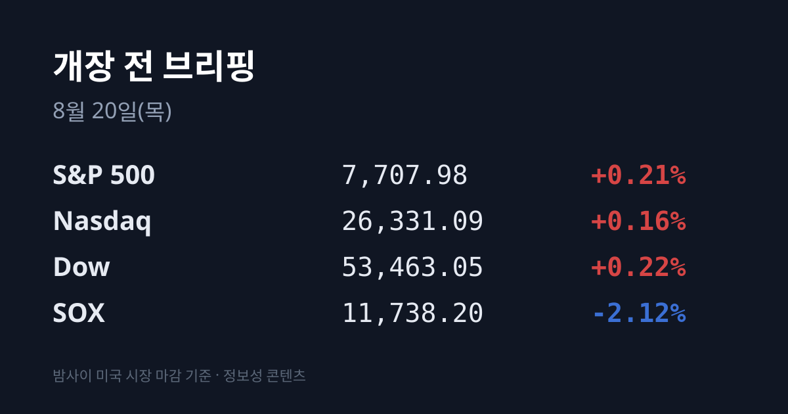
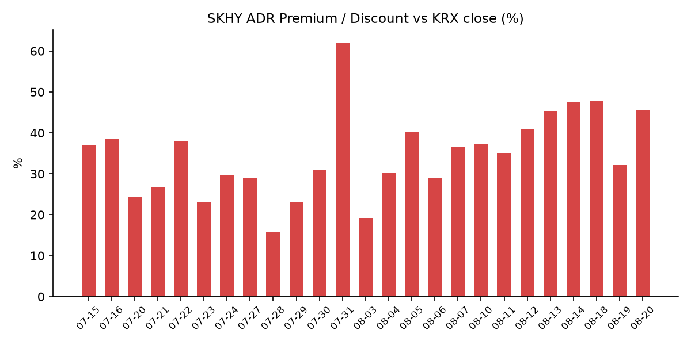
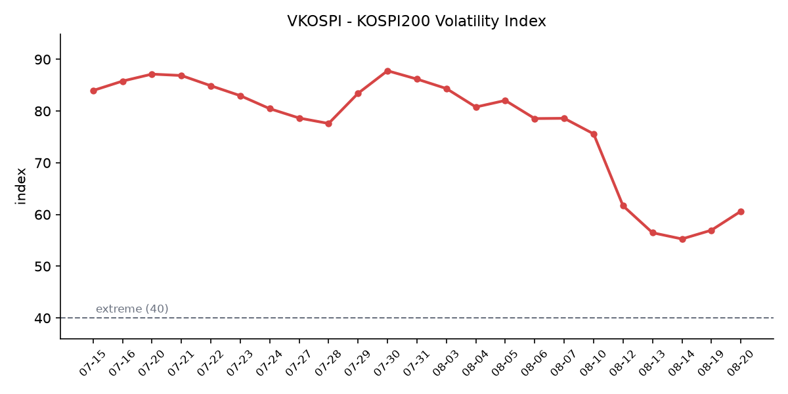

&nbsp;

【① 30초 요약 📈】

어제 코스피가 <mark>6,471.17로 −5.80%(−398.66포인트) 급락</mark>했습니다. 오전 **9시 6분** 코스피200 선물이 **−6.02%까지** 밀려 매도 사이드카가 발동했고, 프로그램 매도호가 효력이 5분간 정지됐습니다. 2주 만의 발동입니다.

낙폭의 정체는 메모리 대형주입니다. 삼성전자 **247,500원(−7.82%)**, SK하이닉스 **1,500,000원(−9.75%)**, SK스퀘어 −11.54%. 두 종목이 코스피 시총의 <mark>46.94%</mark>이고, 가중 기여만 −4%포인트 안팎입니다. 반면 코스닥은 824.46(−1.17%)로 4.63%포인트 덜 빠졌습니다.

그리고 <mark>장 마감(15:30) 13분 뒤인 15시 43분, SK하이닉스가 40조원 규모 자사주 취득·전량 소각을 발표</mark>했습니다. 약 **2,407만주(발행주식의 3.3%)**, 취득 개시일은 **오늘**입니다. 국내 상장사 최대 규모입니다.

시장은 정규장 뒤에 반응했습니다. SK하이닉스 시간외 단일가 **1,644,000원** — 전일 종가 대비 −1.08%로, 정규장 낙폭 −9.75%의 대부분을 되돌린 가격입니다.

밤사이 미국은 방향이 달랐습니다. S&P 500 +0.21% · 나스닥 +0.16% · 다우 +0.22%로 사흘 연속 하락이 끝났습니다. 계기는 <mark>미 재무부가 10~30년 장기국채 바이백 규모를 최소 2배로 확대</mark>한다고 발표한 것입니다. **30년물 −9bp(5.195%)** · **10년물 −5bp(4.653%)**, 2년물은 4.175%로 제자리였습니다.

다만 반도체는 아직 방향이 다릅니다. 필라델피아 반도체(SOX) **11,738.2(−2.12%)** 로 이틀 연속 하락, 08/18~19 누적 **−7.0%** 입니다.

수급은 외국인이었습니다. 코스피에서 **외국인 −4조242억원** · 기관 −1조7,926억원, 받아낸 것은 **개인 +5조6,403억원**입니다.

원·달러는 <mark>1,397.7원(−14.1원)</mark>으로 2025년 10월 2일 이후 처음 1,400원 아래에서 마감했고, 오늘 새벽에는 **1,388.26원**입니다. 외국인이 4조원을 순매도한 날 원화가 14원 강해진 조합입니다.

매크로 밖에서도 두 건이 있었습니다. 한화에어로스페이스가 미 육군 기동전술포(MTC) 시제품 개발 계약에 단독 선정돼 장중 **+8.81%**, 미국에서는 **모더나가 약 +177%**(머크 약 +12%) 올랐습니다.

&nbsp;

【② 밤사이 미국 시장 🌙】

| 지수 | 08/19 종가 | 등락 | 등락률 |
| :--- | ---: | ---: | ---: |
| S&P 500 | 7,707.98 | +16.22 | +0.21% |
| 나스닥 | 26,331.09 | +41.38 | +0.16% |
| 다우 | 53,463.05 | +119.65 | +0.22% |
| 필라델피아 반도체(SOX) | 11,738.2 | −254.3 | **−2.12%** |

3대 지수가 사흘 연속 하락을 끝냈습니다. 러셀2000도 3,032.94(+0.50%)로 대형주를 앞섰습니다. 그런데 이날의 사건은 주식이 아니라 채권시장에서 일어났습니다. <mark>미 재무부가 10~30년 만기 장기국채 바이백(환매) 규모를 최소 2배로 늘린다고 발표했고, 전 세계 장기채가 랠리했습니다.</mark>

수익률로 보면 30년물이 9bp 내려 **5.195%**, 10년물이 5bp 내려 **4.653%** 입니다. 2년물은 약 4.175%로 사실상 제자리였습니다. 8월 내내 시장을 눌러온 것이 초장기 구간이었다는 점을 감안하면, 오른 곳만 내려온 세션입니다. 직전 브리핑 시점에 30년물은 장중 5.34%로 19년 최고를 기록한 상태였습니다.

VIX는 **14.89로 −6.00%** 내렸습니다. 같은 날 7월 FOMC 의사록이 공개됐는데, 내용은 매파적이었습니다 — 인플레이션이 완화되지 않으면 추가 금리 인상 여지가 있다는 언급이 담겼고, 7월 회의(3.50~3.75% 동결)에서는 **로건·해맥·카시카리 세 명이 25bp 인상을 주장하며 반대표**를 던진 것으로 확인됐습니다. CME FedWatch 기준 9월 동결 확률은 65.4%, 인상 확률은 34.6%입니다.

업종은 방어적으로 갈렸습니다. **에너지 +1.79%가 1위**, 그다음 헬스케어와 필수소비재가 1%대 상승이었고, 정보기술·산업재·소재가 부진했습니다. 헬스케어를 끌어올린 것은 매크로가 아니라 개별 사건입니다. <mark>모더나가 하루에 약 177% 올랐고(사상 최대 일간 상승), 머크가 약 12% 올랐습니다.</mark> 두 회사가 공동 개발한 개인맞춤 mRNA 백신 intismeran autogene을 키트루다와 병용한 3상 시험이 1,100명 이상 흑색종 환자에서 재발 지연·전이 억제 주요 목표를 달성했다는 결과가 나왔습니다.

반도체는 이틀 연속 내렸습니다. SOX가 11,738.2로 −2.12%, 직전 세션(−4.98%)과 합치면 2세션 누적 −7.0%입니다. 개별로는 **인텔이 $93.13** 으로, 8월 10일 유상증자 공모가 $95를 밑돌고 있습니다. 인텔은 당시 2억1,053만주를 주당 $95에 발행해 약 200억달러를 조달했고(수요는 1,000억달러 이상), 발행 규모를 150억달러에서 200억달러로 증액했습니다.

어제 개장 전 발표된 실적은 엇갈렸습니다. 타깃은 2분기 EPS $4.11(전년 $2.05 대비 +100.3%), 동일점포 매출 +3.8%(컨센 2.4%), 광고·멤버십 등 비상품 매출 +20% 이상에 관세 환급 일회성 이익까지 반영하며 연간 가이던스를 상향했고 주가는 **+5%($159.91)** 였습니다. 로우스는 조정 EPS $4.40(컨센 $4.22 상회)이었지만 매출 $259.56억(컨센 $261.35억 미달)에 연간 전망을 기존 범위 하단으로 낮춰 개장 전 −2%였습니다. 애널로그디바이스(ADI)는 3분기 매출 $40.2억(+40%), 조정 EPS $3.45(+68%)로 데이터센터·산업 부문이 주도했고 개장 전 +2.20%였습니다.

원자재는 위쪽입니다. **WTI $86.15(+1.42%)** · **브렌트 $91.86(+0.92%)** 로 브렌트가 $92를 넘었습니다. 배경은 미·이란 협상 교착과 중동 긴장 지속입니다. 금은 $4,493.39(직전 $4,394.10 대비 약 +2.3%), 달러인덱스는 약 99.5(−0.2%)입니다. 정규장 마감 후 주요 실적 발표는 없었고, 시간외 지수는 S&P −0.01% · 나스닥100 +0.03%로 사실상 보합이었습니다. 오늘 새벽 07시 06분 기준 S&P 500 선물은 **7,736.75(+0.10%)** 입니다.

아시아는 어제 한국만 무너진 것이 아닙니다. **닛케이 65,326.42(−3.16%)** 로 6만6,000선이 깨졌고, 대만 가권 44,719.35(−1.30%), 상하이종합 3,894.4(−2.40%), 항셍은 약 −0.4%였습니다. 일본 10년물은 2.945%로 30년래 고점에 근접했습니다. 낙폭 순서는 **한국 −5.80% > 일본 −3.16% > 중국 −2.40% > 대만 −1.30%** 였습니다.

&nbsp;

【③ 괴리율 트래커 — SK하이닉스 ADR 🔍】

| 항목 | 수치 |
| :--- | ---: |
| SKHY 종가 | $156.16 (+0.35%) |
| 본주 환산가 (×10×환율) | 2,182,648원 |
| 본주 직전 종가 | 1,500,000원 |
| **괴리율** | **+45.5%** |

괴리율이 직전 브리핑의 +32.2%에서 **+45.5%로** 13.3%포인트 재확대됐습니다. 그런데 <mark>이번 재확대는 8월 내내의 확대와 성격이 정반대입니다</mark> — 지금까지는 ADR이 앞서 올라서 벌어졌고, 이번에는 본주가 무너져서 벌어졌습니다.

분해하면 명확합니다. 같은 날 ADR은 $155.62 → $156.16으로 **+0.35%** 였고, 본주는 1,662,000원 → 1,500,000원으로 **−9.75%** 였습니다. 13.3%포인트 재확대의 거의 전부가 본주 몫입니다. 환율 기여는 이번에 마이너스입니다 — 원·달러가 1,411.8원에서 1,397.7원으로 14.1원 내리며 환산가를 약 22,000원 낮췄고, 괴리율로는 약 1.5%포인트에 해당합니다. 즉 환율 역풍을 뚫고 벌어진 값이며, 순수 본주 요인은 약 14.8%포인트입니다.

섹터 대비 상대 성과는 하루 만에 다시 뒤집혔습니다. SOX가 −2.12%인 날 SKHY는 +0.35%로, 섹터를 **2.47%포인트 상회**했습니다. 직전 세션은 −4.22%p(SOX −4.98% vs SKHY −9.20%)였습니다. ADR은 미 정규장 마감 후 시간외에서 $158.85(+1.72%)로 더 올랐습니다.

같은 날 본주 쪽에서도 정규장 밖 가격이 만들어졌습니다. <mark>SK하이닉스 시간외 단일가는 1,644,000원</mark>으로, 전일 종가 대비 −1.08%(정규장 종가 대비 +9.6%)입니다. 이 가격으로 괴리율을 다시 계산하면 **+32.8%로**, 직전 브리핑 수준과 같습니다. 정규장 종가와 시간외 가격 사이에 12.7%포인트의 괴리율 차이가 존재하는 상태입니다.

괴리율의 의미는 구조에서 나옵니다. ADR과 본주는 원칙적으로 같은 회사의 같은 지분이므로, 환산가가 본주보다 높은 프리미엄 상태에서는 전환 차익거래 구조상 본주 쪽에 매수 유인이, 낮은 디스카운트 상태에서는 매도 유인이 생깁니다. 다만 SK하이닉스 ADR의 본주 전환 한도는 1,779만주(발행주식의 2.5%)이고 전환 절차에 수 주 이상이 걸리므로, 괴리가 즉시 무위험 차익으로 실현되는 구조는 아닙니다.

이번에는 그 구조에 새 변수가 하나 들어왔습니다. 어제 발표된 자사주 취득 규모 **2,407만주는** ADR 상장 당시 발행한 신주 **1,779만주보다 628만주 많습니다.** 회사가 ADR 희석분 전체를 되사서 소각하고, 그보다 더 소각한다는 뜻입니다. 이 지표를 추적한 한 달 동안 괴리율 해소 경로에 회사 자신이 개입한 것은 이번이 처음입니다. 참고로 삼성전자는 ADR 발행을 검토하지 않는다고 밝혀, 이 지표는 SK하이닉스에만 적용됩니다. SK하이닉스 분기배당은 주당 375원, 배당기준일은 8월 31일입니다.

괴리율 추이(브리핑 발행일 기준): 07/29 +23.1 → 07/31 +62.0 → 08/03 +19.1 → 08/05 +40.2 → 08/06 +29.0 → 08/07 +36.7 → 08/10 +37.3 → 08/11 +35.1 → 08/12 +40.8 → 08/13 +45.3 → 08/14 +47.6 → 08/18 +47.7 → 08/19 +32.2 → 08/20 +45.5

&nbsp;

【④ 변동성 트래커 🌡️】

판정 한 줄: <mark>'극단' 유지, 국내는 악화·해외는 개선으로 갈렸다</mark> — VKOSPI가 이틀 연속 올라 60을 재돌파하고 사이드카가 발동한 반면, 같은 밤 VIX는 −6.00%, 미 30년물은 −9bp였습니다.

기대 변동성 — VKOSPI **60.63(08/19,** 전일 56.97 대비 +3.66p, **+6.42%)**, 장중 58.94~61.02로 기준 40의 약 1.52배인 '극단' 구간입니다(25 미만 평온 / 25~40 경계 / 40 이상 극단). 추이는 08/10 69.55 → 08/11 61.68 → 08/12 56.48 → 08/13 55.28 → 08/14 55.31 → 08/18 56.97 → 08/19 60.63 입니다. 9거래일 연속 하락 뒤 이틀 연속 상승이며, 7월 29일 장중 고점 93.27 대비로는 −35.0%입니다. 같은 날 VIX는 15.84 → 14.89(−6.00%)로 반대 방향이었고, 한·미 격차는 3.60배에서 **4.07배로** 벌어졌습니다.

실현 변동성 — 최근 7거래일 코스피 등락률은 08/11 +0.73% · 08/12 +3.68% · 08/13 +3.56% · 08/14 +2.42% · 08/18 −1.55% · 08/19 **−5.80%** 입니다. 최근 10거래일 중 ±3.5% 이상 등락일은 3일입니다. 어제는 직전 세션과 성격이 달랐습니다 — 08/18은 시가 +2.15%에서 장중 고 +3.42%까지 갔다가 저 6,788.78까지 밀린 양방향 진폭(427.84포인트)의 날이었고, <mark>08/19는 개장부터 한 방향으로 내려간 날</mark>입니다. 장중 저점은 **6,400.81로** 종가 6,471.17보다 70.36포인트(추가 −1.09%) 아래였습니다. 코스닥은 −1.17%로, 두 지수 등락률 차이가 **4.63%포인트**입니다.

매매 정지 — <mark>08/19 오전 9시 6분 유가증권시장 매도 사이드카가 발동</mark>했습니다. 코스피200 선물이 전일 종가 대비 −6.02%까지 밀려 '5% 이상 하락 후 1분 이상 지속' 요건을 충족했고, 프로그램 매도호가 효력이 5분간 정지됐습니다. 2주 만의 발동입니다. 최근 이력은 07/31 코스피·코스닥 동반 매수 → 08/03 코스닥 매수 → 08/04 코스피 매도 → 08/19 코스피 매도입니다. 08/19 장중 추가 발동 여부와 서킷브레이커 발동 여부는 집계 시점 기준 미확인입니다.

증폭 경로 — 단일종목 레버리지 상품 거래대금은 5월 27일 10조4,000억원 → 7월 30일 12조4,000억원 → 8월 11일 **7,000억원**으로, 규제 시행 전 고점 대비 약 18분의 1입니다. 08/19 갱신치는 집계 시점 기준 미확인입니다. 어제(08/19)가 규제 강화 시행 첫날이었습니다 — 종가 기준 괴리율 관리 범위가 국내 상품 3%→2%, 해외 상품 6%→5%로 좁혀지고, 단일종목 레버리지·인버스 신규 투자자에게 모의거래 5거래일·총 5시간 이수가 의무화됐습니다. 유동성 공급 호가가 얇아진 첫날에 −5.80%가 나온 조합입니다.

청산 압력 — 마지막 확인치는 신용거래융자 잔고 **30조8,675억원**, 반대매매 37억원(미수금 대비 0.4%)이며 미수금은 19개월 최저입니다(08/18 보도 기준). 08/19 갱신치는 집계 시점 기준 미확인이고, −5.80% 하루 뒤의 담보 상태가 확인되지 않은 상태입니다. 종목별로는 08/14 기준 <mark>삼성전자 4조8,821억원, SK하이닉스 4조8,121억원</mark>입니다. 참고로 7월 말에는 반대매매가 1,000억원을 넘고 미수금 대비 비중이 7~8%에 달했던 구간이 있었습니다.

하방 포지션 — 대차거래 잔고는 08/14 기준 **173조1,899억원**으로, 07/30의 133조4,126억원에서 2주 만에 약 40조원 늘어난 수준입니다. 대차잔고는 공매도로 전환될 수 있는 대기 물량이며, 08/19 갱신치는 집계 시점 기준 미확인입니다. 공매도 거래대금은 08/13 코스피 2조790억원 · 코스닥 3,461억원이 마지막 확인치이고 08/19분은 미확인입니다. 코스피 공매도 순잔고는 **T+3 공시 지연으로** 08/19분이 구조적으로 오늘 확인되지 않습니다.

미확인 항목: 코스피200 야간선물(세 차례 조회를 시도했으나 값을 확보하지 못했습니다) · 08/19 신용융자·반대매매 갱신치 · 08/19 공매도 거래대금과 순잔고 · 08/19 대차잔고 · 08/19 레버리지 상품 거래대금 · 프로그램 매매와 선물 베이시스 · 구리 · 달러/위안 · 달러/엔 08/19 종가 · 항셍 정확 종가 · DRAM·NAND 당일 현물가.

&nbsp;

【⑤ 어제 한국장 리뷰 📊】

| 지수 | 종가 | 등락률 |
| :--- | ---: | ---: |
| KOSPI | 6,471.17 | **−5.80%** |
| KOSDAQ | 824.46 | −1.17% |

코스피가 398.66포인트(−5.80%) 내린 **6,471.17로** 마감했습니다. 장중 저점은 6,400.81이었습니다. 오전 9시 6분에 매도 사이드카가 발동했고, 신한투자증권은 "코스피 시장에서는 금리 우려에 반도체를 중심으로 8월 상승분을 되돌리며 2주 만에 매도 사이드카가 발동됐다"고 설명했습니다.

수급 확정치는 이렇습니다. 코스피에서 <mark>외국인 4조242억원 순매도 · 기관 1조7,926억원 순매도</mark>, 개인 **5조6,403억원 순매수**입니다. 외국인·기관 합산 순매도가 5조8,168억원이고, 개인이 그 전액을 받아냈습니다. 직전 세션에 외국인은 +468억원(닷새 연속 순매수의 마지막 날)이었으므로, 어제 순매도 전환이 확인된 셈입니다.

종목별로는 메모리 대형주에 집중됐습니다. 삼성전자 **247,500원(−21,000원, −7.82%)**, SK하이닉스 **1,500,000원(−162,000원, −9.75%)**, SK스퀘어 −11.54%입니다. 두 종목이 코스피 시총의 46.94%를 차지하므로 가중 기여만 −4%포인트 안팎이고, 지수 낙폭 −5.80%의 약 70%가 여기서 나온 계산입니다. 직접적 배경은 직전 미국장(08/18)의 반도체 붕괴입니다 — SOX −4.98%, 마이크론 −6.98%, 샌디스크 −9.01%, 웨스턴디지털 −7.43%, 엔비디아 −2.34%, SK하이닉스 ADR −9.20%. 한국 시장은 이것을 하루 늦게 개장 직후 한꺼번에 반영했습니다.

코스닥은 824.46(−9.74포인트, −1.17%)로 코스피와 4.63%포인트 차이가 났습니다. 시총 상위는 엇갈렸습니다 — 알테오젠 303,500원(+1.85%), 에코프로비엠 109,800원(+0.64%)이 올랐고, 에코프로 86,200원(−1.03%), 리가켐바이오 462,500원(−1.60%)이 내렸습니다. 신라젠은 **2,285원(+8.04%)** 이었습니다.

지수와 무관하게 오른 종목도 있었습니다. 한화에어로스페이스가 장중 **1,247,000원(+8.81%)** 까지 올랐습니다. 미국 자회사 한화디펜스USA가 미 육군 기동전술포(MTC) 프로그램 시제품 개발 계약에 단독 선정된 데 따른 것으로, K9 차륜형 자주포 시제품 6문 공급에 추가 12문 옵션이 붙어 계약 규모는 최대 2억3,300만달러(약 3,200억원)입니다. 미 육군의 자주포 현대화 사업 전체 규모는 최대 10조원으로 추진되고 있으며, 엘빗아메리카(안두릴·오시코시 협력)·레오나르도DRS·KNDS·라인메탈·BAE시스템즈가 경쟁에 참여했습니다.

원·달러는 <mark>1,397.7원으로 14.1원 내렸습니다</mark>. 2025년 10월 2일 이후 처음으로 1,400원 아래에서 마감했고, 오늘 새벽 06시 49분 기준으로는 **1,388.26원**입니다. 외국인이 코스피에서 4조원 넘게 순매도한 날에 원화가 14원 강세였다는 점이 특이한 조합입니다.

&nbsp;

【⑥ 오늘의 캘린더 & 관전 포인트 📅】

오늘(08/20)

**08/20:** <mark>SK하이닉스 40조원 자사주 장내 취득 개시일</mark> — 약 3개월간 2,407만주 취득 후 전량 소각 예정
미 개장 전 — 월마트 · 디어 · 로스스토어스 실적
21:30 — 미 주간 신규 실업수당 청구, 8월 필라델피아 연준 제조업지수
23:00 — 7월 CB 경기선행지수(6월 −0.2%)

이번 주 이후

**08/21:** 미 S&P 글로벌 8월 PMI 예비치 · 한국 8월 1~20일 수출 잠정치(초순 +45.3%, 반도체 +155.4%) · 미 상원이 애플에 요구한 CXMT·YMTC 미사용 확약 시한
**08/26:** 미 7월 PCE 물가 · 엔비디아 실적 · 알테오젠 무상증자 신주 상장
**08/27(목):** 한국은행 금융통화위원회 + 잭슨홀(직전 07/16 회의에서 2.50%→2.75% 인상)
**08/31:** SK하이닉스 분기배당 기준일(주당 375원)
**09/15~16:** FOMC(현 연방기금금리 3.50~3.75%)
**12/04:** 트럼프 폴리실리콘 관세 시행
**8월 중(수시):** 삼성전자 특별배당 포함 주주환원 발표 예정. 순현금 약 167조원이며 "이사회와 경영진이 구체적 실행 방안을 적극적으로 논의하고 있다"는 회사 설명이 나왔습니다. 08/19까지 발표는 없었습니다

시장이 주시하는 레벨 — 방향 판단 없이 시장 참가자들이 지켜보는 수치만 적습니다. ① SK하이닉스 시간외 단일가 **1,644,000원** — 정규장 종가(1,500,000원)와 12.7%포인트의 괴리율 차이가 존재하는 두 가격입니다. ② 외국인 순매수 전환 여부 — 어제 −4조242억원이었습니다. ③ 미 30년물 **5.29%와 5.10%** — 어제 −9bp 하락해 5.195%이며, 직전에는 장중 5.34%로 19년 최고였습니다. ④ SOX 사흘 연속 하락 여부 — 08/18~19 누적 −7.0%입니다. ⑤ VKOSPI **60선** — 어제 60.63으로 재돌파했습니다. ⑥ 원·달러 1,410원 — 현재 1,388.26원입니다. ⑦ 브렌트 $92 — 어제 $91.86으로 이 선을 넘었습니다. ⑧ 어제 코스피 장중 저점 **6,400.81** — 개인이 5조6,403억원을 받아낸 구간입니다.

&nbsp;

【⑦ 정책 워치 ⚡】

<mark>SK하이닉스가 08/19 이사회에서 40조원 규모 자사주 취득·전량 소각을 결의</mark>했습니다. 약 2,407만주(발행주식의 약 3.3%)를 08/20부터 약 3개월간 장내 취득한 뒤 전량 소각하고, 2025~2027년 주주환원 정책 기간의 누적 잉여현금흐름(FCF) **50% 이상**을 환원하는 내용입니다. 회사 순현금은 2027년 2분기 말 기준 약 **69조원**으로 집계되며, 고정배당과 특별배당을 포함한 배당 확대 방안도 검토 대상에 올랐습니다. 국내 상장사 자사주 소각 중 최대 규모(약 286억달러)입니다.

어제(08/19)부터 ETF·ETN 종가 기준 괴리율 관리 범위가 국내 상품 **3%→2%**, 해외 상품 6%→5%로 좁혀졌고, 단일종목 레버리지·인버스 신규 투자에 모의거래 5거래일·총 5시간 이상이 의무화됐습니다(기본예탁금 3,000만원·사전교육 3시간과 병행). 단일종목 레버리지 개인별 총량규제는 검토 단계입니다.

국내 공매도는 전면 재개 상태가 유지되고 있으며, 2026년에는 공매도 전산화 의무 시스템과 개정 자본시장법이 시행 중입니다. 무차입 공매도 차단과 기관·개인 간 접근성 격차 축소가 제도 개선의 목표로 제시됐습니다.

미 재무부는 10~30년 만기 국채 바이백 규모를 **최소 2배로 확대**한다고 발표했습니다. 발표 당일 30년물이 9bp, 10년물이 5bp 내렸습니다.

7월 FOMC 의사록이 공개됐습니다. 7월 회의는 연방기금금리를 3.50~3.75%로 동결했고, 로건·해맥·카시카리 세 명이 25bp 인상을 주장하며 반대했습니다. 의사록에는 인플레이션이 완화되지 않을 경우 **추가 인상 여지**가 있다는 내용이 담겼습니다.

&nbsp;

【⑧ 오늘의 질문 ❓】

어제 15시 30분에 닫힌 −9.75%와, 15시 43분에 발표된 40조원 사이에 13분이 있었습니다. 시간외 시장은 이미 1,644,000원이라는 답을 내놨습니다. 정규장은 같은 답을 낼까요.

&nbsp;

본 글은 공개된 시장 데이터를 정리한 정보성 콘텐츠이며, 특정 종목·상품의 매매 권유가 아닙니다. 모든 투자 판단과 책임은 투자자 본인에게 있습니다. 수치는 작성 시점 기준이며 이후 변동될 수 있습니다.

&nbsp;

#개장전브리핑 #미국증시마감 #하이닉스ADR #괴리율 #코스피 #코스닥 #반도체 #VKOSPI #자사주소각 #사이드카

&nbsp;