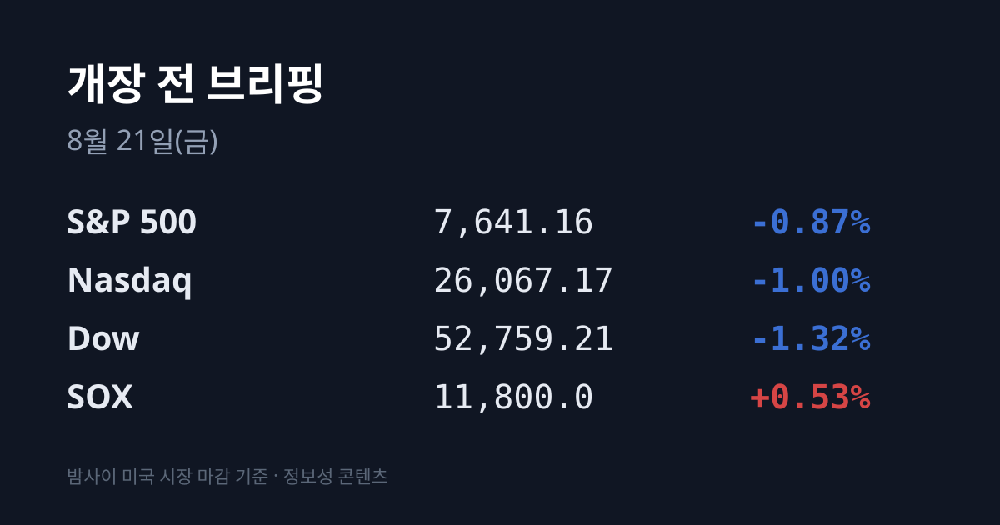
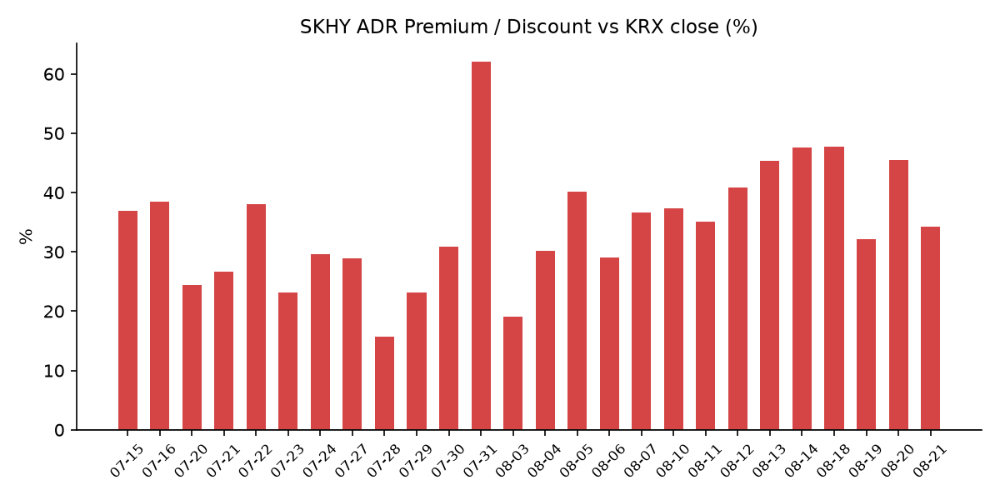
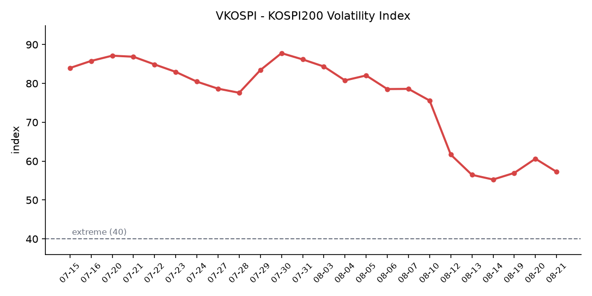

&nbsp;

【① 30초 요약 📈】

어제 코스피가 <mark>6,852.58로 +5.89%(+381.41포인트) 급등</mark>했습니다. 오전 **9시 57분 10초** 코스피200 선물 급등으로 **매수 사이드카가** 발동해 프로그램 매수호가 효력이 5분간 정지됐습니다. 하루 전인 08/19 오전 9시 6분에는 **매도** 사이드카가 걸렸습니다. 이틀 연속 사이드카, 방향은 정반대입니다.

상승의 정체도 메모리 대형주였습니다. 삼성전자 **271,000원(+9.49%)**, SK하이닉스 **1,691,000원(+12.73%)**, SK스퀘어 **+11.85%**, 삼성전자우 **+10.07%**. 코스닥은 **840.89(+1.99%)** 로 3.90%포인트 덜 올랐습니다.

다만 이건 반등이 아니라 왕복입니다. <mark>08/18 종가 대비 2거래일 누적은 코스피 약 −0.25%, 삼성전자 약 +0.93%, SK하이닉스 약 +1.74%</mark>입니다. −5.80% 뒤 +5.89%를 했고 남은 것은 거의 0입니다.

수급은 외국인이었습니다. 코스피에서 **외국인 +2조2,991억원**, 기관 −6,618억원, 개인 −2조6,546억원. 외국인 자금의 90% 이상이 반도체 두 종목과 이들의 지분가치가 부각된 지주사로 몰렸습니다(삼성물산 **+7.78%**, 삼성생명 +7.61%).

그리고 <mark>장 마감(15:30) 뒤에 삼성전자 주주환원 150조원 관측 보도가 나왔습니다</mark>. 장중에 반영된 숫자는 **"100조"**(08/20 10:57 머니투데이 단독)였고, **"150조~160조"** 는 17시 43분(한국경제)·19시(이데일리)에 보도됐습니다. **이사회 의결 전이며** 삼성전자 공식 발표가 아닌 관계자 취재 기반 보도입니다.

밤사이 미국은 방향이 반대였습니다. **S&P 500 7,641.16(−0.87%)** · 나스닥 26,067.17(−1.00%) · 다우 52,759.21(−1.32%) · 러셀2000 −1.34%. 전날 30년물을 −9bp 끌어내린 재무부 바이백 효과가 하루로 끝나 **10년물 4.69%(+4bp)** · **30년물 5.24%** 로 되돌아갔습니다.

그런데 붉은 화면에서 딱 한 구역만 초록이었습니다. <mark>필라델피아 반도체(SOX) 11,800.0(+0.53%)</mark>로 3거래일 만에 상승 전환했고, SKHY **+4.43%** · 마이크론 +2% · 샌디스크 +1% · WDC +1%인데 나스닥100 ETF(QQQ)는 −1%였습니다.

미국 소비 지표는 아래를 가리켰습니다. **월마트가 −9.15%** 로 급락했는데, 실적은 상회했으나 미국 기존점 매출이 +2.6%(시장 전망 +3.7%)에 그쳤고 경영진은 유가 상승에 따른 소비자 "트레이드오프"를 원인으로 지목했습니다. 반면 로스스토어스는 기존점 **+10%**, 주당순이익 $2.66(전망 $1.94)으로 장 마감 후 시간외에서 +4%였습니다.

유가와 지정학은 다시 위입니다. 트럼프 대통령이 이란을 상대로 **"Economic D-Day"** 를 선언했고 **브렌트 $92.09** · WTI $86.07, 장중 고점은 **$94.67**이었습니다. 호르무즈 해협 통항은 08/16 주간 **73건으로** 전주 91건에서 줄었습니다.

&nbsp;

【② 밤사이 미국 시장】

| 지수 | 종가 | 등락률 |
| :--- | ---: | ---: |
| S&P 500 | 7,641.16 | −0.87% |
| 나스닥 | 26,067.17 | −1.00% |
| 다우 | 52,759.21 | −1.32% |
| 러셀 2000 | 2,992.43 | −1.34% |
| 필라델피아 반도체(SOX) | 11,800.0 | **+0.53%** |

지수 하락의 원인은 하나로 특정됩니다. 전날 미 재무부가 10~30년 장기국채 바이백을 최소 2배로 늘린다고 발표해 30년물이 −9bp 내려갔는데, 그 효과가 **단 하루로 끝났습니다**.

어제 <mark>10년물이 +4bp 올라 4.69%, 30년물은 5.24%로 되돌아갔습니다</mark>. 이번 주 고점은 10년물 4.75%(20개월 최고), 30년물 5.34%(19년 최고)였습니다. 2년물은 약 4.18%로 제자리입니다.

즉 8월 내내 시장을 누른 축은 정책금리가 아니라 재정·유가에서 오는 장기 구간이며, 그 축이 하루 쉬고 복귀했습니다. **VIX는 16.01(+7.52%)** 로 올랐고, 달러인덱스 98.84(+0.01%), 금 $4,576.10(+0.10%), 비트코인 $72,582(+4.86%)입니다.

반면 반도체는 지수와 갈렸습니다. SOX가 08/18 −4.98%, 08/19 −2.12% 뒤 어제 **+0.53%로** 3거래일 만에 방향을 바꿨습니다(08/17 대비 3거래일 누적은 여전히 약 −6.5%).

개별로는 SKHY $163.08(+4.43%), 마이크론 $952.39(+2%), 샌디스크 $1,584.36(+1%), WDC $466.23(+1%)이고 QQQ는 −1%입니다. 현지 보도는 이 갈림의 원인을 인공지능 수요 사이클의 변화가 아니라 **자본환원 발표로** 명시했습니다 — SK하이닉스 40조원, 그리고 삼성전자 100조원 이상 검토 보도입니다.

개별 종목에서는 앞서 언급한 월마트(−9.15%)와 모더나(−23.55%, 전날 약 +177% 급등의 상당분 반납), 스페이스X(−4.05%, 3억1,900만주 물량 해제)가 컸습니다.

반도체 쪽 실적으로는 아날로그디바이스(ADI)가 08/19 장 마감 후 3분기 매출 **$40.2억(전년 대비 +40%)**, 주당순이익 $3.45(전망 $3.33), 데이터센터 매출 **+90%**, 산업용 +56%, 조정 영업이익률 50%를 발표했습니다. JP모간은 목표가를 $450에서 $500으로 올렸습니다.

&nbsp;

【③ 괴리율 트래커 — SK하이닉스 ADR】

| 항목 | 수치 |
| :--- | ---: |
| SKHY 종가 | $163.08 (+4.43%) |
| 본주 환산가 (×10×환율) | 2,271,052원 |
| 본주 직전 종가 | 1,691,000원 |
| 괴리율 | +34.3% |

괴리율이 전일 **+45.5%** 에서 **+34.3%** 로 11.2%포인트 좁혀졌습니다. 주목할 점은 축소의 출처입니다. 좁혀진 폭의 사실상 전부가 본주 상승(**+12.73%**) 몫이고, ADR은 +4.43%로 본주보다 8.3%포인트 덜 올랐습니다.

어제 이 브리핑은 본주 시간외 가격으로 계산하면 괴리율이 +32.8%가 된다고 적었는데, 실제 도착한 값은 +34.3%였습니다.

구조를 다시 짚으면, ADR 1주는 본주 10주에 해당하므로 환산가는 ADR 종가에 10과 원·달러 환율을 곱해 구합니다. 환산가가 본주보다 높은 상태(프리미엄)에서는 ADR을 팔고 본주를 사는 전환 차익거래에 유인이 생기고, 낮은 상태(디스카운트)에서는 반대 방향의 유인이 생기는 것이 이 지표의 메커니즘입니다.

다만 실제 차익거래에는 마찰이 있습니다 — 전환 한도가 **1,779만주(발행주식의 2.5%)** 이고 전환 절차에 수 주 이상이 걸립니다. 환율 기여는 이번에도 마이너스였습니다. 원·달러가 1,397.7원에서 **1,392.6원(−5.1원)** 으로 내려 환산가를 약 8,300원 낮췄고, 괴리율로는 약 −0.5%포인트입니다.

최근 국면의 범위는 +15.7%(07/28) ~ +62.0%(07/31)이므로 +34.3%는 중간대에 해당합니다.

회사 쪽 변수도 진행 중입니다 — SK하이닉스의 40조원 자사주 취득은 08/20 개시돼 **11/19까지 약 3개월간** 이어지며, 대상 2,407만주(발행주식의 3.3%)는 ADR 상장 신주 1,779만주보다 628만주 많습니다. 분기배당은 주당 375원, 배당기준일은 **08/31**입니다. 참고로 삼성전자는 ADR 상장 계획을 공식 부인했으므로 이 지표는 SK하이닉스에만 적용됩니다.

괴리율 추이: 07/31 +62.0 → 08/03 +19.1 → 08/05 +40.2 → 08/06 +29.0 → 08/07 +36.7 → 08/10 +37.3 → 08/11 +35.1 → 08/12 +40.8 → 08/13 +45.3 → 08/14 +47.6 → 08/18 +47.7 → 08/19 +32.2 → 08/20 +45.5 → 08/21 +34.3

&nbsp;

【④ 변동성 트래커 🌡️】

판정 한 줄: <mark>'극단' 유지, 방향은 소폭 진정 — 다만 지수가 +5.89% 오른 날인데 VKOSPI가 08/18보다 높게 끝났다</mark>. 기대 변동성은 내렸고 매매 정지는 이틀 연속 걸렸다.

**기대 변동성** — VKOSPI **57.26**(전일 60.63 대비 **−3.37포인트, −5.56%**). 25 미만 평온 / 25~40 경계 / 40 이상 극단 기준에서 **극단 구간이며**, 기준선 40의 약 **1.43배**입니다. 추이는 08/10 69.55 → 08/11 61.68 → 08/12 56.48 → 08/13 55.28 → 08/14 55.31 → 08/18 56.97 → 08/19 60.63 → 08/20 **57.26** 으로, 이틀 만에 다시 하락 방향입니다. 통상 지수 급등일에는 기대 변동성이 더 크게 꺾이는데, 57.26은 08/18의 56.97보다 높은 값입니다.

**실현 변동성** — 최근 2거래일 등락률이 **−5.80%(08/19)**, **+5.89%(08/20)** 입니다. 최근 10거래일 중 종가 기준 ±3% 이상 등락일은 최소 **4일**(08/05 +3.85%, 08/19, 08/20 및 8월 초 급등일)입니다. 일별 전체 시계열은 이번 집계에서 확보하지 못했습니다.

**매매 정지** — <mark>이틀 연속 사이드카가 발동했고 방향이 정반대였습니다</mark>. 08/20 **09:57:10** 유가증권시장 매수 사이드카(프로그램 매수호가 5분 정지), 08/19 **09:06** 매도 사이드카입니다. 서킷브레이커는 두 날 모두 발동하지 않았습니다.

**증폭 경로** — 단일종목 레버리지 ETF 거래 비중·회전율은 집계 시점 기준 미확인입니다. 제도 환경은 08/19부터 종가 괴리율 관리 범위가 국내 3%→**2%**, 해외 6%→5%로 좁혀졌고 모의거래 5거래일·5시간이 의무화된 상태입니다. 관련 거래대금은 08/11 기준 약 **7,000억원으로** 07/30의 약 18분의 1 수준까지 줄어 있었습니다.

**청산 압력** — 신용융자 잔고와 위탁매매 미수금 반대매매 금액의 08/19~20 갱신치는 집계 시점 기준 미확인입니다. 확보된 마지막 값은 08/05 **28조4,179억원**(전일 대비 +1조141억원)이며, 국면 최고는 07/28 33조1,940억원, 연내 최저는 08/04 27조4,038억원입니다. 시장 전체 잔고는 08/18 보도 기준 **30조8,675억원**입니다. 08/20이 +5.89%였으므로 반대매매 경로는 최소한 어제 하루는 닫혀 있었습니다.

**하방 포지션** — 공매도 순잔고는 **T+3 공시 지연이** 있어 08/20분은 구조적으로 오늘 확인할 수 없습니다. 대차거래 잔고는 08/14 **173조1,899억원**, 8월 중 약 +40조원 증가가 마지막 확인치입니다.

집계 시점 기준 미확인: 미 지수선물 현재 방향, 코스피200 야간선물, 신용융자·반대매매 08/19~20 갱신치, 공매도 거래대금·순잔고 08/20분, 레버리지 ETF 거래 비중·회전율, 상해종합·CSI300·항셍 08/20 종가, DRAM·NAND 당일 현물가.

&nbsp;

【⑤ 어제 한국장 리뷰】

| 지수 | 종가 | 등락 |
| :--- | ---: | ---: |
| 코스피 | 6,852.58 | +381.41 (+5.89%) |
| 코스닥 | 840.89 | +16.43 (+1.99%) |

수급 확정치는 코스피에서 **외국인 +2조2,991억원**, 기관 −6,618억원, 개인 −2조6,546억원입니다.

외국인 자금이 어디로 갔는지는 종목별 등락률에 그대로 찍혔습니다 — SK하이닉스 **+12.73%(1,691,000원)**, 삼성전자 **+9.49%(271,000원)**, 삼성전자우 +10.07%, SK스퀘어 +11.85%, 삼성물산 +7.78%, 삼성생명 +7.61%. 보도에 따르면 외국인 순매수의 **90% 이상이** 반도체 두 종목과 이들의 지분가치가 부각된 지주사에 집중됐습니다.

개인은 08/19에 5조6,403억원을 받아낸 뒤 하루 만에 2조6,546억원을 차익실현했습니다.

코스닥은 성격이 달랐습니다. 개장 직후 839.62(+1.84%)로 출발해 장중 850.77까지 올랐고 **바이오·2차전지·반도체 장비주가** 강세였으며, 개인과 기관의 순매수가 반등을 이끌었습니다. 즉 외국인이 반도체 두 종목으로만 갈 때 코스닥을 받친 주체는 따로 있었습니다.

원·달러는 <mark>1,392.6원(−5.1원)</mark>으로 2거래일 연속 1,400원 아래에서 마감했습니다. 외국인이 2조2,991억원을 순매수한 날과 원화 강세가 같은 방향으로 나타난 조합입니다.

같은 날 아시아는 동반 반등이었으나 폭이 달랐습니다 — 닛케이 225는 **66,118(+1.21%)**, 대만 가권지수는 **44,933.74(+0.48%)** 였습니다. 한국의 +5.89%가 압도적 1위였습니다. 상해종합·CSI300·항셍 종가는 집계 시점 기준 미확인입니다.

&nbsp;

【⑥ 오늘의 캘린더 & 관전 포인트 📅】

오늘(08/21)

**08/21 오전:** 한국 8월 1~20일 수출 잠정치(관세청). 직전 발표인 8월 1~10일은 수출 **212억8,600만달러(전년 동기 대비 +45.3%)**, 반도체 **99억5,200만달러(+155.4%)**, 반도체 비중 46.8%(+20.1%포인트)로 8월 기준 역대 최대였습니다.

**08/21:** 미 상원이 애플에 요구한 CXMT·YMTC 메모리 미사용 확약 시한. 짐 뱅크스 공화당 상원의원과 척 슈머 민주당 원내대표 등이 팀 쿡 최고경영자에게 서한을 보내 08/21까지 답할 것을 요구했습니다. 두 업체가 미 국방부 중국군사기업(1260H) 명단에 오른 점을 근거로 들었습니다.

미 S&P 글로벌 8월 구매관리자지수(PMI) 예비치 — 발표 일정은 집계 시점 기준 미확인입니다.

다음 주 이후

**08/26:** 엔비디아 2027회계연도 2분기 실적(미 동부 기준) + 미 7월 개인소비지출(PCE) 물가. 알테오젠 무상증자 신주 상장.

**08/27(목):** 한국은행 금융통화위원회. 현 기준금리는 **2.75%**(07/16에 2.50%→2.75% 인상, 3년 6개월 만의 인상). 우리금융경영연구소는 7월 인상 효과 점검 필요성과 환율 하향 안정을 들어 동결을 전망하면서, 인상 소수의견 1~2명 또는 '매파적 동결' 가능성을 언급했습니다.

**08/27~29:** 잭슨홀 심포지엄(주제 "Financial Innovation: Implications for Payments and Policy"). 케빈 워시 의장의 첫 기조연설이 **08/28 오전**입니다.

**08/31:** SK하이닉스 분기배당(주당 375원) 기준일.

**09/15~16:** FOMC. 현 정책금리 3.50~3.75%, FedWatch 기준 동결 확률 **68.4%** 입니다.

**11/19:** SK하이닉스 40조원 자사주 취득 종료 예정일. **12/04:** 폴리실리콘 관세 시행.

**8월 중(수시):** 삼성전자 이사회 주주환원 의결. 08/20까지 공식 발표는 없고 보도만 존재합니다.

시장이 주시하는 레벨 (방향 판단 없이 레벨만)

삼성전자 **271,000원**과 SK하이닉스 **1,691,000원** — 어제 급등 종가를 지키는지 여부.

미 30년물 **5.29%** — 재무부 바이백 발표 직전 수준. 어제 5.195%에서 5.24%로 되돌아왔습니다. 반대편 관찰 레벨은 5.10%입니다.

VKOSPI **60** — 08/19에 넘었고 08/20에 57.26으로 되내려온 선.

원·달러 **1,410원** — 현재 1,392.6원에서 약 17원 위.

브렌트 **$95** — 장중 고점이 이미 $94.67이었습니다.

8월 1~20일 수출 증가율 **+45.3%** — 초순 수치를 유지하는지 여부.

&nbsp;

【⑦ 정책 워치 ⚡】

**삼성전자 주주환원:** 규모 **150조~160조원** 수준 관측 보도. 구성은 대규모 특별배당에 자사주 매입·소각 **30조원 이상**(임직원 특별성과급 연동)을 더한 형태로, 재원은 잉여현금흐름(FCF) 50% 환원 원칙이 적용된다고 보도됐습니다. 이달 중 이사회 개최 예정이며 아직 의결 전입니다. 머니투데이는 08/20 10:57 단독 보도에서 규모를 "100조원 이상"으로 전하며 금융산업구조개선법 규제를 피하기 위해 소각보다 배당 방식이 선호된다고 설명했습니다. 삼성전자의 상반기 말 현금·현금성자산은 **92.9조원**, 단기금융상품은 97조원입니다.

**SK하이닉스 임금·단체협상 잠정합의(08/20):** 임금 **6.3% 인상**, 성과급(PS)의 **60%를 자사주로 지급**(현금 40% / 당해 주식 40% / 1년 후·2년 후 이연 각 10%). 당해 지급분은 즉시 매도 가능하고 이연분은 각각 1년·2년 후 매도 가능합니다. 회사가 적자를 낼 경우 임금의 최대 3%를 이연하는 조항도 포함됐습니다. 시행 첫해인 2027년은 전액 현금 수령을 선택할 수 있습니다. 이 소식으로 SKHY는 미국 프리마켓에서 +5%로 출발했습니다.

**SK하이닉스 40조원 자사주 취득:** 이사회 의결로 확정된 사안이며 취득 기간은 **08/20부터 11/19까지**입니다. 2025~2027년 누적 잉여현금흐름의 50% 이상 환원으로 기준을 올렸습니다.

**SK하이닉스 용인 반도체 클러스터:** 1기 팹 첫 클린룸 가동 시점을 2027년 5월에서 **2027년 2월로 앞당겼고**, 총 31조원을 투입해 2~6단계 클린룸을 2030년 말까지 순차 구축한다는 계획입니다(08/17).

**공매도 제도:** 전면 재개 상태가 유지되고 있으며, 2026년 공매도 전산시스템 의무화와 개정 자본시장법이 시행 중입니다.

**ETF·ETN 규제:** 08/19부터 종가 괴리율 관리 범위가 국내 3%→2%, 해외 6%→5%로 좁혀졌고 모의거래 5거래일·5시간이 의무화됐습니다.

&nbsp;

【⑧ 오늘의 질문】

장 마감 뒤에 나온 삼성전자 **150조원 주주환원 관측 보도는** 이사회 의결 전인 미확정 정보인데, 시장은 확정 공시를 기다릴 것인지 아니면 어제 SK하이닉스 40조원 때처럼 시가에 먼저 반영할 것인지 — 그리고 오전에 발표되는 8월 1~20일 수출 잠정치가 그 두 숫자를 가능하게 한 현금 흐름을 확인해줄 것인지.

&nbsp;

본 글은 공개된 시장 데이터를 정리한 정보성 콘텐츠이며, 특정 종목·상품의 매매 권유가 아닙니다. 모든 투자 판단과 책임은 투자자 본인에게 있습니다. 수치는 작성 시점 기준이며 이후 변동될 수 있습니다.

&nbsp;

#개장전브리핑 #미국증시마감 #하이닉스ADR #괴리율 #코스피 #코스닥 #반도체 #VKOSPI #주주환원 #사이드카

&nbsp;