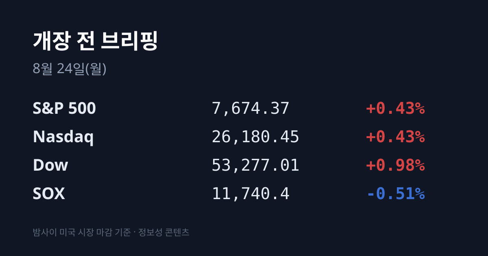
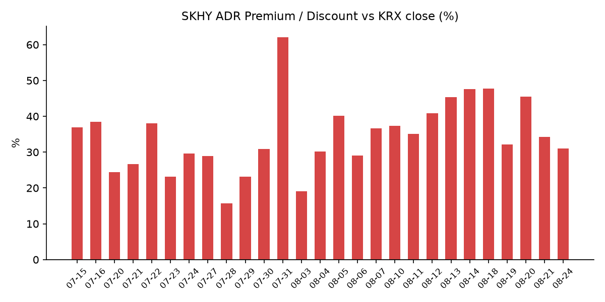
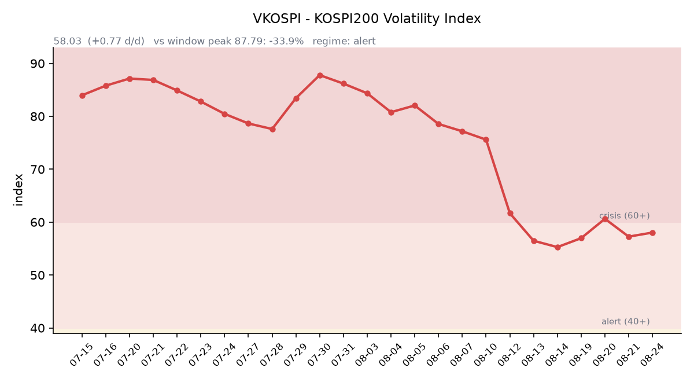

&nbsp;

【① 30초 요약 📈】

금요일 한국 시장은 한 지수 안에서 두 개로 갈렸습니다. 코스피는 **6,912.95(+60.37, +0.88%)** 로 올랐고, <mark>코스닥은 801.94로 −4.63%(−38.95) 급락했습니다</mark>. 코스피는 장 시작 때 **−1.35%(6,759.95)** 로 밀려 출발한 뒤 반대로 돌아섰습니다.

오전 **10시 5분 5초** 코스닥 시장에 **매도 사이드카가** 발동했습니다. 당시 코스닥150 선물(9월물)은 **1,387.40(−6.06%)**, 현물은 **1,391.11(−5.48%)** 였습니다. 올해 코스닥 사이드카는 **32번째**, 매도 방향으로는 **14번째**입니다.

코스피를 올린 것은 시총 1·2위였습니다. 삼성전자 **281,500원(+3.87%)**, 삼성전자 우선주 **+8%**, SK하이닉스 **1,730,000원(+2.31%)**. 주주환원 확대 기대가 근거로 지목됐습니다. 반대로 LG에너지솔루션 **−4.05%**, 삼성전기 −5.73%, 한화에어로스페이스 **−7.03%** 였습니다.

수급은 하루 만에 방향을 바꿨습니다. <mark>코스피에서 외국인이 −4,230억원 순매도로 돌아섰습니다</mark>(08/20에는 +2조2,991억원 순매수). 기관 +2,079억원, 개인 −8,624억원입니다. 코스닥은 외국인 −3,703억원·기관 −3,638억원 동반 순매도에 개인만 +7,285억원이었습니다. 단, 외국인은 **삼성전자 한 종목만 4,300억원 이상 순매수**했습니다.

카카오가 인적분할을 결의했고 주가는 **−7.49%(35,800원)로** 마감했습니다. 분할비율은 순자산 장부가액 기준 존속법인 카카오X **0.64**, 신설법인 카카오AI **0.36**입니다. 장중 저점은 −13.18%(33,600원)였습니다.

밤사이 미국은 지표가 시장을 끌었습니다. <mark>S&P 글로벌 8월 미국 합성 PMI 예비치가 56.0으로 52개월(2022년 4월 이후) 최고</mark>였습니다(시장 전망 54.0). 서비스업 **56.8**(20개월 최고), 제조업 53.2(5개월 최저)입니다. 3대 지수는 S&P 500 7,674.37(+0.43%) · 나스닥 26,180.45(+0.43%) · 다우 53,277.01(+0.98%)로 올랐습니다.

그런데 같은 지표가 금리는 밀어올렸습니다. **10년물 4.73~4.74%(+2~3bp), 30년물 5.27%** 입니다. 8월 내내 시장을 눌러온 장기금리 축은 이번엔 재정이 아니라 경기 호조를 이유로 올랐습니다.

반도체만 방향이 달랐습니다. <mark>필라델피아 반도체(SOX)는 11,740.4로 −0.51%</mark>였습니다. 목요일 +0.53%로 3거래일 만에 돌아섰던 흐름이 하루 만에 되밀렸습니다.

환율은 11개월 최저입니다. **원·달러 서울 종가 1,386.5원(−6.1원)** 으로, 2025년 9월 17일(1,380.1원) 이후 11개월여 만에 가장 낮은 수준입니다. 달러인덱스는 **98.88로** 3개월 최저권입니다.

오늘 예정된 이벤트가 하나 있습니다. <mark>베선트 미 재무장관이 이란 경제 봉쇄 계획을 기자회견으로 발표합니다</mark>(정확한 시각 미확정). 이란과 거래하는 제3국까지 제재하는 내용이 예고됐고, 이란 원유 대부분을 사는 중국이 1차 대상으로 거론됩니다.

&nbsp;

【② 밤사이 미국 시장 🌙】

| 지수 | 종가 | 등락률 |
| :--- | ---: | ---: |
| S&P 500 | 7,674.37 | +0.43% |
| 나스닥 | 26,180.45 | +0.43% |
| 다우 | 53,277.01 | +0.98% |
| 필라델피아 반도체(SOX) | 11,740.4 | **−0.51%** |

금요일 미국장의 주인공은 지표였습니다. S&P 글로벌이 발표한 8월 미국 합성 PMI 예비치가 **56.0**으로 나왔습니다. 2022년 4월 이후 52개월 만의 최고치이고 시장 전망(54.0)을 크게 넘었습니다. 내용을 나눠 보면 방향이 갈립니다 — 서비스업은 **56.8**로 2.2포인트 뛰어 20개월 최고였고, 제조업은 53.2로 0.7포인트 내려 5개월 최저였습니다. S&P 글로벌은 이 조사가 3분기 연율 성장률 약 **3.0%** 를 가리킨다고 밝혔습니다. 2분기는 1.5%였습니다.

<mark>같은 지표가 주식과 채권에 정반대로 작용했습니다</mark>. 지수는 올랐지만 10년물 국채금리는 4.73~4.74%로 2~3bp 올랐고 30년물은 5.27%입니다. 2년물은 4.19%(08/20 연준 H.15 기준), 10년물 실질금리(TIPS)는 **2.35%**(08/20 기준)입니다. 8월 내내 한국 증시를 눌러온 축이 장기금리였는데, 이번 주 마지막 세션에서도 그 축은 내려오지 않았습니다. 다만 이유가 달라졌습니다 — 이전 상승의 이유가 재정적자와 국채 발행 부담이었던 데 비해 이번은 경기 호조입니다. 주간으로는 S&P 500 −1.4%, 나스닥 −2.0%, 다우 −0.8%로 여전히 하락 주였습니다.

달러와 변동성은 반대 방향으로 갔습니다. 달러인덱스 98.88로 3개월 최저권이고, **VIX는 15.13(−5.50%)** 로 내렸습니다. 금 현물은 약 **$4,590(+1.65%)** 로 주간 약 5% 올랐습니다. 여기서 한 가지 구분이 필요합니다 — 금 상승은 실질금리가 2.35%로 제자리인 가운데 달러가 약해진 국면에서 나왔습니다. 즉 순수한 위험회피 신호와는 성격이 다릅니다. 비트코인은 $77,744(+0.98%)로 주간 +22%, 2024년 11월 이후 가장 좋은 주간을 기록했습니다.

반도체는 지수와 갈렸습니다. SOX가 11,740.4(−0.51%)로 목요일의 +0.53% 반등을 하루 만에 되돌렸습니다(08/17 대비 4거래일 누적 약 −7.0%). 개별 종목에서는 크립토 관련주가 컸습니다 — 로빈후드 +13%, 코인베이스 +8%, 마이크로스트래티지 +6~7.6%입니다. 실적 쪽에서는 로스스토어스가 08/20 장 마감 후 발표한 2분기 주당순이익 **$2.66**(시장 전망 $1.94)·기존점 매출 +10%·연간 가이던스 상향을 받아 금요일 정규장에서 상승 마감했습니다(집계에 따라 +5.79~9%). 디어는 08/20에 3분기 순이익 $13.79억(+7%)과 가이던스 상향을 발표해 **+8.59%($630.48)** 였습니다. 하락 쪽은 플라워스푸드 −5.7%, 처치앤드와이트 −4%, 보스턴비어 −3%입니다.

현재 미 지수선물은 위입니다. S&P 500 선물이 **7,691.25(+28.75, +0.38%)** 로 거래되고 있습니다(08/23 18:03 ET = 08/24 07:03 KST, 일요일 재개장 후). 나스닥100 선물은 29,387.75(+0.30%)인데 표시 시각이 08/21 16:59 ET로 일요일 갱신이 확인되지 않았습니다.

원자재에서는 한국에 직접 닿는 항목이 하나 있습니다. 한국 원유 수입의 기준유종인 **두바이유가 $97.81(+2.21)** 로, 브렌트 $94.39(+0.61)보다 **$3.42 비쌉니다**(한국석유공사 페트로넷 08/21 기준). WTI는 $87.06(+0.77)입니다. 통상 브렌트가 두바이보다 비싼데 중동 공급 차질 국면에서는 역전이 나타나며, 이 상태에서는 한국 정유 원가와 수입물가만 따로 악화됩니다. 벌크 해상운임 BDI는 **2,841(+50, +1.79%)** 입니다(08/21, 발틱거래소 확정이 하루 늦게 게시되는 구조).

&nbsp;

【③ 괴리율 트래커 — SK하이닉스 ADR 📊】

| 항목 | 수치 |
| :--- | ---: |
| SKHY 종가 | $163.41 (+0.20%) |
| 본주 환산가 (×10×환율) | 2,265,680원 |
| 본주 직전 종가 | 1,730,000원 |
| **괴리율** | **+31.0%** |

괴리율이 전일 **+34.3%** 에서 **+31.0%로** 3.3%포인트 좁혀졌습니다. 축소의 출처가 이번에도 본주 쪽입니다 — 본주가 **+2.31%** 오른 데 비해 ADR은 **+0.20%로** 사실상 보합이었습니다. 환율 기여도 마이너스였습니다. 원·달러가 1,392.6원에서 1,386.5원으로 6.1원 내려 환산가를 약 10,000원 낮췄고, 괴리율로는 약 −0.6%포인트입니다. ADR 시간외 가격 $163.77로 계산하면 +31.3%입니다.

구조를 다시 짚으면, ADR 1주는 본주 10주에 해당하므로 환산가는 ADR 종가에 10과 원·달러 환율을 곱해 구합니다. 환산가가 본주보다 높은 상태(프리미엄)에서는 ADR을 팔고 본주를 사는 전환 차익거래에 유인이 생기고, 낮은 상태(디스카운트)에서는 반대 방향의 유인이 생기는 것이 이 지표의 메커니즘입니다. 다만 실제 차익거래에는 마찰이 있습니다 — 전환 한도가 **1,779만주**(발행주식의 2.5%)이고 절차에 수 주 이상 걸립니다.

밤사이 한국 시장 전체가 미국에서 어떻게 값이 매겨졌는지도 함께 봅니다. 한국 대표 ETF인 **EWY는 $178.34(+0.10%)** 로 마감했고 시간외는 $178.42(+0.04%)입니다. 즉 미국 투자자가 매긴 한국 시장 가격은 금요일 한국 마감 대비 사실상 변화가 없었습니다.

회사 쪽 일정도 진행 중입니다 — SK하이닉스의 40조원 자사주 취득은 08/20 개시돼 11/19까지 이어지며, 분기배당은 주당 375원, 기준일은 **08/31**입니다.

괴리율 추이: 08/05 +40.2 → 08/06 +29.0 → 08/07 +36.7 → 08/10 +37.3 → 08/11 +35.1 → 08/12 +40.8 → 08/13 +45.3 → 08/14 +47.6 → 08/18 +47.7 → 08/19 +32.2 → 08/20 +45.5 → 08/21 +34.3 → **08/24 +31.0**

&nbsp;

【④ 변동성 트래커 🌡️】

판정 한 줄: <mark>'경보' 구간(40~60) 유지, 방향은 다시 위 — 지수가 오른 날인데 기대 변동성이 올랐고, 그 이유는 코스닥이다</mark>. 코스피 +0.88%와 코스닥 −4.63%가 같은 날에 나왔고 사이드카는 코스닥에 걸렸다.

**기대 변동성** — VKOSPI **58.03**(전일 57.26 대비 **+0.77p, +1.34%**). 구간 기준은 25 미만 평시 / 25~40 주의 / 40~60 경보 / 60 이상 위기이며 현재는 **경보**다. 6월 종가 고점 96.94 대비 **−40.1%** 까지 내려온 상태이나 평시 상단(25)의 **2.32배**다. 추이: 08/11 61.68 → 08/12 56.48 → 08/13 55.28 → 08/14 55.31 → 08/18 56.97 → 08/19 60.63 → 08/20 57.26 → **08/21 58.03**.

**실현 변동성** — 확보된 일별 등락률은 코스피 08/19 **−5.80%** → 08/20 **+5.89%** → 08/21 +0.88%다. 사흘 중 ±3.5% 이상이 2일이고 방향은 서로 반대였다. 코스닥은 같은 기간 08/20 +1.99% → 08/21 **−4.63%** 다. 주간 누적은 코스피 −0.93%, 코스닥 **−7.25%** 로 두 지수 격차가 6.3%포인트다. 그 앞 구간의 일별 전체 시계열은 이번 집계에서 확보하지 못했다.

**매매 정지** — 08/19 오전 9시 6분 코스피200 매도 사이드카 → 08/20 오전 9시 57분 10초 매수 사이드카 → 08/21 오전 10시 5분 5초 코스닥 매도 사이드카. **3거래일 연속 발동**이며 방향은 매도·매수·매도로 번갈았다. 코스닥 시장 기준 올해 32번째(매도 14번째)다.

**증폭 경로** — 단일종목 레버리지 ETF 주평균 거래대금 **11조원**으로 국내 주식형 ETF 거래대금 22조4,000억원의 **48.8%** 다. 규제는 이미 진행 중이다 — 기본예탁금이 1,000만원에서 3,000만원으로 올랐고(07/16), 최소 매매단위를 1주에서 20주로 늘리는 조치가 9월 조기 시행으로 추진되고 있다. 당일 회전율은 개장 전 산출되지 않는다.

**청산 압력** — 신용융자 잔고는 08/13 기준 **30조9,263억원**으로 8거래일간 3조4,824억원(+12.7%) 늘었고, 그중 코스닥은 6조3,914억원(+5,616억원, +9.6%)이다. 별도 집계로 신용융자·대주 합산 잔고는 6월 42조원에서 08/19 시점 약 29조원까지 줄었다 — 두 수치는 집계 대상과 시점이 달라 그대로 병기한다. 08/19~21 갱신치와 미수금 반대매매 금액은 집계 시점 기준 미확인이다.

**하방 포지션** — 공매도 순잔고는 T+2~3 공시 지연이 구조적이어서 개장 전에는 알 수 없다. 최신 확보치는 08/01~14 거래대금 집계로, 삼성전자 **5.4조원**(7월 2.3조원 → 2.4배, 2위에서 1위), SK하이닉스 3.1조원(7월 3.8조원 → 감소, 1위에서 2위)이다. 신규 상위 진입은 한국항공우주 2,936억원(매매비중 **30.45%**), HD현대중공업 2,764억원(16.77%), LG에너지솔루션 2,436억원(18.37%)이다.

미확인 항목: 코스피200 야간선물(2회 시도) · 08/19~21 신용융자·반대매매 갱신치 · 레버리지 ETF 당일 회전율 · 08/19~21 공매도 순잔고(T+3) · 프로그램 매매 차익·비차익과 선물 베이시스 · 항셍 08/21 종가(출처 상충) · USD/JPY.

&nbsp;

【⑤ 어제 한국장 리뷰 🇰🇷】

| 지수 | 종가 | 등락 |
| :--- | ---: | ---: |
| 코스피 | 6,912.95 | +60.37 (+0.88%) |
| 코스닥 | 801.94 | −38.95 (**−4.63%**) |

금요일 한국 시장은 두 지수가 정반대로 끝났습니다. 코스피는 −1.35%(6,759.95)로 내려 출발한 뒤 삼성전자·SK하이닉스로 매수가 들어오며 상승 전환했고, 코스닥은 시가 −2.00%(824.05)에서 낙폭을 키워 오전 10시 5분 매도 사이드카까지 갔습니다.

수급 확정치입니다. 코스피 — 외국인 **−4,230억원**, 기관 +2,079억원, 개인 −8,624억원. 코스닥 — 외국인 −3,703억원, 기관 −3,638억원, 개인 +7,285억원(출처: KB의 생각 08/21 집계. 일부 매체는 코스피 외국인 순매도를 1,760억~4,200억원으로 다르게 집계했습니다). 하루 전 08/20에 코스피에서 +2조2,991억원을 순매수했던 외국인이 순매도로 돌아선 것입니다. 다만 종목별로는 갈렸습니다 — 삼성전자 한 종목은 4,300억원 이상 순매수였습니다.

업종에서는 **통신·은행·보험을 제외한 대부분이 약세**였습니다. 오른 쪽은 삼성전자(+3.87%)·삼성전자우(+8%)·SK하이닉스(+2.31%)와 실리콘투이고, 내린 쪽은 카카오(−7.49%, 인적분할 결의)·한화에어로스페이스(−7.03%)·삼성전기(−5.73%)·LG에너지솔루션(−4.05%)입니다. LIG디펜스앤에어로스페이스는 임원 구속 소식이 나왔습니다. 코스닥에서는 2차전지·제약바이오·로봇 등 성장주 전면에서 매물이 나와 시총 상위 20개 종목 중 19개가 하락했습니다.

수출 지표는 같은 날 아침에 확인됐고 방향은 위였습니다. **8월 1~20일 수출 552억달러(+56.0%)** 로 같은 기간 기준 역대 최대이고, 그중 반도체가 **260억3,000만달러(+198.8%)** 로 비중 **47.2%**(+22.5%포인트)를 차지했습니다. 석유제품 42억달러(+56.4%), 컴퓨터 주변기기 22억달러(+242.1%)이며 무역수지는 140억달러 흑자입니다.

환율은 원화 강세 쪽입니다. 원·달러 서울 종가 **1,386.5원(−6.1원)** 으로 2025년 9월 17일(1,380.1원) 이후 11개월여 만에 가장 낮았습니다. 배경으로는 달러 약세(DXY 3개월 최저권), 수출업체 네고 물량, 그리고 삼성전자·SK하이닉스 주주환원이 달러를 원화로 바꾸는 수요로 이어진다는 해석이 함께 거론됐습니다. 작성 시각 현재값은 1,386.25원(08/24 06:49 KST)입니다.

아시아는 폭이 작았습니다 — 닛케이 225 66,016(−0.3%), 대만 가권 +0.47%, 상해종합 3,905.20(+0.04%)입니다. 항셍은 출처에 따라 +0.8%(25,698)와 +1.21%(26,009.46)로 달라 확정하지 못했습니다.

&nbsp;

【⑥ 오늘의 캘린더 & 관전 포인트 📅】

**08/24(오늘):** <mark>베선트 미 재무장관 이란 경제 봉쇄 계획 기자회견</mark>(정확한 시각 미확정). 이란과 거래하는 제3국까지 제재하고 동맹국에 선택을 요구하는 내용이 예고됐으며, 이란 원유의 대부분을 사는 중국이 1차 대상으로 거론됩니다. 미 7월 시카고 연은 국가활동지수도 발표됩니다.

**8월 중(수시):** 삼성전자 이사회 주주환원 의결. 150조~160조원 규모 관측 보도가 나와 있고 구성은 대규모 특별배당과 자사주 매입·소각, 재원은 잉여현금흐름 50% 환원 원칙으로 전해집니다. **08/24 오전 현재 이사회는 열리지 않았고 공식 발표도 없습니다** — 관계자 취재 기반 보도 단계입니다.

**08/25:** 미 7월 신규주택 매매, 8월 컨퍼런스보드 소비자심리지수

**08/26:** 미 7월 PCE 물가, 7월 내구재 신규수주, 현대차 2026 CEO 인베스터데이, **엔비디아 FY2027 2분기 실적**(미 장 마감 후 = 08/27 새벽 KST), 마벨 테크놀로지 실적

**08/27(목):** **한국은행 금융통화위원회**(현 기준금리 2.75%, 07/16에 2.50%에서 인상). 같은 날 잭슨홀 심포지엄 개막(08/27~29), 케빈 워시 연준 의장의 취임 후 첫 기조연설은 08/28 오전입니다.

**08/28:** 미 8월 MNI 시카고 PMI, 일본 8월 도쿄 소비자물가지수

**08/31:** SK하이닉스 분기배당(주당 375원) 기준일

**09월(조기 시행 추진):** 단일종목 레버리지 ETF 최소 매매단위 1주 → 20주

**09/15~16:** FOMC. CME 페드워치 기준 동결 확률 약 68%, 인상 약 31%, 인하 약 1%입니다.

**11/19:** SK하이닉스 40조원 자사주 취득 종료 예정일

시장이 주시하는 레벨: 미 30년물 국채금리 **5.34%**(19년 최고, 이번 주 고점), 10년물 4.75%(20개월 최고), 원·달러 **1,380.1원**(2025-09-17 저점)과 1,400원, VKOSPI 60과 65, 두바이-브렌트 스프레드의 역전 폭(현재 $3.42), 그리고 SK하이닉스 ADR 괴리율의 최근 범위 +29.0%(08/06) ~ +47.7%(08/18)입니다.

&nbsp;

【⑦ 정책 워치 ⚡】

**공매도 제도:** 차입 공매도는 전면 재개 상태이고 무차입 공매도는 여전히 금지입니다. 2026년부터 공매도 전산시스템 의무화와 개정 자본시장법이 시행 중입니다.

**단일종목 레버리지 ETF:** 07/16 기본예탁금이 1,000만원에서 3,000만원으로 올랐고 신규 상장이 중단됐습니다. 최소 매매단위를 1주에서 20주로 늘리는 조치는 당초 11월 도입 예정이었으나 9월로 앞당기는 방향으로 추진되고 있습니다.

**거시 점검:** 08/21 오전 8시 전국은행연합회관에서 구윤철 부총리 겸 재정경제부 장관 주재로 관계기관 합동 시장상황점검회의가 열려 금융·외환시장 동향을 점검했습니다.

**기업 지배구조:** 카카오 이사회가 인적분할을 결의했습니다. 존속법인 카카오X 0.64, 신설법인 카카오AI 0.36(순자산 장부가액 기준)입니다.

&nbsp;

【⑧ 오늘의 질문 ❓】

미국 투자자가 밤사이 매긴 한국 시장 가격은 금요일 한국 마감과 거의 같았는데(EWY +0.10%), 그렇다면 오늘 시장을 움직이는 것은 해외 신호가 아니라 국내 두 가지 — 삼성전자 이사회가 열리는지, 그리고 매도 사이드카가 걸린 다음 거래일의 코스닥이 어떻게 여는지 — 가 될 것인가.

&nbsp;

본 글은 공개된 시장 데이터를 정리한 정보성 콘텐츠이며, 특정 종목·상품의 매매 권유가 아닙니다. 모든 투자 판단과 책임은 투자자 본인에게 있습니다. 수치는 작성 시점 기준이며 이후 변동될 수 있습니다.

&nbsp;

#개장전브리핑 #미국증시마감 #하이닉스ADR #괴리율 #코스피 #코스닥 #사이드카 #VKOSPI #반도체 #환율

&nbsp;