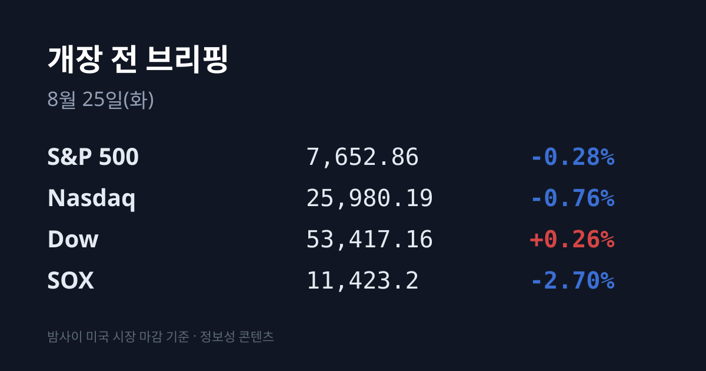
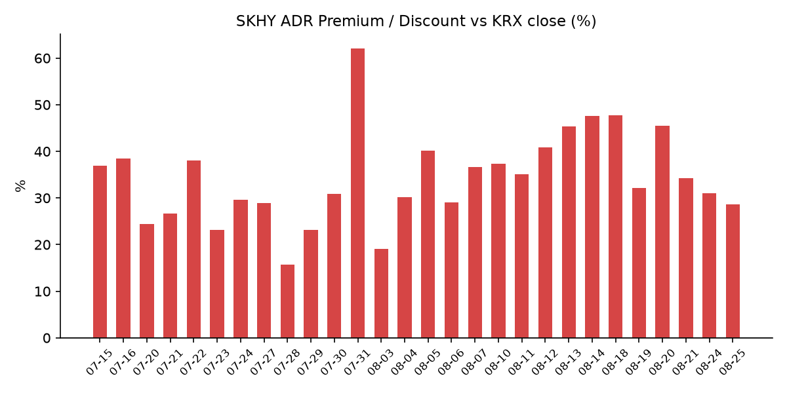
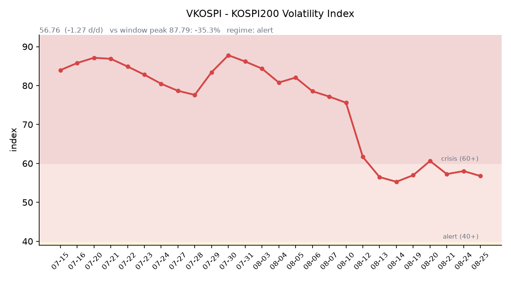

&nbsp;

【① 30초 요약 📈】

어제 한국 시장은 한 종목이 지수를 끌어내린 날이었습니다. 코스피는 **6,696.96(−215.99, −3.12%)** 로 6,700선이 무너졌고, 반대로 <mark>코스닥은 813.33으로 +1.42%(+11.39) 올랐습니다</mark>.

원인은 삼성전자입니다. <mark>삼성전자가 257,000원(−8.70%)으로 마감했습니다</mark>. 08/21 이사회가 2026년 주주환원 재원을 **90조~110조원으로** 제시하고 3분기에 약 30조원 현금배당(정규 분기배당 2조4,500억 + 추가 현금배당 27조5,500억)을 지급하기로 했는데, 시장이 기다린 자사주 매입·소각의 규모와 집행 시점이 비어 있었습니다. 구체안은 10월 말 이사회, 나머지는 내년 1월 이사회로 넘어갔습니다.

삼성그룹주가 함께 무너졌습니다. **삼성생명 285,500원(−13.09%)**, 삼성화재 636,000원(−13.09%), 삼성물산 364,500원(−7.84%)입니다. SK하이닉스도 1,671,000원(−3.41%)이었습니다.

수급은 규모가 컸습니다. <mark>코스피에서 외국인이 −3조6,691억원, 기관이 −1조2,901억원을 순매도했고 개인이 +3조3,217억원으로 받았습니다</mark>. 그런데 코스닥은 정반대로 외국인 +2,417억원·기관 +249억원 순매수, 개인 −2,604억원 순매도입니다.

돈이 어디로 갔는지가 코스닥에 보입니다. **에코프로비엠 117,000원(+10.80%)**, 에코프로 87,900원(+7.59%)이었고, 코스피 상승률 상위는 제약·바이오가 채웠습니다 — 한미사이언스 56,500원(+25.70%), 신풍제약·신풍제약우 상한가, 키다리스튜디오 5,100원(+26.87%)입니다.

밤사이 미국은 반도체만 크게 밀렸습니다. <mark>필라델피아 반도체(SOX)가 11,423.2로 −2.70% 하락했습니다</mark>. 3대 지수는 S&P 500 7,652.86(−0.28%) · 나스닥 25,980.19(−0.76%) · 다우 53,417.16(+0.26%)로 갈렸습니다.

SOX를 누른 뉴스는 두 건입니다. <mark>WCCFtech가 "트럼프 행정부가 애플의 중국 CXMT·YMTC 메모리 구매를 허용하기로 했다"고 보도</mark>했고, 넷리스트가 DDR5 특허로 마이크론에 대해 ITC·연방법원에 수입금지를 청구했습니다. 마이크론 −5.8%, 샌디스크 −6%, 시게이트 −6.5%, AMD −3%대, 브로드컴 −2%대입니다.

금리는 8월 들어 처음으로 의미 있게 내렸습니다. **10년물 4.72%(−2bp), 30년물 5.23%(−4.7bp)** 입니다. 유가도 빠졌습니다 — 브렌트 $92.06(−2.5%), WTI는 $85 아래입니다.

베선트 미 재무장관이 대이란 제재 "Operation Economic Outcast"를 발표했습니다. 2차 제재 분야로 디지털자산·기술·금·항공·해운 5개를 신설했는데, 중국 등 최대 교역국에 대한 적용 시점은 명시되지 않았습니다. 유가는 발표 후 오히려 −2.5% 내렸습니다.

&nbsp;

【② 밤사이 미국 시장 🌙】

| 지수 | 종가 | 등락률 |
| :--- | ---: | ---: |
| S&P 500 | 7,652.86 | −0.28% |
| 나스닥 | 25,980.19 | −0.76% |
| 다우 | 53,417.16 | +0.26% |
| 필라델피아 반도체(SOX) | 11,423.2 | **−2.70%** |

월요일 미국장은 지수보다 업종 하나가 이야기의 전부였습니다. 3대 지수는 다우만 오르고 S&P와 나스닥이 내리는 혼조였는데, <mark>필라델피아 반도체 지수는 11,423.2로 −2.70% 밀렸습니다</mark>. 08/17 대비 5거래일 누적으로는 약 −9.5%입니다.

원인은 두 건의 뉴스입니다. 첫째, 기술 매체 WCCFtech가 트럼프 행정부가 애플에 중국 메모리 업체 CXMT(창신메모리)와 YMTC(양쯔메모리) 제품 구매를 허용하기로 했다고 보도했습니다. 마이크론은 개장 5분 만에 −5.5%까지 밀렸고 종가는 −5.8%였습니다. 샌디스크 −6%, 웨스턴디지털 −7%, 시게이트 −6.5%, 코히런트·루멘텀 −4%대, 코닝 −3%, AMD −3%대, 브로드컴 −2%대입니다.

이 보도가 무거운 이유는 불과 3주 전 시장의 컨센서스가 정반대였기 때문입니다 — 8월 초에는 "CXMT가 애플의 LPDDR5X 가격 인하 요구를 거부해 협상이 깨졌고, 그래서 삼성전자·SK하이닉스가 반사이익을 본다"는 해석이 나와 있었습니다. 미 의원들(짐 뱅크스·척 슈머 등)은 07/29 팀 쿡 CEO에게 CXMT·YMTC 제품을 사지 말라는 서한을 보내고 08/21까지 답변을 요구한 상태였습니다.

둘째, 넷리스트가 DDR5 RDIMM·MRDIMM 특허로 마이크론을 상대로 ITC와 연방법원에 새 소송을 제기했습니다. 일부 메모리 제품의 미국 수입·판매를 막는 수입금지 명령을 청구한 건입니다.

<mark>같은 날 금리는 8월 들어 처음으로 의미 있게 내렸습니다</mark>. 10년물 4.72%(−2bp), 30년물 5.23%(−4.7bp)입니다. 8월 내내 증시를 눌러온 축이 반대 방향으로 움직였는데, 지수는 그 완화분을 반도체 뉴스로 되돌려준 셈입니다. 2년물·10년물 실질금리의 08/24 확정치는 이번 집계에서 확보하지 못했습니다(08/20 기준 2년물 4.19%, 실질금리 2.35%). VIX는 15.85(+4.76%)로 올랐고 달러인덱스는 98.99(+0.18%)로 반등했습니다.

원자재에서는 유가가 컸습니다. 브렌트가 $92.06으로 −2.5%, WTI는 $85 아래로 −2%대 내렸습니다. 2주간 이어진 랠리가 끝난 것인데, 배경은 베선트 미 재무장관의 대이란 제재 발표가 예상보다 구체성이 부족했다는 평가입니다. 발표 내용은 "Operation Economic Outcast"라는 이름으로 디지털자산·기술·금·항공·해운 5개 분야를 2차 제재 대상에 신설하고 UAE·홍콩·중국·싱가포르·스위스·유럽에 걸친 브로커와 그림자 선단 네트워크를 지목하는 것입니다. 발표 직전 UAE가 이란과의 모든 교역 중단을 선언했고, 반대로 이란은 호르무즈 해협 선박 나포를 경고했습니다.

한국 원유 수입의 기준유종인 두바이유는 페트로넷 기준일이 08/21에서 갱신되지 않아 브렌트 역전($3.42) 해소 여부를 확인하지 못했습니다. 벌크 해상운임 BDI는 2,882(+41, +1.44%)로 3거래일 연속 올랐습니다.

주말 사이 무역 쪽에도 변화가 있었습니다. 미국과 캐나다의 무역협상이 결렬돼 08/22 0시부터 미국이 캐나다산 200억달러 규모에 **50% 관세를** 부과했고, 캐나다는 09/08부터 동일 규모 보복관세를 발효한다고 밝혔습니다.

현재 미 지수선물은 사실상 보합입니다. S&P 500 선물 7,675.00(+0.07%) · 나스닥100 선물 29,130.00(+0.08%)입니다(08/25 07:06~07:10 KST 기준).

&nbsp;

【③ 괴리율 트래커 — SK하이닉스 ADR 🔍】

| 항목 | 수치 |
| :--- | ---: |
| SKHY 종가 | $155.37 (−4.92%) |
| 본주 환산가 (×10×환율) | 2,148,689원 |
| 본주 직전 종가 | 1,671,000원 |
| **괴리율** | **+28.6%** |

괴리율이 전일 +31.0%에서 **+28.6%로** 2.4%포인트 좁혀졌습니다. **8월 들어 가장 낮은 수치**입니다. 이번 축소의 출처는 어제와 반대로 ADR 쪽입니다 — ADR이 −4.92% 빠진 데 비해 본주는 −3.41%로 덜 빠졌습니다. 환율 기여도 소폭 마이너스였습니다(1,386.00원 → 1,382.95원). ADR 시간외 가격 $155.20으로 계산하면 +28.4%입니다.

구조를 다시 짚으면, ADR 1주는 본주 10주에 해당하므로 환산가는 ADR 종가에 10과 원·달러 환율을 곱해 구합니다. 환산가가 본주보다 높은 상태(프리미엄)에서는 ADR을 팔고 본주를 사는 전환 차익거래에 유인이 생기고, 낮은 상태(디스카운트)에서는 반대 방향의 유인이 생기는 것이 이 지표의 메커니즘입니다. 다만 실제 차익거래에는 마찰이 있습니다 — 전환 한도가 1,779만주(발행주식의 2.5%)이고 절차에 수 주 이상 걸립니다.

밤사이 한국 시장 전체가 미국에서 어떻게 값이 매겨졌는지도 함께 봅니다. 한국 대표 ETF인 EWY는 $173.64(−2.64%)로 마감했고 시간외는 $173.76(+0.07%)입니다. <mark>어제 코스피 낙폭(−3.12%)보다 얕고 시간외는 소폭 플러스입니다</mark> — 미국 투자자는 어제 한국 낙폭을 대체로 따라갔지만 그 이상으로 팔지는 않았다는 뜻입니다.

괴리율 추이: 08/14 +47.6 → 08/18 +47.7 → 08/19 +32.2 → 08/20 +45.5 → 08/21 +34.3 → 08/24 +31.0 → **08/25 +28.6**

&nbsp;

【④ 변동성 트래커 🌡️】

판정 한 줄: <mark>'경보' 구간(40~60) 유지, 방향은 아래 — 그런데 지수가 −3.12% 빠진 날에 기대 변동성이 내렸다</mark>. 낙폭의 대부분이 삼성전자 한 종목에서 나온 개별 이벤트였고, 코스닥은 오히려 +1.42% 올랐다는 사실이 그 배경이다.

**기대 변동성** — VKOSPI **56.76**(전일 58.03 대비 −1.27p, −2.19%). 구간 기준은 25 미만 평시 / 25~40 주의 / 40~60 경보 / 60 이상 위기이며 현재는 경보다. 6월 종가 고점 96.94 대비 −41.4%까지 내려온 상태이나 평시 상단(25)의 **2.27배다**. 추이: 08/18 56.97 → 08/19 60.63 → 08/20 57.26 → 08/21 58.03 → 08/24 56.76.

**실현 변동성** — 확보된 코스피 일별 등락률은 08/19 −5.80% → 08/20 +5.89% → 08/21 +0.88% → 08/24 −3.12%다. 나흘 중 ±3.5% 이상이 3일이고 방향은 계속 뒤집혔다. 코스닥은 같은 기간 08/20 +1.99% → 08/21 −4.63% → 08/24 +1.42%다. 어제 두 지수는 4.54%포인트 벌어졌고 방향 자체가 반대였다.

**매매 정지** — 08/19 코스피200 매도 사이드카 → 08/20 매수 사이드카 → 08/21 코스닥 매도 사이드카. 08/24 발동 보도는 이번 검색에서 확인되지 않았다(발동 없음으로 확정하지는 않는다).

**증폭 경로** — 단일종목 레버리지 ETF 주평균 거래대금 11조원으로 국내 주식형 ETF 거래대금 22조4,000억원의 48.8%다. 기본예탁금은 07/16 3,000만원으로 올랐고, 최소 매매단위를 20주로 늘리는 조치가 9월 조기 시행으로 추진되고 있다.

**청산 압력** — 신용융자 잔고는 08/13 기준 30조9,263억원으로 8거래일간 3조4,824억원(+12.7%) 늘었고, 그중 코스닥은 6조3,914억원이다. 08/14 이후 갱신치와 미수금 반대매매 금액은 집계 시점 기준 미확인이다.

**하방 포지션** — 공매도 순잔고는 T+2~3 공시 지연이 구조적이어서 개장 전에는 알 수 없다. 최신 확보치는 08/01~14 거래대금 집계로 삼성전자 5.4조원, SK하이닉스 3.1조원이다.

미확인 항목: 원·달러 서울 주간거래 종가 · 미 2년물·실질금리 08/24치 · 코스피200 야간선물 · 프로그램 매매와 선물 베이시스 · 08/14 이후 신용융자 갱신치 · 08/24 사이드카 발동 여부 · 두바이유 08/24치.

&nbsp;

【⑤ 어제 한국장 리뷰 🇰🇷】

| 지수 | 종가 | 등락 |
| :--- | ---: | ---: |
| 코스피 | 6,696.96 | −215.99 (**−3.12%**) |
| 코스닥 | 813.33 | +11.39 (+1.42%) |

어제 한국 시장은 두 지수가 이틀 연속 정반대로 끝났습니다. 금요일에는 코스피가 오르고 코스닥이 −4.63% 빠졌는데, 어제는 코스피가 −3.12%로 6,700선을 내주고 코스닥이 +1.42%로 반등했습니다.

코스피를 끌어내린 것은 시가총액 1위 한 종목입니다. 삼성전자가 **257,000원(−8.70%)** 으로 마감했습니다. 08/21 이사회는 2026년 주주환원 재원을 90조~110조원으로 제시했습니다. 내용은 ① 3분기 중 약 30조원 현금배당(정규 분기배당 2조4,500억원 + 추가 현금배당 27조5,500억원), ② 임직원 보상용 자사주 매입 약 15조원 의결이며, 근거는 2024~2026년 3개년 잉여현금흐름(FCF) 50% 환원 정책입니다.

시장이 반응한 지점은 발표된 것이 아니라 <mark>발표되지 않은 것</mark>이었습니다 — 자사주 매입·소각의 규모와 집행 시점이 비어 있었고, 구체안은 10월 말 이사회, 나머지 주주환원은 내년 1월 이사회로 넘어갔습니다. 증권가에서는 기대가 이미 주가에 반영된 상태에서 나온 셀온(sell-on) 성격이라는 분석이 나왔습니다.

삼성그룹주가 함께 무너졌습니다. 삼성생명 285,500원(−13.09%), 삼성화재 636,000원(−13.09%), 삼성물산 364,500원(−7.84%)입니다. SK하이닉스도 1,671,000원(−3.41%)으로 밀렸습니다.

수급 확정치입니다. 코스피 — 외국인 −3조6,691억원, 기관 −1조2,901억원, 개인 +3조3,217억원(일부 매체는 개인 순매수를 3.8조원으로 집계했습니다). 코스닥 — 외국인 +2,417억원, 기관 +249억원, 개인 −2,604억원입니다. <mark>같은 외국인이 코스피는 3.7조원 팔고 코스닥은 2,417억원 샀습니다</mark>.

돈이 어디로 이동했는지는 코스닥 종목에 나타났습니다. 에코프로비엠 117,000원(+10.80%), 에코프로 87,900원(+7.59%)으로 2차전지가 지수를 끌어올렸고 소부장이 동반 강세였습니다. 코스피 상승률 상위는 제약·바이오가 채웠습니다 — 한미사이언스 56,500원(+25.70%), 한미약품 동반 급등, 신풍제약·신풍제약우 상한가, 키다리스튜디오 5,100원(+26.87%)입니다.

환율은 외국인 대량 매도에도 원화 강세였습니다. 원·달러 08/24 일간 종가는 **1,382.95원(−0.21%)** 이고 장중 저점은 1,376원입니다. 배경으로는 수출기업의 월말 달러 매도와 대기업 주주환원에 따른 원화 수요가 거론됐습니다. 작성 시각 현재값은 1,381.96원(08/25 07:18 KST)입니다.

아시아는 전 시장이 함께 내렸습니다 — 닛케이 225 65,528.09(−0.74%) · 상해종합 3,882.01(−0.59%) · 대만 가권 44,762.32(−1.02%) · 항셍 −1.98%입니다. 배경으로는 엔비디아 실적·잭슨홀 관망, 이란 제재, 그리고 알리바바의 유상증자가 함께 지목됐습니다. 알리바바는 HK$800억(약 102억달러) 규모 신주 7.1억주(발행주식의 3.7%)를 금요일 종가 대비 8.4% 할인된 HK$112.70에 배정했고, 전액을 AI 인프라에 투입한다고 밝혔습니다.

&nbsp;

【⑥ 오늘의 캘린더 & 관전 포인트 📅】

**08/25:** 미 7월 신규주택 매매, 미 8월 컨퍼런스보드 소비자심리지수(둘 다 한국장 마감 이후 도착)

**08/26:** 미 7월 PCE 물가, 7월 내구재 신규수주, 현대차 2026 CEO 인베스터데이, <mark>엔비디아 FY2027 2분기 실적(미 장 마감 후 = 08/27 새벽 KST)</mark>. 시장 전망은 주당순이익 $2.09, 매출 $920.7억입니다. 마벨·인튜이트·세일즈포스도 금주입니다.

**08/27(목):** <mark>한국은행 금융통화위원회</mark>. 현 기준금리는 **2.75%이고**, 시장에서는 추가 인상과 동결 전망이 팽팽하게 갈려 있습니다. 같은 날 잭슨홀 심포지엄 개막(08/27~29)이며 케빈 워시 연준 의장의 취임 후 첫 기조연설은 08/28입니다.

**08/28:** 미 8월 MNI 시카고 PMI, 일본 8월 도쿄 소비자물가지수

**08/31:** SK하이닉스 분기배당(주당 375원) 기준일

**09/08:** 캐나다의 대미 보복관세 발효

**09/15~16:** FOMC. 인베스팅닷컴 집계 기준 동결 59.6%, **인상 40.4%입니다**. 직전 집계(동결 약 68%·인상 약 31%)에서 인상 쪽으로 이동했습니다.

**10월 말:** 삼성전자 이사회, 3분기 실적 발표와 함께 주주환원 구체안 확정

**11/19:** SK하이닉스 40조원 자사주 취득 종료 예정일

시장이 주시하는 레벨: 미 30년물 국채금리 5.34%(19년 최고)와 5.23%(어제 종가), 10년물 4.72%, 원·달러 1,376원(08/24 장중 저점)과 1,400원, VKOSPI 60과 65, SK하이닉스 ADR 괴리율의 최근 범위 +28.6%~+47.7%, 그리고 삼성전자의 08/21 종가 281,500원입니다.

&nbsp;

【⑦ 정책 워치 🏛️】

공매도 제도: 차입 공매도는 전면 재개 상태이고 무차입 공매도는 여전히 금지입니다. 2026년부터 공매도 전산시스템 의무화가 가동 중이며, 개인투자자도 기관과 동일하게 상환기간 90일(최대 12개월)·담보비율 105%를 적용받습니다. 코스닥 시장과 상장 리츠를 공매도 대상에서 제외해달라는 건의가 국회와 금융당국에 접수돼 있습니다.

단일종목 레버리지 ETF: 07/16 기본예탁금이 3,000만원으로 올랐고 신규 상장이 중단됐습니다. 최소 매매단위를 20주로 늘리는 조치는 9월로 앞당기는 방향으로 추진되고 있습니다.

기업 주주환원: 삼성전자 이사회가 2026년 주주환원 재원 90조~110조원과 3분기 현금배당 약 30조원, 임직원 보상용 자사주 매입 15조원을 의결했습니다. 자사주 소각 규모와 시점은 10월 말·내년 1월 이사회로 이연됐습니다.

통상: 미국이 08/22 0시부터 캐나다산 200억달러 규모에 50% 관세를 부과했고, 캐나다는 09/08부터 동일 규모 보복관세를 발효합니다.

&nbsp;

【⑧ 오늘의 질문 ⚡】

어제 코스피를 무너뜨린 것은 국내 재료(삼성전자 주주환원)였고 이미 값이 매겨졌는데, 밤사이 도착한 재료(애플의 중국 메모리 채택 보도와 SOX −2.70%)는 한국 시장이 아직 한 번도 값을 매기지 않았습니다 — 오늘 시초가는 이 둘 중 어느 쪽을 먼저 반영할 것인가.

&nbsp;

#개장전브리핑 #미국증시마감 #하이닉스ADR #괴리율 #삼성전자주주환원 #필라델피아반도체 #코스피 #코스닥 #VKOSPI #금통위

&nbsp;

본 글은 공개된 시장 데이터를 정리한 정보성 콘텐츠이며, 특정 종목·상품의 매매 권유가 아닙니다. 모든 투자 판단과 책임은 투자자 본인에게 있습니다. 수치는 작성 시점 기준이며 이후 변동될 수 있습니다.