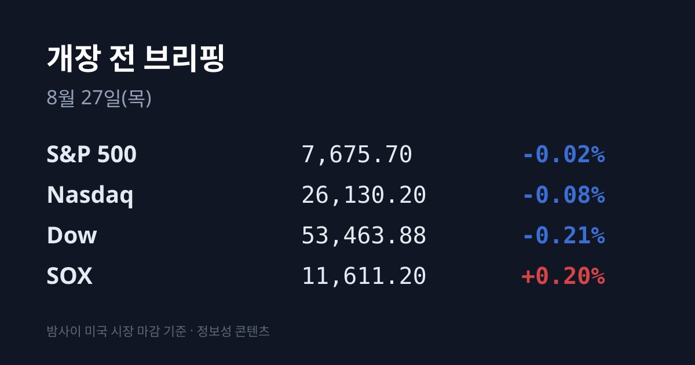
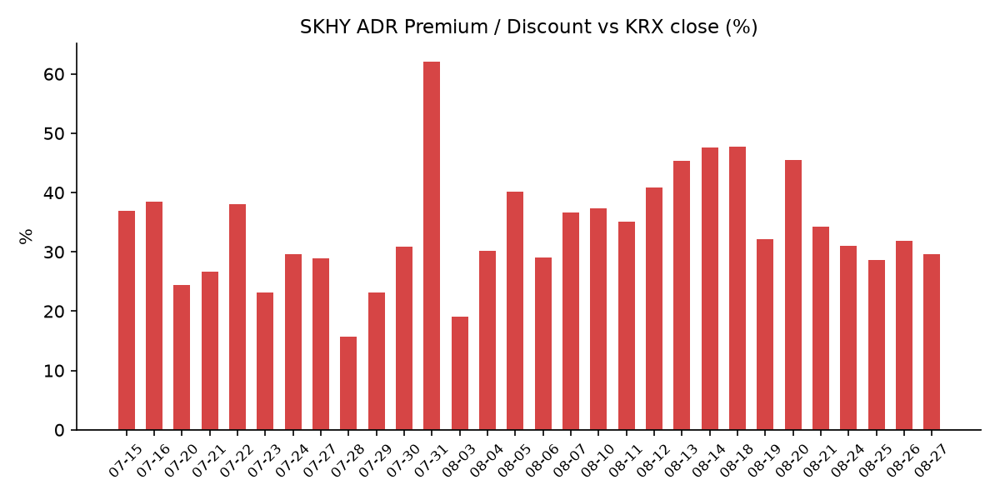
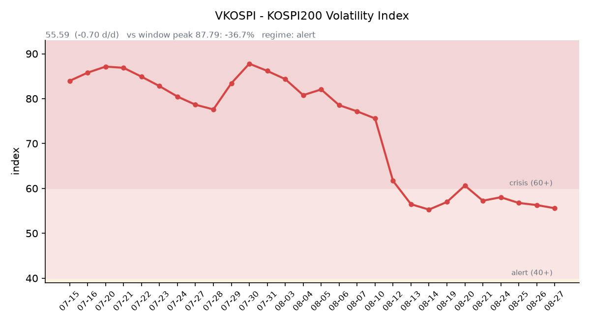

&nbsp;

【① 30초 요약 📈】

미국 정규장은 거의 움직이지 않았습니다. S&P 500 7,675.70(−0.02%), 나스닥 26,130.20(−0.08%), 다우 53,463.88(−0.21%)이고 필라델피아 반도체(SOX)만 11,611.20(+0.20%)으로 소폭 올랐습니다.

낮 동안 시장을 누른 것은 물가였습니다. <mark>미 7월 PCE가 전년비 +3.7%로 예상(3.6%)을 웃돌았고</mark>, 근원은 +3.3%로 예상에 부합했습니다. 금리는 이틀간의 하락을 되돌려 10년물 4.66%(+2bp), 30년물 5.18%(+1bp)입니다.

장이 닫힌 뒤 판이 바뀌었습니다. 엔비디아 FY2027 2분기 실적이 매출 **96.22B달러(+106% YoY)**, 조정 주당순이익 2.22달러, 3분기 가이던스 108B달러로 컨센서스(92.2B / 2.09 / 104.2B)를 전 항목에서 넘겼습니다. 데이터센터 매출은 +117%입니다.

주가는 발표 직후 −1.5~2%로 밀렸다가 컨퍼런스콜 이후 반전해 <mark>시간외 217.80~218.16달러(+3.88~4.05%)</mark>가 됐습니다. 세일즈포스 +14%, 옥타 +19%, 크라우드스트라이크 +10%대도 같은 시간에 나왔습니다.

한국 관련 자산은 시간외에서 크게 올랐습니다. SK하이닉스 ADR(SKHY)이 164.80달러로 **+4.29%**, 한국 ETF EWY가 185.40달러로 +3.47% 입니다.

어제 코스피는 6,808.21(+65.47, +0.97%), 코스닥은 826.87(−0.28, −0.03%)이었습니다. 삼성전자 261,500원(+1.75%), SK하이닉스 1,688,000원(+0.60%)입니다.

수급의 핵심은 <mark>외국인 순매도가 3조9,491억원에서 1,051억원으로 사실상 멈췄다는 점</mark>입니다. 기관 +7,648억원, 개인 −2조2,468억원, 기타법인 +1조5,981억원입니다.

어제 지수를 끌어올린 것은 반도체가 아니라 삼성 계열 배당 재평가였습니다. 삼성전자의 **110조원 주주환원** 의결(08/21) 이후 지분 보유 계열사로 자금이 몰려 삼성생명 +8.60%, 삼성물산 +5.59%, 삼성화재 +4.94%입니다.

유가는 3거래일 연속 급락해 브렌트 85.85달러(−3.08%), WTI 80.15달러(−2.68%)로 8월 10일 이후 최저입니다.

오늘은 **한국은행 금융통화위원회**가 있습니다. 현 기준금리 2.75%에서 인상과 동결 전망이 갈려 있습니다.

&nbsp;

【② 밤사이 미국 시장 🌙】

| 지수 | 종가 | 등락률 |
| :--- | ---: | ---: |
| S&P 500 | 7,675.70 | −0.02% |
| 나스닥 | 26,130.20 | −0.08% |
| 다우 | 53,463.88 | −0.21% |
| 필라델피아 반도체(SOX) | 11,611.20 | +0.20% |

수요일 미국 정규장은 아무 결론도 내지 않은 하루였습니다. 3대 지수가 −0.02%에서 −0.21% 사이에 머물렀고 SOX만 23.2포인트 올랐습니다. 구성 종목은 갈렸습니다 — ARM +3.93%, 아스테라랩스 +2.71%가 올랐고 엔비디아는 −1.59%였습니다. 시장 전체가 장 마감 후 발표를 기다리며 움직이지 않았다는 쪽에 가깝습니다.

낮 동안의 실제 재료는 물가였습니다. 미 7월 개인소비지출(PCE) 물가지수가 전월비 +0.2%, 전년비 +3.7%로 나왔습니다. 전년비는 시장 예상 3.6%를 웃돌았고, 근원 PCE는 전월비 +0.2%, 전년비 +3.3%로 예상에 부합했습니다. 둘 다 연준 목표 2%를 크게 웃도는 수준입니다.

금리는 이 발표에 반응해 이틀간의 하락을 되돌렸습니다. 미 재무부 확정치로 2년물 4.19%(+2bp), 10년물 4.66%(+2bp), 30년물 5.18%(+1bp)이고 10년–2년 스프레드는 +47bp로 전일과 같습니다. 10년물 실질금리(TIPS)는 2.34%로 2bp 올랐습니다. 되돌림 폭 자체는 작지만, 어제 한국장 상승의 근거 중 하나가 금리 하락이었다는 점에서 방향이 바뀐 것입니다. VIX는 15.21(−1.55%), 달러인덱스는 99.07로 전일 98.90에서 소폭 올랐습니다. CME FedWatch 기준 9월 FOMC 인상 확률은 약 40%, 동결 약 60%입니다.

그리고 정규장이 닫힌 뒤 이 모든 것을 덮는 뉴스가 나왔습니다. 엔비디아의 FY2027 2분기(5~7월) 실적입니다. <mark>매출 96.22B달러로 전년 동기 대비 +106%, 조정 주당순이익 2.22달러, 3분기 가이던스 108B달러</mark>로 컨센서스를 전 항목에서 넘겼습니다. 데이터센터 매출은 +117%, 순이익 59.69B달러, 영업이익률 66.2%입니다. 가이던스에는 중국 데이터센터 매출이 포함되지 않았습니다. 젠슨 황 CEO는 "AI가 변곡점에 도달했다"고 말했고, 회사는 FY2028 매출 약 +70% 성장과 클라우드 산업 백로그 2조달러 초과를 제시하면서 **공급이 FY2028 말까지 병목**이라고 밝혔습니다. 한편 재고일수가 119일로 늘어난 점은 수요 둔화 가능성으로 지적됐습니다.

주가 반응은 두 단계였습니다. 발표 직후에는 −1.5~2%로 밀려 206.72달러까지 내려갔고, 컨퍼런스콜 코멘트가 나온 뒤 반전해 217.80~218.16달러(+3.88~4.05%)로 거래됐습니다. 정규장 종가가 209.66달러(−1.59%)였으므로 시간외에서 방향이 완전히 바뀐 셈입니다.

같은 시간 소프트웨어·보안도 한꺼번에 컨센서스를 넘겼습니다. 세일즈포스가 +14%(앤스로픽과의 제휴 'Claudeforce' 발표), 옥타가 +19%, 크라우드스트라이크가 +10%대(순신규 연간반복매출 333M달러로 사상 최대)입니다. 전날 발표된 인튜이트는 −8%였습니다.

원자재에서는 유가가 3거래일 연속 크게 빠졌습니다. 브렌트 85.85달러(−3.08%), WTI 80.15달러(−2.68%)로 8월 10일 이후 최저이고 3거래일 누적 약 −9%입니다. 배경은 두 가지로 지목됐습니다 — 이란과 오만의 회담으로 호르무즈 해협 재개방 기대가 살아난 것, 그리고 미국의 최신 제재가 이란 교역 상대국을 겨냥한 2차 제재를 빼고 나온 것입니다.

한국 원유 수입의 기준유종인 두바이유에서는 변화가 있었습니다. 페트로넷 08/26 게시 기준 두바이 87.10달러, 브렌트 87.84달러, WTI 82.23달러입니다. <mark>08/21 +3.42달러, 08/25 +4.42달러까지 벌어졌던 두바이-브렌트 역전이 −0.74달러로 해소됐습니다</mark>. 두바이가 브렌트보다 빠르게 빠졌다는 뜻입니다. 이틀 전까지는 브렌트만 내리고 두바이는 버티는 국면이어서 국내 정유 원가가 헤드라인만큼 개선되지 않았는데, 이번에는 방향이 다릅니다. 금은 12월물 4,657.54달러로 전일 4,718.30달러에서 내렸습니다. 벌크 해상운임 BDI는 2,926(08/25 기준)입니다.

현재 미 지수선물은 위로 벌어져 있습니다. S&P 500 선물 7,719.30(+0.57%), 나스닥100 선물 29,499.30(+0.94%), 다우 선물 53,687.00(+0.42%)이고 닛케이 선물도 66,782.50(+0.97%)입니다.

&nbsp;

【③ 괴리율 트래커 — SK하이닉스 ADR 📊】

| 항목 | 수치 |
| :--- | ---: |
| SKHY 종가 | $158.02 (−0.95%) |
| 본주 환산가 (×10×환율) | 2,188,261원 |
| 본주 직전 종가 | 1,688,000원 |
| 괴리율 | +29.6% |

정규장 기준 괴리율이 전일 +28.6%에서 +31.8%를 거쳐 **+29.6%로** 2.2%포인트 좁혀졌습니다. 축소의 출처는 단순합니다 — ADR이 −0.95% 내리는 동안 본주는 +0.60% 올랐습니다. 환율은 계산에 거의 영향을 주지 않았습니다(1,386.10원 → 1,384.80원).

그런데 정규장 수치만 보면 방향을 반대로 읽게 됩니다. 엔비디아 실적 발표 후 <mark>SKHY 시간외 가격이 164.80달러로 +4.29%</mark>가 됐기 때문입니다. 이 가격으로 환산하면 2,282,150원, 괴리율은 +35.2%로 오히려 벌어집니다. 정규장에서 좁혀진 것이 시간외에서 다시 열린 하루입니다.

구조를 다시 짚으면, ADR 1주는 본주 10주에 해당하므로 환산가는 ADR 종가에 10과 원·달러 환율을 곱해 구합니다. 환산가가 본주보다 높은 상태(프리미엄)에서는 ADR을 팔고 본주를 사는 전환 차익거래에 유인이 생기고, 낮은 상태(디스카운트)에서는 반대 방향의 유인이 생기는 것이 이 지표의 메커니즘입니다. 다만 실제 차익거래에는 마찰이 있습니다 — 전환 한도가 1,779만주(발행주식의 2.5%)이고 절차에 수 주 이상 걸립니다.

밤사이 한국 시장 전체가 미국에서 어떻게 값이 매겨졌는지도 함께 봅니다. 한국 대표 ETF인 EWY가 정규장 179.18달러(−0.54%)로 마친 뒤 시간외 185.40달러(+3.47%)가 됐습니다. EWY는 삼성전자 22.35%, SK하이닉스 23.19%로 두 종목이 자산의 절반 가까이를 차지하는 ETF입니다. 코스피200 야간선물은 3거래일째 확보하지 못했으므로, 이 수치가 밤사이 미국 투자자가 한국 시장 전체를 다시 매긴 값에 가장 가까운 기록입니다.

&nbsp;

【④ 변동성 트래커 🌡️】

판정 한 줄: <mark>'경보' 구간(40~60) 유지, 그리고 이번에는 기대 변동성과 실현 변동성이 처음으로 같은 방향을 가리켰다</mark>. VKOSPI가 3거래일 연속 내려 8월 저점이고, 일중 진폭도 5.0%포인트에서 2.69%포인트로 줄었다.

기대 변동성 — VKOSPI **55.59**(전일 56.29 대비 −0.70p, −1.24%). 구간 기준은 25 미만 평시 / 25~40 주의 / 40~60 경보 / 60 이상 위기이며 현재는 경보다. 6월 종가 고점 96.94 대비 −42.7%까지 내려온 상태이나 평시 상단(25)의 2.22배다. 추이: 08/20 57.26 → 08/21 58.03 → 08/24 56.76 → 08/25 56.29 → 08/26 55.59로 3거래일 연속 하락했고 8월 들어 가장 낮은 값이다.

실현 변동성 — 어제 코스피의 일중 경로는 시가 6,727.25 → 저가 6,704.10 → 고가 6,887.18 → 종가 6,808.21이다. 진폭은 약 2.69%포인트로, 08/25의 5.0%포인트에서 절반 가까이 줄었다. 확보된 일별 등락률은 08/20 +5.89% → 08/21 +0.88% → 08/24 −3.12% → 08/25 +0.68% → 08/26 +0.97%이고 다섯 거래일 중 ±3% 이상이 2일이다. 코스닥 어제 일중 범위는 815.53~832.21이었다.

매매 정지 — 08/26에는 사이드카·서킷브레이커가 발동되지 않았다. 확인된 최근 이력은 08/19 코스피200 매도 사이드카 → 08/20 매수 사이드카 → 08/21 코스닥 매도 사이드카가 마지막이며 이후 3거래일 연속 발동이 없다. 사이드카 기준은 지수가 아니라 코스피200 선물의 5% 변동이 1분간 지속되는 경우다.

증폭 경로 — 금융위 집계 기준 단일종목 레버리지 상품 거래대금은 05/27 10조4,000억원 → 07/30 12조4,000억원 → 08/11 7,000억원으로 급감한 상태다. 기본예탁금이 1,000만원에서 3,000만원으로 올랐고 신규 상장이 중단됐으며, 최소 매매단위를 1주에서 20주로 늘리는 조치가 9월 조기 시행으로 추진되고 있다. 당일 회전율은 개장 전 산출되지 않는다.

청산 압력 — 신용융자 잔고는 08/13 기준 30조9,263억원이고 그중 코스닥은 6조3,914억원이다. 08/14 이후 갱신치와 미수금 반대매매 금액은 집계 시점 기준 미확인이며 이 공백이 3주째다.

하방 포지션 — 공매도 순잔고는 T+2~3 공시 지연이 구조적이어서 개장 전에는 알 수 없다. 최신 확보치는 08/01~14 공매도 거래대금 집계로 삼성전자 5.4조원, SK하이닉스 3.1조원이다.

미확인 항목: 코스피200 야간선물(3거래일째), 프로그램 매매 차익·비차익과 선물 베이시스, 08/14 이후 신용융자·반대매매 갱신치, CCFI(컨테이너 운임).

&nbsp;

【⑤ 어제 한국장 리뷰 🇰🇷】

| 지수 | 종가 | 등락 |
| :--- | ---: | ---: |
| 코스피 | 6,808.21 | +65.47 (+0.97%) |
| 코스닥 | 826.87 | −0.28 (−0.03%) |

어제 한국 시장은 조용해진 하루였습니다. 코스피는 6,727.25로 하락 출발했다가 오전 중 상승 전환해 6,808.21로 마쳤습니다. 장중 저점 6,704.10, 고점 6,887.18로 진폭이 2.69%포인트인데 하루 전 5.0%포인트와 비교하면 절반 수준입니다. 6,800선을 회복했습니다. 코스닥은 826.87로 사실상 제자리였습니다.

상승 전환의 배경으로는 밤사이 미 금리·유가 하락이 지목됐습니다. 키움증권 한지영 연구원은 "소비자신뢰지수 부진과 추가 국채 개입 기대가 금리와 유가 하락에 기여했다"는 분석을 내놨습니다.

수급표에서 가장 눈에 띄는 것은 외국인 매도의 소멸입니다. 코스피는 외국인 **−1,051억원**, 기관 +7,648억원, 개인 −2조2,468억원, 기타법인 +1조5,981억원입니다(매체에 따라 외국인 −1,162억원, 기관 2조원대로도 집계). 외국인은 4거래일 연속 순매도라는 라벨을 유지했지만 하루 전 −3조9,491억원과 비교하면 규모가 38분의 1로 줄어 사실상 멈춘 수준입니다. 기타법인 순매수는 이틀 연속 1조6,000억원 안팎이고 삼성전자·SK하이닉스의 자사주 취득이 배경으로 지목됩니다. 코스닥은 외국인 −911억원, 기관 −1,051억원 순매도, 개인 +1,928억원 순매수로 이틀 이어지던 외국인·기관의 코스닥 순매수가 끊겼습니다.

지수를 끌어올린 것은 반도체가 아니라 삼성 계열의 배당 재평가였습니다. 삼성전자는 08/21 이사회에서 90조~110조원 규모 주주환원 시행 방안을 의결한 상태입니다 — 3분기에 약 30조원 현금배당, 임직원 보상용 자사주 15조원 매입, 잔여분은 내년 1월 이사회에서 방식과 규모를 정합니다. 국내 상장기업 사상 최대 규모이고 종전 최고인 2020년(20조3,000억원)의 다섯 배입니다. 어제는 이 배당을 받을 지분 보유 계열사로 자금이 몰렸습니다 — 삼성생명 +8.60%(309,500원, 삼성전자 지분 8.51%), 삼성물산 +5.59%(387,500원, 5.11%), 삼성화재 +4.94%(680,000원, 1.49%)입니다.

두 번째 재료는 SK이노베이션과 SK아이이테크놀로지(SKIET)의 합병 추진 보도였습니다. 두 종목은 정반대로 갈렸습니다 — SKIET가 +29.95%(19,960원) 상한가, SK이노베이션은 −11.04% 입니다. 코스피에서는 이월드도 +29.98%로 상한가였고 코스닥에서는 시그네틱스·CSA코스믹·유디엠텍 등 8개 종목이 상한가를 기록해 하루에 상한가가 10개 나왔습니다. 건설·원전·2차전지·중소형 개별주에 고르게 걸쳐 있어 순환매 성격이 강했습니다.

원전·전력 축도 사흘째 살아 있었습니다. 한국전력 +6.42%, 두산에너빌리티 +6.32%(84,300원)입니다. 시가총액 상위 두 종목은 삼성전자 261,500원(+1.75%), SK하이닉스 1,688,000원(+0.60%)으로 반도체 대형주 저가 매수세가 지수 상승을 거들었습니다.

환율은 이례적으로 조용했습니다. 원·달러 08/26 서울 주간 종가는 1,384.80원(−1.30원)이고 작성 시각 현재값은 1,384.73원(08/27 07:19 KST)으로 차이가 0.07원입니다. USD/JPY는 159.27로 정체 상태입니다.

아시아는 전 시장이 올랐습니다 — 닛케이 225 66,262.16(+0.62%), 상해종합 3,912.52(+0.59%), 대만 가권 45,832.62(+1.47%), 항셍 25,652.97(+0.56%)입니다. 반도체 동조 축인 대만 가권이 이틀 연속 가장 강했고 코스피(+0.97%)보다 0.5%포인트 앞섰습니다.

&nbsp;

【⑥ 오늘의 캘린더 & 관전 포인트 📅】

**오늘(08/27)** — <mark>한국은행 금융통화위원회 통화정책방향 결정회의와 수정 경제전망</mark>. 현 기준금리는 2.75%(07/16에 2.50%에서 인상)이고 시장에서는 인상(3.00%)과 동결 전망이 갈려 있습니다.

08/27~29 — 잭슨홀 심포지엄 개막. 주제는 "금융 혁신: 지불 및 정책에 대한 영향"입니다.

08/28 — 케빈 워시 연준 의장의 취임 후 첫 기조연설, 미 동부시간 10:00(= 08/28 23:00 KST). 미 30년물 국채금리 방향을 결정할 자리로 지목되고 있습니다. 같은 날 미 8월 시카고 PMI와 일본 8월 도쿄 소비자물가지수도 나옵니다.

오늘 밤(KST) — 미 2분기 GDP 수정치, 주간 신규 실업수당 청구 건수(한국장 마감 후)

08/31 — SK하이닉스 분기배당(주당 375원) 기준일

3분기 중 — 삼성전자 약 30조원 현금배당 집행(08/21 이사회 의결분)

09/08 — 캐나다의 대미 보복관세(200억달러 규모) 발효

09/15~16 — FOMC. CME FedWatch 기준 인상 약 40%, 동결 약 60%입니다.

09월(조기 시행 추진) — 단일종목 레버리지 ETF 최소 매매단위 1주 → 20주

내년 1월 이사회 — 삼성전자 잔여 주주환원의 방식·규모 결정

11/19 — SK하이닉스 40조원 자사주 취득 종료 예정일

2027년 상반기(목표) — YMTC 상하이 STAR 마켓 상장

수시 — SK이노베이션·SKIET 합병 비율 공시, 08/14 이후 신용융자·반대매매 집계 공표, 공매도 순잔고 공표(T+3)

시장이 주시하는 레벨: 미 30년물 국채금리 5.18%(어제 종가)와 5.31%(8/17 고점)·5.10%, 10년물 4.66%, 원·달러 1,384.7원(현재)과 1,376원·1,400원, VKOSPI 60과 65 그리고 50, SK하이닉스 ADR 괴리율의 최근 범위 +28.6%~+47.7%, 두바이-브렌트 스프레드 −0.74달러(역전 해소선), 코스피 6,800선과 어제 고점 6,887.18입니다.

&nbsp;

【⑦ 정책 워치 ⚡】

공매도 제도 — 차입 공매도는 전면 재개 상태이고 무차입 공매도는 여전히 금지입니다. 2026년부터 공매도 전산시스템 의무화가 시행 중이며, 기관투자자는 대차거래 내역뿐 아니라 매매·증자·주식배당·상환 내역까지 반영한 매도가능 잔고를 실시간 전산 관리해 무차입 주문을 사전 차단하도록 돼 있습니다. 불법 무차입 공매도에는 부당이득의 최대 5배 벌금과 형사처벌이 적용됩니다.

단일종목 레버리지 ETF — 07/16 기본예탁금이 1,000만원에서 3,000만원으로 올랐고 주식·채권 등 보유 자산은 예탁금으로 인정되지 않습니다. 신규 상장은 중단됐고 최소 매매단위를 1주에서 20주로 늘리는 개정이 9월 시행을 목표로 추진되고 있습니다.

기업 주주환원 — 삼성전자가 08/21 이사회에서 90조~110조원 규모 주주환원을 의결했습니다. 2024~2026년 3개년 주주환원책(잉여현금흐름의 50% 활용)에 따른 것으로 3개년 총 환원 규모는 120조~140조원 수준으로 전망됩니다.

원전 통상 — 미국이 한국에 웨스팅하우스 지분 투자를 제안했다는 보도에 대해 산업통상부는 공동 인수설을 부인한 상태이고 이후 후속 확인은 나오지 않았습니다.

통상 — 캐나다의 대미 보복관세(200억달러 규모)가 09/08 발효 예정입니다.

&nbsp;

【⑧ 오늘의 질문 ❓】

밤사이 미국은 엔비디아 실적으로 한국 관련 자산을 시간외에서 3.5~4.3% 위로 다시 매겼고, 같은 시각 국내에는 금통위라는 변수가 대기하고 있습니다 — 시초가에 도착한 해외 재평가와 장중에 도착하는 국내 통화정책 결정 중 어느 쪽이 오늘의 종가를 결정할 것인가.

&nbsp;

#개장전브리핑 #미국증시마감 #엔비디아실적 #하이닉스ADR #괴리율 #VKOSPI #코스피 #금융통화위원회 #반도체 #삼성전자주주환원

&nbsp;

본 글은 공개된 시장 데이터를 정리한 정보성 콘텐츠이며, 특정 종목·상품의 매매 권유가 아닙니다. 모든 투자 판단과 책임은 투자자 본인에게 있습니다. 수치는 작성 시점 기준이며 이후 변동될 수 있습니다.