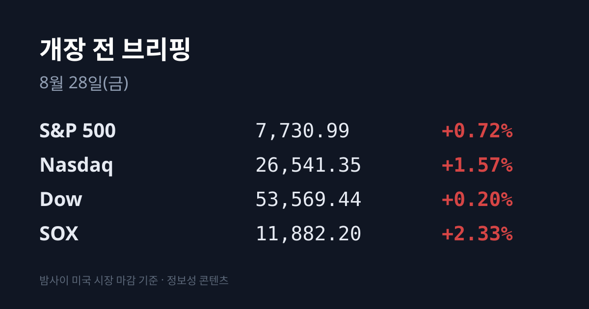
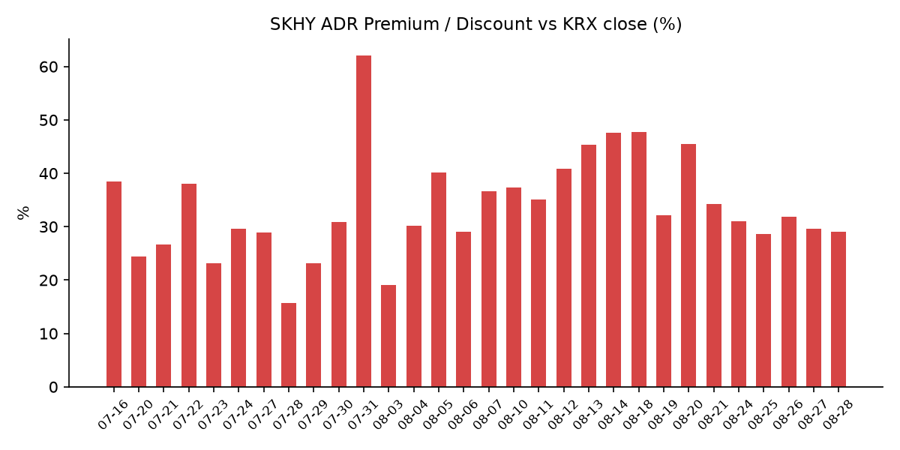
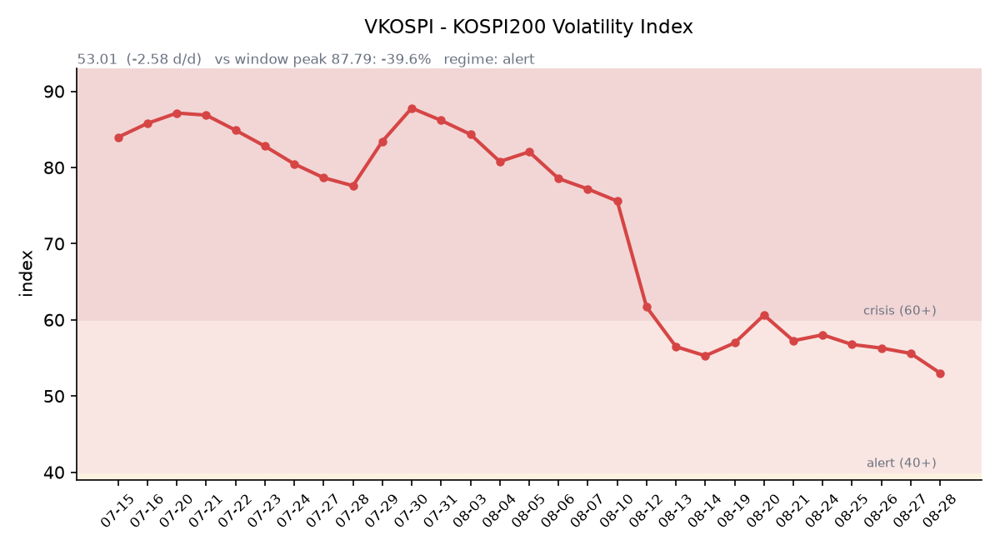

&nbsp;

【① 30초 요약 📈】

미국 정규장은 엔비디아 실적을 온전히 반영했습니다. 나스닥 26,541.35(**+1.57%**), S&P 500 7,730.99(+0.72%), 다우 53,569.44(+0.20%), 필라델피아 반도체(SOX) 11,882.20(**+2.33%**)입니다.

엔비디아는 +7.4~8.7%로 시가총액 5조5,000억달러를 회복했고, 마이크론 +4.5%·마벨 +5.8%가 따라붙었습니다. 소프트웨어는 더 셌습니다 — <mark>세일즈포스 +22%, 옥타 +28%, 크라우드스트라이크 +20%</mark>.

그런데 장이 닫힌 뒤 방향이 뒤집혔습니다. <mark>마벨은 매출·EPS·3분기 가이던스를 전부 넘기고도 시간외 −1.5~2%</mark>였고, 워크데이 −5~7%, 오토데스크 −6%, 루브릭 −10%, 센티넬원 −3%였습니다.

같은 날 <mark>트럼프 행정부가 반도체 관세 2차 라운드를 검토 중이라는 보도</mark>가 나왔습니다. 대상이 칩에서 **노트북·게임콘솔·데이터센터 서버까지** 넓어지는 안입니다.

한국 관련 자산의 시간외는 어제와 정반대였습니다. SK하이닉스 ADR(SKHY) 160.54달러(**−0.66%**), 한국 ETF EWY 181.02달러(−0.61%)입니다.

어제 코스피는 6,912.37(+104.16, **+1.53%**), 코스닥은 837.65(+10.78, +1.30%)로 3거래일 연속 올랐습니다. 삼성전자 266,000원(+1.72%), SK하이닉스 1,730,000원(+2.49%)입니다.

한국은행이 기준금리를 **2.75%에서 3.00%로** 올렸습니다. 두 달 연속 인상이고, <mark>금통위원 점도표 중간값이 3.25%</mark>로 나왔습니다.

수급에서는 <mark>외국인이 4거래일 연속 순매도를 끊고 기관과 함께 샀습니다</mark> — 코스피 외국인 +1,456억원, 기관 +1,814억원, 개인 −1조9,120억원입니다.

VKOSPI가 **53.01로 52주 최저**입니다. 4거래일 연속 하락했고 6월 고점 96.94 대비 −45.3%입니다.

오늘 밤 **23:00(KST) 케빈 워시 연준 의장의 잭슨홀 기조연설**이 있습니다. 한국장 마감 후입니다.

&nbsp;

【② 밤사이 미국 시장 🌙】

| 지수 | 종가 | 등락률 |
| :--- | ---: | ---: |
| S&P 500 | 7,730.99 | +0.72% |
| 나스닥 | 26,541.35 | +1.57% |
| 다우 | 53,569.44 | +0.20% |
| 필라델피아 반도체(SOX) | 11,882.20 | +2.33% |

목요일 미국 정규장은 전날 밤에 나온 엔비디아 실적을 낮 동안 온전히 값으로 매긴 하루였습니다. 나스닥이 411.15포인트 올라 다른 지수를 앞섰고, SOX는 270.9포인트 상승했습니다.

엔비디아가 +7.4~8.7%로 시가총액 5조5,000억달러를 회복했고, 마이크론 +4.5%, 마벨 +5.8%가 따라붙었습니다. VanEck 반도체 ETF는 +3.5%, iShares 반도체 ETF는 +3%였습니다.

더 크게 움직인 쪽은 소프트웨어였습니다. 세일즈포스 +22%, 옥타 +28%, 크라우드스트라이크 +20%입니다. 세일즈포스 마크 베니오프 CEO는 "This is not the SaaSpocalypse"라며 AI가 기업용 소프트웨어를 무너뜨릴 것이라는 예측을 반박했습니다.

경제지표도 우호적이었습니다. 미 주간 신규 실업수당 청구가 **203,000건으로** 시장 예상 208,000건을 밑돌았습니다.

금리는 커브 전체가 1bp씩 올랐습니다. 미 재무부 확정치로 2년물 4.20%, 10년물 4.67%, 30년물 5.19%이고, 10년–2년 스프레드는 +47bp로 전일과 같습니다. 10년물 실질금리(TIPS)는 2.34%로 보합입니다. 커브가 같은 폭으로 평행 이동한 것이라 형태 변화는 없습니다.

VIX는 14.51(−4.60%)로 내렸고, 달러인덱스는 99.14입니다. CME FedWatch 기준 9월 16일 FOMC는 동결 65.6%, 인상 34.4%입니다.

그런데 정규장이 닫힌 뒤 분위기가 바뀌었습니다. 마벨 테크놀로지는 2분기 매출 2.739B달러(컨센서스 2.707B), 조정 주당순이익 0.94달러(컨센서스 0.929), 3분기 매출 가이던스 3.15B달러(컨센서스 3.034B)로 전 항목을 넘겼고 연간 전망을 두 분기 연속 올렸습니다. 데이터센터 매출은 전년 대비 +46%로 전체의 76%입니다.

그럼에도 시간외 주가는 **−1.5~2%(241.45달러)** 였습니다. 연초 이후 약 188% 오른 상태여서 "beat 폭이 이미 가격에 들어 있었다"는 해석이 나왔습니다.

다른 기업들도 비슷했습니다. 워크데이 −5~7%(3분기 구독매출 가이던스 2.515B달러가 기대에 미달), 오토데스크 −6%(3분기 EPS 가이던스 3.04~3.09달러 vs 컨센서스 3.14달러), 센티넬원 −3%, 그리고 루브릭은 주당순이익 0.20달러로 컨센서스 0.04달러를 다섯 배 넘겼는데도 −10%였습니다. 반대편에는 갭 +9%, 어펌 +12.8%, 울타 뷰티 +2%가 있습니다.

같은 날 정책 쪽에서도 뉴스가 나왔습니다. <mark>트럼프 행정부가 반도체 관세 2차 라운드를 검토 중</mark>이라는 보도입니다. 알려진 내용은 세 가지입니다.

첫째, 관세 대상이 칩 자체를 넘어 노트북·게임콘솔·데이터센터 서버 등 반도체가 들어간 제품으로 확대되는 안입니다. 둘째, 올해 1월 부과된 25% 관세에 딸려 있던 데이터센터·연구개발·스타트업·소비자기기 면제가 승계되지 않을 수 있다는 점입니다. 셋째, 러트닉 상무장관이 각 기업의 대미 생산 약정 물량에 연동한 무관세 쿼터 구조를 선호한다는 점입니다.

러트닉은 그간 한국·대만 기업이 미국에 투자하지 않을 경우 100% 관세를 부과할 수 있다고 언급해 왔습니다. 단계적 도입이 논의 중이고 틀은 아직 바뀔 수 있는 상태입니다.

원자재에서는 유가가 4거래일 만에 반등했습니다. 브렌트 88.51달러(+1.81%), WTI 83.54달러(+1.59%)입니다. 08/24 90.54달러에서 08/26 86.94달러까지 사흘 내리 빠진 뒤 방향이 바뀌었습니다. 이란-오만의 호르무즈 해협 합의로 눌려 있던 자리에 러시아발 공급 차질 우려가 겹친 점이 배경으로 지목됐습니다.

한국 원유 수입의 기준유종인 두바이유는 페트로넷 게시가 아직 08/26에 멈춰 있어 두바이 87.10달러, 브렌트 87.84달러, WTI 82.23달러가 최신입니다(두바이가 0.74달러 낮은 역전 해소 상태). 금 12월물은 4,654.70달러로 보합권이고, 벌크 해상운임 BDI는 2,841입니다.

현재 미 지수선물은 네 종목 모두 소폭 아래입니다. S&P 500 선물 7,732.00(−0.14%), 나스닥100 선물 29,624.25(−0.24%), 다우 선물 53,605.00(−0.03%), 닛케이 선물 66,137.50(−0.05%)입니다(08/28 07:09~07:19 KST).

&nbsp;

【③ 괴리율 트래커 — SK하이닉스 ADR 📊】

| 항목 | 수치 |
| :--- | ---: |
| SKHY 종가 | $161.61 (+2.27%) |
| 본주 환산가 (×10×환율) | 2,231,672원 |
| 본주 직전 종가 | 1,730,000원 |
| **괴리율** | **+29.0%** |

정규장 기준 괴리율이 전일 +29.6%에서 **+29.0%로** 0.6%포인트 좁혀졌습니다. 축소 폭이 작은 데는 이유가 있습니다 — ADR과 본주가 어제 거의 같은 폭으로 움직였습니다. SKHY +2.27%, SK하이닉스 +2.49%입니다. 한국 시장 전체를 담는 EWY도 +1.65%로 코스피 +1.53%와 거의 같았습니다.

이 구조가 말해 주는 것은 밤사이 미국이 한국 자산을 추가로 재평가하지 않았다는 점입니다. 하루 전에는 SKHY 시간외가 +4.29%, EWY가 +3.47%였고 그 차이가 다음 날 시초가 갭으로 나타났습니다. 어제는 그런 벌어짐이 없었고, 시간외에서는 오히려 SKHY −0.66%, EWY −0.61%로 되돌려졌습니다. 시간외 가격으로 환산하면 괴리율은 +28.2%가 됩니다.

괴리율 자체의 의미는 구조에서 나옵니다. ADR 1주는 본주 10분의 1에 해당하므로 ADR 종가 × 10 × 원달러 환율이 본주의 해외 평가액이 됩니다. 이 값이 국내 종가보다 높으면(프리미엄) 전환 차익거래 구조상 본주를 사고 ADR을 파는 유인이, 낮으면(디스카운트) 반대 방향의 유인이 생깁니다.

다만 SK하이닉스 ADR은 정식 상장 ADR이 아닌 장외 프로그램이어서 전환이 자유롭지 않고, 그래서 괴리가 장기간 유지되는 특성이 있습니다. 최근 범위는 08/25 +28.6%에서 08/18 +47.7% 사이입니다.

&nbsp;

【④ 변동성 트래커 🌡️】

판정 한 줄: <mark>'경보' 구간(40~60)이지만 VKOSPI가 4거래일 연속 내려 52주 밴드의 정확한 하단에 닿았다</mark>. 기대 변동성과 실현 변동성이 사흘째 같은 방향을 가리키고 있다.

**기대 변동성** — VKOSPI **53.01**(전일 55.59 대비 −2.58p, −4.64%). 구간 기준은 25 미만 평시 / 25~40 주의 / 40~60 경보 / 60 이상 위기이며 현재는 경보다. 6월 종가 고점 96.94 대비 −45.3%까지 내려왔고 평시 상단(25)의 2.12배다. 추이는 08/21 58.03 → 08/24 56.76 → 08/25 56.29 → 08/26 55.59 → 08/27 53.01로 4거래일 연속 하락했다. 특기할 점은 이 값이 52주 밴드(53.01~93.27)의 하단 그 자체라는 것이다.

**실현 변동성** — 어제 코스피의 일중 경로는 시가 **6,996.12** = 고가 → 저가 6,841.88 → 종가 6,912.37이다. 시가가 곧 고가였고 진폭은 약 2.23%포인트로, 08/26의 2.69%포인트, 08/25의 약 5.0%포인트에서 사흘 연속 줄었다. 일별 등락률은 08/21 +0.88% → 08/24 −3.12% → 08/25 +0.68% → 08/26 +0.97% → 08/27 +1.53%이고, 다섯 거래일 중 ±3% 이상은 1일이다. 코스닥은 같은 기간 08/24 +1.42% → 08/25 +1.70% → 08/26 −0.03% → 08/27 +1.30%이며 어제 일중 범위는 824.22~839.57이었다.

**매매 정지** — 08/27에는 사이드카·서킷브레이커가 발동되지 않았다. 코스피가 시초에 +2.76%로 열렸으나 사이드카 기준(코스피200 선물 5% 변동이 1분간 지속)에는 닿지 않았다. 확인된 최근 이력은 08/19 코스피200 매도 사이드카 → 08/20 매수 사이드카 → 08/21 코스닥 매도 사이드카가 마지막이며, 이후 4거래일 연속 발동이 없다.

**증폭 경로** — 금융위 집계 기준 단일종목 레버리지 상품 거래대금은 05/27 10조4,000억원 → 07/30 12조4,000억원 → 08/11 7,000억원으로 급감한 상태다. 규제도 진행 중이다 — 기본예탁금이 3,000만원으로 올랐고(현금만 인정), 신규 상장이 중단됐으며, 매매수량단위를 1주에서 20주로 늘리는 조치가 당초 11월에서 **9월로 앞당겨졌다.** 당일 회전율은 개장 전 산출되지 않는다.

**청산 압력** — 신용융자 잔고는 08/26 기준 **33조1,023억원으로** 전 거래일보다 2,540억원 늘었다. 07/28(33조1,940억원) 이후 한 달 만에 33조원대로 복귀했고, 08/04 저점 27조4,038억원과 비교하면 3주 만에 약 5조7,000억원 증가다. 반등을 개인의 레버리지가 따라붙고 있다는 뜻이다. 같은 날 투자자예탁금은 98조9,176억원으로 100조원 아래다. 08/27 기준 갱신치와 미수금 반대매매 금액은 집계 시점 기준 미확인이다.

**하방 포지션** — 공매도 순잔고는 T+2~3 공시 지연이 구조적이어서 개장 전에는 알 수 없다. 제도는 차입 공매도 전면 재개 상태가 유지되고 있고 변경 사항은 확인되지 않았다.

미확인 항목: 코스피200 야간선물(4거래일째), 프로그램 매매 차익·비차익과 선물 베이시스, 08/27 기준 신용융자·반대매매 갱신치, 일본 8월 도쿄 CPI 결과.

&nbsp;

【⑤ 어제 한국장 리뷰 🇰🇷】

| 지수 | 종가 | 등락 |
| :--- | ---: | ---: |
| 코스피 | 6,912.37 | +104.16 (+1.53%) |
| 코스닥 | 837.65 | +10.78 (+1.30%) |

어제 한국 시장은 위로 열렸다가 절반을 반납한 하루였습니다. 코스피는 엔비디아 실적에 힘입어 6,996.12로 출발해 장초반 3% 가까이 급등했지만, 오전 중 한국은행의 기준금리 인상 발표가 나오면서 상승폭을 줄여 6,912.37로 마쳤습니다. 시가가 곧 그날의 고가였고 저점은 6,841.88입니다. 7,000선은 문턱에서 물러섰습니다.

코스닥도 금리 인상 발표에 장초반 밀렸다가 상승 전환해 837.65로 마감했습니다.

<mark>한국은행이 기준금리를 연 2.75%에서 3.00%로 올렸습니다.</mark> 7월(2.50%→2.75%)에 이은 두 달 연속 인상이고, 기준금리 3% 시대는 1년 9개월 만입니다. 신현송 총재는 연속 인상 배경을 두고 "거시경제 안정을 위해서는 선제적 대응이 필요하다", "가래 대신 호미로 막은 것"이라고 설명했습니다.

함께 나온 수정 경제전망에서 올해 성장률 전망은 **2.6%에서 3.3%로** 상향됐고, 반도체 경기 호조와 소득 여건 개선이 근거로 제시됐습니다. 회의에서는 동결 소수의견도 나왔습니다.

시장이 더 주목한 것은 금통위원 금리 전망 점도표의 중간값이 **3.25%라는** 점입니다 — 신 총재는 이를 두고 "6개월간 회의가 4번 있는데 지금보다 한 번 더 인상한다는 의미"라고 설명했습니다. 10월 결정의 판단 지표로는 물가와 명목 GDP를 꼽았습니다.

수급에서 가장 눈에 띄는 것은 외국인의 순매수 전환입니다. 코스피는 외국인 **+1,456억원**, 기관 +1,814억원, 개인 −1조9,120억원입니다(매체에 따라 외국인 +1,422~1,524억원, 기관 +1,776~1,816억원으로 집계됐습니다).

외국인은 4거래일 연속 순매도를 끊었고, 외국인과 기관이 동시에 산 것은 이번 반등 국면에서 처음입니다. 코스닥도 외국인 +891억원, 기관 +620억원 순매수, 개인 −1,492억원 순매도로 코스피와 같은 구조였습니다. 프로그램 매매와 선물 베이시스는 이번 집계에서 확보하지 못했습니다.

업종에서는 전기·전자가 **+2.62%로** 가장 강했고 금속 +2.30%, 제조 +2.04%가 뒤따랐습니다. 시가총액 상위 두 종목이 지수를 끌어올렸습니다 — 삼성전자 266,000원(+1.72%), SK하이닉스 1,730,000원(+2.49%)입니다.

사유는 하나로 모입니다. 전날 밤 엔비디아가 매출 96.22B달러(+106% YoY), 조정 EPS 2.22달러, 3분기 가이던스 108B달러로 전 항목 컨센서스를 넘기면서 HBM과 메모리 수요가 재확인된 것입니다.

두 번째 축은 이차전지였습니다. LG에너지솔루션이 **+5.56%로** 올랐고, 재료는 미국 전력망 확충에 따른 ESS(에너지저장장치) 수요 확대 기대였습니다. 코스닥이 금리 인상 발표 직후의 하락을 되돌린 것도 이 축 덕입니다. 방산에서는 한화에어로스페이스가 +5.80%였습니다.

반대로 전날의 승자들이 되돌려졌습니다. 하루 전 배당 재평가로 급등했던 삼성물산이 −3.10%, 현대차가 −2.45%입니다. 약세 업종은 유통 −2.36%, 전기·가스 −2.05%, 음식료·담배 −1.56%였습니다.

환율은 이틀째 조용했고, 방향까지 좋았습니다. 원·달러 08/27 서울 주간 종가는 **1,380.90원(−3.90원)** 이고, 작성 시각 현재값은 1,381.43원(08/28 07:19 KST)으로 밤사이 되돌림이 0.53원에 그쳤습니다. 기준금리를 올린 다음 날이라는 점에서 금리차 축소가 원화를 떠받친 것으로 읽힙니다. USD/JPY는 159.39로 정체 상태입니다.

아시아는 엇갈렸습니다 — 상해종합 3,956.57(+1.13%), 대만 가권 45,975.22(+0.31%)가 올랐고 닛케이 225 66,131.98(−0.20%), 항셍 25,565.74(−0.34%)가 내렸습니다. 눈에 띄는 것은 반도체 동조 축인 대만이 +0.31%에 그쳤다는 점입니다. 전날 +1.47%로 아시아에서 가장 강했던 시장인데, 엔비디아 실적 다음 날에는 코스피(+1.53%)에 1.2%포인트 뒤졌습니다.

&nbsp;

【⑥ 오늘의 캘린더 & 관전 포인트 📅】

**08/28 08:30** — 일본 8월 도쿄 소비자물가지수. 작성 시각 이후 발표라 결과는 미확인입니다.

**08/28 22:45 / 23:00** — 미 8월 시카고 PMI, 미시간대 소비자심리 최종치

**08/28 23:00** — <mark>케빈 워시 연준 의장의 잭슨홀 기조연설</mark>(미 동부시간 10:00). 미 30년물 국채금리 방향을 결정할 자리로 지목되고 있으며, 한국장 마감 후입니다.

**08/29 05:00** — 델 테크놀로지스 2분기 실적(미 08/28 장 마감 후)

**08/31** — SK하이닉스 분기배당(주당 375원) 기준일

**09/01** — 한국 8월 수출입 잠정치

**09/08** — 캐나다의 대미 보복관세(200억달러 규모) 발효

**09월(조기 시행)** — 단일종목 레버리지 ETF·ETN 매매수량단위 1주 → 20주. 당초 11월이었으나 앞당겨졌습니다.

**09월 중** — 선물·옵션 동시만기(네 마녀의 날)

**09/15~16** — FOMC. CME FedWatch 기준 동결 65.6%, 인상 34.4%입니다.

**10월** — 한국은행 금융통화위원회. 신현송 총재는 판단 지표로 물가와 명목 GDP를 지목했습니다.

**3분기 중** — 삼성전자 약 30조원 현금배당 집행(08/21 이사회 의결분)

**11/19** — SK하이닉스 40조원 자사주 취득 종료 예정일

**내년 1월 이사회** — 삼성전자 잔여 주주환원(90조~110조 중 잔액)의 방식·규모 결정

**2027년 상반기(목표)** — YMTC 상하이 STAR 마켓 상장

**수시** — 반도체 관세 2차 라운드 구체안 발표, 08/27 기준 신용융자·반대매매 집계 공표, 공매도 순잔고 공표(T+3), SK이노베이션·SKIET 합병 비율 공시

시장이 주시하는 레벨: 미 30년물 국채금리 5.19%(어제 종가)와 5.31%(8/17 고점)·5.10%, 10년물 4.67%, 원·달러 1,381.4원(현재)과 1,376원(08/24 장중 저점)·1,400원, VKOSPI 50과 60, SK하이닉스 ADR 괴리율의 최근 범위 +28.6%(08/25)~+47.7%(08/18), 두바이-브렌트 스프레드 −0.74달러(역전 해소선), 코스피 7,000선과 어제 고점 6,996.12입니다.

&nbsp;

【⑦ 정책 워치 ⚡】

미 반도체 관세: 트럼프 행정부가 2차 라운드를 검토 중이라는 보도가 08/27 나왔습니다. 관세 대상을 칩에서 노트북·게임콘솔·데이터센터 서버 등 반도체 탑재 제품으로 넓히는 안이고, 올해 1월 부과된 25% 관세에 딸린 데이터센터·연구개발·스타트업·소비자기기 면제가 승계되지 않을 수 있다는 내용이 포함돼 있습니다. 러트닉 상무장관은 각 기업의 대미 생산 약정 물량에 연동한 무관세 쿼터 구조를 선호하는 것으로 전해졌습니다.

한국은행: 08/27 기준금리를 2.75%에서 3.00%로 인상했습니다. 두 달 연속이고 3% 복귀는 1년 9개월 만입니다. 수정 경제전망에서 올해 성장률 전망을 2.6%에서 3.3%로 올렸습니다. 금통위원 점도표 중간값은 3.25%입니다.

공매도 제도: 차입 공매도는 전면 재개 상태이고 무차입 공매도는 여전히 금지입니다. 무차입 주문을 사전 차단하는 전산 3중 방지체계가 가동 중이며, 이번 집계에서 제도 변경 사항은 확인되지 않았습니다.

단일종목 레버리지 ETF: 매매수량단위를 1주에서 20주로 늘리는 조치의 시행 시기가 당초 11월에서 9월로 앞당겨졌습니다. 기본예탁금은 3,000만원(현금만 인정)이고 신규 상장은 중단된 상태이며, 총량 규제·과다호가부담금·긴급시장조치가 추가 검토 중입니다.

기업 주주환원: 삼성전자가 08/21 이사회에서 90조~110조원 규모 주주환원을 의결한 상태입니다. 3분기 약 30조원 현금배당과 임직원 보상용 자사주 15조원 매입이 포함되고, 잔여분은 내년 1월 이사회에서 결정됩니다.

통상: 캐나다의 대미 보복관세(200억달러 규모)가 09/08 발효 예정입니다.

&nbsp;

【⑧ 오늘의 질문 ❓】

미국 정규장은 엔비디아를 다시 사줬지만 한국은 그 몫을 어제 이미 반영했고, 밤사이 새로 도착한 것은 반도체 관세 확대 검토 보도와 "실적을 넘겨도 팔린다"를 보여준 장 마감 후 반응입니다 — 어제 선반영된 호재와 오늘 처음 도착하는 재료 중 어느 쪽이 개장 30분의 가격을 만들 것인가.

&nbsp;

#개장전브리핑 #미국증시마감 #반도체관세 #하이닉스ADR #괴리율 #VKOSPI #코스피 #한국은행기준금리 #잭슨홀 #마벨실적

&nbsp;

본 글은 공개된 시장 데이터를 정리한 정보성 콘텐츠이며, 특정 종목·상품의 매매 권유가 아닙니다. 모든 투자 판단과 책임은 투자자 본인에게 있습니다. 수치는 작성 시점 기준이며 이후 변동될 수 있습니다.