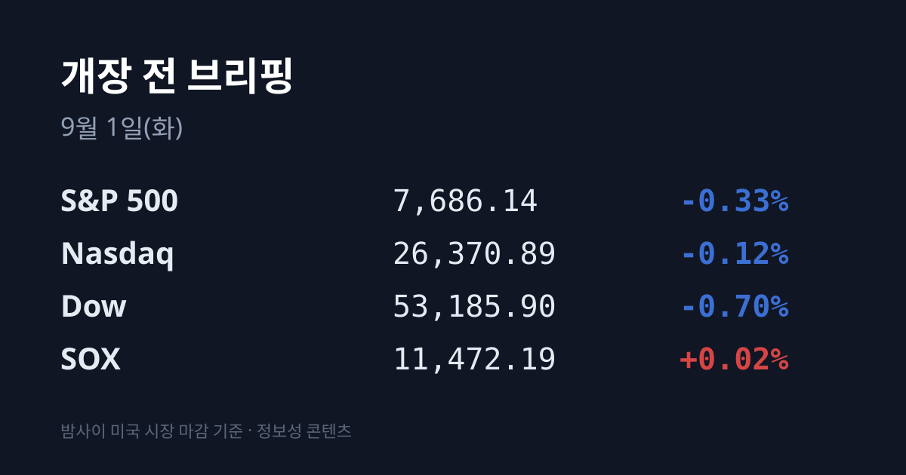
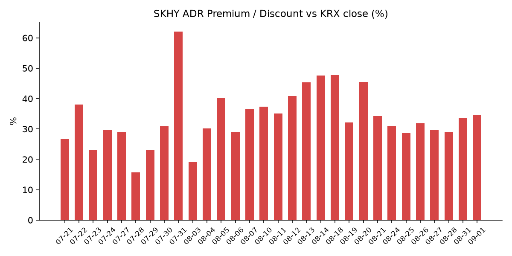
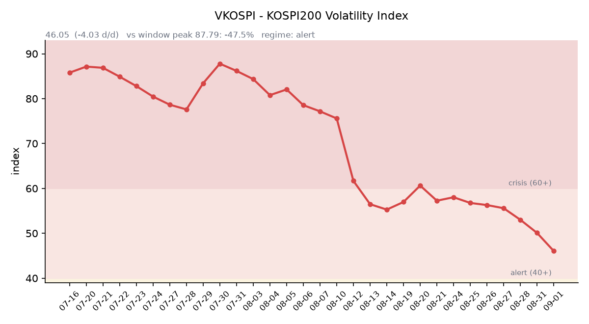

&nbsp;

【① 30초 요약 📈】

미 3대 지수는 유가 급등에 밀렸습니다. S&P 500 −0.33% · 나스닥 −0.12% · 다우 −0.70%. 그런데 <mark>필라델피아 반도체(SOX)는 11,472.19로 +0.02% 보합</mark>이었습니다 — 전날 −3.47%로 혼자 무너진 지수가 이번엔 혼자 버텼습니다.

08/30 미군이 호르무즈 해협 라라크섬의 이란 혁명수비대 로켓발사대 2기를 공습했고, 몇 시간 뒤 이란이 요르단 내 미군 연계 기지 2곳에 보복했습니다. **WTI $85.76(+2.83%)** · 브렌트 $90.49(+2.71%)로 반응했습니다.

미 국채는 2년물이 멈춘 채 장기물만 올랐습니다. 10년물 4.76%(+4bp, 2025년 1월 이후 최고) · 2년물 4.344%(보합) · **30년물 5.26%(+5bp)**.

SKHY ADR은 +2.20%로 본주(+1.27%)보다 더 올라 괴리율이 +34.55%까지 벌어졌습니다. EWY도 +0.37%였습니다.

어제 코스피는 시초 −3.55%(저점 6,547.76)에서 <mark>종가 6,820.02 = 당일 최고가</mark>까지 되돌렸습니다. 삼성전자·SK하이닉스 자사주 매입분이 기타법인 순매수 **+1조5,400억으로** 들어왔습니다.

원·달러 서울 종가 1,368.6원(−3.9원)으로 13개월 최저였습니다. 오늘 09:00 한국 8월 수출입 확정 잠정치가 나옵니다.

&nbsp;

【② 밤사이 미국 시장】

| 지수 | 종가 | 등락률 |
| :--- | ---: | ---: |
| S&P 500 | 7,686.14 | −0.33% |
| Nasdaq | 26,370.89 | −0.12% |
| Dow | 53,185.90 | −0.70% |
| SOX (필라델피아 반도체) | 11,472.19 | +0.02% |

세션을 움직인 것은 실적이 아니라 지정학이었습니다. 08/30 미군은 호르무즈 해협의 라라크섬에서 이란 혁명수비대(IRGC) 로켓발사대 2기를 공습했습니다. 미 당국자는 IRGC가 기뢰를 실은 로켓을 호르무즈로 발사할 준비를 하는 것이 포착됐다고 설명했으며, 한 달 만의 첫 군사행동이었습니다.

몇 시간 뒤 이란은 요르단 내 미군 연계 기지 2곳에 미사일·드론으로 보복했고, IRGC는 응징을 예고했습니다. 유가가 즉시 반응해 WTI는 $85.76(+2.83%), 브렌트는 $90.49(+2.71%)로 마감했습니다.

채권의 반응은 전날과 모양이 달랐습니다. 08/28에는 2년물이 +14bp 뛰는 베어 플래트너였는데, 08/31에는 2년물이 4.344%로 멈춘 채 <mark>10년물 4.76%·30년물 5.26%로 장기물만 올랐습니다</mark>. 10년물은 2025년 1월 이후 최고, 30년물은 2007년 이후 최고권입니다. 10Y−2Y는 약 +42bp로 전일 +39bp에서 벌어졌습니다.

시장에서는 이번 금리 상승이 연준의 단기 정책보다 유가발 인플레와 장기 위험 보상(term premium) 쪽 이야기라는 해석이 나옵니다. 반도체가 지수보다 덜 빠진 배경으로 이 곡선 모양의 차이가 지목됩니다.

지수 3종이 반도체보다 더 빠진 데에는 개별 종목 사정도 있었습니다. 애플은 앱스토어 총괄 임원의 사임 보도에 약 2% 내렸고, 페이팔은 어드벤트·스트라이프 컨소시엄의 인수 철회 보도에 −12.7%, PG&E는 캘리포니아 산불 책임 완충 법안 부결에 −16%였습니다. 아마존은 FTC의 광고가격 소송 보도에 3%대 하락했습니다. 반대로 엔비디아는 미디어텍에 35억달러 투자를 발표하며 약 1% 올랐습니다. 08/31 장마감 후 주목할 실적 발표는 없었습니다.

기타 지표는 VIX 14.92(+3.40%) · DXY 99.42(−0.22%) · 금 약 $4,480(약 −1%, 2세션 연속 하락)이었습니다. 금은 8월 월간으로는 약 10% 올라 2월 이후 최고 월간이었습니다. 9월 FOMC 인상 확률은 59~62%로 전일 57.5%에서 소폭 올랐습니다. 작성 시각 지수 선물은 S&P500 7,701.75(+0.04%) · 나스닥100 29,504.25(−0.03%)였습니다.

&nbsp;

【③ 괴리율 트래커 — SK하이닉스 ADR】

| 항목 | 수치 |
| :--- | ---: |
| SKHY 종가 (08/31) | $164.58 (+2.20%) |
| SKHY 시간외 | $164.30 (−0.17%) |
| 적용 환율 (서울 08/31 종가) | 1,368.6원 |
| 본주 환산가 (×10×환율) | 2,252,442원 |
| 본주 직전 종가 (08/31) | 1,674,000원 |
| **괴리율** | **+34.55%** |
| 참고: EWY (한국 ETF) | $180.86 (+0.37%) |

괴리율은 전일 +33.7%에서 0.85%포인트 벌어졌습니다. 산수를 보면 이유가 드러납니다 — 본주는 +1.27% 올랐는데 ADR은 +2.20% 올랐습니다. SOX가 보합인 세션에 미국 투자자는 하이닉스만 따로 더 사 올린 것입니다. EWY도 +0.37%로 같은 방향이었고, 원화가 0.28% 강해진 것을 감안한 이론값(+0.74%)보다는 덜 올랐습니다.

구조를 설명하면 이렇습니다. ADR이 본주 환산가보다 비싼 프리미엄 상태에서는 전환 차익거래상 ADR을 팔고 본주를 사는 유인이 생기고, 디스카운트에서는 반대 유인이 생깁니다.

다만 SK하이닉스 ADR은 정식 상장이 아닌 장외 프로그램이어서 전환이 자유롭지 않고, 괴리가 곧바로 메워지지 않습니다. 최근 밴드는 +28.6~+34.55%이며 <mark>오늘의 +34.55%는 이 밴드의 새 상단</mark>입니다. 시간외는 SKHY −0.17% · EWY −0.08%로 조용했습니다.

&nbsp;

【④ 변동성 트래커 🌡️】

판정 한 줄: <mark>'경보'(40~60) 유지, 방향은 6거래일 연속 진정 — VKOSPI가 4개월 반 만에 50선을 깼습니다. 다만 실현 변동폭은 어제 다시 4% 근처로 되튀었습니다.</mark>

기대 변동성 — VKOSPI **46.05**(08/31, 전일 50.08 대비 **−4.03p, −8.05%**). 4단 구간(25 미만 평시 / 25~40 주의 / 40~60 경보 / 60 이상 위기)에서 '경보'입니다. 6월 종가 고점 96.94 대비 −52.5%, 평시 상단 25의 1.84배입니다. 추이는 08/24 56.76 → 08/25 56.29 → 08/26 55.59 → 08/27 53.01 → 08/28 50.08 → 08/31 46.05으로 6거래일 연속 하락이며, 하루 −8.05%는 이 구간에서 가장 큰 낙폭이었습니다. 그것도 코스피가 시초에 −3.55% 빠진 날에 나왔습니다.

실현 변동성 — 최근 5거래일 일중 변동폭(고가−저가÷종가)은 08/25 5.02% → 08/26 2.69% → 08/27 2.23% → 08/28 1.79% → **08/31 3.99%로** 평균 3.14%였습니다. 08/28에 1.79%까지 좁혀졌다가 어제 다시 벌어졌습니다. 종가 기준 ±3% 이상 등락일은 08/24~08/31 6거래일 중 08/24(−3.12%) 하루입니다.

매매 정지 — 08/31 사이드카·서킷브레이커 발동 여부는 집계 시점 기준 미확인입니다. 시초 −3.55%는 매도 사이드카 기준(코스피200 선물 −5%)에 미달하는 수준이었습니다.

증폭 경로 — 단일종목 레버리지 ETF의 당일 거래 비중·회전율은 집계 시점 기준 미확인입니다. 제도 쪽 변화는 ⑦에 정리했습니다.

청산 압력 — 신용융자 잔고 **33조3,379억원**(08/28 기준)으로 9거래일 연속 증가했습니다. 코스피는 26조3,860억원으로 928억원 줄었으나 코스닥에서 늘어 전체는 증가였습니다. 반대매매는 08/28 470억원으로 전일 2,480억원에서 급감했고, 미수금 9,303억원 대비 비율은 0.5%였습니다. 투자자예탁금은 99.8조원으로 100조원에 1조8,620억원 미달입니다.

하방 포지션 — 공매도 순잔고는 T+3 공시 지연으로 개장 전에는 확인되지 않습니다. 대차거래 잔고도 T+2 지연이며 최신 확보치는 08/14 기준 173조1,899억원입니다. 07/30 133조4,126억원에서 2주 만에 약 40조원 늘어난 수준이고, 6월 15일 역대 최고 195조3,006억원 아래입니다.

미확인 항목: 08/31 사이드카·서킷브레이커 발동 여부, 레버리지 ETF 당일 회전율, 08/31 기준 신용융자·반대매매, 공매도 순잔고, 코스피200 야간선물, 미 10년물 실질금리(TIPS) 08/31치.

&nbsp;

【⑤ 어제 한국장 리뷰】

| 지수 | 종가 | 등락 |
| :--- | ---: | ---: |
| KOSPI | 6,820.02 | +31.14 (+0.46%) |
| KOSDAQ | 834.29 | −4.12 (−0.49%) |

경로가 극적이었습니다. 코스피는 SOX −3.47%를 받아 시초에 −241.12p(−3.55%) 빠지며 저점 6,547.76까지 밀렸다가, 종가 6,820.02로 마감했습니다. 당일 고가가 6,820.10이었으므로 사실상 최고가 마감이며, 일중 되돌린 폭이 272.34p(4.16%)였습니다.

수급 확정치가 이 반전의 정체를 그대로 보여줍니다. 코스피에서 <mark>기타법인이 +1조5,400억원 순매수</mark>였고, 기관 −9,096억원 · 외국인 −4,435억원 · 개인 −1,917억원으로 **3대 투자주체가 모두 순매도**였습니다. 세 주체가 동시에 팔았는데 지수가 오른 것은 사상 초유라는 보도가 나왔습니다. 기타법인 순매수의 실체는 삼성전자 200만주 · SK하이닉스 65만주 자사주 매입분의 장중 분할매수입니다.

외국인 순매도 규모는 08/28 1조7,585억원에서 08/31 4,435억원으로 줄었습니다. 코스닥에서는 개인이 +2,534억원을 받고 기관 −2,016억원 · 외국인 −550억원이었습니다.

종목·업종에서는 삼성전자 **260,000원(+1.17%)**, SK하이닉스 1,674,000원(+1.27%)이었습니다. SK하이닉스는 장중 1,626,000원(−1.63%)까지 밀렸다가 회복했습니다. 삼성전자에는 HBM4 기대가 붙었고 LS증권이 목표주가를 45만원으로 상향했습니다. SK이노베이션은 자회사 SK온의 약 1조5,000억원 규모 ESS 배터리 공급계약 소식에 +7.4%였습니다.

업종별로는 전기전자·화학이 1%대 올랐고, 건설 −3.85% · 기계장비 −3.56% · 금속 −3.39% · 통신·보험 −2%대로 빠졌습니다. 코스닥에서는 일반서비스 −5.14% · 기계장비 −4.35% · 전기전자 −3.73%로 낙폭이 컸습니다.

환율은 서울 외환시장 주간 종가 1,368.6원(−3.9원)으로 13개월 최저였습니다. 미 10년물이 2025년 1월 이후 최고로 오르고 9월 인상 확률이 60% 근처까지 갔는데도 달러인덱스는 −0.22%였고 원화는 강해졌습니다. 작성 시각(09/01 07:14 KST) 현재값은 1,367.51원으로 밤사이 되밀림이 없었습니다. USD/JPY는 159.754로 소폭 엔 강세입니다.

아시아에서는 08/31에 오른 곳이 한국과 중국뿐이었습니다. 상해종합 3,986.30(+0.86%) · 코스피 +0.46% vs 닛케이 66,311.93(−0.14%) · 대만 가권 46,128.47(−0.33%) · 항셍 25,566.99(−0.07%)였습니다. 08/28에는 한국만 −1.79%로 빠지고 대만이 +0.77%였는데, 하루 만에 순서가 뒤집혔습니다.

&nbsp;

【⑥ 오늘의 캘린더 & 관전 포인트 📅】

**09:00 (오늘)** — 한국 8월 수출입 확정 잠정치. 8월 1~20일 누계는 552억달러(전년비 +56.0%), 반도체 260억달러(+198.8%), 반도체 비중 47.2%(+22.5%p)였습니다.

**22:45 (오늘)** — 미 8월 S&P글로벌 제조업 PMI 확정치.

**23:00 (오늘)** — 미 8월 ISM 제조업 PMI · JOLTs 구인건수. ISM 신규주문 전월치는 56.7이었습니다.

**09/02 05:30** — 델 테크놀로지스 FY27 2분기 실적. 컨센서스는 매출 $45.1B · 조정 EPS $4.91로 전년 $2.32 대비 +112%입니다. 델은 08/28 −3.69%였고 사유로 메모리 원가 급등과 관세 우려가 지목됐습니다.

**09/02** — 미 8월 ADP 고용 · 7월 공장주문. **09/03** — 미 8월 ISM 서비스업 PMI · 주간 신규 실업수당. **09/04** — 미 8월 고용보고서.

**09/08** — 캐나다의 대미 보복관세(200억달러) 발효.

**09/15~16** — FOMC. 현 목표범위 3.50~3.75%, 인상 확률 59~62% · 동결 약 38%.

09월 중 — 선물·옵션 동시만기. 10월 — 한은 금통위(현 기준금리 3.00%).

**11/19** — SK하이닉스 40조원 자사주 취득 종료. **11/21** — 삼성전자 15조원 자사주 매입 종료.

시장이 주시하는 레벨 (방향 판단 없이 레벨만): 원·달러 1,360원과 1,380원, 미 10년물 4.70%와 4.85%, 30년물 5.35%, SKHY ADR 괴리율 +30%와 +38%, VKOSPI 40과 50, 8월 수출 전년비 +40%와 +55%. 그리고 호르무즈 해협의 통항 상태 — 기뢰 부설이나 통항 차단이 실제로 확인되는지가 유가 레벨 전체를 다시 놓는 변수로 거론됩니다.

&nbsp;

【⑦ 정책 워치 ⚡】

단일종목 레버리지 ETF·ETN 매매수량단위 확대 — 한국거래소는 매매수량단위를 1주→20주(ETN은 1증권→20증권)로 확대하는 유가증권시장 업무규정 시행세칙 개정안을 마련했습니다. 당초 11월 시행 예정이었으나 과열 조기 진정 요구에 따라 이르면 9월 시행을 목표로 시장 의견을 수렴 중입니다. 약 1만원에 거래되는 삼성전자 단일종목 레버리지 상품 기준으로 최소 거래금액이 약 20만원으로 올라갑니다.

공매도 제도 — 2025년 3월 31일 전면 재개 상태가 유지되고 있습니다. 대차·대주 상환기간 12개월, 담보비율 105%(현금) 통일, 공매도 전산시스템 가동, 불법 공매도 부당이득 50억원 이상 시 무기징역까지 가능한 처벌 체계가 적용됩니다.

메모리 공급 구조 — PC용 범용 DDR4 8Gb(1Gx8) 평균 고정거래가격이 24달러로 역대 최고를 기록했습니다. HBM에 생산 역량이 집중되며 범용 D램 공급이 위축된 결과로 설명되고, 대만 메모리모듈 업체 아페이서는 내년 주요 D램 제조사가 독립 모듈업체에 공급하는 물량이 올해보다 70% 이상 줄어들 수 있다고 분석했습니다.

미중 반도체 관세 — 2차 라운드는 여전히 검토 단계이며 발표일이 정해지지 않았습니다.

&nbsp;

【⑧ 오늘의 질문】

09:00에 나오는 8월 수출 확정치가 1~20일 누계의 반도체 +198.8%를 월간으로도 확인해줄 것인가, 그리고 어제 지수를 되돌린 자사주 물량이 오늘도 같은 규모로 들어올 것인가.

&nbsp;

본 글은 공개된 시장 데이터를 정리한 정보성 콘텐츠이며, 특정 종목·상품의 매매 권유가 아닙니다. 모든 투자 판단과 책임은 투자자 본인에게 있습니다. 수치는 작성 시점 기준이며 이후 변동될 수 있습니다.

&nbsp;

#개장전브리핑 #미국증시마감 #하이닉스ADR #괴리율 #VKOSPI #코스피 #반도체 #호르무즈 #국제유가 #8월수출

&nbsp;