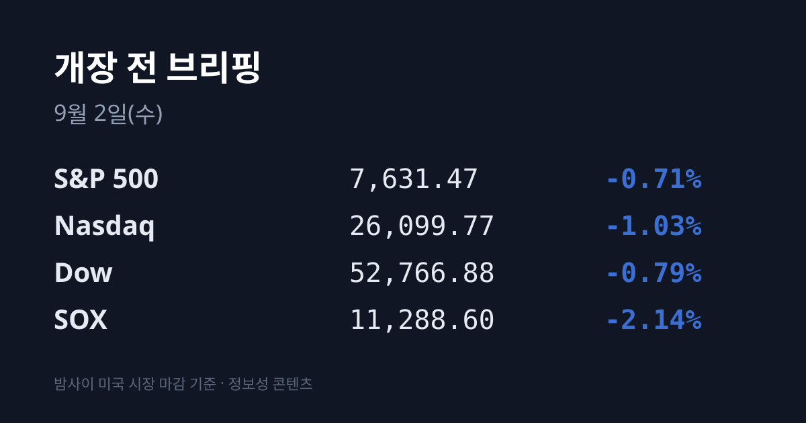
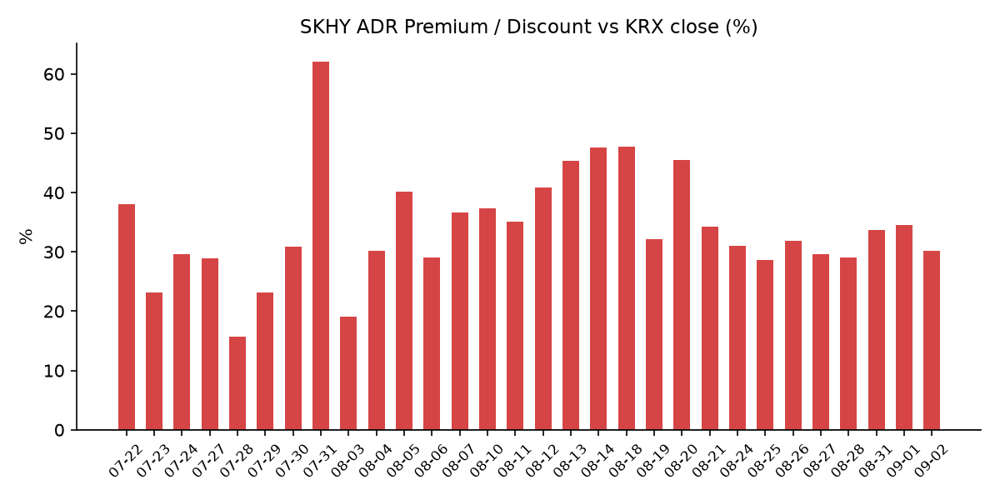
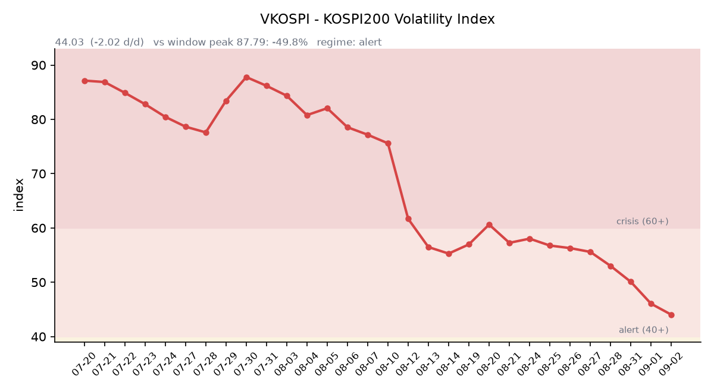

&nbsp;

【① 30초 요약 📈】

미 3대 지수가 밀렸고, 이번에는 반도체가 가장 많이 빠졌습니다. S&P 500 −0.71% · 나스닥 −1.03% · 다우 −0.79%인데 <mark>필라델피아 반도체(SOX)는 11,288.6으로 −2.14%</mark>였습니다. 전날 홀로 버틴 지수가 이번엔 홀로 더 빠졌습니다.

유가가 이틀 연속 +5%입니다. **두바이 $99.91(+$4.92, +5.2%)** · 브렌트 $94.65(+4.6%) · WTI $90.22(+5.2%), 중동産 무르반은 $100을 넘었습니다. <mark>두바이가 브렌트보다 $5.26 비쌉니다</mark> — 한국의 기준유종은 두바이입니다.

08/31 남부 호르무즈에서 초대형 유조선이 **기뢰 2발에 접촉해 화재**가 났습니다. 이란 혁명수비대는 "불법 통항 시도"라며 규칙 위반 선박도 같은 운명을 맞을 것이라 경고했습니다.

<mark>일본 10년물 국채가 3.0%를 터치했습니다 — 1996년 9월 이후 30년 만입니다.</mark> 엔은 개입 임계선으로 통하는 **160/달러** 에 붙어 있습니다.

SKHY ADR은 −2.31%로 본주(+1.14%)와 반대로 갔고, 괴리율이 **+34.55% → +30.14%로 4.41%포인트** 좁혀졌습니다. EWY는 −2.80%였습니다.

미 정규장이 끝난 뒤 <mark>델 테크놀로지스 실적이 나왔습니다 — AI 서버 수주잔고 $95B 사상 최대, 시간외 +9~10%</mark>. HPE +6% · SMCI +2.4%가 따라 올랐습니다.

어제 코스피는 6,835.80(+0.23%)으로 마감했습니다. 3대 투자주체가 전부 순매도인데 **기타법인이 +1조6,892억** 을 사들여 10거래일 연속 순매수를 이었습니다.

&nbsp;

【② 밤사이 미국 시장】

| 지수 | 종가 | 등락률 |
| :--- | ---: | ---: |
| S&P 500 | 7,631.47 | −0.71% |
| 나스닥 | 26,099.77 | −1.03% |
| 다우 | 52,766.88 | −0.79% |
| 필라델피아 반도체(SOX) | 11,288.6 | −2.14% |

먼저 정정할 것이 있습니다. 어제 이 브리핑은 08/31 SOX를 11,472.19(+0.02%)로 적었으나, 인베스팅닷컴 시계열 원본을 다시 확인한 결과 실제 08/31 종가는 **11,535.1(+0.57%)** 이었습니다. 위 −2.14%는 정확한 직전 종가를 기준으로 계산한 값입니다.

밀린 원인은 하나로 좁혀집니다 — <mark>유가와 금리가 동시에, 그리고 이번에는 크게 올랐습니다</mark>. 페트로넷 09/01 확정치로 두바이 $99.91(+$4.92, +5.2%) · 브렌트 $94.65(+$4.16, +4.6%) · WTI $90.22(+$4.46, +5.2%)입니다. 어제가 "+2.8%의 첫 충격"이었다면 이번은 이틀 연속 +5%입니다.

채권은 그 인플레를 그대로 받았습니다. **10년물 4.77%(+2bp, 장중 4.79%로 2025년 1월 이후 최고)** · **30년물 5.26%(+2bp)**. 30년물은 2006년 이후 가장 오래 이 레벨권에 머무는 구간입니다. 미 2년물 09/01 종가는 확보하지 못해 10Y−2Y 스프레드는 산출하지 못했습니다.

그런데 밤사이 새로 등장한 가장 구조적인 소식은 미국이 아니라 일본에서 나왔습니다. 일본 10년물 국채가 3.0%를 터치했습니다. 2년 만에 3배 넘게 올랐고, 시장은 BOJ의 이달 인상을 거의 확실로 가격에 넣었습니다. 일본 정부가 FY2026 예산에서 국채 이자비용을 계산할 때 쓴 장기금리 가정치가 3%였습니다.

역설적으로 미 실물 지표는 약했습니다. **ISM 제조업 8월 54.6** (예상 55.2, 7월 55.6)으로 신규주문·생산·고용·수주잔고가 전부 둔화했고, **JOLTS 7월 구인은 727.1만** (예상 733.0만)이었습니다. 성장 지표가 식는데 금리가 오르는 조합이며, 연준 기대가 아니라 유가·재정 프리미엄이 커브를 밀고 있다는 해석이 나옵니다.

9월 FOMC 인상 확률은 **66.1%** 로 전일 59~62%에서 더 올랐습니다. DXY 99.65(+0.23%) · VIX 16.34(+9.52%) · 금 현물 약 $4,360(−약 2%, 8/19 이후 최저)입니다. 금이 내리는데 달러가 오른 조합이어서 달러발 리스크 회피와는 결이 다릅니다.

그리고 정규장이 끝난 뒤 반대 방향의 큰 숫자가 도착했습니다. <mark>델 테크놀로지스의 FY27 2분기 실적입니다</mark> — 매출 **$46.97B** (예상 $44.92B) · 조정 EPS **$7.04** (예상 $4.87~4.95). AI 최적화 서버 매출이 전년비 2배인 $16.4B, 주문은 $60.9B로 사상 최대, **AI 서버 수주잔고는 $95B로 사상 최대** 입니다. 3분기 가이던스 $49B(컨센 $41.91B) · FY27 $192B(컨센 $173.8B)로 컨센서스를 크게 넘겼습니다. 시간외 +9~10%, HPE +6% · SMCI +2.4%가 동반 상승했습니다. 어제 이 브리핑이 캘린더에 "메모리 원가를 어떻게 언급할지"로 올려둔 건의 결과이며, 델은 메모리 원가 상승을 겪으면서 AI 서버 물량을 2배로 늘렸습니다.

반도체 쪽에서는 방향이 다른 소식도 나왔습니다. **중국 CXMT(창신메모리)가 HBM3E 소량(리스크) 생산을 개시** 했습니다. 알리바바 T-Head·캄브리콘이 평가 중이며 2027년 상용화가 가능하다는 보도입니다. 빅3는 이미 HBM4 양산 단계로 한 세대 앞이지만, 미국의 HBM 수출규제를 우회하는 중국 내 자급 경로가 열립니다.

반대로 대만에서는 미디어텍이 엔비디아와 장기 파트너십을 확대해 **+9.94% 상한가**, TSMC +1.46%로 대만 가권이 아시아에서 유일하게 올랐습니다(+1.78%). 그 밖에 애플은 09/01부로 CEO가 팀 쿡에서 존 터너스로 교체됐고(쿡은 이사회 의장), 팔로알토 네트웍스는 실적이 예상을 넘겼으나 시간외는 보합이었습니다.

&nbsp;

【③ 괴리율 트래커 — SK하이닉스 ADR】

| 항목 | 수치 |
| :--- | ---: |
| SKHY 종가 (09/01) | $160.78 (−2.31%) |
| 적용 환율 (서울 09/01 종가) | 1,370.4원 |
| 본주 환산가 (×10×환율) | 2,203,329원 |
| 본주 직전 종가 (09/01) | 1,693,000원 |
| 괴리율 | +30.14% |

괴리율은 전일 +34.55%에서 **4.41%포인트 좁혀졌습니다.** 산수를 보면 좁혀진 방식이 드러납니다 — 본주는 +1.14% 올랐는데 ADR은 −2.31% 내렸습니다. <mark>즉 본주가 올라가서 메운 것이 아니라 ADR이 내려와서 메웠습니다</mark>. 어제와 정확히 거울상입니다. 최근 밴드는 +28.6~+34.55%이며 오늘의 +30.14%는 그 하단 근처입니다.

같은 방향의 프록시가 하나 더 있습니다. EWY(iShares MSCI South Korea ETF)가 $175.80으로 **−2.80%** 였습니다. 코스피가 +0.23% 오르고 원화가 0.13% 약해진 날의 이론값(약 +0.10%)과 비교하면 약 2.9%포인트 벌어진 값입니다. 다만 시간외는 $175.83(+0.02%)로 하락이 멈췄고, 그 시각에는 델 실적이 이미 공개된 상태였습니다. SKHY 시간외는 $159.25(−0.95%)로 추가 하락했습니다.

구조를 설명하면 이렇습니다. ADR이 본주 환산가보다 비싼 프리미엄 상태에서는 전환 차익거래상 ADR을 팔고 본주를 사는 유인이 생기고, 디스카운트에서는 반대 유인이 생깁니다. 다만 SK하이닉스 ADR은 정식 상장이 아닌 장외 프로그램이어서 전환이 자유롭지 않고, 괴리가 곧바로 메워지지 않습니다.

&nbsp;

【④ 변동성 트래커 🌡️】

<mark>'경보' 유지, 방향은 계속 진정</mark> — VKOSPI 7거래일 연속 하락, 일중 변동폭 5거래일 중 최저, 40선이 눈앞입니다. 반대편에서는 VIX가 +9.5% 올라 두 지수의 격차가 좁혀지고 있습니다.

**기대 변동성** — VKOSPI **44.03** (전일비 **−2.02, −4.39%**). 40~60의 '경보' 구간입니다. **7거래일 연속 하락** 이며 6월 고점 96.94 대비 −54.6%, 평시 상단(25)의 1.76배입니다. 7월 이후 처음으로 '주의'(25~40) 구간의 문턱에 왔습니다. 같은 날 VIX는 16.34(+9.52%)로 올라, 두 지수의 배율이 전일 3.1배에서 **2.7배** 로 좁혀졌습니다.

**실현 변동성** — 최근 7거래일 코스피 일별 등락률은 −3.12% · +0.68% · +0.97% · +1.53% · −1.79% · +0.46% · +0.23%로, ±3.5% 이상 등락일은 0일이었습니다. 최근 5거래일 일중 변동폭 평균은 2.51%이고, **09/01은 1.83%로 5거래일 중 가장 좁았습니다.**

**매매 정지** — 09/01 사이드카·서킷브레이커 발동 여부는 확인하지 못했습니다. 코스피 일중 최대 낙폭이 −1.28%였습니다.

**증폭 경로** — 단일종목 레버리지 ETF의 당일 거래 비중·회전율은 확인하지 못했습니다. 제도 쪽 변화는 ⑦에 정리했습니다.

**청산 압력** — 신용융자 **33조3,380억** (08/28 기준, 9거래일 연속 증가) · 반대매매 470억 · 미수금 9,303억. 09/01 기준치는 아직 공표되지 않았습니다.

**하방 포지션** — 코스피 공매도 순보유 잔고 19조4,480억, 코스닥 7조3,300억(둘 다 08/12 기준). 공매도 잔고는 T+3 공시 지연이 있어 개장 전에는 최신치를 알 수 없습니다.

미확인 항목: 09/01 사이드카·서킷브레이커 발동 여부, 코스피200 야간선물(8일 연속), 레버리지 ETF 당일 회전율, 미 2년물 09/01 종가, 미 10년물 실질금리(TIPS) 09/01치(08/28 확정 2.42%), BDI·CCFI, 프로그램 매매·선물 베이시스, TOPIX·CSI300.

&nbsp;

【⑤ 어제 한국장 리뷰】

| 지수 | 종가 | 등락률 |
| :--- | ---: | ---: |
| KOSPI | 6,835.80 | +0.23% |
| KOSDAQ | 821.25 | −1.56% |

코스피는 6,784.29(−0.52%)로 하락 출발해 장중 **6,732.47(−1.28%)** 까지 밀린 뒤 낙폭을 전부 만회하고 상승 마감했습니다. 이틀 연속 같은 패턴입니다.

수급이 이 회복을 설명합니다. 머니투데이 집계로 코스피에서 **기타법인 +1조6,892억 · 기관 −7,297억 · 외국인 −5,331억 · 개인 −4,222억** 이었습니다(아시아경제 집계는 소스 간 수백억 편차가 있습니다). <mark>3대 투자주체가 전부 순매도인데 지수가 오른 날이 이틀 연속 나왔습니다.</mark> 기타법인은 유가증권시장에서 **10거래일 연속 순매수** 이며, 사유는 삼성전자의 임직원 주식보상 목적 자사주 매입 + SK하이닉스의 소각 목적 매입입니다.

오후 반등의 방아쇠는 지표였습니다. **8월 수출이 982.5억달러(+68.7%)로 역대 3위**, 그중 **반도체가 467억달러(+209%)로 역대 최대** 이며 3개월 연속 400억달러를 넘었습니다. 삼성전자는 **261,000원(+0.38%)**, SK하이닉스는 **1,693,000원(+1.14%)** 으로 마감해 두 종목이 지수 상승에 약 37포인트를 기여했습니다.

업종별로는 유통 +2.98% · 보험 +2.15% · 통신 +0.85%가 오르고, **건설 −3.50%** · 기계·장비 −1.34% · 음식료·담배 −1.24% · 운송장비·부품 −1.19%가 내렸습니다. 건설은 08/31 −3.85%에 이어 이틀 연속 업종 최하위였습니다.

개별 종목에서는 삼성물산 +3.72% · SK스퀘어 +2.89% · 신한지주 +2.02%가 올랐고, **한화에어로스페이스 −3.99%** · LG에너지솔루션 −2.91%가 내렸습니다. 코스닥에서는 알테오젠·에코프로비엠·에코프로(−2.63%)·원익IPS 등 시총 상위 성장주가 눌려 이틀 연속 코스피 대비 상대약세였습니다.

원·달러는 서울 주간 종가 **1,370.4원(+1.8원)** 으로 마감했습니다. 08/31의 1,368.6원(13개월 최저)에서 이틀에 걸쳐 되밀리는 흐름이며, 작성 시각(09/02 07:09 KST) 현재는 **1,374.75원** 입니다.

아시아에서는 대만 가권만 올랐습니다 — 대만 46,948.72(+1.78%) vs 닛케이 66,215.34(−0.15%) · 상해종합 3,979.89(−0.16%) · 항셍 25,329.73(−0.93%).

&nbsp;

【⑥ 오늘의 캘린더 & 관전 포인트 📅】

**오늘 밤(미 장마감 후, 09/03 새벽 KST)** — 브로드컴 FY26 3분기 실적. 회사 가이던스는 매출 약 $29.4B(+84%) · **AI 반도체 약 $16B(+200% 이상)** · 소프트웨어 $8.9B(+31%)이고, FY26 AI 매출 목표는 $56B(+180%)입니다. 같은 날 HPE·넷앱·브라운포먼도 발표합니다.

**오늘 밤** — 미 8월 ADP 민간고용(예상 +4.7만명), 미 7월 공장주문, 연준 베이지북. ADP 발표 시각은 교차 확인이 되지 않아 특정하지 않습니다(통상 21:15 KST).

**09/03** — 미 8월 ISM 서비스업 PMI · 주간 신규 실업수당.

**09/04** — 미 8월 고용보고서.

**09/15~16** — FOMC. 현 목표범위 3.50~3.75%, 시장 반영 인상 확률 66.1% · 동결 33.9%.

**9월 중** — BOJ 회의. 일본 10년물이 3.0%를 터치하며 시장이 이달 인상을 거의 확실로 반영했고, 엔은 160/달러에 있습니다.

**09/08** — 캐나다의 대미 보복관세(200억달러) 발효.

**9월 IPO 일정** — 9월은 수요예측 11곳·일반청약 10곳으로 공모금액이 1,876억 → **4,721억원(2.5배)** 으로 늘었습니다. 청약은 네오사피엔스 **09/10~11** · 와이즈플래닛컴퍼니 **09/14~15** · 빅웨이브로보틱스 **09/15~16** · 덕산넵코어스·글로벌테크놀로지 **09/16~17** · 브릴스 **09/17~18** · 엘리스그룹 **09/18~21** (9월 최대어, 공모 2,011억) 순입니다. 09/14~21에 청약이 집중됩니다.

**9월 중** — 선물·옵션 동시만기(네 마녀의 날).

**10월** — 한은 금통위(현 기준금리 3.00%).

**11/19 / 11/21** — SK하이닉스 40조원 자사주 취득 종료 / 삼성전자 15조원 자사주 매입 종료.

시장이 주시하는 레벨(방향 판단 없이 레벨만): 두바이유 $100과 브렌트-두바이 역전의 해소 여부, SKHY ADR 괴리율 +28%와 +33%, 원·달러 1,368원과 1,380원, 미 10년물 4.70%와 4.85%, 30년물 5.35%, 일본 10년물 3.0%, 엔 160, VKOSPI 40과 48. 그리고 호르무즈 해협의 통항 상태 — 추가 기뢰 접촉이나 통항 차단이 확인되는지가 유가 레벨 전체를 다시 놓는 변수로 거론됩니다.

&nbsp;

【⑦ 정책 워치 ⚡】

단일종목 레버리지 ETF·ETN 매매수량단위가 1주(1증권)에서 **20주(20증권)로 상향** 됩니다. 한국거래소가 '유가증권시장 업무규정 시행세칙' 개정안을 마련해 시장 의견을 수렴했고, 당초 11월 시행이었으나 과열을 조기에 진정시켜야 한다는 지적에 따라 이르면 9월로 앞당겨집니다.

신규 개인투자자는 08/19부터 5거래일 이상, 하루 1시간씩 총 5시간의 모의거래를 의무 이수해야 합니다. 20주에 미달하는 기존 소수 단주는 LP(유동성공급자) 증권사가 시가로 매입해 일괄 정리하는 절차가 논의되고 있습니다.

공매도 제도 자체는 전면 재개 상태가 유지되고 있으며, 9월 들어 제도 변경은 확인되지 않았습니다. 메모리 가격 쪽에서는 DDR4 8Gb 고정거래가가 **$24로 역대 최고** 를 유지하고 있고, 서버 DDR5 RDIMM 2분기 계약가는 +49.7% QoQ, HBM 2026년 계약가는 +20%로 집계됐습니다.

&nbsp;

【⑧ 오늘의 질문】

정규장 종가가 정해진 뒤에 도착한 델의 AI 서버 수주잔고 $95B가 SOX −2.14%와 EWY −2.80%가 매긴 가격보다 무거운 정보였는가, 그리고 10거래일 연속 들어온 자사주 물량이 이틀 연속 되돌림 뒤에도 같은 규모로 들어올 것인가.

&nbsp;

본 글은 공개된 시장 데이터를 정리한 정보성 콘텐츠이며, 특정 종목·상품의 매매 권유가 아닙니다. 모든 투자 판단과 책임은 투자자 본인에게 있습니다. 수치는 작성 시점 기준이며 이후 변동될 수 있습니다.

&nbsp;

#개장전브리핑 #미국증시마감 #하이닉스ADR #괴리율 #VKOSPI #코스피 #반도체 #두바이유 #호르무즈 #델실적

&nbsp;