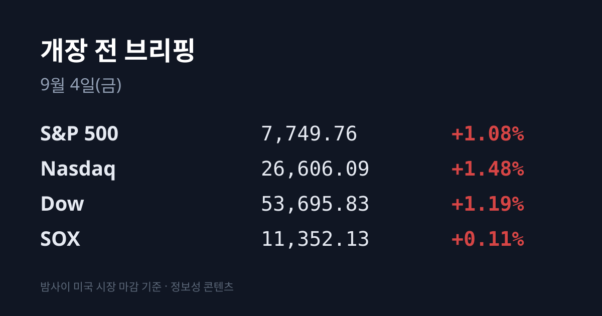
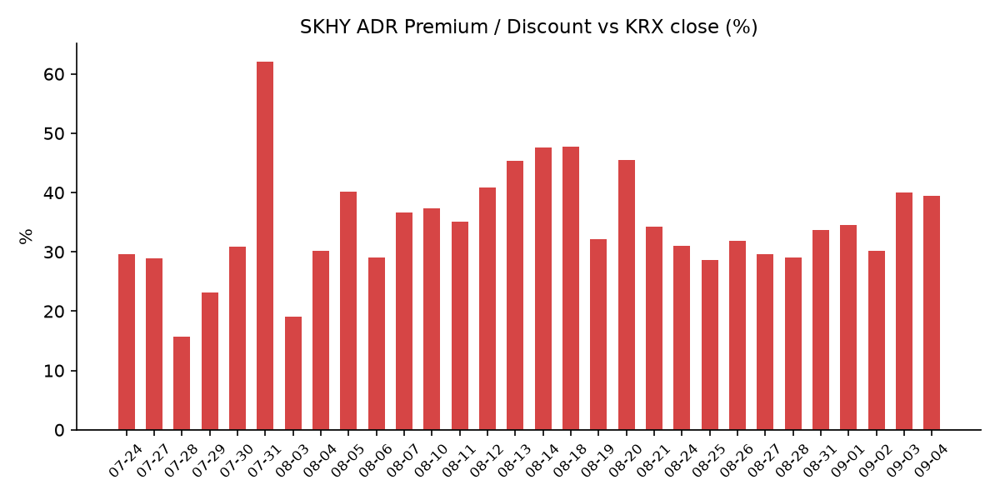
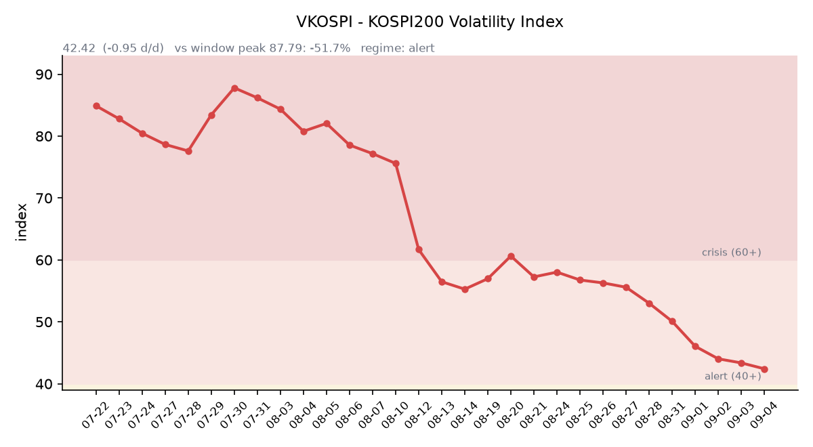

&nbsp;

【① 30초 요약 📈】

미 3대 지수가 크게 올랐습니다. S&P 500 **+1.08%**, 나스닥 **+1.48%**, 다우 **+1.19%** 였습니다. 그런데 <mark>필라델피아 반도체(SOX)는 11,352.13(+0.11%)에 그쳤습니다</mark> — 나스닥의 13분의 1입니다.

방아쇠는 크리스토퍼 월러 연준 이사였습니다. "다음 2주 데이터가 지금 흐름을 이어가면 9월에 금리를 현 수준에 유지하는 쪽으로 기울겠다"고 밝혔고, <mark>CME FedWatch 9월 인상 확률은 약 50.3%로 내려왔습니다</mark>. 조건으로는 **09/11 발표될 8월 CPI**를 지목했습니다.

어제 코스피는 6,579.48(**+0.26%**)로 마감했는데, <mark>개인·외국인·기관이 모두 판 날에 기타법인이 1조5,936억원을 순매수</mark>해 지수를 떠받쳤습니다. 코스닥은 −1.71%로 800선을 내줬습니다.

SK하이닉스 ADR 괴리율은 **+39.40%로** 전일(+39.99%)과 거의 같았습니다. 지수 프록시인 EWY는 +0.95%였는데, 이는 코스피 등락(+0.26%)과 원화 강세(0.69%)로 계산되는 이론값과 사실상 같은 수치입니다.

한국의 기준유종인 <mark>두바이유가 $102.19로 $100을 넘었습니다</mark>. 같은 날 브렌트는 $95.52(페트로넷 기준)로 **브렌트-두바이 역전 폭이 $6.67까지** 벌어졌습니다.

&nbsp;

【② 밤사이 미국 시장 🌙】

| 지수 | 종가 | 등락률 |
| :--- | ---: | ---: |
| S&P 500 | 7,749.76 | +1.08% |
| 나스닥 | 26,606.09 | +1.48% |
| 다우 | 53,695.83 | +1.19% |
| 필라델피아 반도체(SOX) | 11,352.13 | +0.11% |

지수는 크게 올랐지만 오른 자산군이 갈렸습니다. 상승을 만든 것은 소프트웨어·플랫폼이었습니다. **스노우플레이크가 +20.9%로** 마감했는데(시간외 한때 +23.14%), 2분기 매출 $15.5억으로 시장 예상 $14.8억을, 조정 EPS $0.62로 예상 $0.45를 넘겼고 가이던스도 올렸습니다. **로빈후드는 +16.3%**, **테슬라는 +7.1%** 였습니다. 반대로 **브로드컴은 −2.5~2.8%로** 반도체 업종을 눌렀습니다 — 4분기 총매출 가이던스 $348억이 시장 예상 $350.3억에 미달했기 때문입니다. 급락 종목으로는 울트라제닉스(RARE) −44.0%, 캠벨스 −8.73%, 타이슨푸드 −7.27%가 있었습니다.

가장 큰 개별 뉴스는 엔비디아였습니다. **엔비디아가 허깅페이스를 $129억에 인수한다고 확정 발표**했습니다(주주 몫 $119억, 임직원 유지용 지분 $10억). 허깅페이스는 개발자 1,800만 명·기업 20만 곳이 사용하는 오픈 AI 모델·데이터셋 허브로, 이번 인수는 엔비디아 역사상 두 번째로 큰 거래입니다(1위는 지난해 말 그록 자산 $200억). 거래 종결은 내년 상반기로 예정됐고, 양측은 플랫폼을 독립·오픈·컴퓨트 중립으로 유지한다고 밝혔습니다. 엔비디아 주가는 3%대 올랐습니다. 다만 인수 대상은 칩이나 메모리가 아니라 **소프트웨어 플랫폼**이라는 점을 함께 볼 필요가 있습니다.

금리 쪽 배경은 연준 인사의 발언이었습니다. **크리스토퍼 월러 연준 이사**가 "앞으로 2주간 나올 데이터가 지금의 디스인플레이션 흐름을 이어가면 9월 회의에서 연방기금금리를 현 수준(3.50~3.75%)에 유지하는 쪽으로 기울겠다"고 말했고, 결정의 조건으로 **09/11 발표되는 8월 CPI**를 명시했습니다. 미 10년물은 **4.767%(−2.7bp)** 로 이틀째 내렸고, 2년물은 4.340%로 10년–2년 스프레드는 약 +42.7bp, 30년물은 5.252%였습니다. 10년물 실질금리(TIPS)는 09/02 기준 2.45%로 08/27 2.34%에서 완만히 올라온 상태이며 09/03치는 공표 전입니다. CME FedWatch 기준 **9월 FOMC 인상 확률은 약 50.3%로** 집계됐습니다.

같은 날 발표된 8월 ISM 서비스업 지수는 **55.4**(시장 예상 54.1, 7월 대비 +1.3p)로 예상을 크게 웃돌았고, 주간 신규 실업수당 청구는 20만6천건(예상 20만5천건), 7월 무역적자는 886억달러였습니다. 지표는 강했지만 금리는 내렸습니다.

원자재는 반대 방향이었습니다. 국제유가는 하루 만에 상승세를 되찾아 **브렌트 $95.82(+1.01%)**, **WTI $91.70(+1.04%)** 로 마감했습니다(작성 시각 브렌트 $95.92, WTI $91.76). 한국석유공사 페트로넷 기준 **두바이유는 09/03에 $102.19(+$0.21)** 로 $100을 넘었고, 같은 자료의 브렌트 $95.52와 비교하면 **역전 폭이 $6.67입니다**. 한국이 실제로 수입하는 원유가 브렌트보다 비싼 상태가 이어지고 있습니다. 금은 선물 기준 **$4,526.20(+2.53%)** 로 크게 올랐고 현물은 약 $4,490이었습니다. 금이 오르는 동안 달러인덱스는 99.51(−0.05%)로 거의 움직이지 않았고 명목금리는 내렸는데, 이는 금과 달러가 함께 오르는 순수한 위험회피 국면과는 다른 조합입니다. VIX는 **14.52(−4.47%)** 로 더 내렸습니다.

미국 밖에서는 어제까지의 기록 행진이 한 걸음 물러섰습니다. 09/02에 1996년 이후 최고인 3.015%를 찍었던 <mark>일본 10년물 국채금리가 2.965%로 되내려왔습니다</mark>(−4.5bp). 일본 30년물은 4.095%(−6.0bp)였습니다. 다만 엔은 반대로 강해졌습니다 — **USD/JPY는 155.84**(작성 시각 155.88)로, 09/01 무렵 언급되던 약 160(개입 임계선) 수준에서 2.6%가량 엔 강세로 이동했습니다(중간 경로는 이번 회차에 확인하지 않았습니다).

작성 시각(07:08 KST) 미 지수선물은 S&P 500 선물 7,749.25(−0.07%), 나스닥100 선물 29,493.00(−0.11%), 다우 선물 53,723.00(−0.04%)이었습니다.

&nbsp;

【③ 괴리율 트래커 — SK하이닉스 ADR 📊】

| 항목 | 수치 |
| :--- | ---: |
| SKHY 종가 (09/03) | $163.68 (−0.79%) |
| SKHY 시간외 | $162.76 (−0.56%) |
| 본주 환산가 (×10×1,359.3원) | 2,224,902원 |
| 본주 직전 종가 (09/03) | 1,596,000원 |
| **괴리율** | **+39.40%** |
| 전일 괴리율 | +39.99% |

괴리율은 전일 +39.99%에서 **+39.40%로** 0.59%포인트 좁혀졌습니다. 이틀 연속 +39%대에 머문 셈입니다. 트래커 최고치는 07/31의 +62.0%이고, 그다음이 08/20의 +45.5%입니다. 최근 밴드였던 +28.6~+34.55%보다는 여전히 높은 자리입니다.

괴리율의 구조적 의미는 이렇습니다. 프리미엄(+)은 미국에서 거래되는 ADR 가격이 한국 본주보다 높다는 뜻이고, 전환 차익거래 구조상 본주 쪽에 매수 유인이 생기는 상태입니다. 반대로 디스카운트(−)는 본주 쪽에 매도 유인이 생깁니다. 다만 SK하이닉스 ADR은 정식 상장이 아닌 장외 프로그램이어서 전환이 자유롭지 않고, 괴리가 곧바로 메워지지 않는다는 점을 함께 봐야 합니다.

지수 전체를 보는 프록시인 **EWY(iShares MSCI South Korea ETF)** 는 $180.56(**+0.95%**)으로 마감했고 시간외에는 $179.89(−0.37%)로 되밀렸습니다. 여기서 산수를 한 번 해볼 수 있습니다. 어제 코스피는 +0.26%였고 원화는 0.69% 강해졌으므로, 달러로 환산한 한국 주식의 이론적 변화는 약 +0.95%입니다. <mark>EWY 실제 등락률도 +0.95%였습니다</mark>. 전날(09/02) 같은 계산에서는 이론값과 실제 사이에 약 5.6%포인트의 격차가 있었는데, 이번에는 그 격차가 사실상 없습니다. SKHY 쪽도 이론값(본주 −1.05% + 원화 0.69% ≈ −0.36%) 대비 실제 −0.79%로 0.43%포인트 낮았습니다.

&nbsp;

【④ 변동성 트래커 🌡️】

**판정 한 줄**: <mark>'경보' 유지, 기대 변동성은 9거래일 연속 진정 — 그런데 어제 코스피의 실제 일중 진폭은 243포인트(3.7%)였습니다</mark>. 옵션시장이 매긴 변동성과 시장이 실제로 움직인 폭이 갈라져 있는 구간입니다.

**기대 변동성** — VKOSPI **42.42**(전일비 −0.95, **−2.19%**). **40~60이 '경보'** 구간입니다(25 미만 평시 / 25~40 주의 / 40~60 경보 / 60 이상 위기). **9거래일 연속 하락**이며 6월 고점 96.94 대비 **−56.2%**, 평시 상단(25)의 **1.70배** 수준입니다.

**실현 변동성** — 09/03 코스피 **+0.26%**, 09/02 −3.99%, 09/01 +0.23%. 다만 어제는 종가 등락률만으로는 하루가 설명되지 않습니다. 시가 6,650.33(+1.33%)으로 열려 장중 저점 6,439.49(**−1.88%**)까지 밀렸다가 고점 6,682.97을 찍고 +0.26%로 끝났습니다. **고점과 저점의 차이가 243.48포인트**, 전일 종가 대비 3.7%였습니다. 이번 회차에서 종가 기준 ±3.5%를 넘긴 날은 09/02 하루입니다.

**증폭 경로** — 단일종목 레버리지 ETF의 당일 거래 비중·회전율은 집계 시점 기준 미확인입니다. 제도 측면에서는 매매수량단위가 1주에서 20주로 바뀌는 조치가 9월에 앞당겨 시행됩니다.

**청산 압력** — 신용융자 잔고 **33조3,380억원**(08/28 기준, 9거래일 연속 증가), 위탁매매 미수금 반대매매 470억원, 미수금 9,303억원(모두 08/28 기준)입니다. 그 이후 4거래일 — 09/02의 −3.99% 급락과 09/03의 3.7% 일중 진폭을 포함한 — 수치는 아직 공표되지 않았습니다.

**하방 포지션** — 공매도 순잔고는 코스피 19조4,480억원, 코스닥 7조3,300억원입니다. **T+3 공시 지연으로 08/12 기준**이라는 점을 명시합니다.

미확인 항목: 코스피200 야간선물, 레버리지 ETF 당일 거래 비중·회전율, 08/31~09/03 기준 신용융자·반대매매·미수금, 프로그램 매매 차익·비차익, 선물 베이시스, 10년물 실질금리 09/03치.

&nbsp;

【⑤ 어제 한국장 리뷰 🇰🇷】

| 지수 | 종가 | 등락 |
| :--- | ---: | ---: |
| 코스피 | 6,579.48 | +16.76 (**+0.26%**) |
| 코스닥 | 790.21 | −13.77 (**−1.71%**) |

코스피와 코스닥이 정반대로 움직였습니다. 코스피는 시가 6,650.33(+1.33%)으로 출발해 장중 6,439.49(−1.88%)까지 밀렸다가 되돌아 소폭 상승으로 끝났고, 코스닥은 800선을 내줬습니다. 같은 날 아시아 주요 지수는 모두 소폭 상승이었습니다 — 닛케이 64,455.83(+0.20%), 대만 가권 46,178.81(+0.015%), 상해종합 3,959.19(+0.45%), 항셍 25,408.42(+0.39%). 09/02에 −1.67~−3.99%씩 빠졌던 것에 비하면 되돌림 폭은 작았습니다.

**실제 수급 확정치.** 코스피에서 <mark>기타법인이 1조5,936억원을 순매수</mark>했고, 나머지 세 주체는 모두 순매도였습니다 — 개인 9,551억원, 외국인 4,193억원(다른 집계 4,232억원), 기관 2,152억원. 미래에셋증권은 "개인·외국인·기관의 동반 매도가 이뤄졌고 기타법인 매수만 버팀목 역할을 해줬다"고 분석했습니다. 외국인 순매도는 08/31 4,435억원, 09/01 5,331억원, 09/02 1조9,093억원에 이어 **나흘째**이며 규모는 09/02 대비 크게 줄었습니다. 장중 급락은 오후 2시 전후 금융투자·연기금의 매도 물량이 확대되면서 나왔습니다.

**업종·개별 종목.** 상승 업종 상위는 **KRX 보험 +3.65%(1위)**, **KRX 은행 +2.51%(2위)**, 그리고 건설 +3.45%, 전기·가스 +3.22%였습니다. 개별로는 **KB금융 +5.20~6.03%**(집계별 편차), 신한지주 +3.62~3.71%, **LG에너지솔루션 +5.18%**, 현대차 +1.46%였습니다. 은행·보험의 강세 배경으로는 금리 상승에 따른 이자이익·자산운용수익 개선 기대가 지목됐습니다.

반면 반도체는 부진했습니다 — **삼성전자 250,000원(−0.20%)**, **SK하이닉스 1,596,000원(−1.05%)**, 삼성전기 −3.71%. 하락 업종은 섬유·의류 −1.56%, 통신 −1.38%, 제약 −0.96%였습니다. 코스닥에서는 시가총액 상위 10개 종목 중 7개가 내렸고, 대장주 **알테오젠이 283,000원(−5.19%)** 으로 낙폭이 컸습니다(심텍·원익IPS도 약세).

**원/달러 환율.** 어제 서울 외환시장 주간 종가는 **1,359.3원**(전일 대비 −9.4원, −0.69%)이었습니다. 작성 시각(09/04 07:09 KST) 현재값은 **1,356.26원으로** 어제 주간 종가보다 3.04원 낮습니다. 09/02 종가 1,368.7원부터 세면 이틀 누적 12.44원(−0.91%) 원화 강세입니다.

&nbsp;

【⑥ 오늘의 캘린더 & 관전 포인트 📅】

오늘 일정

**09/04 21:30 KST** — 미 8월 고용보고서(비농업고용·실업률). 한국장 마감(15:30) 이후에 발표됩니다. 09/02 발표된 8월 ADP 민간고용은 +3.8만명(예상 +4.7만)으로 1월 이후 최저였습니다. 이번 회차 컨센서스 수치는 미확인입니다.

이번 주~이달

**09/08** — 캐나다의 대미 보복관세(200억달러) 발효
**09/11 21:30 KST** — 미 8월 소비자물가지수(CPI). 월러 연준 이사가 9월 결정의 조건으로 명시적으로 지목한 지표입니다.
**09/15~16** — FOMC (인상 확률 약 50.3%, 현 목표범위 3.50~3.75%). 결과 발표는 09/17 03:00 KST.
**9월 중** — 일본은행(BOJ) 회의. 09/03에 일본 10년물이 2.965%로 되내려온 뒤의 인상 확률은 이번 회차에 갱신하지 않았습니다.
**9월 중** — 선물·옵션 동시만기
**9월(조기 시행)** — 단일종목 레버리지 ETF·ETN 매매수량단위 1주 → 20주
**9월 IPO 일정**(공모금액 4,721억원, 전년비 2.5배): 네오사피엔스 청약 09/10~11, 와이즈플래닛컴퍼니 09/14~15, 빅웨이브로보틱스 09/15~16, 덕산넵코어스·글로벌테크놀로지 09/16~17, 브릴스 09/17~18, 엘리스그룹(공모 2,011억) 수요예측 09/09~15 → 청약 09/18~21. 09/10~21에 청약이 집중됩니다.
**10월** — 한국은행 금통위 (08/27 인상으로 기준금리 3.00%)
**11/19** — SK하이닉스 40조원 자사주 취득 종료 / **11/21** — 삼성전자 15조원 자사주 매입 종료

시장이 주시하는 레벨 (방향 판단이 아닌 참고 레벨)

시장 참가자들은 원/달러 **1,350원** 선을 주시하고 있습니다. 작성 시각 1,356.26원입니다.
두바이유 **$100** 선은 09/03에 $102.19로 넘어섰습니다. 브렌트-두바이 역전 폭 $6.67이 함께 언급됩니다.
SK하이닉스 ADR 괴리율에서는 **+34%** 와 **+40%** 가 최근 밴드(+28.6~+34.55%)와의 경계로 언급됩니다.
USD/JPY **155~160** 구간이 엔캐리 관련 레벨로 언급됩니다. 09/03 종가는 155.84입니다.
미 10년물 **4.75%** 와 **4.82%** 가 언급되는 레벨입니다.
VKOSPI에서는 '주의' 구간 경계인 **40** 이 언급됩니다. 어제 종가는 42.42입니다.
코스닥 **800** 선은 어제 790.21로 내준 자리입니다.

&nbsp;

【⑦ 정책 워치 ⚡】

**공매도 제도** — 코스피200·코스닥150 종목을 대상으로 한 부분 재개가 유지되고 있습니다. 2026년부터 기관·법인 투자자의 공매도 전산 시스템 구축이 의무화돼 한국거래소 중앙점검시스템(NSDS)과 실시간으로 연동되며, 상환기간은 90일 단위 연장·최대 12개월, 현금 담보비율은 개인·기관 모두 105%로 통일돼 있습니다. 불법 공매도 이익에 대해서는 3~5배의 벌금이 부과되고 부당이득이 5억원을 넘으면 가중처벌 대상입니다. 이번 회차에 제도 변경은 없었습니다.

**호르무즈 해협** — 미국이 이란의 선박 공격에 동일하게 대응한다는 <mark>"유조선에는 유조선으로(tanker for tanker)" 원칙</mark>을 새로 세우고, 09/01 이란 정부 소속 유조선 2척을 공격했습니다. 트럼프 대통령이 승인한 조치로 전해졌습니다. 앞서 08/31에는 호르무즈를 빠져나가던 유조선 2척이 피격됐으며, 그중 한 척은 장금상선이 용선한 '세네갈 프로스페리티'호(라이베리아 선적)였습니다(해양수산부는 한국 국적선이 아니고 한국인 선원도 없었다고 밝혔습니다). 이란 최고지도자 모즈타바 하메네이는 해협 봉쇄를 계속하겠다고 밝혔고, 현재 유조선 통항은 사실상 중단된 상태입니다.

**미중** — 반도체 관세 2차 라운드의 발표일은 여전히 미정입니다.

&nbsp;

【⑧ 오늘의 질문 ❓】

밤사이 미국에서 오른 것은 소프트웨어였고 반도체는 제자리였는데(나스닥 +1.48% vs SOX +0.11%), 어제 코스피를 올린 것도 반도체가 아닌 은행·보험이었습니다. 그 은행·보험의 재료였던 금리 상승 기대는 월러 발언으로 약해진 상태입니다. 오늘 지수를 움직이는 자리는 어디가 될까요.

&nbsp;

#개장전브리핑 #미국증시마감 #하이닉스ADR #괴리율 #코스피 #코스닥 #반도체 #VKOSPI #두바이유 #FOMC

&nbsp;

본 글은 공개된 시장 데이터를 정리한 정보성 콘텐츠이며, 특정 종목·상품의 매매 권유가 아닙니다. 모든 투자 판단과 책임은 투자자 본인에게 있습니다. 수치는 작성 시점 기준이며 이후 변동될 수 있습니다.