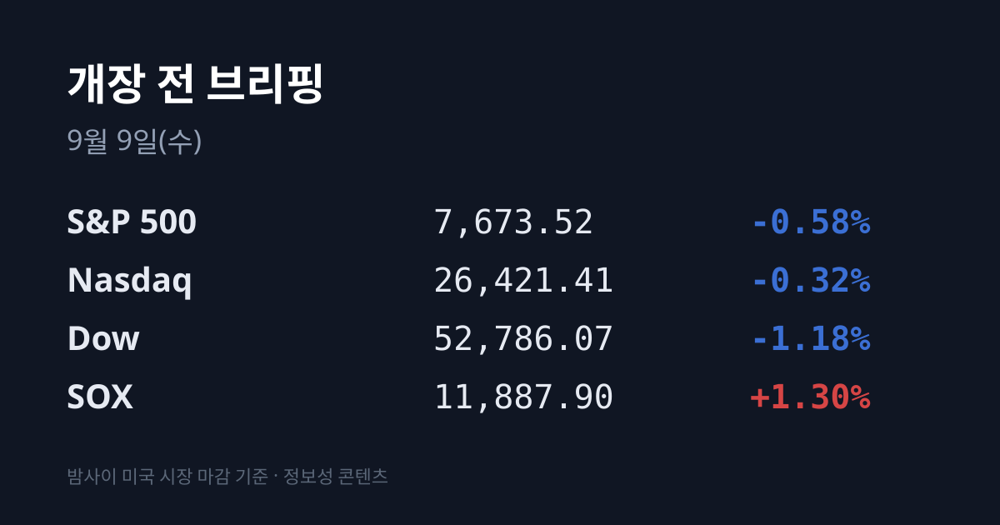
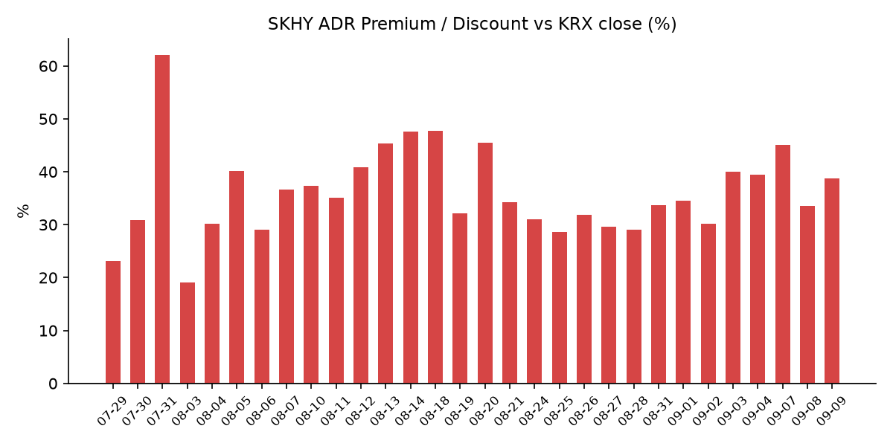
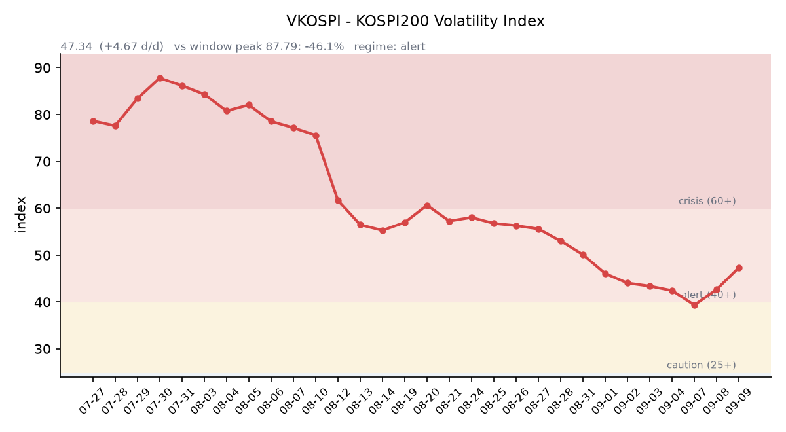

&nbsp;

【① 30초 요약 📈】

노동절로 이틀 쉰 뉴욕이 09/08 재개장했고, 지수와 반도체가 갈렸습니다. 다우 −1.18% · S&P 500 −0.58% · 나스닥 −0.32%로 3대 지수가 모두 내린 날에 <mark>필라델피아 반도체지수(SOX)만 152.6포인트, **+1.30% 올랐습니다.**</mark>

하락 동인은 반도체가 아니라 유가였습니다. 후티가 사우디 아람코 시설 등 남부 에너지 인프라를 드론·탄도미사일로 타격해 최소 73명이 부상했고, 자잔 정제시설(40만b/d)을 포함한 일부 설비가 가동을 멈췄습니다. 브렌트는 장중 **$99.46까지** 올라 7월 23일 이후 최고를 기록했습니다.

한국의 기준유종에 더 크게 찍혔습니다. 페트로넷 최신 게시치로 <mark>두바이유 $109.71이 브렌트($97.92)보다 **$11.79** 비싼 역전 상태</mark>이며, 직전 브리핑 시점의 역전폭 $5.63에서 하루 만에 두 배 이상 벌어졌습니다.

SK하이닉스 ADR과 본주의 격차가 벌어졌습니다. 본주가 어제 한국장에서 +0.56%로 끝난 뒤 밤사이 SKHY가 +4.83% 올라, 괴리율이 +33.56%에서 **+38.7%로** 5.1%포인트 확대됐습니다.

어제 코스피는 장중 7,171.52까지 오른 뒤 6,954.52(−0.58%)로 마감했습니다. 15거래일 만에 7,000선을 되찾았으나 안착에 실패했고, 일중 변동폭은 3.16%였습니다. VKOSPI는 <mark>47.34로 이틀 연속 두 자릿수 상승</mark>했습니다.

원/달러는 밤사이 되내려왔습니다. 어제 서울 주간 종가 1,345.6원에서 작성 시각 07:14 KST 현재 **1,340.06원** 입니다.

&nbsp;

【② 밤사이 미국 시장】

| 지수 | 종가 | 등락률 |
| :--- | ---: | ---: |
| S&P 500 | 7,673.52 | −0.58% |
| 나스닥 종합 | 26,421.41 | −0.32% |
| 다우존스 | 52,786.07 | −1.18% |
| 필라델피아 반도체(SOX) | 11,887.90 | **+1.30%** |
| 러셀 2000 | 2,960.20 | −0.52% |

노동절 연휴로 09/07 전면 휴장했던 뉴욕이 09/08 재개장했습니다. 3대 지수는 모두 내렸고 경기민감 성격이 강한 다우가 −1.18%로 가장 부진했습니다. 연초 대비로는 러셀 2000 +19.3% · 나스닥 +13.7% · S&P 500 +12.1% · 다우 +9.8%입니다.

작성 시각 07:11 KST 기준 지수선물은 S&P 500 7,679.25(−0.02%) · 나스닥100 29,525.00(−0.05%) · 다우 52,819(−0.02%)로 세 종목 모두 보합권입니다.

하락 요인으로는 이란과의 교전 격화에 따른 국제유가 상승이 지목됐습니다. 미·캐나다 무역 갈등도 함께 거론됐습니다. 브렌트가 장중 $99.46까지 오르며 인플레이션 우려가 되살아났고, 이번 주 물가 지표와 다음 주 연준 결정을 앞둔 경계감이 겹쳤습니다.

반면 반도체는 갈라섰습니다. SOX는 전 거래일 종가 11,735.30에서 152.6포인트 오른 11,887.90으로 마감했습니다. 시장에서는 오픈AI의 신모델 'GPT-6 아스트라' 출시 이후 토큰 사용량 증가와 AI 인프라 확대 기대, 그리고 엔비디아의 허깅페이스 인수(129.3억달러, 약 17.5조원, 09/03 발표·2027년 상반기 완료 예정)가 반도체 투자심리를 받쳤다는 해석이 나옵니다.

같은 오픈AI 재료가 소프트웨어에는 반대로 작용했습니다. 09/08 미 세션에서 **서비스나우 −5% · 세일즈포스 −4% · 인튜이트 −4%** 가 빠졌고, 사유로는 오픈AI 신모델이 전문 소프트웨어가 제공해온 영역을 대체할 수 있다는 우려의 재점화가 거론됐습니다. 이 밖에 암젠이 BMO캐피털의 밸류에이션 근거 등급 하향에 −8%, 보스턴사이언티픽은 8월 25일 사이버 침해 사고로 매출·조정 EPS 가이던스 달성이 어렵다고 밝혔습니다.

채권·외환·상품 쪽은 미 10년물 4.79%(보합) · 30년물 5.2480%(−0.6bp) · 2년물 4.37%·10Y−2Y +42bp(09/04 기준)입니다. 30년물은 2007년 이후 최고 구간에 머물러 있고, 베센트 재무장관이 10~30년물 국채 바이백 확대를 발표했으나 시장에서는 지속 효과에 회의적이라는 반응이 나왔습니다.

VIX는 15.72(+2.75%, 전일 15.30), 달러인덱스는 09/08 종가 98.86 이후 작성 시각 98.82입니다. 금은 $4,367.90(−0.84%)으로 $4,400 아래에서 마감했습니다. 금이 내리는 동안 달러도 내렸으므로 달러 요인으로는 설명되지 않고, 시장에서는 25bp 인상 확률(CME FedWatch 기준 58.7%)과 장기금리 수준이 금을 눌렀다는 해석이 나옵니다. 10년물 실질금리(TIPS)는 09/04 기준 2.43%가 최신치이며 09/08치는 집계 시점 기준 미게시입니다.

원유는 후티가 사우디 남부 아브하·카미스무샤이트·자잔·나즈란의 아람코 시설과 에너지 인프라를 공격해 최소 73명이 부상했고, 자잔 정제시설(40만b/d)이 표적에 포함됐습니다. 사우디 에너지부는 일부 시설과 유틸리티의 가동 중단을 확인했습니다. 브렌트는 장중 $99.46까지 올랐고 9월 들어 8% 이상 상승했습니다. 페트로넷 최신 게시치는 두바이 $109.71(+$4.32) · 브렌트 $97.92(+$0.92) · WTI $93.03(+$1.55)입니다. 골드만삭스는 중동 해운 차질이 2027년까지 이어질 것으로 봤다고 전해졌습니다.

&nbsp;

【③ 괴리율 트래커 — SK하이닉스 ADR】

| 항목 | 수치 |
| :--- | ---: |
| SKHY 종가 | $185.55 (+4.83%) |
| 본주 환산가 (×10×환율) | 2,486,481원 |
| 본주 직전 종가 | 1,793,000원 |
| **괴리율** | **+38.7%** |

환율은 작성 시각 07:14 KST 현재 원/달러 1,340.06원을 적용했습니다. SKHY 시간외는 $185.30(−0.13%, 18:18 ET)입니다.

괴리율은 어제 +33.56%에서 **+38.7%로** 5.1%포인트 확대됐습니다. 확대의 산수는 단순합니다. 본주는 어제 한국장에서 +0.56%로 끝났는데, 그 뒤 열린 미국장에서 ADR은 +4.83% 올랐습니다. 같은 회사에 두 개의 가격이 붙어 있고, 그중 ADR이 더 최근에 매겨진 가격입니다.

프리미엄(+)은 ADR이 본주보다 비싸다는 뜻이고, 전환 차익거래 구조에서는 이 상태가 본주 쪽에 매수 유인을, 디스카운트(−)는 매도 유인을 만듭니다. ADR 1주는 본주의 10분의 1에 해당하므로 환산가는 ADR 종가에 10을 곱하고 다시 원/달러를 곱해 계산합니다. SKHY는 2026년 7월 10일 나스닥에 정식 상장됐으며, 공모가는 주당 $149, 공모 규모는 약 280억달러(약 43조원)로 외국 기업의 미국 IPO 가운데 역대 최대 규모였습니다.

레벨 자체는 이례적인 값이 아닙니다. 괴리율 +38.7%는 이 트래커의 39거래일 중 11위이며, 최고치는 07/31의 +62.0%입니다.

밤사이 한국 시장 전체의 프록시인 EWY(iShares MSCI South Korea ETF)는 $189.91(+0.55%, 거래량 1,424.8만주)로 마감했습니다. 다만 SKHY와 EWY 모두 비교 기준이 되는 전 거래일 종가가 09/04치입니다. 미국이 09/07 휴장했기 때문에, 두 프록시의 등락률은 한국의 09/07(+4.61%)과 09/08(−0.58%) 두 세션을 한꺼번에 담고 있습니다. 단일 세션 기준으로 읽을 수 없는 값이라는 점을 함께 밝힙니다.

&nbsp;

【④ 변동성 트래커 🌡️】

판정 한 줄: <mark>'경보' 유지, 방향은 악화 — VKOSPI가 이틀 연속 두 자릿수로 올라 47.34가 됐고, 어제 실현 일중 변동폭 3.16%가 최근 5거래일 평균 2.49%를 크게 넘었습니다.</mark>

**기대 변동성** — VKOSPI 47.34(전일비 **+4.67**, +10.94%). 40~60 구간이므로 '경보'입니다(25 미만 평시 / 25~40 주의 / 40~60 경보 / 60 이상 위기). 09/04 39.33 → 09/07 42.67 → 09/08 47.34로 2세션 누적 +20.4%이며, 이틀 연속 두 자릿수 상승률입니다. 6월 고점 96.94 대비로는 −51% 수준이고, 평시 상단(25)의 1.9배입니다. 장중 레인지는 44.36~47.45였습니다. 어제 코스피가 0.58% 내리는 동안 기대 변동성은 10.94% 올랐습니다. 미국의 VIX 15.72와 비교하면 3.0배입니다.

**실현 변동성** — 최근 6거래일 코스피 일별 등락률은 09/01 +0.23% · 09/02 −3.99% · 09/03 +0.26% · 09/04 +1.64% · 09/07 +4.61% · 09/08 −0.58%입니다. ±3.5% 이상 등락일은 **2일**(09/02, 09/07)입니다. 일중 변동폭((고가−저가)÷종가)은 09/08이 **3.16%**(7,171.52~6,951.78)로, 최근 5거래일 평균 2.49%를 웃돌았습니다.

**증폭 경로** — 단일종목 레버리지 ETF의 당일 거래 비중·회전율은 집계 시점 기준 미확인입니다. 제도 쪽으로는 단일종목 레버리지 ETF·ETN의 매매수량단위가 1주에서 20주로 9월 조기 시행됩니다.

**청산 압력** — 6거래일간 갱신되지 않던 집계가 09/04 기준으로 공표됐습니다. 신용거래융자 잔고 **33.60조원**(전일 대비 +537억원, 4거래일 연속 증가), 투자자예탁금 **93.55조원**(−4.21조원, 1월 16일 이후 최저), 위탁매매 미수금 1.05조원(+612억원), 반대매매 260억원(반대매매 비중 2.6%)입니다. 직전 확보치였던 08/28 기준 반대매매 47억원과 비교하면 5.5배 규모입니다.

**하방 포지션** — 공매도 순잔고는 T+2~3 공시 지연으로 개장 전 확인이 구조적으로 불가능한 항목입니다. 집계 시점 기준 최신치가 아직 반영되지 않았습니다.

집계 시점 기준 미확인 항목: 코스피200 야간선물 방향(13거래일 연속), 레버리지 ETF 거래 비중·회전율, 프로그램 매매 차익·비차익 및 선물 베이시스, 미 2년물·10Y−2Y 스프레드의 09/08 갱신치, 10년물 실질금리 09/08치, 공매도 순잔고.

&nbsp;

【⑤ 어제 한국장 리뷰】

| 지수 | 종가 | 등락 |
| :--- | ---: | ---: |
| KOSPI | 6,954.52 | −40.87p (−0.58%) |
| KOSDAQ | 811.88 | −10.31p (−1.25%) |

어제 코스피는 시가 7,045.79(+0.72%)로 출발해 장중 **7,171.52**(+2.52%)까지 올랐습니다. 15거래일 만의 7,000선 회복이었으나 오후에 상승분을 모두 반납하고 저가 6,951.78 부근인 6,954.52로 마감했습니다. 오전 강세의 재료로는 오픈AI 신모델발 AI 반도체 기대가, 오후 반전의 재료로는 중동 지정학 리스크와 국제유가 급등에 따른 차익 실현이 지목됐습니다.

반도체 두 종목은 장중 고점을 지키지 못했습니다. 삼성전자는 장중 279,000원(+3.33%)까지 올랐다가 **269,500원(−0.19%)** 으로, SK하이닉스는 장중 1,889,000원(+5.95%)까지 올랐다가 **1,793,000원(+0.56%)** 으로 마감했습니다. 두 종목의 합산 코스피 시총 비중은 50%에 육박합니다.

수급은 외국인과 기관이 4거래일 연속 함께 순매수했습니다. 코스피에서 외국인 +6,316억~+6,483억원, 기관 +6,427억~+6,429억원, 개인 −3조332억~−3조3,300억원입니다(집계 기관별 편차를 병기했습니다). 전 거래일 외국인·기관이 각각 2조5,000억원대를 순매수했던 것과 비교하면 규모는 약 4분의 1로 줄었습니다.

업종별로는 **IT서비스 −3.2%** · 의료·정밀기기 −2.1% · 운송장비·부품 −1.8% · 제약 −1.6%가 약세였고, 에너지·정유는 소폭 올랐습니다. 보험도 약세로 DB손해보험이 −2.65%였습니다.

대형주 확정치는 삼성전기 1,370,000원(−5.78%) · 현대차 385,000원(−2.04%) · 삼성SDI 1,440,000원(−1.77%) · KB금융 173,700원(−1.25%) · 삼성물산 382,000원(−0.52%)입니다. 삼성전기 등 전기·전자 부품주 약세의 사유로는 장중 엔화 강세폭 확대와 차익 실현 매물이 거론됐습니다.

상승 쪽은 원전이 이끌었습니다. **미국 내 원전 8기 건설(총 1,300억달러 규모)** 이 3,500억달러 대미투자 패키지에 담긴다는 소식이 재료였습니다. 8기 중 6기는 웨스팅하우스 AP1000, 2기는 한국수력원자력의 APR1400 모델로 거론됐고, 미국에 원전 시공 역량을 갖춘 기업이 사실상 없어 한수원·두산에너빌리티·현대건설 등으로 설계·주기기·시공·정비 전반의 발주 기대가 확산됐습니다. 한전기술 142,600원(+16.60%) · 두산에너빌리티 91,100원(+3.64%, 장중 6%대 상승) · 한신기계 +10.74%였고, 코스닥에서 오르비텍 +29.83%와 서전기전 +29.80%가 상한가로 마감했습니다.

코스닥에서는 상한가가 6종목 나왔습니다(빛과전자 +30.00%, 거래량 4,180만주). 현대약품 +23.99% · SM바이오셀 +23.53%였고, 매기가 원전·제약·건설·유통 시스템 관련 종목으로 분산됐습니다. 카프로는 상장폐지 확정으로 −94.95%였습니다.

원/달러는 서울 주간 종가 1,345.6원으로, 전 거래일 1,340.5원 대비 5.1원 올랐습니다. 5거래일 연속 하락 뒤의 반등이며 유가 상승이 원인으로 지목됐습니다. 다만 작성 시각 07:14 KST 현재는 1,340.06원(−0.37%, 당일 레인지 1,339.90~1,340.21)으로 되내려와 있습니다.

아시아는 갈렸습니다. 닛케이225 65,269.33(−1.70%, 엔화 강세와 중동 불안) · 대만 가권 47,105.78(−0.47%) · 상해종합 3,940.55(+0.20%, 수출 호조) · 항셍은 마감 10여 분 전 −0.39% 수준이었습니다. TOPIX와 CSI300은 집계 시점 기준 미확인입니다. USD/JPY는 153.72(−0.41%, 전일 154.35)입니다.

&nbsp;

【⑥ 오늘의 캘린더 & 관전 포인트 📅】

오늘(09/09)

**21:30~** 미 10년물 국채 입찰 (30년물은 09/10). 10년물 4.79% · 30년물 5.25%(2007년 이후 최고 구간)에서 진행됩니다.

엘리스그룹 수요예측 시작(09/09~15) — 9월 최대어로 거론됩니다. 222.2만주, 희망 밴드 70,400~90,500원, 공모 규모 1,564억~2,011억원, 미래에셋증권·삼성증권 주관. 공모금 중 1,263억원이 AI PMDC 인프라 조성에 배정됐습니다.

네오사피엔스 청약 마감(09/08~09). 진행 중 수요예측은 글로벌테크놀로지 09/07~13 · 빅웨이브로보틱스 09/07~11 · 덕산넵코어스 09/08~14 · 브릴스 09/09~15입니다.

이번 주 이후

**09/10(목)** 한국 선물·옵션 동시만기(네 마녀의 날) — 각 결제월 두 번째 목요일 규정에 따릅니다.

**09/10 21:30** 미 8월 PPI / 09/10 미 장마감 후(09/11 새벽 KST) 오라클·어도비 실적 — 오라클의 AI 클라우드 백로그와 데이터센터 수요가 이번 주 최대 신호로 거론됩니다.

<mark>**09/11 21:30** 미 8월 CPI</mark> — 7월이 전년비 3.4%로 두 달 연속 둔화한 뒤이며, 유가가 6주 최고 수준인 상태에서 발표되는 첫 물가 지표입니다.

**09/15~16** FOMC(결과 09/17 03:00 KST, 점도표 동시 공개). CME FedWatch 기준 25bp 인상 확률 58.7%, 현 목표범위 3.50~3.75%입니다. 워시 의장은 PCE가 12개월 3.7%·6개월 4.1%라는 점을 "우려"로 언급했습니다.

**09/18** 한미 원전 8기 최종 서명(MOU) 거론일 / 미국 쿼드러플 위칭 / 엘리스그룹 청약 시작(09/18~21).

**11/19** SK하이닉스 자사주 취득 종료 / **11/21** 삼성전자 자사주 매입 종료, 10월 한은 금통위.

시장이 주시하는 레벨 (방향 판단이 아닌 참고 수치입니다)

원/달러 1,350원과 1,335원 — 어제 서울 종가 1,345.6원, 현재 1,340.06원 사이에 두 레벨이 놓여 있습니다.

브렌트 $100과 두바이 $112 — 어제 브렌트 장중 고점은 $99.46, 두바이 최신 게시치는 $109.71입니다.

ADR 괴리율 +40%와 +33% — 현재 +38.7%입니다.

VKOSPI 50과 42 — 현재 47.34입니다.

코스피 7,171.52 — 어제 장중 고점이자 지키지 못한 자리입니다. 어제 장중 저점은 6,951.78입니다.

&nbsp;

【⑦ 정책 워치 ⚡】

한미 원전 협력 — 미국 내 원전 8기(총 1,300억달러)가 3,500억달러 대미투자 패키지에 포함되는 방향으로 협의됐고, 최종 서명(MOU) 시점이 이르면 09/18로 거론됩니다. 8기 중 6기는 웨스팅하우스 AP1000, 2기는 한수원 APR1400입니다.

미 국채 시장 — 베센트 재무장관이 10~30년물 대상 바이백 운영 확대를 발표했습니다. 차입비용이 급등하거나 시장 유동성이 악화되면 개입할 준비가 돼 있다는 신호로 읽혔으나, 대규모 재정적자·물가 지속·발행 부담 때문에 지속 효과에는 회의적이라는 반응이 함께 나왔습니다.

공매도 제도 — 코스피200·코스닥150 부분 재개가 유지되고 있습니다. 2026년부터 기관·법인의 전산 시스템 의무화(NSDS 실시간 연동), 상환 90일 단위·최대 12개월, 담보비율 105% 통일이 적용됩니다.

단일종목 레버리지 ETF·ETN — 매매수량단위가 1주에서 20주로 9월 중 조기 시행됩니다.

&nbsp;

【⑧ 오늘의 질문】

어젯밤 미국이 반도체와 유가를 동시에 올려 보낸 뒤, 한국 시장은 어느 쪽 가격을 먼저 읽을 것인가.

&nbsp;

본 글은 공개된 시장 데이터를 정리한 정보성 콘텐츠이며, 특정 종목·상품의 매매 권유가 아닙니다. 모든 투자 판단과 책임은 투자자 본인에게 있습니다. 수치는 작성 시점 기준이며 이후 변동될 수 있습니다.

&nbsp;

#개장전브리핑 #미국증시마감 #하이닉스ADR #괴리율 #코스피 #반도체 #SOX #VKOSPI #두바이유 #원전주

&nbsp;