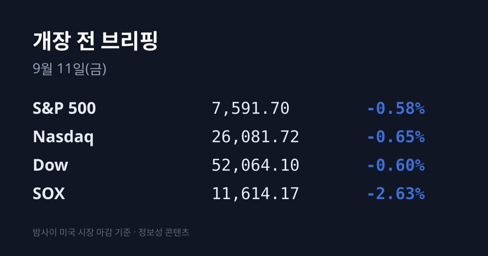
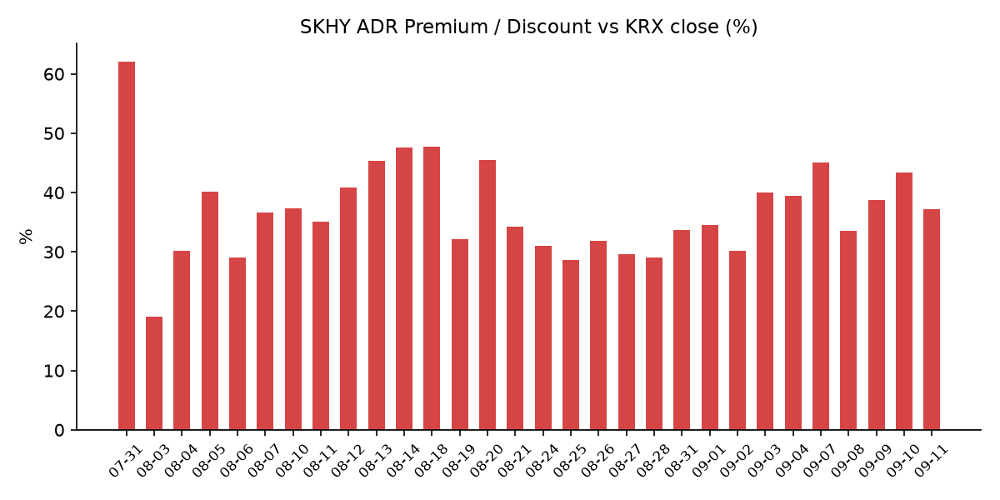
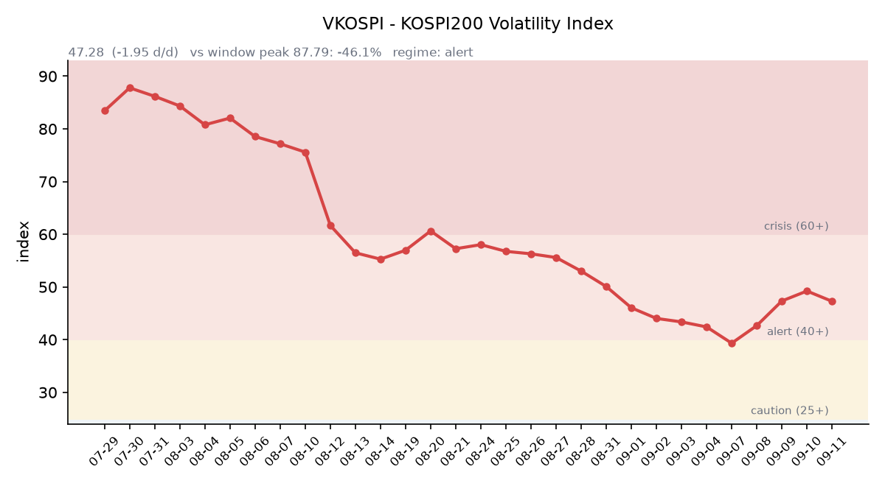

&nbsp;

【① 30초 요약 📈】

미 3대 지수가 4거래일 연속 내렸습니다. S&P 500 −0.58% · 나스닥 −0.65% · 다우 −0.60%. <mark>필라델피아 반도체지수(SOX)는 −2.63%로 이틀 연속 홀로 오르던 흐름이 뒤집혔습니다</mark>.

미 8월 생산자물가(PPI)가 **전년비 +5.4%**(전월 4.8%)로 나온 뒤 미 10년물 국채금리가 **4.943%까지** 올랐습니다. 약 3년 만의 최고이고, 30년물은 **5.35%로** 2007년 6월 이후 최고입니다.

CME FedWatch 기준 다음 주 FOMC **25bp 인상 확률이 70%** 가 됐습니다. PPI 발표 직전은 61%였습니다.

브렌트유가 +6.34% 올라 $107.63, WTI는 +6.69% $102.48로 5월 이후 첫 $102 종가였습니다. 다만 한국 기준유종 두바이유는 **$121.49로** 소폭 내려 브렌트와의 역전폭이 $20.80에서 **$13.86으로** 줄었습니다.

<mark>한국 ETF인 EWY가 −4.19%, SK하이닉스 ADR(SKHY)이 −5.20%</mark>였습니다. 어제 한국장 마감(15:30) 이후 열린 미국 세션에서 일어난 일입니다.

미 장마감 후 <mark>오라클이 시장 예상을 크게 웃도는 실적을 내며 시간외 +6.23% 올랐습니다</mark>. 잔여 수행의무(RPO)가 $6,640억으로 컨센서스($6,306억)를 $334억 상회했습니다.

어제 코스피는 7,033.92(−0.25%)로 마감했습니다. 장중 저점은 6,898.45였고, 외국인이 코스피에서 **2조5천억원 규모를 순매도**했습니다. 코스닥은 836.92(+0.79%)였습니다.

오늘 밤 21:30 미 8월 소비자물가(CPI)가 발표됩니다.

&nbsp;

【② 밤사이 미국 시장 🌙】

| 지수 | 종가 | 등락률 |
| :--- | ---: | ---: |
| S&P 500 | 7,591.70 | −0.58% |
| 나스닥 | 26,081.72 | −0.65% |
| 다우존스 | 52,064.10 | −0.60% |
| 필라델피아 반도체(SOX) | 11,614.17 | −2.63% |

3대 지수가 4거래일 연속 내렸고 러셀2000도 −1.04%였습니다. 이틀 연속 홀로 올랐던 SOX가 하루 만에 −2.63%로 뒤집힌 것이 어제와 가장 크게 달라진 점입니다. 마벨·인텔·램리서치가 각각 3% 내렸고 엔비디아는 −1%였습니다.

출발점은 물가 지표였습니다. 미 8월 생산자물가(PPI)는 전월비 +0.4%로 예상에 부합했지만, 전년비로는 +5.4%가 나왔습니다. 전월 4.8%에서 올라간 값이고 예상보다 0.1%포인트 높습니다. 근원 PPI는 전년비 4.6%(전월 4.3%)였습니다. 상승분의 4분의 3 이상이 최종수요 에너지(+4.2%)에서 나왔고, **경유 가격이 한 달에 +24.1%** 뛴 것이 주된 기여였습니다.

그 결과 금리가 뛰었습니다. 미 10년물이 10bp 오른 4.943%로 약 3년 만의 최고를 기록했고, 2년물은 4.55%(2년여 최고), 30년물은 6bp 오른 5.35%로 2007년 6월 이후 최고입니다. 10년–2년 스프레드는 +39.3bp입니다.

보도는 반도체 하락의 원인으로 개별 업황이 아니라 **장기 조달금리 상승에 대한 노출**을 지목했습니다. 금리가 오르면 먼 미래 이익의 현재가치가 깎이므로, 성장 프리미엄이 큰 종목이 먼저 눌리는 구조입니다.

유가는 다시 크게 올랐습니다. 브렌트 11월물이 +6.34% 올라 $107.63(장중 $108 상회 후 반납), WTI 10월물이 +6.69% $102.48로 5월 이후 첫 $102 종가였습니다.

배경은 중동입니다. 보도에 따르면 이란은 미국의 해상봉쇄에 물러서지 않고 자국 영토 공격이 계속되면 보복을 확대하겠다고 시사했고, 미·이란 양측이 장기전을 대비하는 국면으로 전해졌습니다. 천연가스와 경유 가격도 함께 급등했습니다.

물가와 유가가 겹치자 정책 기대가 움직였습니다. CME FedWatch 기준 9월 15~16일 FOMC의 25bp 인상 확률이 70%로 올라섰습니다(PPI 직전 61%). 12월 추가 인상 확률도 60% 부근으로 거론됩니다. <mark>VIX는 18.05 수준으로, 28거래일간 유지됐던 14~17 박스를 위로 벗어났습니다</mark>(장중 18.17).

한편 금 현물은 온스당 $4,407.30으로 1.2% 내렸고 은은 −5.42%였습니다. 달러인덱스는 98.75로 보합(−0.05%)입니다. 금이 내리는 동안 명목금리가 오르고 달러는 움직이지 않았다는 조합은, 안전자산으로의 도피가 확산된 것이 아니라 금리 상승이 금을 눌렀다는 쪽에 가깝습니다. 은의 −5.42%는 유동성 청산 색이 짙은 움직임입니다.

미 정규장 마감 후 실적 — 어제 예고했던 두 건의 결과가 나왔습니다.

오라클은 FY2027 1분기 조정 EPS $1.92(예상 $1.74), 매출 $193.5억(예상 $191.4억)으로 상회했습니다. 클라우드 매출이 전년비 +62% 늘어 $116억이었고, **잔여 수행의무(RPO)가 $6,640억으로 컨센서스 $6,306억을 $334억 상회**했습니다. 분기 중 최대 100억달러 규모의 국방부 계약도 확보했습니다. 연간 가이던스는 조정 EPS $8.10·매출 최소 $900억으로 제시했고, 주가는 시간외 +6.23%($162.47)였습니다.

어도비는 FQ3 EPS $6.13(예상 $6.08), 매출 $67.6억(예상 $66.9억)으로 사상 최대 3분기를 기록하고 연간 목표를 상향했지만, 경쟁 우려에 시간외 −2%였습니다.

작성 시각(07:08 KST) 미 지수선물은 S&P 500 7,601.25(+0.04%) · 나스닥100 29,139.25(+0.01%) · 다우 52,077(−0.03%)로 3종 모두 보합권입니다.

&nbsp;

【③ 괴리율 트래커 — SK하이닉스 ADR】

| 항목 | 수치 |
| :--- | ---: |
| SKHY 종가 | $188.30 (−5.20%) |
| SKHY 시간외 | $188.60 (+0.16%) |
| 본주 환산가 (×10×환율 1,349.73) | 2,541,542원 |
| 본주 직전 종가 (09/10) | 1,853,000원 |
| **괴리율** | **+37.16%** |
| 전일 괴리율 | +43.35% |
| 41거래일 트래커 순위 | 16위 (최고 +62.0%, 07/31) |

SKHY는 어제 $188.30으로 −5.20%였습니다. 그저께 +7.05% 급등한 것을 상당 부분 되돌린 움직임입니다. 괴리율은 +43.35%에서 **+37.16%로 6.2%포인트 축소**됐습니다. 축소의 원인은 두 갈래인데, ADR 가격이 내린 것이 주된 요인이고 환율 상승(1,339.20 → 1,349.73)은 반대로 환산가를 밀어 올리는 방향이었습니다.

괴리율이 플러스라는 것은 본주가 ADR 환산가보다 싸게 거래되고 있다는 뜻입니다. SK하이닉스 ADR은 본주 10주에 해당하므로, ADR 가격 × 10 × 원/달러 환율이 본주로 환산한 가격이 됩니다. 이 값이 본주 종가보다 높으면 프리미엄(+), 낮으면 디스카운트(−)입니다.

프리미엄 구간에서는 구조상 본주를 사서 ADR로 전환하려는 차익거래 유인이 생기고, 디스카운트 구간에서는 그 반대 방향의 유인이 생깁니다. 현재 +37.16%는 41거래일 트래커에서 16위이며, 최고치는 7월 31일의 +62.0%입니다.

함께 볼 지표가 하나 더 있습니다. EWY(iShares MSCI South Korea ETF)는 어제 $182.78로 −4.19%였고 시간외에는 $182.97(+0.10%)였습니다. 그저께 EWY가 +0.46%에 그쳐 하이닉스 단일 종목의 상승이었던 것과 달리, <mark>어제는 한국 시장 전체를 대표하는 ETF가 −4.19%로 함께 밀렸습니다</mark>.

ADR과 EWY는 모두 한국장이 닫힌 뒤 미국 투자자가 한국 자산에 매긴 가격이라, 어제 한국 종가에는 반영되지 않은 정보입니다.

&nbsp;

【④ 변동성 트래커 🌡️】

판정 한 줄: <mark>'경보' 유지, 국내 기대변동성은 진정·미국 기대변동성은 이탈</mark> — VKOSPI는 3세션 연속 상승을 끝내고 −3.96% 내렸지만, 같은 밤 VIX가 28거래일간 지켜 온 14~17 박스를 위로 벗어났습니다.

기대 변동성: VKOSPI **47.28**(전일비 **−1.95**, −3.96%). 레짐 구간은 40~60 = 경보입니다(25 미만 평시 / 25~40 주의 / 40~60 경보 / 60 이상 위기). 42.67 → 47.34 → 49.23으로 3세션 연속 올랐던 흐름이 어제 꺾였습니다. 6월 고점 96.94 대비 −51.2%이고, 평시 상단(25)의 **1.9배** 수준입니다. 선물·옵션 동시만기를 통과하면서 진폭 기대가 처음으로 내려온 것으로 읽힙니다. 다만 미국 쪽은 반대 방향이었습니다 — VIX 18.05는 28거래일 박스 상단(17)을 넘어선 값이고 장중 고점은 18.17이었습니다.

실현 변동성: 최근 7거래일 코스피 종가 등락률은 09/02 −3.99% · 09/03 +0.26% · 09/04 +1.64% · 09/07 +4.61% · 09/08 −0.58% · 09/09 +1.40% · 09/10 −0.25%였습니다. ±3.5% 이상 등락일은 2일입니다. 일중 변동폭(고가−저가)/종가는 최근 5거래일 평균 **2.241%** 입니다(09/10 2.48% · 09/09 2.05% · 09/08 3.16% · 09/07 1.82% · 09/04 1.70%). 어제는 장중 저점 6,898.45까지 −2.2% 밀린 뒤 종가 7,033.92로 되돌렸습니다.

증폭 경로: 단일종목 레버리지 ETF의 어제 거래 비중·회전율은 집계 시점 기준 미확인입니다. 제도 쪽으로는 매매수량단위가 1주에서 20주로 확대되는 조치가 9월 중 시행됩니다.

청산 압력: 신용융자 잔고는 33.3조원(8월 31일 기준)이 확보된 최신치이고, 9월 갱신치는 집계 시점 기준 미확인입니다. 이 기준일 이후 코스피는 6,562.72에서 7,033.92로 7.2% 올랐습니다. 위탁매매 미수금 반대매매 금액도 9월분은 미확인입니다.

하방 포지션: 공매도 순잔고는 T+2~3 공시 지연이 있어 개장 전에는 확정치를 알 수 없습니다.

미확인 항목: 코스피200 야간선물 방향(15거래일 연속), 레버리지 ETF 거래 비중·회전율, 프로그램 매매 차익·비차익과 선물 베이시스, 10년물 실질금리(TIPS) 09/10치, 신용융자·반대매매 9월 갱신치, VIX 확정 종가(집계처별로 17 상회~18.05로 갈립니다), BDI 09/10치.

&nbsp;

【⑤ 어제 한국장 리뷰 🇰🇷】

| 지수 | 종가 | 등락률 |
| :--- | ---: | ---: |
| 코스피 | 7,033.92 | −0.25% |
| 코스닥 | 836.92 | +0.79% |

어제 코스피는 7,038.85로 출발해 장중 6,898.45까지 −2.2% 밀렸다가 7,033.92로 마감했습니다. 고가는 7,072.79였습니다. 코스닥은 836.92(+6.55p, +0.79%)로 올랐습니다.

수급의 규모가 컸습니다. 코스피에서 <mark>외국인이 2조4,907억원을 순매도</mark>했고(집계처에 따라 2조7,140억원으로도 보도됩니다), 기관 +4,615억원, 개인 +3,622억원이었습니다. 개인·기관 수치는 집계처별로 편차가 크게 나타나(개인 +2조5,420억, 기관 +1,580억으로도 집계) 확정치는 오늘 이후 정리됩니다. 코스닥에서는 개인 −890억원, 외국인 +520억원, 기관 +430억원이었습니다.

어제는 선물·옵션 동시만기(네 마녀의 날)와 한국거래소 섹터지수 정기변경이 같은 종가에 걸린 날이었습니다. 예고된 물량은 SK하이닉스 약 1조2,440억원·삼성전자 약 2,068억원의 매도 수요와, 한미반도체 약 3,064억원·주성엔지니어링 약 1,795억원의 매수 수요였습니다. 결과는 이렇습니다.

매도 측: SK하이닉스 1,853,000원(−0.16%) · 삼성전자 269,000원(−0.19%) — 시총 1·2위 종목이 거의 움직이지 않고 물량을 흡수했습니다.

매수 측: **주성엔지니어링 221,000원(+7.02%)** · **한미반도체 253,000원(+1.00%)** — 예고된 방향으로 나타났습니다.

외국인 순매도 규모가 컸던 배경에는 이 정기변경이 있습니다. 해외에 설정된 인덱스 추종 자금의 기계적 매도가 외국인 계정으로 집계되기 때문입니다. 변경된 지수는 오늘(9월 11일)부터 적용됩니다.

그 외 대형주는 현대차 −1.24%, 기아 −0.89%였습니다. 코스닥에서는 상한가 11종목이 나왔습니다(알파칩스·원익피앤이·더코디가 각각 +29.9%대, 드림어스컴퍼니 +28.78%). 반도체·2차전지·엔터·교육·산업재에 걸쳐 개별 재료 중심의 순환매가 나타난 하루였습니다.

원/달러 환율은 서울 외환시장 주간 종가 1,339.20원으로 4.3원 내렸습니다. 다만 밤사이 흐름이 반대로 돌아, 작성 시각(07:09 KST) 현재 **1,349.73원**입니다. 어제 주간 종가보다 **10.5원 높은 수준**입니다. 달러인덱스가 보합(−0.05%)인데 원화만 밀린 형태로, 통상 이런 조합의 배경으로는 유가 상승에 따른 수입 결제 수요와 외국인 자금 유출이 함께 거론됩니다.

&nbsp;

【⑥ 오늘의 캘린더 & 관전 포인트 📅】

오늘 (9월 11일 금)

**21:30 KST** — 미 8월 소비자물가(CPI). 시장 예상은 전월비 +0.4%(7월 +0.1%), 전년비 3.4% 유지, 근원 전월비 +0.2%·전년비 2.5%에서 2.4%입니다. 국제유가가 배럴당 100달러를 넘어선 뒤 처음 발표되는 CPI이고, 다음 주 FOMC를 앞둔 마지막 핵심 물가 지표입니다.

한국거래소 섹터지수 변경분 적용 개시 — 어제 종가에 소화된 리밸런싱의 반대편(재편입 종목 비중 확대)이 오늘부터 지수에 반영됩니다.

다음 주 이후

**09/15~16:** FOMC. FedWatch 기준 25bp 인상 확률 70%, 결과 발표는 09/17 03:00 KST이고 점도표가 동시 공개됩니다.

**09/18:** 미국 쿼드러플 위칭. 한미 원전 8기 최종 서명 거론일이기도 합니다.

**09/09~15:** 엘리스그룹 수요예측(222.2만주, 밴드 70,400~90,500원, 공모 규모 1,564~2,011억원, 청약 09/18~21, 납입 09/23). 진행 중인 공모는 글로벌테크놀로지 09/07~13 · 덕산넵코어스 09/08~14 · 브릴스 09/09~15입니다.

**09/30:** 마이크론 FQ4'26 실적.

**10월:** 한국은행 금융통화위원회 / 인텔 PC용 CPU 최대 10% 인상 예정.

**11/19:** SK하이닉스 자사주 취득 종료 / **11/21:** 삼성전자 자사주 매입 종료.

⚡ 시장이 주시하는 레벨 (방향 판단이 아니라 참가자들이 지켜보는 수치입니다)

미 10년물 5.00% — 어제 4.943%로 문턱 바로 아래입니다.

원/달러 1,360원 — 현재 1,349.73원입니다.

브렌트 $112, 그리고 두바이–브렌트 역전폭 $20 — 어제 역전폭은 $13.86으로 줄었습니다.

VKOSPI 52 — 어제 47.28입니다.

SK하이닉스 ADR 괴리율의 방향 — 어제 +37.16%로 6.2%포인트 축소됐습니다.

개장 30분 내 외국인 순매도 페이스 — 어제 2조5천억원 규모가 정기변경에 따른 기계적 매도였는지가 확인되는 지점으로 거론됩니다.

대만 가권지수의 시초 방향 — 대만·일본도 어제 미국 세션 이후의 재평가를 아직 반영하지 않았습니다.

&nbsp;

【⑦ 정책 워치 🏛️】

단일종목 레버리지 ETF·ETN 매매수량단위 1주에서 20주 확대가 9월 중 시행됩니다. 금융당국은 초단기 매매를 억제해 변동성을 줄이는 효과를 기대한다고 밝혔습니다. 신규 개인 투자자에 대해서는 8월 19일부터 하루 1시간씩 5일, 총 5시간의 사전 모의거래 교육이 의무화됐습니다.

공매도 제도(직전 확보치 기준, 9월 갱신 정보는 미확인): 코스피200·코스닥150 부분 재개가 유지되고 있고, 기관·법인의 전산화 의무(NSDS 실시간 연동), 상환 90일 단위·최대 12개월, 담보비율 105% 통일이 적용 중입니다.

해운 운임: BDI는 9월 9일 기준 3,620(+1.00%)으로 52주 최고치(3,628) 부근입니다. 발틱거래소 확정이 런던 오후라 게시가 하루 밀리는 구조적 지연이 있어 09/10치는 미확인입니다.

&nbsp;

【⑧ 오늘의 질문 ❓】

<mark>어제 한국장이 닫힌 뒤 미국이 매긴 값(EWY −4.19%)과, 그 뒤에 나온 오라클의 AI 발주 잔고(RPO $6,640억) 중 어느 쪽이 오늘 오전 반도체 호가에 먼저 반영될 것인가.</mark>

&nbsp;

본 글은 공개된 시장 데이터를 정리한 정보성 콘텐츠이며, 특정 종목·상품의 매매 권유가 아닙니다. 모든 투자 판단과 책임은 투자자 본인에게 있습니다. 수치는 작성 시점 기준이며 이후 변동될 수 있습니다.

&nbsp;

#개장전브리핑 #미국증시마감 #하이닉스ADR #괴리율 #코스피 #코스닥 #VKOSPI #반도체 #미국CPI #오라클실적

&nbsp;