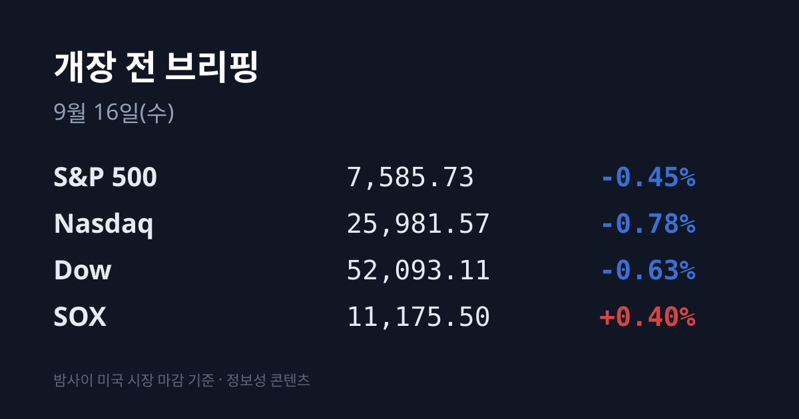
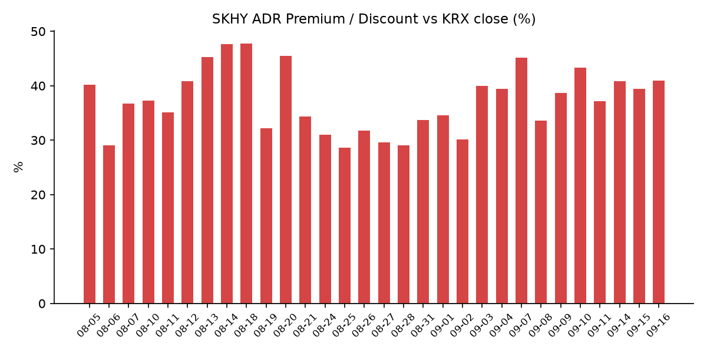
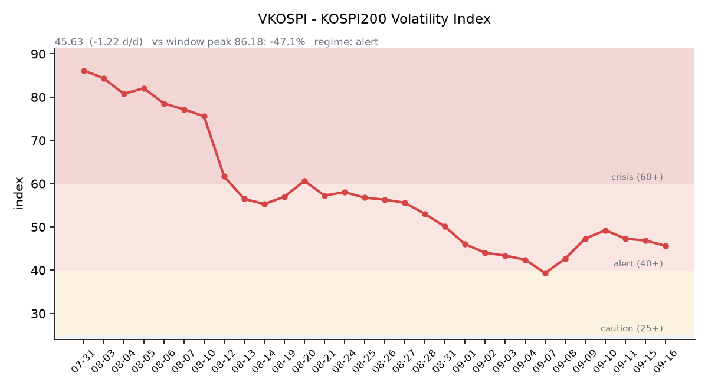

&nbsp;

【① 30초 요약 📈】

전날 −5.86% 급락했던 <mark>필라델피아 반도체지수(SOX)가 +0.40%로 되돌렸습니다.</mark> 반면 뉴욕 3대 지수는 −0.45~−0.78%로 이틀째 내렸습니다. 전날과 정반대로 반도체가 서고 지수가 밀린 하루였습니다.

미 10년물 금리는 **장중 5.02~5.03%로** 2007년 7월 이후 최고를 기록했습니다. 30년물은 장중 5.354%, 10년물 실질금리는 2.622%로 2008년 이후 최고였습니다(9월 14일 기준).

<mark>원/달러가 하루에 12.1원 올라 1,359.40원에 마감했습니다.</mark> 6월 29일 이후 약 3개월 만의 최대 상승폭입니다. 작성 시점 현재는 **1,362.68원입니다.**

어제 코스피는 6,627.26(−0.85%)으로 4거래일 연속 내렸고, 코스닥은 812.41(+0.70%)로 4일 만에 반등했습니다. **상한가 종목이 9개** 나왔습니다.

오늘 밤 FOMC가 열립니다. CME 페드워치 기준 25bp 인상 확률은 **93%이며**(목표 3.75~4.00%), 성사되면 2023년 이후 첫 인상입니다.

&nbsp;

【② 밤사이 미국 시장 🌙】

| 지수 | 종가 | 등락률 |
| :--- | ---: | ---: |
| S&P 500 | 7,585.73 | −0.45% |
| 나스닥 | 25,981.57 | −0.78% |
| 다우 | 52,093.11 | −0.63% |
| 러셀 2000 | 2,870.29 | −0.76% |
| SOX (필라델피아 반도체) | 11,175.5 | +0.40% |

전날과 자리가 바뀐 하루였습니다. 9월 14일에는 3대 지수가 −0.3~−0.6% 내리는 동안 SOX만 −5.86% 급락했는데, 이번에는 <mark>SOX가 44.3포인트 오른 11,175.5로 되돌린 반면 지수는 더 내렸습니다.</mark> AI 개발 속도조절론이 촉발한 반도체 매도가 이틀째로 이어지지 않았다는 뜻입니다.

지수를 누른 것은 금리와 일정이었습니다. 미 10년물은 장중 5.02~5.03%까지 올라 2007년 7월 이후 최고 수준을 기록했습니다(9월 14일 종가 4.957%, 장중 고점 5.0142%). 2년물은 4.63%로 2024년 7월 이후 최고였고, 30년물은 장중 5.354%로 2007년 6월 이후 최고였습니다. 특히 10년물 **실질금리 2.622%는** 2008년 이후 최고입니다 — 인플레 기대가 아니라 실질 할인율이 17년 만의 수준이라는 의미입니다.

여기에 FOMC가 겹쳤습니다. 연준의 9월 회의는 9월 15일 시작해 9월 16일(미국 시간) 결정으로 마무리됩니다.

원자재와 통화는 방향이 엇갈렸습니다. WTI는 $105.31(−0.49%)로 처음 되밀렸고 브렌트는 약 $108 수준에서 장중 $110에 육박했습니다. 금은 $4,334.60(+0.04%)으로 <mark>사실상 움직이지 않았습니다</mark> — 달러인덱스가 99.41(+0.3%)로 오른 날 금이 버틴 것은 안전자산 선호도 할인율 완화도 아닌 관망에 가까운 조합입니다. VIX는 17.20(+0.58%)으로 낮은 수준을 유지했고, 비트코인은 $75,212.83(−4.24%)으로 내렸습니다.

지정학은 전날 수준에서 고착됐습니다. 9월 11일 피격된 사우디 동서 송유관(약 1,200km, 설계능력 하루 700만 배럴)은 폐쇄 상태가 이어지고 있으며, 재가동되지 않을 경우 하루 최대 400만 배럴(세계 공급의 약 4%)의 추가 차질이 거론됩니다. 한국 원유 도입 기준유종인 두바이유는 $126.70으로 브렌트($105.68)보다 $21.02 비싼 역전 상태입니다(모두 9월 14일 기준).

미 정규장 마감 후 발표된 주요 반도체·빅테크 실적은 확인된 범위에서 없었습니다. 직전 브리핑에서 추적 대상으로 올린 데이브앤버스터스(PLAY)는 9월 14일 장마감 후 2분기 실적을 냈는데, 매출 $544.1M(전년 대비 −2.4%, 컨센서스 하회), 조정 EPS −$0.27(컨센서스 +$0.19), 순손실 $12.5M으로 부진했고 시간외 −12.53%에 이어 9월 15일 정규장에서도 −12%를 기록했습니다.

&nbsp;

【③ 괴리율 트래커 — SK하이닉스 ADR 📊】

| 항목 | 수치 |
| :--- | ---: |
| SKHY 종가 | $174.83 (−0.46%) |
| 적용 환율 (07:00 KST) | 1,362.68원 |
| 본주 환산가 (×10×환율) | 2,382,373원 |
| 본주 직전 종가 (09/15) | 1,690,000원 |
| 괴리율 | +40.97% |

전일(+39.44%) 대비 **괴리율 +40.97%로** 1.53%포인트 확대됐습니다. 44거래일 트래커에서 8위이며, 최고치는 7월 31일의 +62.0%입니다.

괴리율이 플러스라는 것은 미국에 상장된 ADR이 한국 본주보다 비싸게 거래되고 있다는 뜻입니다. 구조적으로 ADR과 본주는 예탁·전환 절차를 통해 서로 교환될 수 있으므로, 가격 차이가 벌어지면 싼 쪽을 사서 비싼 쪽으로 전환하는 차익거래 유인이 생깁니다. 현재 본주는 환산가보다 29.1% 싼 상태입니다. 다만 전환에는 시간과 비용, 수량 제약이 따르므로 괴리가 즉시 메워지지는 않습니다.

이번 확대에는 한 가지 단서가 붙습니다. <mark>ADR이 올라서가 아니라 원화가 밀려서 환산가가 커진 결과</mark>이기 때문입니다. SKHY는 −0.46%로 본주(−0.41%)와 거의 같은 폭으로 내렸고, 적용 환율이 1,347.32원에서 1,362.68원으로 15.36원 오르면서 환산가가 밀어올려졌습니다.

한국 시장 전체를 담는 EWY(iShares MSCI South Korea ETF)는 $176.49(+0.15%), 시간외 $176.67(+0.10%)로 마감했습니다. 전날 두 프록시의 수치가 크게 갈렸던 것과 달리, 이번에는 ADR과 지수 프록시가 모두 보합권에 있습니다.

&nbsp;

【④ 변동성 트래커 🌡️】

판정 한 줄: <mark>'경보' 유지, 방향은 진정 — 코스피가 내린 날인데 VKOSPI는 −2.60% 내렸고, 일중 변동폭은 이틀 연속 구간 최저를 경신했습니다.</mark>

기대 변동성 — VKOSPI는 **45.63**(전일비 −1.22, −2.60%)으로 40~60 구간인 '경보'에 있습니다. 6월 고점 96.94 대비 −52.9%이며, 평시 상단(25)의 1.83배입니다. 지수가 −0.85% 내린 날 기대 변동성이 함께 내린 조합입니다.

실현 변동성 — 최근 5거래일 코스피 일중 변동폭(고가−저가)/종가는 9월 9일 2.05%, 9월 10일 2.48%, 9월 11일 2.12%, 9월 14일 1.78%, 9월 15일 1.33%로 평균 1.95%입니다. 9월 2일부터 9월 15일까지 확보한 10거래일 중 종가 기준 ±3% 이상 등락일은 3일이었습니다.

증폭 경로 — 단일종목 레버리지 ETF의 거래 비중·회전율은 집계 시점 기준 미확인입니다. 다만 어제 국내 증시에서 **인버스 ETF가 거래량 1위를** 기록해 하방 헤지 수요가 두껍게 남아 있음이 확인됐습니다.

청산 압력 — 신용융자 잔고와 위탁매매 미수금 반대매매 금액의 9월 갱신치는 기준일이 확정되지 않아 이번 브리핑에서는 채택하지 않았습니다.

하방 포지션 — 공매도 순잔고는 T+3 공시 지연이 있어 개장 전 시점에는 확정치를 알 수 없습니다.

미확인 항목: 코스피200 야간선물 방향, 레버리지 ETF 거래 비중·회전율, 신용융자·반대매매 9월 갱신치, 프로그램 매매 차익·비차익, 선물 베이시스, 9월 15일 미 국채 종가 확정치, 대만·상하이·항셍 9월 15일 종가.

&nbsp;

【⑤ 어제 한국장 리뷰 🇰🇷】

| 지수 | 종가 | 등락률 |
| :--- | ---: | ---: |
| 코스피 | 6,627.26 | −0.85% |
| 코스닥 | 812.41 | +0.70% |
| 삼성전자 | 248,500원 | −0.20% |
| SK하이닉스 | 1,690,000원 | −0.41% |

코스피는 57.11포인트(−0.85%) 내린 6,627.26으로 4거래일 연속 하락했습니다. 다만 <mark>장중 고가는 6,715.46으로 전일 종가를 넘어섰고</mark> 시가는 6,659.25였습니다. 코스닥은 5.62포인트 오른 812.41로 4일 만에 반등했습니다.

주목할 대목은 시가총액 상위 두 종목이 지수보다 덜 내렸다는 점입니다. 전날 각각 −4.05%, −6.35%로 크게 밀렸던 삼성전자와 SK하이닉스는 −0.20%, −0.41%에 그쳤습니다. "미국 반도체가 급락했는데 삼전닉스는 보합"이 어제 국내 증시의 표제였습니다. LG에너지솔루션은 +1.02%였습니다.

수급은 **외국인이 5거래일 연속 순매도**였습니다. 코스피에서 외국인 약 −1.5조원, 기관 약 −0.9조원을 기록했고 개인이 약 +2.4조원을 받았습니다(집계처에 따라 외국인 −3,850억원·기관 −2,120억원·개인 +5,740억원으로 집계되기도 합니다). 장중 11시 37분 기준 외국인은 −8,526억원이었으므로 오후에 매도가 더 나온 흐름이었습니다.

환율이 어제 국내 시장의 가장 큰 변화였습니다. 서울 외환시장에서 원/달러는 전일 주간종가 대비 **12.10원 급등한** 1,359.40원에 마감했습니다. 6월 29일 이후 약 3개월 만의 최대 상승폭입니다. 미 장기 국채금리와 국제유가가 동시에 오른 것이 배경으로 제시됐습니다.

개별 종목에서는 상한가가 9개 나왔습니다. 사이버보안이 이틀째 주도해 <mark>아톤 +29.84%, 한컴위드 +29.78%, 아이티센피엔에스가 상한가</mark>를 기록했고 라온시큐어는 +19.82%였습니다. 전날 상한가였던 샌즈랩에서 주인공이 바뀐 셈입니다. 다만 드림시큐리티는 −2.68%로 차익 매물이 나왔습니다. 동인으로는 AI 에이전트 확산에 따른 인증·접근제어 수요와 젠슨 황의 피지컬 AI 보안 발언이 거론됐고, 아톤은 토큰증권 제도화 기대와 양자내성암호(PQC), 한컴위드는 PQC 사업이 함께 부각됐습니다.

보안 밖으로도 상한가가 퍼졌습니다. SHD(건설) +29.97%, 이뮤노메트(바이오) +29.94%, YTN(미디어) +29.80%, 삼현(기계) +29.80%였습니다. 반도체 소재에서는 한국첨단소재 +16.83%, SFA반도체 +15.01%로 이틀 연속 강세가 이어졌습니다. JW신약은 +7.21%로 실물주식 거래량 1위(3,722만주)를 기록했습니다.

아시아 증시에서 닛케이225는 63,484.10(−0.01%)으로 3일 연속 소폭 하락했습니다. 대만 가권·상하이종합·항셍은 한국시간 오전 11시 20분 기준 각각 +0.07%, +0.14%, −0.27%였으며 종가는 집계 시점 기준 미확인입니다.

&nbsp;

【⑥ 오늘의 캘린더 & 관전 포인트 📅】

**09:00** — 원/달러 고시 환율
**21:30** — 미국 8월 소매판매·수입물가지수
**09/17 03:00** — FOMC 금리 결정 + 점도표 (25bp 인상 확률 93%)
**09/17** — 영란은행(BOE) 통화정책회의
**09/17~18** — 일본은행(BOJ) 금융정책결정회의 (18일 15:30 총재 회견)
**09/18** — 세 마녀의 날(선물·옵션 동시만기)
**09/18~21** — 엘리스그룹 청약 (밴드 70,400~90,500원, 납입 09/23)
**09/30** — 마이크론 FQ4'26 실적
오늘 — 한-중앙아시아 정상회의(5개국) 서울 개최
수시 — 9월 15일 기준 신용융자·예탁금·반대매매 집계, 공매도 순잔고 공표(T+2~3), 두바이유 확정치, 사우디 동서 송유관 복구 관련 헤드라인

시장이 주시하는 레벨: <mark>원/달러 1,355원과 1,365원</mark>, 코스피 6,600과 6,715(어제 장중 고가), 미 10년물 5.05%, VKOSPI 50, 두바이유 $130과 브렌트 대비 역전폭 $25.

&nbsp;

【⑦ 정책 워치 ⚡】

한국의 공매도 제도는 2025년 3월 31일 전면 재개 이후 유지되고 있으며, 2026년 들어 공매도 전산화 시스템(NSDS) 의무화가 전면 시행 중입니다. 개인 투자자의 상환기간(기본 90일, 최장 12개월)과 담보비율(105%)은 기관과 동일하게 적용됩니다. 현재 제도 변경 사항은 없습니다.

미 행정부의 반도체 수출통제 강화, 무단 증류 단속, 모델 가중치 도난 방지 요구가 거론되고 있으나 2026년 9월 기준 신규 조치로 확정된 바는 확인되지 않았습니다. 한국은 2025년 1월 조치에서 AI 칩 수출통제 면제국(1등급) 지위를 유지하고 있습니다.

&nbsp;

【⑧ 오늘의 질문 ❓】

원/달러가 하루에 12.1원 오른 것은 미 금리·유가 충격이 원화로 전이되기 시작한 신호일까요, 아니면 FOMC를 앞둔 일시적 되돌림일까요.

&nbsp;

#개장전브리핑 #미국증시마감 #하이닉스ADR #괴리율 #코스피 #코스닥 #FOMC #원달러환율 #필라델피아반도체지수 #VKOSPI

&nbsp;

본 글은 공개된 시장 데이터를 정리한 정보성 콘텐츠이며, 특정 종목·상품의 매매 권유가 아닙니다. 모든 투자 판단과 책임은 투자자 본인에게 있습니다. 수치는 작성 시점 기준이며 이후 변동될 수 있습니다.