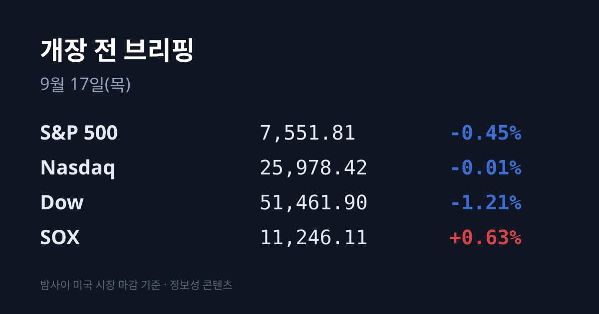
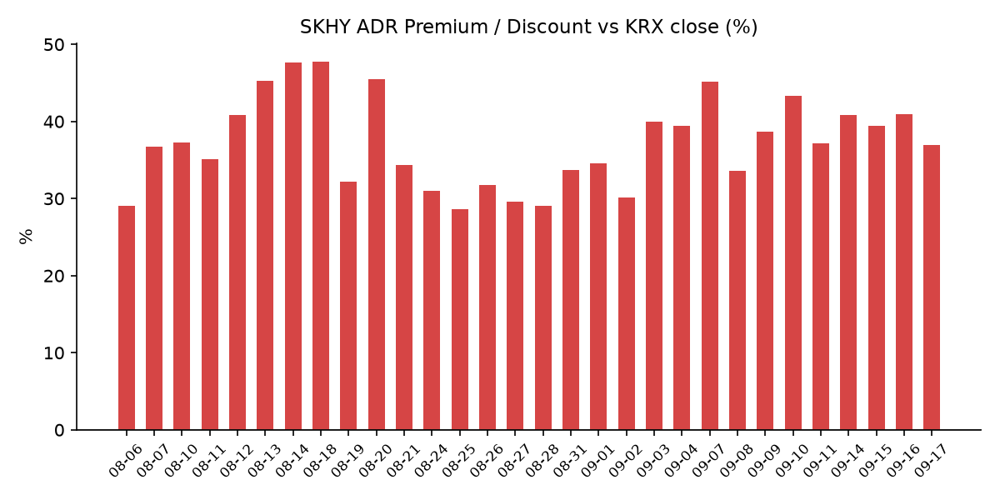
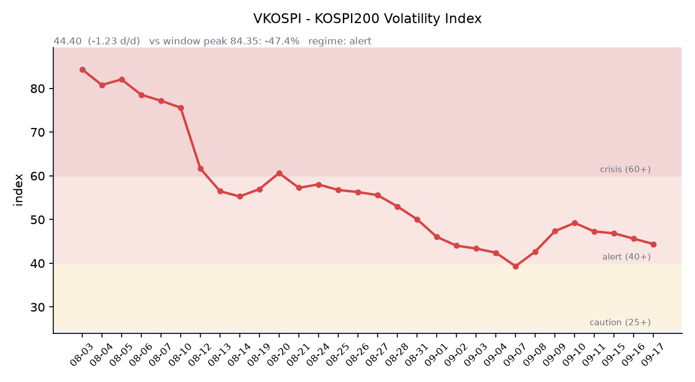

&nbsp;

【① 30초 요약 📈】

연준이 기준금리를 0.25%p 올려 **3.75~4.00%로** 만들었습니다. 만장일치 12-0이며 <mark>2023년 7월 이후 첫 인상</mark>입니다. 점도표 중간값은 2026년말 4.1%, 2027년말도 4.1%였습니다.

3대 지수는 발표 전까지 모두 플러스였다가 케빈 워시 의장 회견 뒤 반전했습니다. 다우 −1.21%, S&P 500 −0.45%, 나스닥 −0.01%로 마감했습니다.

같은 밤 필라델피아 반도체지수(SOX)는 **+0.63%로** 이틀 연속 올랐습니다. 대만 가권도 +0.74%였습니다.

어제 코스피는 6,717.97(+1.37%)로 5거래일 만에 반등했습니다. <mark>SK하이닉스 +4.08%, 삼성전자 +2.01%</mark>였고, 로이터는 SK하이닉스가 인텔과 미국 내 메모리 생산을 협의 중이라고 보도했습니다.

원/달러는 서울 종가 1,368.6원에서 작성 시점 **1,377.19원까지** 밀렸습니다. 달러인덱스는 100.34로 100선을 넘었습니다.

&nbsp;

【② 밤사이 미국 시장】

| 지수 | 종가 | 등락률 |
| :--- | ---: | ---: |
| S&P 500 | 7,551.81 | −0.45% |
| 나스닥 | 25,978.42 | −0.01% |
| 다우 | 51,461.90 | −1.21% |
| SOX (필라델피아 반도체) | 11,246.11 | +0.63% |

FOMC가 하루를 지배했습니다. 연방공개시장위원회는 기준금리를 0.25%p 올려 목표 범위를 3.75~4.00%로 조정했습니다. 표결은 만장일치 12-0, 반대표는 없었습니다. 성명문은 "물가 상승률이 여전히 높다"고 적고, 이번 인상이 "2% 목표로의 보다 시의적절한 복귀를 뒷받침한다"고 밝혔습니다. 2023년 7월 이후 3년여 만의 첫 인상입니다.

함께 공개된 점도표 중간값은 2026년말 4.1%, 2027년말 4.1%, 2028년 3.9%, 2029년 3.6%, 장기 중립금리 3.2%였습니다. 현재 범위의 중간값이 3.875%이므로 <mark>연내 25bp 한 차례 추가 인상을 시사하고 2027년은 그 수준을 유지하는 그림</mark>입니다. 2027년 항목에서는 위원 8명이 추가 인상, 6명이 동결, 4명이 인하를 제시해 갈렸습니다. 워시 의장은 취임 이후 본인의 점을 제출하지 않고 있으며, 회견에서 동료들에게는 전망 제출을 계속 권했다고 밝혔습니다.

지수는 발표 전까지 3대 모두 플러스였다가 회견 이후 반전했습니다. 다만 내려간 폭은 지수마다 크게 달랐습니다. 다우가 631.21포인트(−1.21%) 빠진 반면 나스닥은 −0.01%로 사실상 보합이었습니다. 다우를 누른 종목에는 J.B. 헌트(3분기 이익이 5~10% 감소할 수 있다고 경고, −11% 이상)와 익스피디아(모건스탠리 투자의견 하향, −2.5% 이상)가 있었습니다.

반도체는 반대 방향이었습니다. SOX가 70.56포인트(+0.63%) 오른 11,246.11로 이틀 연속 상승했습니다. 배경에는 인텔이 있었습니다. 로이터는 SK하이닉스가 인텔과 미국 내 메모리 생산을 협의 중이라고 보도했고, 인텔은 **+4.34% 상승**했습니다. 보도된 시나리오는 두 가지로, SK하이닉스가 인텔 오하이오 공장의 일부를 인수하거나 메모리 물량을 확보하려는 클라우드 대형사들과 합작법인을 세우는 방안입니다. SK하이닉스는 같은 날 뉴스룸을 통해 확정된 바 없다는 입장을 냈습니다. 미국 생산은 한국 대비 인건비·건설비가 높고, HBM·DRAM 선단 기술의 해외 이전은 한국 산업기술보호법상 심사 대상이 될 수 있다는 점도 함께 거론됐습니다.

금리는 앞뒤가 다르게 움직였습니다. <mark>2년물이 4.45%로 6bp 오른 반면 30년물은 5.35%로 1bp 내렸고</mark>, 10년물은 5.01%로 1bp 올랐습니다. 10년물−2년물 스프레드는 0.61%p에서 0.56%p로 좁혀졌습니다. 눈여겨볼 곳은 실질금리입니다. 10년물 실질금리(TIPS)가 **2.68%로 6bp 상승**해 명목금리보다 더 크게 올랐습니다. 명목에서 실질을 뺀 10년 기대인플레(BEI)는 2.38%에서 2.33%로 5bp 내렸습니다.

달러와 금은 같은 이야기를 했습니다. 달러인덱스는 100.34(+0.73%)로 100선을 넘었고, 금은 $4,296.90으로 $90.60(−2.06%) 내렸습니다. 은도 $63.37(−2.39%)로 함께 내렸습니다. 금이 내리고 달러가 오르고 실질금리가 오른 조합은, 안전자산으로 돈이 몰린 흐름(그 경우 금은 오릅니다)과는 다른 형태입니다. VIX는 17.71(+2.97%)이었고, 미 지수선물은 S&P 7,618.25(−0.06%)·나스닥100 29,252.25(−0.02%)·다우 51,885(−0.06%)로 보합권이었습니다.

유가는 전날 급등에서 되밀렸습니다. WTI $102.18(−0.24%), 브렌트 $105.61(−0.21%)입니다. 사우디 동서 송유관 폐쇄와 리비아 3개 유전 가동 중단은 이어지고 있으며, 골드만삭스는 유전 인프라 공격이 분쟁의 의미 있는 격화이고 브렌트 $120 상방 시나리오의 확률을 높인다고 언급했습니다. 한국 원유 도입 기준유종인 두바이유는 $127.70(+$1.00)으로, 같은 기준일(9월 15일)의 브렌트 $108.75보다 $18.95 비싼 역전 상태입니다. 역전폭은 전일 $21.02에서 좁혀졌습니다(한국석유공사 페트로넷은 하루 지연 게시).

미 정규장 마감 후에는 주택건설사 레나(LEN)가 실적을 냈습니다. 조정 EPS $1.23(컨센서스 $1.29 하회), 매출 $80.5억(컨센서스 $83.1억 하회, 전년 대비 −9%)이었고, 연간 인도 목표를 8.2만~8.3만호에서 8.0만~8.1만호로 낮췄습니다. 스튜어트 밀러 회장은 "우리가 영업하는 환경이 지난 실적 발표 이후 악화됐다"고 밝혔습니다. 시간외 −2.8%를 기록했습니다. 금리 인상 결정이 나온 지 몇 시간 뒤에 나온 발표였습니다.

&nbsp;

【③ 괴리율 트래커 — SK하이닉스 ADR】

| 항목 | 수치 |
| :--- | ---: |
| SKHY 종가 | $174.87 (+0.02%) |
| 적용 환율 (07:18 KST) | 1,377.19원 |
| 본주 환산가 (×10×환율) | 2,408,292원 |
| 본주 직전 종가 (09/16) | 1,759,000원 |
| **괴리율** | **+36.91%** |

전일(+40.97%) 대비 4.06%포인트 축소됐습니다. 45거래일 트래커에서 20위이며, 최고치는 7월 31일의 +62.0%입니다. 9월 8일 이후 가장 낮은 값입니다.

괴리율이 플러스라는 것은 미국에 상장된 ADR이 한국 본주보다 비싸게 거래되고 있다는 뜻입니다. 구조적으로 ADR과 본주는 예탁·전환 절차를 통해 서로 교환될 수 있으므로, 가격 차이가 벌어지면 싼 쪽을 사서 비싼 쪽으로 전환하는 차익거래 유인이 생깁니다. 현재 본주는 환산가보다 27.0% 싼 상태입니다. 다만 전환에는 시간과 비용, 수량 제약이 따르므로 괴리가 즉시 메워지지는 않습니다.

이번 축소의 원인은 계산식의 두 입력값 중 분모 쪽에 있습니다. <mark>ADR이 내려서가 아니라 본주가 +4.08% 올라 따라잡았기 때문</mark>입니다. SKHY는 +0.02%로 제자리였고, 적용 환율은 오히려 1,362.68원에서 1,377.19원으로 14.51원(+1.06%) 올라 환산가를 키우는 쪽으로 작용했습니다. 환율이 괴리를 넓히는 방향이었는데도 4.06%포인트 줄었다는 것은, 본주의 상승폭이 그만큼 컸다는 뜻입니다.

ADR의 하루 경로 자체는 격렬했습니다. SKHY는 장중 $180.66까지 올랐다가 $172.79까지 밀린 뒤 $174.87로 마감했습니다. 고가와 저가의 차이가 4.5%입니다. 정규장 이후 시간외에서는 $177.20(+1.33%)을 기록 중입니다.

한국 시장 전체를 담는 EWY(iShares MSCI South Korea ETF)는 $175.54(−0.54%)로 마감했고, 이쪽도 장중 $180.19~$173.93을 오갔습니다. 시간외는 $176.45(+0.52%)입니다. 정규장 종가와 시간외 가격의 방향이 서로 다른 날입니다.

&nbsp;

【④ 변동성 트래커 🌡️】

판정 한 줄: <mark>'경보' 유지, 방향은 사흘째 진정 — VKOSPI가 6월 고점의 절반 아래로 처음 내려왔습니다.</mark>

기대 변동성 — VKOSPI는 **44.40(전일비 −1.23, −2.70%)** 으로 40~60 구간인 '경보'에 있습니다. 6월 고점 96.94 대비 −54.2%이며, 평시 상단(25)의 1.78배입니다. 3거래일 연속 하락이고, 고점의 절반 아래로 내려온 것은 이번 국면에서 처음입니다. 코스피가 +1.37% 오른 날 기대 변동성이 함께 내린 조합입니다.

실현 변동성 — 코스피 종가 등락률은 9월 14일 −3.26%, 9월 15일 −0.85%, 9월 16일 +1.37%였습니다. 9월 16일 일중 변동폭(고가−저가)/종가는 집계 시점 기준 미확인입니다.

매매 정지 — 한국거래소 KIND 시장운영 공시 조회 결과, 최근 10거래일 구간에 해당하는 이력은 없습니다.

증폭 경로 — 단일종목 레버리지 ETF의 거래 비중·회전율은 집계 시점 기준 미확인입니다.

청산 압력 — 신용융자 잔고와 위탁매매 미수금 반대매매 금액의 9월 갱신치는 확보되지 않았습니다. 검색으로 확인된 가장 최근 수치는 8월 21일 기준 신용융자 잔고 32조4,162억원으로, 기준일이 한 달 가까이 지나 이번 브리핑에서는 채택하지 않았습니다.

하방 포지션 — 공매도 순잔고는 T+2~3의 공시 지연이 있어 개장 전 시점에는 확정치를 확인할 수 없습니다.

미확인 항목: 코스피200 야간선물 방향, 레버리지 ETF 회전율, 프로그램 매매·베이시스, 신용융자·반대매매 9월 갱신치, BDI(소스 페이지 접속 불가), FOMC 이후 갱신된 페드워치 차기 회의 확률.

&nbsp;

【⑤ 어제 한국장 리뷰】

| 지수 | 종가 | 등락률 |
| :--- | ---: | ---: |
| 코스피 | 6,717.97 | +1.37% |
| 코스닥 | 815.98 | +0.44% |

코스피가 90.71포인트(+1.37%) 올라 5거래일 만에 반등했습니다. 다만 출발은 약했습니다. 시가 6,611로 내려 열린 뒤 장중에 방향을 바꿨습니다. 코스닥도 시가 808.37에서 장중 801.12까지 밀렸다가 815.98로 마쳤는데, <mark>종가가 당일 고가</mark>였습니다.

반등을 끌어올린 것은 반도체였습니다. SK하이닉스 1,759,000원(+69,000원, **+4.08%**), 삼성전자 253,500원(+5,000원, +2.01%)입니다. 하이닉스에는 두 가지 재료가 겹쳤습니다. 인텔과의 미국 메모리 생산 협의 보도와, 임단협 타결에 따른 PS 보너스 확정입니다. 이 밖에 LG에너지솔루션 398,000원(+0.51%), 현대차 243,000원(+0.62%), 삼성바이오로직스 985,000원(−0.40%)이었습니다.

광통신이 반도체와 함께 움직였습니다. 대한광통신 +13.86%, 에이스테크 +29.97%(상한가), RFHIC +6.79%였고, AI 인프라의 필수 기술로 광통신이 부각된 점과 내년 통신장비 공급 부족 가능성이 배경으로 거론됐습니다. 전력기기(초고압 변압기)와 연료전지도 AI 데이터센터 전력 수요를 재료로 강세였고, 해성디에스가 코스피 상승률 1위였습니다. 반대로 가상자산 관련주는 미 상원이 클래리티법을 부결하면서 급락했습니다.

코스닥에서는 상한가 7종목이 나왔고 하한가는 없었습니다. 큐라티스(GLP-1 비만치료제 CDMO 수주) +30.00%, 에이스테크(저궤도 위성 지상국 능동위상배열 안테나) +29.97%, 엠에프씨(AI 경구용 인슐린 국책과제 71억원 단독 수행) +29.96%, 미투온(카카오게임즈의 39.56% 지분 약 9,800억원 인수·경영권 확보) +29.95%, 기가레인(10대 1 주식병합 이후 유통물량 감소, 외국인 5거래일 연속 순매수, AI 데이터센터용 고주파 RF 커넥터) +29.91%, 뷰티스킨(K뷰티 북미 아마존·대형 유통 ODM 수주) +29.86%, 아이티센피엔에스(양자내성암호 표준화 참여·KCMVP 인증, 2거래일 연속 상한가) +29.85%였습니다.

수급은 숫자를 자세히 볼 필요가 있습니다. 코스피에서 <mark>외국인이 1조6,825억원을 순매도해 6거래일 연속 매도 우위</mark>였고, 개인도 1조1,900억원을 팔았습니다. 산 쪽은 기관 1조2,104억원과 기타법인 1조6,600억원입니다. **기타법인의 순매수 규모가 외국인 순매도와 거의 같은 크기**라는 점이 이날 수급의 특징이었습니다. 코스닥은 기관 +170억원, 외국인 −285억원, 개인 +130억원으로 규모 자체가 얇았습니다.

원/달러는 9.2원 오른 1,368.6원에 주간 거래를 마쳤습니다. 장중에는 1,372.9원까지 올라 1,370원선을 넘었고, 5거래일 연속 상승입니다. 미 금리 인상 우려와 국제유가 급등이 배경으로 지목됐습니다. 작성 시점 현재 환율은 1,377.19원(07:18 KST)으로, 서울 종가보다 8.59원 높은 자리에 있습니다.

아시아 증시는 방향이 같았습니다. 대만 가권 45,848.90(+0.74%), 닛케이 225 63,923.00(+0.69%), 상해종합 3,891.60(+0.71%), 항셍 24,713.78(+0.19%)로 모두 올랐습니다.

&nbsp;

【⑥ 오늘의 캘린더 & 관전 포인트 📅】

**09:00 (KST):** 원/달러 개장 고시. 작성 시점 현재 1,377.19원입니다.

**20:00 (KST):** 영란은행(BOE) 금리 결정. 시장에서는 3.75% 동결과 3.50% 인하 전망이 비슷한 비중으로 갈려 있습니다.

**09/17~18:** 일본은행(BOJ) 금융정책결정회의. 결과는 18일에 나오며 총재 회견은 18일 15:30(KST)입니다. 시장이 반영한 25bp 인상 확률은 61% 수준입니다.

**09/18:** 미국 쿼드러플 위칭(주가지수 선물·옵션, 개별주식 선물·옵션 동시만기).

**09/18~21:** 엘리스그룹 공모 청약(밴드 70,400~90,500원, 공모 규모 1,564억~2,011억원, 납입 9월 23일).

**09/30:** 마이크론 FQ4'26 실적 발표.

수시: 9월 16일 기준 신용융자·예탁금·반대매매 집계, 공매도 순잔고 공표(T+2~3), 두바이유 9월 16일 확정치(페트로넷 하루 지연), 사우디 송유관·리비아 유전 복구 진척, SK하이닉스–인텔 협의 관련 후속 보도.

시장이 주시하는 레벨 — 원/달러는 1,377원 부근에서 개장을 맞습니다. SK하이닉스 어제 종가는 1,759,000원이고 장중 고가는 1,760,000원이었습니다. 코스피는 어제 시가 6,611과 종가 6,717.97 사이 구간이 하루 만에 만들어졌습니다. 미 10년물 실질금리는 2.68%, 2년물은 4.45%, 두바이유는 $127.70, 브렌트−두바이 역전폭은 $18.95입니다.

&nbsp;

【⑦ 정책 워치 ⚡】

연준은 9월 16일 회의에서 기준금리를 3.75~4.00%로 0.25%p 인상했습니다. 만장일치 12-0이었고 반대표는 없었습니다. 성명문은 경제활동이 견조하게 확장 중이고 생산성 증가와 자본투자가 강하다고 평가하면서, 물가 상승률은 여전히 높다고 적었습니다. 워시 의장 체제의 연준은 인플레이션 측정 방식을 재검토하고 있으며, 호주·캐나다·영국처럼 1~3% 같은 목표 범위를 엄격한 2% 단일 목표 대신 채택하는 방안이 거론되고 있습니다.

한국 공매도 제도는 기관·법인 투자자의 전산시스템 구축 의무화가 시행 중입니다. 공매도 잔고 보고 대상 법인과 시장조성자·유동성공급자는 중앙점검시스템(NSDS)에 2영업일 이내 종목별 잔고를 제출해야 합니다. 개인 대상 대주서비스 담보비율은 대차 수준인 105%(현금 기준)로 낮아졌고, 시장조성자·유동성공급자의 공매도 목적 대차거래에는 상환기간 제한(90일 단위 연장, 총 12개월)이 적용됩니다. 이번 브리핑 시점에 새로 바뀐 사항은 확인되지 않았습니다.

미국에서는 상원이 가상자산 시장구조법인 클래리티법(Clarity Act)을 부결했고, 국내 가상자산 관련주가 이에 반응해 하락했습니다.

&nbsp;

【⑧ 오늘의 질문】

인텔과의 미국 생산 협의가 "확정된 바 없다"는 단계에 머무는 동안, 어제 하이닉스에 붙은 +4.08%는 어디까지가 뉴스값이고 어디까지가 실적값일까요.

&nbsp;

#개장전브리핑 #미국증시마감 #FOMC #금리인상 #하이닉스ADR #괴리율 #코스피 #코스닥 #반도체 #환율

&nbsp;

본 글은 공개된 시장 데이터를 정리한 정보성 콘텐츠이며, 특정 종목·상품의 매매 권유가 아닙니다. 모든 투자 판단과 책임은 투자자 본인에게 있습니다. 수치는 작성 시점 기준이며 이후 변동될 수 있습니다.