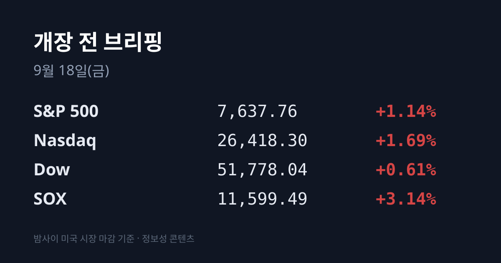
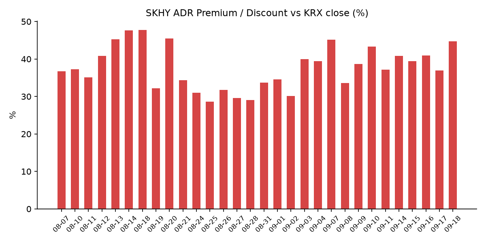
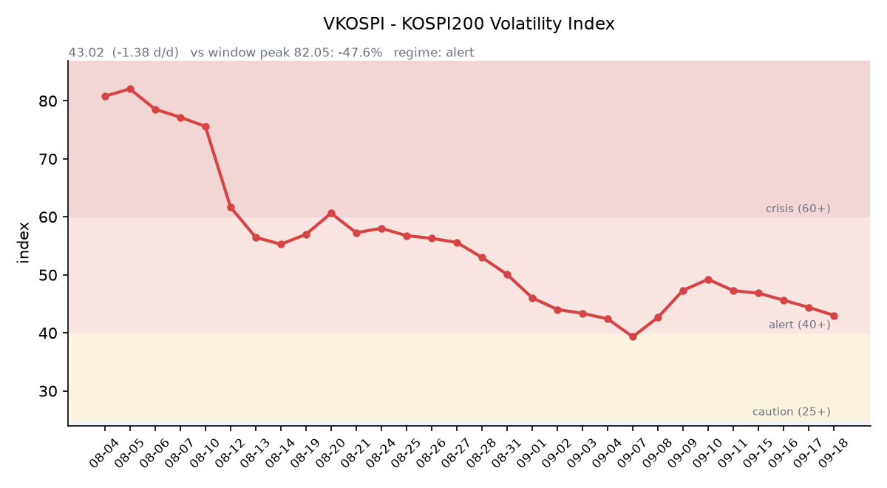

&nbsp;

【① 30초 요약 📈】

<mark>인텔 CEO 립부 탄이 "내년 메모리 상황이 훨씬 심각하다"고 경고했습니다.</mark> 생산능력이 극히 제한돼 메모리를 충분히 조달하지 못하고 많은 프로젝트가 지연되고 있으며, **메모리 가격은 이미 5~7배 올랐다**는 내용이었습니다.

필라델피아 반도체지수(SOX)가 11,599.49로 **+3.14% 오르며** 사흘 연속 상승했습니다. 3배 레버리지 ETF인 SOXL은 **+10.35% 급등** 했습니다.

<mark>SK하이닉스 ADR이 +4.64%, 한국 ETF인 EWY가 +3.90% 올랐습니다.</mark> 어제 한국장에서 SK하이닉스 본주는 −0.80%로 내렸습니다.

어제 한국 증시를 움직인 것은 반도체가 아니라 방산·조선·우주항공이었습니다. **한화시스템 +12.21%**, HD현대중공업 +8.40%, 나라스페이스테크놀로지는 상한가였습니다.

VIX가 15.51로 −12.43% 급락했고, 원/달러는 6거래일 만에 되밀렸습니다. <mark>오늘 정오 전후 일본은행(BOJ) 금리 결정이 나옵니다.</mark>

&nbsp;

【② 밤사이 미국 시장】

| 지수 | 종가 | 등락률 |
| :--- | ---: | ---: |
| S&P 500 | 7,637.76 | +1.14% |
| 나스닥 | 26,418.30 | +1.69% |
| 다우 | 51,778.04 | +0.61% |
| SOX(필라델피아 반도체) | 11,599.49 | +3.14% |

간밤 미국 증시를 움직인 것은 매크로가 아니라 메모리였습니다. 인텔 최고경영자 립부 탄은 내년 메모리 수급에 대해 "생산능력이 극히 제한돼 메모리를 충분히 조달하지 못하고, 많은 프로젝트가 지연되고 있으며, 메모리 가격은 이미 5~7배 올랐다"고 말했습니다.

<mark>공급 제약이 메모리 제조사의 가격 결정력으로 해석되면서 관련 종목이 일제히 올랐습니다.</mark> 여기에 엔비디아 최고경영자 젠슨 황이 내년 칩 매출이 두 배가 될 수 있다고 언급한 것이 더해졌습니다.

개별 종목으로는 **마이크론 $977.50(+5.50%)**, **인텔 $108.80(+7.67%)**, 샌디스크 $1,614.39(+6.21%), 브로드컴 +2.85%, 엔비디아 $219.34(+2.54%)였습니다.

반도체 밖에서는 제너랙(GNRC)이 아마존 데이터센터에 최대 80억 달러 규모 발전기를 공급하기로 합의하고 지분 워런트를 부여하면서 22% 상승했습니다.

지수를 떠받친 배경에는 유가와 금리의 동반 하락도 있었습니다. WTI는 $101.14(−1.26%), 브렌트는 $104.08(−1.65%)로 내렸습니다. 사우디아라비아가 오만 소하르항을 통해 원유를 추가 공급하는 방안을 찾았다는 소식과, 미국 원유 재고가 예상보다 적게 감소했다는 집계가 함께 전해졌습니다.

금은 $4,383.00(−0.10%)으로 사실상 보합, 은은 $65.82(+2.38%)였습니다. 달러인덱스는 100.236(−0.07%)으로 움직이지 않았습니다. 금과 달러가 모두 제자리인 가운데 VIX만 12% 넘게 빠졌다는 점은, 간밤 상승이 매크로 재평가보다 공포 되돌림과 개별 산업 재료에 기댄 것이었음을 보여줍니다.

미 국채 금리는 FRED 기준 10년물 5.01%, 30년물 5.35%, 2년물 4.74%, 10년−2년 스프레드 +0.27%p, 10년 실질금리(TIPS) 2.68%였습니다. 모두 09/16 기준치이며, 09/17 확정치는 집계 시점 기준 미공개로 하락 방향만 확인됐습니다.

&nbsp;

【③ 괴리율 트래커 — SK하이닉스 ADR】

| 항목 | 수치 |
| :--- | ---: |
| SKHY 종가 | $182.99 (+4.64%) |
| SKHY 시간외 | $183.39 (+0.22%) |
| 적용 환율 (08:05 KST) | 1,380.34원 |
| 본주 환산가 (×10×환율) | 2,525,884원 |
| 본주 직전 종가 (09/17) | 1,745,000원 |
| 괴리율 | +44.75% |
| 전일 괴리율 | +36.91% |

괴리율이 하루 만에 **7.84%포인트 확대** 됐습니다. 벌어진 방식이 전날과 정반대입니다. 09/16에는 본주가 올라 환산가를 따라잡으면서 괴리가 좁혀졌지만, 이번에는 <mark>본주가 −0.80%로 내린 자리에서 ADR이 +4.64% 뛰면서 벌어졌습니다.</mark>

환율은 1.86원 내려 괴리를 좁히는 쪽으로 작용했는데도 확대됐습니다. 즉 이번 확대는 환율 효과가 아니라 한국과 미국이 같은 회사를 서로 다르게 매긴 결과입니다.

구조적으로 ADR이 본주보다 비싼 프리미엄 상태에서는, 두 시장의 가격 차이를 이용하는 전환 차익거래가 성립할 때 본주 쪽에 매수 유인이 생깁니다. 반대로 디스카운트 상태에서는 본주 쪽에 매도 유인이 생깁니다. 현재 본주는 환산가보다 **30.9% 싼** 상태입니다.

다만 이 괴리는 자동으로 좁혀지는 것이 아니라 실제 거래가 일어나야 좁혀지며, ADR과 본주 사이에는 거래 시간·세제·전환 절차의 마찰이 존재합니다. 이 트래커 기준 +44.75%는 집계된 46거래일 중 7위이고, 09/07(45.12%) 이후 가장 높은 수준입니다. 전 구간 최고치는 07/31의 62.0%였습니다.

한편 한국 시장 전체를 담는 iShares MSCI South Korea ETF(EWY)는 $182.39(+3.90%), 시간외 $182.59(+0.11%)였습니다. EWY는 단일 종목이 아니라 한국 증시 전반에 매겨진 가격이라는 점에서 ADR과 다른 정보를 줍니다.

&nbsp;

【④ 변동성 트래커 🌡️】

<mark>판정 한 줄: '경보' 유지, 방향은 진정 — VKOSPI가 나흘째 내렸고 실현 변동폭도 축소 중이지만, 레벨은 여전히 평시 상단의 1.7배입니다.</mark>

기대 변동성 — VKOSPI **43.02(전일비 −1.38)** 로 40~60 '경보' 구간입니다. 6월 고점 96.94 대비 **−55.6%** 까지 내려왔고, 평시 상단(25)의 1.72배 수준입니다. 구간 기준은 25 미만 평시 / 25~40 주의 / 40~60 경보 / 60 이상 위기입니다. 〔한국거래소 공식 확정치〕

실현 변동성 — 최근 10거래일 일중 변동폭(고가−저가)/종가 평균은 2.03%, 최근 5거래일은 1.83%로 축소됐습니다. 최근 10거래일 중 종가 기준 ±3% 이상 등락한 날은 2일이었습니다.

증폭 경로 — 레버리지 ETF가 전체 ETF 거래대금의 **29.83%** 를 차지했습니다. 상위 두 종목이 모두 반도체로, KODEX 반도체레버리지가 거래대금 2,426억원(회전율 24.29%), TIGER 반도체TOP10레버리지가 1,395억원(회전율 24.25%)이었습니다. KODEX 2차전지산업레버리지는 424억원(회전율 5.76%)이었습니다.

회전율이 높은 레버리지 상품은 종가 리밸런싱 물량이 그날의 방향을 증폭시키는 경로로 작동합니다.

파생 지표 — 선물 베이시스는 +4.48(선물 1,062.75 − 현물 1,058.27)로 콘탱고였습니다. 09/17 개장 직전 밤의 코스피200 야간선물은 1,050.55(주간 종가 대비 −10.60, 거래량 34,382)였습니다. 〔한국거래소 공식 확정치〕

청산 압력 — 신용융자 잔고와 위탁매매 미수금 반대매매 금액의 9월 갱신치는 집계 시점 기준 미확인입니다. 확인된 최신치는 8월 31일 기준 신용거래융자 잔액 28조9,350억원입니다.

하방 포지션 — 공매도 순잔고는 T+2~3 공시 지연으로 개장 전에는 확인할 수 없습니다.

미확인 항목: 신용융자·반대매매 9월 갱신치, 공매도 순잔고·대차잔고(공시 지연), 오늘 개장 직전 밤의 야간선물(다음 날 아침 공개), DRAM/NAND 당일 현물가, 프로그램매매 차익/비차익.

&nbsp;

【⑤ 어제 한국장 리뷰】

| 지수 | 종가 | 등락 |
| :--- | ---: | ---: |
| KOSPI | 6,715.41 | −2.56 (−0.04%) |
| KOSDAQ | 822.18 | +6.20 (+0.76%) |

코스피는 시가 6,779.02(+0.91%)로 오르며 출발해 장중 고가 6,795.53까지 닿았으나, 이후 흘러내려 보합으로 마감했습니다. 장중 저가는 6,697.85였습니다.

수급은 코스피 기준 <mark>외국인이 2조2,300억원을 순매도해 7거래일 연속 매도 우위였습니다.</mark> 기관은 1,563억원, 개인은 3,710억원 순매수였습니다.

시가총액 상위 종목은 대체로 약했습니다. **삼성전자 252,500원(−0.39%)**, **SK하이닉스 1,745,000원(−0.80%)**, 삼성전자우 193,300원(−0.67%), SK스퀘어 1,008,000원(−1.18%), 삼성전기 1,330,000원(−3.69%)이었습니다.

지수를 실제로 움직인 곳은 다른 쪽이었습니다. 방산·조선·우주항공 테마가 장을 주도했습니다. 한화시스템 +12.21%, HD현대중공업 +8.40%, 센서뷰 +23%, 켄코아 +14% 등이었습니다. 스페이스X 스타십 시험비행 기대와 K방산 수출 모멘텀이 배경으로 거론됐습니다.

코스닥에서는 상한가가 6종목 나왔습니다 — 비츠로테크 11,440원(+30.00%), 큐라티스 4,815원(+29.96%), 진영 4,905원(+29.93%), 나라스페이스테크놀로지 13,850원(+29.92%), 한켐 12,640원(+29.91%), 앤씨앤 2,825원(+29.89%)입니다.

원/달러는 서울 외환시장 주간거래 종가 기준 **1,382.20원(+13.6원)** 으로 6거래일 연속 올랐습니다. 다만 08:05 KST 현재는 1,380.34원으로 서울 종가 대비 1.86원 내린 상태입니다.

아시아 증시는 09/17 종가 기준으로 대만 가권 46,288.00(+0.96%), 토픽스 4,094.19(+0.80%), 닛케이225 64,136.25(+0.33%)가 올랐고, 상하이종합 3,875.60(−0.41%), CSI300 4,460.16(−0.45%), 항셍 24,604.29(−0.44%)는 내렸습니다.

&nbsp;

【⑥ 오늘의 캘린더 & 관전 포인트 📅】

**정오 전후** — 일본은행(BOJ) 금융정책결정회의 결과. 블룸버그 이코노미스트 설문에서 응답자 89~100%가 기준금리를 1.00%에서 1.25%로 올릴 것으로 답했습니다. USD/JPY는 155.91 수준입니다.

**15:30** — 우에다 총재 기자회견. 한국장 마감 시각과 겹칩니다.

**09:00** — 원/달러 고시 환율. 시장 참가자들은 1,380원 선을 주시하고 있습니다. 이 아래에서 고시되면 6거래일 연속 상승이 끊깁니다.

**오늘 밤**(한국 09/19 새벽) — 미국 쿼드러플 위칭(선물·옵션 동시만기).

**오늘** — 브릴스 공모청약 마감. 로봇 모듈화 플랫폼 기업으로 확정공모가는 19,500원, 주관사는 IBK투자증권입니다.

**09/18~21** — 엘리스그룹 청약. 희망밴드 70,400~90,500원, 공모 규모 1,564~2,011억원, 납입일 09/23입니다.

**09/30** — 마이크론 FQ4'26 실적. <mark>간밤 인텔 CEO가 언급한 메모리 가격 상승이 실제 손익으로 확인되는 첫 자리입니다.</mark>

시장이 함께 주시하는 레벨로는 SK하이닉스의 1,800,000원(ADR 괴리 반영 여부를 가르는 자리), VKOSPI 48(나흘째 진정 흐름의 분기점), 미 10년물 5.05%, 두바이유 $130이 거론됩니다. 방향 판단 없이 레벨만 적습니다.

&nbsp;

【⑦ 정책 워치 ⚡】

국내 공매도는 2025년 3월 31일 전면 재개된 이후 현재까지 정상 운영 중입니다. 2026년부터는 기관·법인 투자자의 공매도 전산시스템 구축이 의무화돼 무차입 공매도 차단 장치가 강화됐습니다.

기업 소식으로는 네이버가 배달의민족 인수 검토를 4개월 만에 중단했다고 밝혔습니다. 경영환경 변화가 이유로 제시됐습니다.

원유 시장에서는 한국이 수입 기준유종으로 쓰는 두바이유가 **$123.70** (기준일 09/17, 페트로넷)으로, 같은 표의 브렌트 $104.82보다 **$18.88 비싼 역전 상태** 가 이어졌습니다. 국제 유가가 내렸어도 한국의 정유·화학 원가 기준은 별도로 움직인다는 뜻입니다.

&nbsp;

【⑧ 오늘의 질문】

<mark>어제 한국이 팔았던 반도체를 간밤 미국이 샀습니다 — 그 간극이 오늘 한국 시장에서 어떻게 정리될 것인가.</mark>

&nbsp;

#개장전브리핑 #미국증시마감 #하이닉스ADR #필라델피아반도체지수 #코스피 #코스닥 #VKOSPI #메모리반도체 #BOJ금리결정 #괴리율트래커

&nbsp;

본 글은 공개된 시장 데이터를 정리한 정보성 콘텐츠이며, 특정 종목·상품의 매매 권유가 아닙니다. 모든 투자 판단과 책임은 투자자 본인에게 있습니다. 수치는 작성 시점 기준이며 이후 변동될 수 있습니다.

VKOSPI·야간선물·선물 베이시스는 「한국거래소 통계정보」를 사용한 결과입니다.