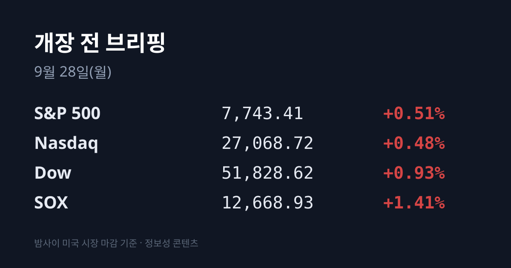
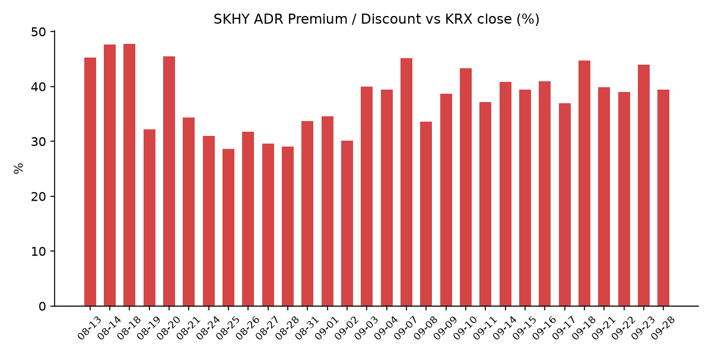
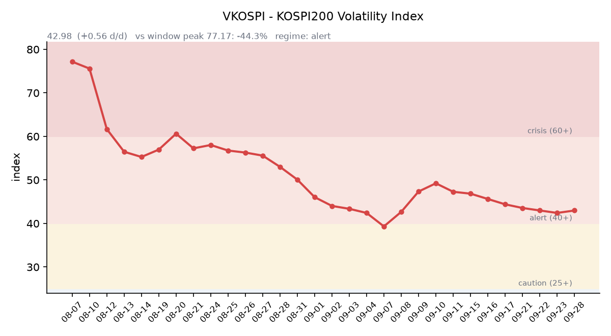

&nbsp;

【① 30초 요약 📈】

한국 증시가 추석 연휴로 쉰 5일 동안 미국은 3세션(09/23·24·25)을 치렀습니다. S&P500은 누적 −0.27%, 나스닥 −0.64%, 필라델피아 반도체지수(SOX) −0.16%로 **급락 뒤 반등해 거의 제자리**였습니다.

그 사이 <mark>미 10년물 국채금리는 5.18%로 21bp 올라</mark> 장중 2007년 이후 최고를 기록했고, 10월 FOMC 25bp 인상 확률은 약 70%로 높아졌습니다.

브렌트유(11월물)는 $99.25에서 $106.33으로 +7.1% 올랐습니다. 트럼프 대통령은 09/26 이란의 '7일 내 호르무즈 재개방' 제안을 거부했습니다.

미·중 정상회담(09/24)에서는 무역 휴전이 2개월 연장됐고, $300억 규모 상호 관세 인하와 AI 대화 채널 신설이 합의됐습니다.

한국 시장 전체를 담는 <mark>EWY는 09/23 한국 마감 이후 −2.82%</mark>, SK하이닉스 ADR(SKHY)은 −1.95%였습니다. 오늘은 삼성전자 3분기 배당의 최종 매수일입니다.

&nbsp;

【② 밤사이 미국 시장 🌙】

| 지수 | 09/25 종가 | 09/25 등락률 | 3세션 누적 |
| :--- | ---: | ---: | ---: |
| S&P 500 | 7,743.41 | +0.51% | −0.27% |
| 나스닥 종합 | 27,068.72 | +0.48% | −0.64% |
| 다우 | 51,828.62 | +0.93% | −0.07% |
| 필라델피아 반도체(SOX) | 12,668.93 | +1.41% | −0.16% |

※ 누적은 한국 직전 거래일(09/23) 마감 전에 끝난 미국 09/22 종가 대비입니다.

세 세션의 경로는 '급락 → 보합 → 반등'이었습니다. 09/23에는 강한 PMI 지표와 금리 상승에 S&P500이 −0.75%, 나스닥이 −1.13%, SOX가 −1.23% 내렸습니다. 에너지를 뺀 거의 모든 업종이 하락했고, SOX의 6거래일 연속 상승이 이날 끊겼습니다. 09/24는 지수가 보합권에 머물렀고, 09/25에는 기술주 중심으로 반등해 다우가 +0.93% 올랐습니다. 마이크론은 3세션 누적 −1.27%(1,082.28달러), 엔비디아는 −1.66%(225.07달러)입니다. 한국 시각 07:54 기준 미국 지수선물은 S&P500 −0.29%, 나스닥100 −0.33%입니다.

공백 기간에 가장 크게 움직인 것은 금리입니다. 미 10년물은 09/22 4.97%에서 **5.18%로 21bp** 올랐고, 09/25 장중 5.230%까지 올라 2007년 6월 이후 최고치를 기록했습니다. 30년물은 5.47%(장중 5.502%, 2004년 이후 최고), 2년물은 4.87%, 10년물 실질금리(TIPS)는 2.85%로 09/21(2.62%)보다 23bp 높습니다. 10년물과 2년물의 차이는 0.36%p로 넓어졌습니다. 마이클 바 연준 이사가 "할 일이 더 남았다"며 추가 인상을 지지했고, CME 페드워치 기준 10/28 FOMC의 25bp 인상 확률은 09/22 59.7%에서 약 69~73%로 올랐습니다. VIX는 14.87, 달러인덱스는 100.97(09/22 대비 +0.37%), 금은 온스당 $4,294.2(−1.9%)입니다.

국제유가는 다시 올랐습니다. 브렌트 11월물은 09/23 이란 대통령의 유엔 연설("압력에 굴복하지 않는다") 뒤 +3.9%, 09/24 +3.4% 올랐다가 09/25 −2.1% 내렸고, 한국 시각 오늘 아침 $106.33(+1.9%)입니다. WTI 11월물은 $93.50입니다. 이란은 09/25 유엔에서 미국의 해상봉쇄 해제·동결자산 해제·전면 종전을 조건으로 7일 안에 호르무즈 해협을 재개방하고 핵협상을 재개하겠다고 제안했습니다. 트럼프 대통령은 09/26 이 제안을 거부하며 "이란이 무리수를 뒀다"고 말했고, 이번 주 협상 재개를 예상한다고 밝혔습니다.

미·중 정상회담은 09/24 워싱턴에서 열렸습니다. 양국은 무역 휴전을 2개월 연장해 2027년 1월 10일까지로 늘렸고, 중국은 09/26 8개 항 합의를 발표했습니다. 농산물·목재·화장품과 소형가전·완구 등 $300억 규모의 상호 관세 인하, AI 공식 대화 개시, 무역위원회 신설, 미국산 석탄 2천만톤 구매가 담겼습니다. 반도체·희토류·대만 문제에 대한 구체 합의는 발표되지 않았습니다.

직전 정규장 마감 후 실적으로는 09/24 코스트코가 주당순이익과 매출($957억)에서 예상을 웃돌았으나 주가 반응은 보합 수준이었고, 한국 증시와 직접 관련된 발표는 없었습니다. 마이크론 실적은 09/30 장마감 후 발표됩니다.

&nbsp;

【③ 괴리율 트래커 — SK하이닉스 ADR】

| 항목 | 수치 |
| :--- | ---: |
| SKHY 종가 | $191.56 (3세션 누적 −1.95%) |
| 본주 환산가 (×10×환율 1,354.92원) | 2,595,485원 |
| 본주 직전 종가 | 1,862,000원 |
| **괴리율** | **+39.4%** |

괴리율은 연휴 전 +43.93%에서 **4.54%포인트 줄었습니다.** 두 방향에서 좁혀졌습니다. 한국 본주는 09/23 +1.20% 올랐고, 그 뒤 미국의 ADR은 $189.28(−3.12%) → $186.37(−1.54%) → $191.56(+2.78%)로 3세션 누적 −1.95%였습니다. SKHY 시간외 가격은 $191.28(−0.15%)입니다.

괴리율은 미국에 상장된 예탁증서(ADR) 가격을 본주 1주 기준으로 환산한 값과 한국 본주 종가를 비교한 수치입니다. 환산가가 본주보다 높은 프리미엄 상태에서는 두 시장의 가격이 붙는 방향으로 움직일 때 이익을 얻는 전환 차익거래 구조상 본주 쪽에 매수 유인이 생기고, 디스카운트면 반대입니다. 현재 본주는 환산가보다 28.3% 낮은 수준입니다. 이 트래커 50거래일 기록에서 오늘 값은 18위이며, 전 구간 1위는 07/31의 +62.0%입니다.

한국 시장 전체를 담는 EWY(iShares MSCI South Korea ETF)는 $185.65(−3.62%) → $182.53(−1.68%) → $187.18(+2.55%)로, 09/23 한국 마감 이후 <mark>3세션 누적 −2.82%</mark>입니다. 시간외는 $187.01(−0.09%)였습니다. 개장 전 NXT 프리마켓(08:03)에서는 삼성전자가 286,500원(+0.35%), SK하이닉스가 1,838,000원(−1.29%)에 거래됐습니다.

&nbsp;

【④ 변동성 트래커 🌡️】

판정 한 줄: <mark>'경보' 유지, 연휴 전 소폭 반등</mark> — VKOSPI가 이틀 하락 뒤 연휴 직전에 다시 올랐고, 공백 5일 동안 한국 변동성 지표는 갱신되지 않았습니다.

기대 변동성: VKOSPI **42.98**(09/23, 전일비 +0.56, +1.32%)로 '경보'(40~60) 구간입니다. 6월 고점 96.94 대비 −55.7%이며 평시 상단인 25의 1.72배 수준입니다. 미국 VIX는 3세션 동안 14.21 → 15.18 → 15.67 → 14.87로 움직였습니다. (한국거래소 통계정보 기준)

실현 변동성: 최근 7거래일 코스피 일별 등락률은 09/15 −0.85%, 09/16 +1.37%, 09/17 −0.04%, 09/18 +2.66%, 09/21 +1.65%, 09/22 +0.15%, 09/23 +0.90%였습니다. ±3% 이상 등락일은 0일입니다. 09/23 일중 변동폭은 종가 대비 1.96%로 전일(2.64%)보다 줄었습니다.

증폭 경로: 레버리지 ETF 거래 비중은 오늘 아침 수집하지 못했습니다.

청산 압력: 신용융자 잔고는 최신 확정치인 09/15 기준 32조8,319억원입니다.

하방 포지션: 공매도 순잔고는 T+2~3 공시 지연이 있어 개장 전 시점에는 확정치를 알 수 없습니다.

미확인: 레버리지 ETF 거래 비중, 공매도 순잔고 최신치, 신용융자 09/15 이후 집계, 오늘 개장 직전 밤의 코스피200 야간선물(한국거래소가 다음 날 아침 공개), DRAM·NAND 당일 현물가.

&nbsp;

【⑤ 직전 거래일(09/23) 한국장 리뷰】

| 지수 | 종가 | 등락 |
| :--- | ---: | ---: |
| 코스피 | 7,080.92 | +63.01 (+0.90%) |
| 코스닥 | 844.48 | +10.10 (+1.21%) |

코스피는 7,153.99(+1.94%)로 출발한 시가가 그날의 고가였고, 저가 7,014.98까지 밀렸다가 +0.90%로 마쳐 4거래일 연속 올랐습니다. 상승 종목은 311개, 하락 종목은 548개로 대형 반도체 중심의 상승이었습니다.

코스피 수급(매체 집계)은 개인 1조4,543억원 순매도, 외국인 4,949억원 순매도, 기관 3,233억원 순매수였습니다. 매체에 따라 외국인 −5,101억원, 기관 +3,170억원으로 집계되는 등 편차가 있습니다. 외국인과 기관은 09/21~09/23 사흘간 삼성전자를 합계 **4조1,889억원** 순매수했습니다. 코스닥에서는 개인 275억원·기관 106억원 순매수, 외국인 456억원 순매도였습니다.

종목별로는 삼성전자가 <mark>285,500원(+3.25%)</mark>으로 올랐습니다. 매체들은 뉴욕발 AI·반도체 훈풍을 배경으로 꼽았고 별도의 개별 호재는 없었습니다. SK하이닉스는 장중 190만원까지 오른 뒤 1,862,000원(+1.20%)으로 마쳤고, SK스퀘어는 +5.03%였습니다. 반도체 소재주 솔브레인·동진쎄미켐이 약 9% 올랐습니다. 현대차(−1.94%), 삼성바이오로직스(−1.80%), KB금융(−1.42%)은 내렸습니다.

원/달러는 서울 외환시장 주간 종가 1,358.4원(+0.2원)으로 마감했고, 역외 NDF는 1,353.30원에 최종 호가됐습니다. 작성 시점 현재 환율은 1,354.9원 안팎이고, 달러/엔은 157.57입니다.

한국거래소 확정치 기준 선물 베이시스는 +1.63(선물 1,127.75 − 현물 1,126.12)으로 전일 −1.30에서 콘탱고로 돌아왔습니다. 코스피200 야간선물은 09/23 개장 직전 밤 세션이 1,140.70으로 직전 주간 종가 대비 +28.70, 거래량 33,688계약이었습니다.

연휴 동안 아시아 증시는 엇갈렸습니다. 닛케이225는 66,364.20(09/25 +1.30%, 09/18 대비 +2.07%), 토픽스는 4,128.59(+1.31%)였습니다. 상하이종합은 3,888.37(09/24 −1.22%), CSI300은 4,439.14(−1.73%)로 마친 뒤 중추절 휴장에 들어갔고, 항셍은 24,510.09(09/25 −1.01%, 09/22 대비 −2.30%), 대만 가권은 48,024.60(09/24 −0.28%)입니다.

&nbsp;

【⑥ 오늘의 캘린더 & 관전 포인트 📅】

**오늘(09/28):** 추석 연휴 뒤 첫 거래일. <mark>삼성전자 3분기 배당 최종 매수일</mark>(09/29 배당락, 09/30 기준일). 증권가 추정 주당 약 4,604원이며 공식 금액은 이사회에서 확정됩니다. 중국 증시 재개장, 코리아 프리미엄 위크 개막(10월 중순까지).

**09/28~09/30:** Yotta 2026 컨퍼런스(라스베이거스).

**09/29(화):** 윌리엄스 뉴욕 연은 총재 발언. 글로벌테크놀로지·빅웨이브로보틱스 신규 상장.

**09/30(수) 21:30:** 미국 8월 PCE 물가, 2분기 GDP 확정치. 같은 날 미국 9월 ADP 고용, 중국 9월 PMI, 한국 8월 산업활동. SK하이닉스·현대차 배당 지급.

**10/01(목) 새벽:** <mark>마이크론 FQ4'26 실적</mark>(미국 09/30 장마감 후). 시장 컨센서스는 주당순이익 $31.56, 매출 $512억이며 회사 가이던스는 매출 $500억±10억입니다.

**10/01(목):** 한국 9월 수출입 통계, 미국 ISM 제조업지수.

**10/02(금):** 한국 9월 소비자물가, 21:30 미국 9월 고용보고서.

연휴 중 나온 국내 종목 뉴스도 있습니다. HLB의 미국 자회사 엘레바가 개발한 담관암 치료제 '리픽투(리라푸그라티닙)'가 미국 시각 09/23 FDA 정규 승인을 받았습니다(임상 객관적반응률 46%). SK하이닉스의 손자회사 솔리다임이 내년 미국 상장을 추진한다는 보도가 나왔고, 기업가치는 최대 $1,500억으로 추정됐습니다. 증권가는 3분기 영업이익 추정치를 삼성전자 111조3,772억원(+5%), SK하이닉스 78조1,291억원(+2%)으로 올렸습니다.

시장이 주시하는 레벨: 삼성전자 보합선, SK하이닉스 **185만원** 선, 원/달러 1,365원 선, 미 10년물 5.10% 선, 브렌트 11월물 $103 선, VKOSPI 46 선, 재개장한 상하이종합의 등락입니다.

&nbsp;

【⑦ 정책 워치】

미·중은 휴전 연장과 함께 무역위원회를 신설하고 AI 공식 대화를 시작하기로 했습니다. 반도체 수출 규제에 대한 구체적 변화는 발표되지 않았습니다.

미 행정부의 이란 대응은 제안 거부와 협상 재개 예고가 동시에 나온 상태입니다.

공매도는 전면 재개 상태이며 연휴 중 제도 변경 사항은 확인되지 않았습니다.

&nbsp;

【⑧ 오늘의 질문 ⚡】

미국 지수가 제자리로 돌아오는 동안 금리·유가·인상 확률은 한 방향으로 움직였고 EWY는 −2.8% 내렸다. 연휴 5일치 뉴스를 한 번에 받는 한국 시장에서, 삼성전자 배당 막차와 미·중 휴전은 그 무게를 얼마나 상쇄하는가.

&nbsp;

#개장전브리핑 #미국증시마감 #추석연휴 #미국채10년물 #국제유가 #하이닉스ADR #괴리율 #EWY #코스피 #VKOSPI

&nbsp;

본 글은 공개된 시장 데이터를 정리한 정보성 콘텐츠이며, 특정 종목·상품의 매매 권유가 아닙니다. 모든 투자 판단과 책임은 투자자 본인에게 있습니다. 수치는 작성 시점 기준이며 이후 변동될 수 있습니다.