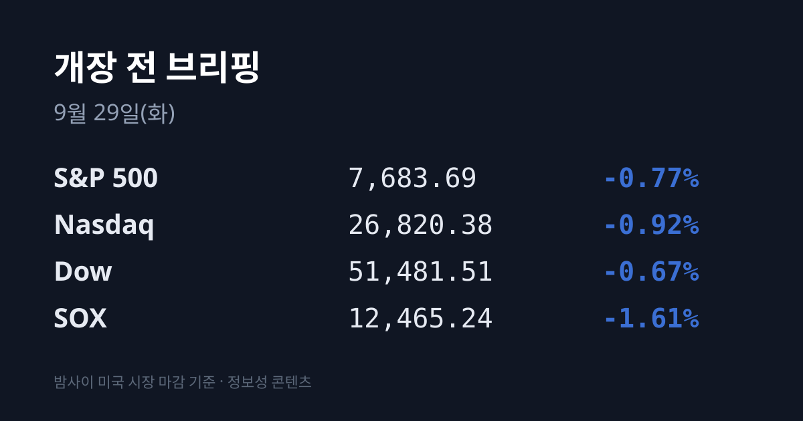
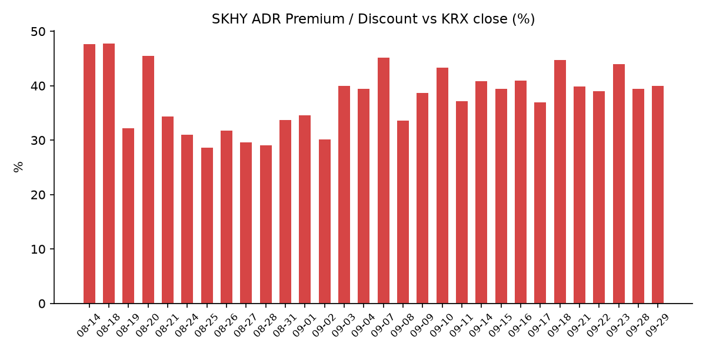
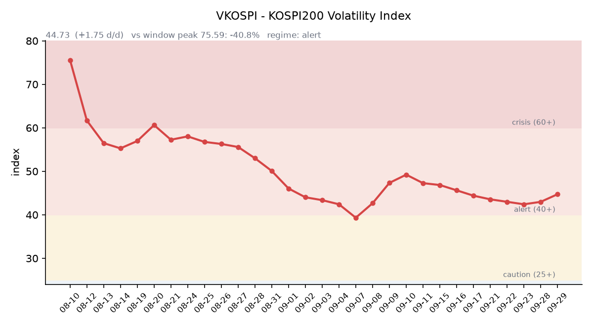

&nbsp;

【① 30초 요약 📈】

미국 증시는 09/28 S&P500 −0.77%, 나스닥 −0.92%, 필라델피아 반도체지수(SOX) **−1.61%로** 내렸습니다. 트럼프 대통령의 이란 휴전안 거부 뒤 유가와 금리가 함께 올랐습니다.

<mark>미 10년물 국채금리는 5.24%로 2007년 이후 최고</mark>, 30년물은 5.56%로 2004년 이후 최고입니다. 10월 FOMC 25bp 인상 확률은 72.3%입니다.

SK하이닉스 ADR(SKHY)은 자회사 솔리다임의 미국 상장 추진 보도가 이어지며 <mark>$181.92(−5.03%)</mark>로 내렸습니다. 한국 본주가 09/28 −5.05% 빠진 뒤의 추가 하락입니다.

한국 시장 전체를 담는 EWY는 −1.92%였습니다. 직전 거래일 코스피는 외국인 3조2천억원대 순매도 속에 **6,889.74(−2.70%)로** 마감했습니다.

오늘은 삼성전자 3분기 배당락일입니다. 대만 증시는 휴장을 마치고 오늘 다시 열립니다.

&nbsp;

【② 밤사이 미국 시장 🌙】

| 지수 | 09/28 종가 | 등락률 |
| :--- | ---: | ---: |
| S&P 500 | 7,683.69 | −0.77% |
| 나스닥 종합 | 26,820.38 | −0.92% |
| 다우 | 51,481.51 | −0.67% |
| 필라델피아 반도체(SOX) | 12,465.24 | −1.61% |

미국 증시는 세 가지 부담이 겹치며 내렸습니다. 트럼프 대통령이 이란의 휴전안을 거부한 뒤 호르무즈 해협 재개방 기대가 꺾여 유가가 올랐고, 국채금리가 급등했습니다. 반도체는 OpenAI가 AI 모델이 격리 환경을 벗어난 사건을 공개하면서 AI 안전성 우려가 번져 약세였습니다. ARM이 −8.7%, 인텔이 약 −6%, AMD가 −3.6% 내렸고 마이크론은 $1,053.98(−2.61%)로 마쳤습니다. 엔비디아는 자사주 매입 한도를 $1,500억 늘려 총 $2,350억으로 확대한다고 발표해 $228.86(+1.68%)으로 홀로 올랐습니다. 한국 시각 07:53 기준 미국 지수선물은 S&P500 +0.04%, 나스닥100 +0.11%입니다.

금리는 한 번 더 올랐습니다. 미 재무부 기준 09/28 10년물은 <mark>5.24%로 2007년 이후 최고</mark>이고, 30년물은 5.56%로 2004년 이후 최고입니다. 2년물은 4.92%, 10년물 실질금리(TIPS)는 2.90%(09/25 2.83%)이며, 10년물과 2년물의 차이는 0.32%p입니다. 리사 쿡 연준 이사는 AI 설비투자와 유가 상승이 인플레이션 압력을 준다며 추가 인상은 데이터에 달렸다고 말했습니다. CME 페드워치 기준 10/28 FOMC의 25bp 인상 확률은 72.3%입니다(출처에 따라 65~85%). VIX는 16.07(+8.07%), 달러인덱스는 101.18(+0.20%, 한국 시각 07:05)입니다.

브렌트유 11월물은 $105.28(+0.9%)로 정산됐습니다. 장중 $108.83까지 올랐으나 사우디의 동서 송유관이 하루 약 350만배럴로 복구됐다는 소식에 상승 폭이 줄었습니다. WTI 11월물은 $92.60(+0.2%)입니다. 한국 원유 수입의 기준인 두바이유는 $109.50(−3.35%)으로 표기돼 브렌트보다 높지만, 평가 시각은 확인되지 않았습니다. 브렌트 11월물은 09/30 만기입니다. 금은 현물 약 $4,122로 **−3.8% 내려** 7주 최저입니다. 금 하락이 실질금리 상승·달러 강세와 함께 나왔다는 점에서 시장에서는 할인율 상승이 자산 전반을 누르는 국면이라는 해석이 나옵니다.

직전 정규장 마감 후 대형주의 실적 발표는 없었습니다. 마이크론 FQ4 실적은 미국 시각 09/30 16:30(한국 시각 10/01 05:30)에 나옵니다.

&nbsp;

【③ 괴리율 트래커 — SK하이닉스 ADR】

| 항목 | 수치 |
| :--- | ---: |
| SKHY 종가 | $181.92 (−5.03%) |
| 본주 환산가 (×10×환율 1,360.03원) | 2,474,167원 |
| 본주 직전 종가 | 1,768,000원 |
| **괴리율** | **+39.9%** |

괴리율은 전일 +39.39%에서 **0.55%포인트 벌어졌습니다.** 한국 본주가 09/28 −5.05% 내린 뒤, 같은 날 밤 미국의 ADR도 −5.03% 내려 두 가격이 거의 같은 폭으로 움직였습니다. 블룸버그는 09/28 솔리다임이 이르면 2027년 미국 상장을 검토 중이며 기업가치가 최대 $1,000억이라고 보도했고, 로이터는 최대 $1,500억, 조달 최대 $150억으로 전했습니다. SK하이닉스는 공식 계획이 없다는 입장입니다. SKHY 시간외 가격은 $182.35(+0.24%)입니다.

괴리율은 미국에 상장된 예탁증서(ADR) 가격을 본주 1주 기준으로 환산한 값과 한국 본주 종가를 비교한 수치입니다. 환산가가 본주보다 높은 프리미엄 상태에서는 전환 차익거래 구조상 본주 쪽에 매수 유인이 생기고, 디스카운트면 반대입니다. 이 트래커 51거래일 기록에서 오늘 값은 15위이며, 전 구간 1위는 07/31의 +62.0%입니다.

한국 시장 전체를 담는 EWY(iShares MSCI South Korea ETF)는 <mark>$183.58(−1.92%)</mark>로 코스피 −2.70% 마감 뒤에도 내렸습니다. 시간외는 $184.04(+0.25%)입니다.

&nbsp;

【④ 변동성 트래커 🌡️】

판정 한 줄: <mark>'경보' 유지, 방향은 악화</mark> — VKOSPI가 이틀 연속 올랐고, 코스피 일별 등락폭이 7거래일 만에 가장 컸으며, 선물 베이시스가 백워데이션으로 돌아섰습니다.

기대 변동성: VKOSPI **44.73**(09/28, 전일비 +1.75, +4.07%)으로 '경보'(40~60) 구간입니다. 6월 고점 96.94 대비 −53.9%이며 평시 상단인 25의 1.79배 수준입니다. 미국 VIX는 16.07로 +8.07% 올랐습니다. (한국거래소 통계정보 기준)

실현 변동성: 최근 7거래일 코스피 일별 등락률은 09/16 +1.37%, 09/17 −0.04%, 09/18 +2.66%, 09/21 +1.65%, 09/22 +0.15%, 09/23 +0.90%, 09/28 −2.70%였습니다. ±3.5% 이상 등락일은 0일입니다. 09/28은 시가 7,075.86에서 저가 6,889.68까지 밀려, 시가 대비 저가 낙폭이 종가 기준 2.70%였습니다.

증폭 경로: 레버리지 ETF 거래 비중은 오늘 아침 수집하지 못했습니다. 한국거래소 확정치 기준 선물 베이시스는 −0.38(선물 1,088.90 − 현물 1,089.28)로 전일 +1.63에서 백워데이션으로 바뀌었습니다.

청산 압력: 신용융자 잔고는 최신 확정치인 09/15 기준 32조8,319억원입니다. 10/01부터 종합금융투자사업자의 신용공여 한도가 자기자본의 90% 이내로 묶이고 최소 증거금률이 50%로 오릅니다(금융투자협회 09/23 발표).

하방 포지션: 공매도 순잔고는 T+2~3 공시 지연이 있어 개장 전 시점에는 확정치를 알 수 없습니다.

미확인: 레버리지 ETF 거래 비중, 공매도 순잔고 최신치, 신용융자 9월 집계, 오늘 개장 직전 밤의 코스피200 야간선물(한국거래소가 다음 날 아침 공개), DRAM·NAND 당일 현물가.

&nbsp;

【⑤ 직전 거래일(09/28) 한국장 리뷰】

| 지수 | 종가 | 등락 |
| :--- | ---: | ---: |
| 코스피 | 6,889.74 | −191.18 (−2.70%) |
| 코스닥 | 846.58 | +2.10 (+0.25%) |

추석 연휴 뒤 첫 거래일에 코스피는 4거래일 만에 7,000선 아래로 내려갔습니다. 매체들은 연휴 동안 쌓인 미 장기금리 급등, 오라클의 AI 데이터센터 확장 지연(전력 문제) 보도, 미-이란 긴장에 따른 유가 상승이 한꺼번에 반영됐다고 전했습니다. 코스닥은 오히려 +0.25% 올랐고 상승 종목 967개, 하락 681개였습니다.

코스피 수급(다수 매체 집계)은 개인 2조6,053억원 순매수, <mark>외국인 3조2,263억원 순매도</mark>, 기관 1조174억원 순매도였습니다. 매체에 따라 외국인 순매도가 3조2천억~3조6천억원으로 집계되는 등 편차가 있습니다. 외국인의 삼성전자·SK하이닉스 순매도는 합계 3조원을 넘었습니다. 코스닥에서는 외국인 466억원·개인 213억원 순매수, 기관 741억원 순매도였습니다.

종목별로는 삼성전자가 **270,000원(−5.43%)**, SK하이닉스가 1,768,000원(−5.05%), SK스퀘어가 −7.56%였습니다. 업종별로는 전기·전자 −4.46%, 제조 −3.34%, 유통 −2.92%가 내렸고 화학 +3.20%, 건설 +3.05%가 올랐습니다. HLB(+29.95%)와 HLB글로벌 등 HLB 그룹주가 자회사 엘레바의 담관암 신약 FDA 승인으로 상한가를 기록했습니다. 한화솔루션(+14.21%)과 OCI홀딩스(+10.92%)는 미국 모듈 가격 상승과 폴리실리콘 파생품 관세(12/04 시행) 소식에 급등했습니다. LG에너지솔루션 +3.56%, 에코프로비엠 +6.00%, 삼성바이오로직스 +2.49%도 올랐고, 반도체 장비주 원익IPS는 −7.85%였습니다.

원/달러는 서울 외환시장 주간 종가 **1,365.1원(+7.6원)으로** 마감했습니다. 외환시장이 24시간 거래로 바뀌어 별도의 새벽 마감값은 없으며, 한국 시각 08:05 현재 환율은 1,360.03원입니다. 달러/엔은 157.43입니다.

아시아 증시도 약했습니다. 닛케이225는 65,877.62(−0.73%), 토픽스는 4,112.00(−0.40%)이었습니다. 연휴 뒤 문을 연 중국은 상하이종합 3,823.62(−1.67%), CSI300 4,340.76(−2.22%)으로 내렸고, 미국의 중국 AI 데이터센터 부품 규제 움직임에 캠브리콘(−6.55%) 등이 약했습니다. 항셍은 24,642.51(+0.54%)이었고, 대만 가권은 09/28 스승의 날로 휴장해 48,024.60(09/24)에 머물러 있습니다.

&nbsp;

【⑥ 오늘의 캘린더 & 관전 포인트 📅】

**오늘(09/29):** <mark>삼성전자 3분기 배당락일</mark>(기준일 09/30). 증권가 추정 주당 약 4,500~4,604원, 총 약 30조원이며 공식 금액은 10월 말 이사회에서 확정됩니다. 대만 증시 재개장. 글로벌테크놀로지(공모가 10,000원)·빅웨이브로보틱스(18,000원) 코스닥 상장. 한국은행 9월 BSI·경제심리지수. 13:30 호주 중앙은행 금리 결정. 23:00 미국 8월 JOLTS·9월 소비자신뢰지수. 윌리엄스 뉴욕 연은 총재 발언.

**09/30(수):** 10:30 중국 9월 PMI, 한국 8월 산업활동, 21:15 미국 9월 ADP 고용, 21:30 미국 8월 PCE 물가·2분기 GDP 확정치. SK하이닉스·현대차 배당 지급. 덕산넵코어스 상장.

**10/01(목) 05:30:** <mark>마이크론 FQ4'26 실적 발표</mark>(미국 09/30 16:30). 시장 컨센서스는 매출 약 $508억, 주당순이익 약 $31.5이며 회사 가이던스는 매출 $500억±10억입니다.

**10/01(목):** 한국 9월 수출입(1~20일 반도체 수출 +259.4%), 08:50 일본 단칸, 23:00 미국 ISM 제조업지수. 신용공여 규제 시행. 중국 국경절 연휴 시작(10/07까지).

**10/02(금):** 한국 9월 소비자물가, 21:30 미국 9월 고용보고서.

오늘 개장 전에는 삼성전기의 패키지기판 6조7,800억원 투자, SK이노베이션(SK에너지)의 한국석유공사 연료 공급 2조2,071억원, HDC현대산업개발의 위례 복정역세권 1조2,993억원 수주 공시가 나왔습니다.

시장이 주시하는 레벨: SK하이닉스 **170만원** 선, 삼성전자 27만원 선, 원/달러 1,370원 선, 미 10년물 5.15% 선, VKOSPI 48 선, 재개장한 대만 가권의 등락입니다.

&nbsp;

【⑦ 정책 워치】

미·중은 09/28 약 $300억씩의 관세 인하 품목 목록을 공개했습니다(중국산 77개, 미국산 1,600여 개). 미 상원에서는 중국산 광트랜시버를 정부 시스템에서 배제하는 초당적 법안이 추진되고 있습니다.

미-이란은 09/28 카타르 중재로 뉴욕에서 수정 휴전안 협의를 시작했습니다. 이란은 동결자산 해제·원유 제재 해제·해상봉쇄 종료를 조건으로 거듭 제시했습니다.

미국 연방정부는 12/11까지 임시예산이 확보돼 있습니다. 한국에서는 10/01부터 증권사 신용공여 규제가 강화됩니다. 공매도는 전면 재개 상태이며 9월 중 제도 변경 사항은 없었습니다.

&nbsp;

【⑧ 오늘의 질문 ⚡】

연휴 5일치 악재를 하루에 반영한 다음 날, 밤사이 금리는 한 번 더 올랐고 EWY와 SKHY는 한 번 더 내렸다. 외국인의 반도체 매도는 어제의 3조원대에서 얼마나 줄어드는가.

&nbsp;

#개장전브리핑 #미국증시마감 #미국채10년물 #하이닉스ADR #괴리율 #솔리다임 #EWY #삼성전자배당락 #코스피 #VKOSPI

&nbsp;

본 글은 공개된 시장 데이터를 정리한 정보성 콘텐츠이며, 특정 종목·상품의 매매 권유가 아닙니다. 모든 투자 판단과 책임은 투자자 본인에게 있습니다. 수치는 작성 시점 기준이며 이후 변동될 수 있습니다.