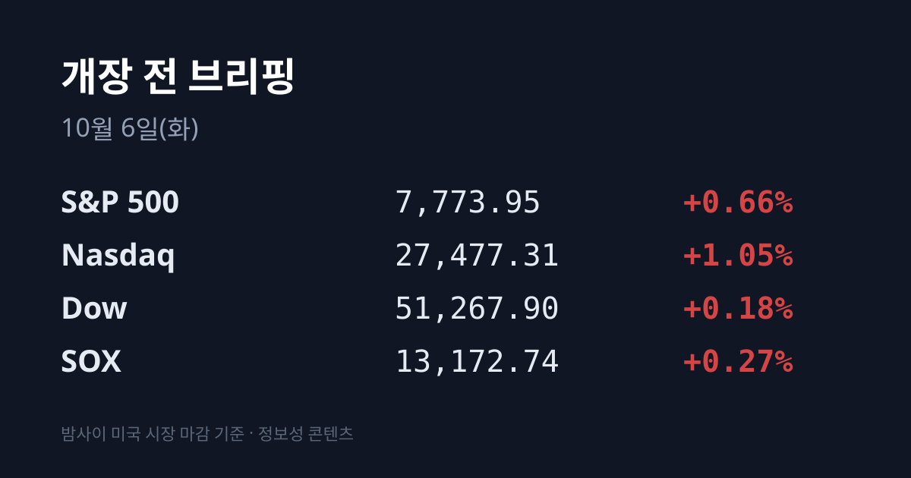
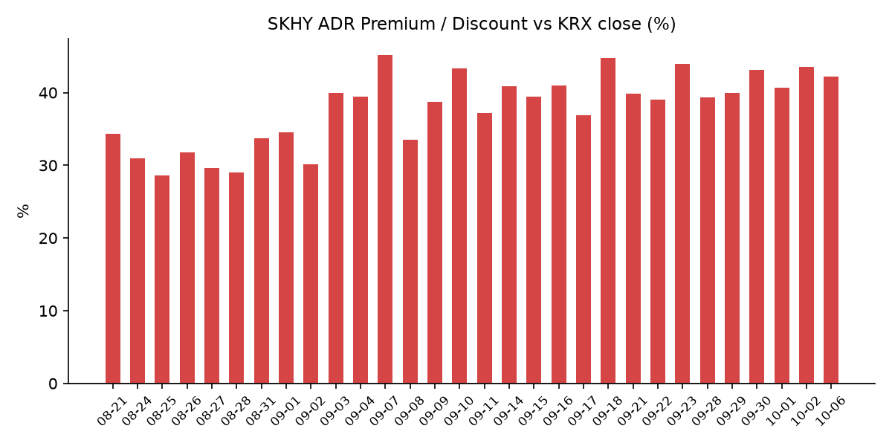
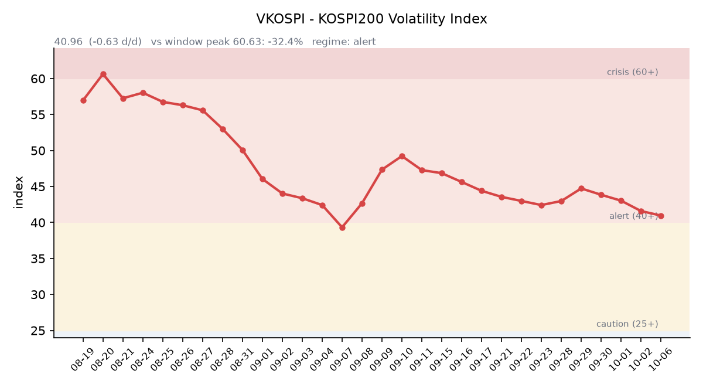

&nbsp;

【① 30초 요약 📈】

한국 증시가 쉰 10/03~05 동안 미국은 10/02(금)·10/05(월) 2거래일 열렸습니다. 두 세션 누적으로 <mark>나스닥 +2.25%, 필라델피아 반도체지수(SOX) +2.68%</mark>였고, 나스닥은 10/05 사상 최고 종가를 기록했습니다.

미국 9월 비농업 고용은 **+2.9만 명으로** 예상(8.4만~9만 명)을 크게 밑돌았고 실업률은 4.2%였습니다. 10월 FOMC 금리 인상 확률은 약 36%에서 약 17%로 내렸다고 보도됐습니다(CNBC, 10/02).

반면 미 10년물 금리는 5.24%에서 5.31%로 올랐습니다. 미국 반도체 상승은 TSMC·브로드컴·엔비디아가 이끌었고, 마이크론(−3.05%)·샌디스크(−4.67%) 등 메모리주는 두 세션 연속 내렸습니다.

한국 시장 전체를 담는 EWY는 2세션 누적 +2.87%, SK하이닉스 ADR(SKHY)은 +0.79%였습니다. 괴리율은 +42.2%로 직전보다 1.34%포인트 좁혀졌습니다.

원/달러는 10/02 서울 종가 1,350.6원에서 한국 시각 07:16 기준 1,342.20원으로 내려왔습니다. 브렌트유는 사우디의 아시아향 판매가 인하에 $100.32로 2세션 누적 −1.95%였습니다.

&nbsp;

【② 밤사이 미국 시장 🌙】

한국이 쉬는 사이 미국은 두 번 장을 열었습니다. 아래 누적 등락은 한국 증시가 마지막으로 반영한 10/01 미국 종가 대비입니다.

| 지수 | 10/02 등락 | 10/05 종가 | 10/05 등락 | 2세션 누적 |
| :--- | ---: | ---: | ---: | ---: |
| S&P 500 | +0.73% | 7,773.95 | +0.66% | +1.40% |
| 나스닥 종합 | +1.19% | 27,477.31 | +1.05% | +2.25% |
| 다우 | +0.49% | 51,267.90 | +0.18% | +0.67% |
| 필라델피아 반도체(SOX) | +2.40% | 13,172.74 | +0.27% | +2.68% |

10/02(금)에는 9월 고용보고서가 나왔습니다. 비농업 고용은 2.9만 명 늘어 예상(8.4만~9만 명)에 크게 못 미쳤고, 실업률은 4.2%(예상 4.1%), 시간당 임금은 전월 대비 +0.1%(전년 대비 3.0%)였습니다. 7~8월 고용은 합계 6.0만 명 하향 수정돼 7월이 −1.0만 명으로 바뀌었습니다. 금리 인상 베팅이 줄면서 반도체가 올랐습니다. 브로드컴은 $600억 규모 AI 칩 금융 계약 보도에 +3.35%, 테슬라는 3분기 인도량 486,532대(예상 약 46.3만 대)에 올랐습니다. 반면 도시바가 HDD 생산능력을 두 배로 늘린다고 밝히자 시게이트는 −10.2% 내렸습니다.

10/05(월)에는 AI·기술주가 지수를 끌어올렸습니다. 엔비디아는 $238.90(+2.12%)으로 사상 최고가를 기록했습니다. 일론 머스크가 칩 제조 사업 '테라팹(Terafab)'과 관련해 TSMC와 초기 논의를 하고 있다고 확인하자 TSMC ADR은 $485.80(+2.75%)으로 사상 최고가에 올랐고 인텔은 −2.63% 내렸습니다. 9월 ISM 서비스업 지수는 54.9(예상 55.1)였지만 가격지수는 74.0으로 2022년 7월 이후 가장 높았습니다.

반도체 안에서는 방향이 갈렸습니다. 2세션 누적으로 TSMC ADR +5.79%, 브로드컴 +5.49%, 엔비디아 +3.48%, AMD +2.60%가 오른 반면 <mark>마이크론은 $1,063.96(−3.05%), 샌디스크는 −4.67%로 메모리주는 두 세션 연속 내렸습니다.</mark> 인텔은 −3.18%였습니다. 10/05 장 마감 뒤에는 대형주 실적이나 큰 뉴스가 없었습니다. 주말에는 오라클이 텐센트에 동남아 데이터센터의 AI 칩 약 10만 개를 5년간 임대하는 $70억 계약이 보도됐습니다. 한국 시각 07:08 기준 미국 지수선물은 S&P500 +0.08%, 나스닥100 +0.14%입니다.

미 국채 금리는 고용 부진에도 올랐습니다. 미 재무부 기준 10년물은 10/01 5.24%에서 10/02 5.28%, 10/05 **5.31%로** 2세션 동안 7bp 올랐습니다. 2년물은 4.84%(+6bp), 30년물은 5.66%(+5bp), 10년물 실질금리(TIPS)는 2.95%(+7bp)이고, 10년물과 2년물의 차이는 0.47%p입니다. 10/27~28 FOMC의 25bp 인상 확률은 CNBC가 10/02 약 17%(1주 전 약 36%)로 전했고, 보도에 따라 16~23%입니다. 12월까지의 인상 확률은 75% 이상으로 보도됐습니다. VIX는 15.52, 달러인덱스는 102.10(한국 시각 07:04)입니다.

유가는 두 세션 모두 내렸습니다. WTI 11월물은 $89.43(누적 −3.70%), 브렌트 12월물은 $100.32(누적 −1.95%)로 정산됐습니다. 10/02에는 유럽의 비상 경유 재고 방출이, 10/05에는 사우디 아람코가 11월 아시아향 아랍라이트 판매가격을 기준유가 대비 −$5(6년 만의 최저)로 낮춘 것이 영향을 줬습니다. 한국 원유 수입의 기준인 두바이유는 10/02 표기 기준 $108.79(한국석유공사)로 브렌트보다 약 $6.5 비싼 상태가 이어지고 있습니다. 금 현물은 10/05 약 $4,140으로 10/01보다 약 0.9% 내렸습니다. 같은 기간 실질금리와 달러인덱스는 올랐습니다.

&nbsp;

【③ 괴리율 트래커 — SK하이닉스 ADR】

| 항목 | 수치 |
| :--- | ---: |
| SKHY 종가 (10/05) | $195.02 (−0.06%) |
| 본주 환산가 (×10×환율 1,342.20원) | 2,617,558원 |
| 본주 직전 종가 (10/02) | 1,841,000원 |
| **괴리율** | **+42.2%** |

괴리율은 직전 +43.52%에서 **1.34%포인트 좁혀졌습니다.** SKHY는 10/02 $195.13(+0.84%), 10/05 $195.02(−0.06%)로 2세션 누적 +0.79%였고, 같은 기간 원/달러가 1,359.55원(10/02 아침 기준)에서 1,342.20원으로 내려 환산가도 함께 낮아졌습니다. SKHY 시간외 가격은 $194.66(−0.18%)입니다.

괴리율은 미국에 상장된 예탁증서(ADR) 가격을 본주 1주 기준으로 환산한 값과 한국 본주 종가를 비교한 수치입니다. 환산가가 본주보다 높은 프리미엄 상태에서는 전환 차익거래 구조상 본주 쪽에 매수 유인이 생기고, 디스카운트면 반대입니다. 오늘 값은 이 트래커 55거래일 기록에서 12위이며, 전 구간 1위는 07/31의 +62.0%입니다.

한국 시장 전체를 담는 EWY(iShares MSCI South Korea ETF)는 10/02 $191.88(+3.10%), 10/05 $191.46(−0.22%)로 <mark>2세션 누적 +2.87%</mark>였습니다. 같은 기간 한국 증시가 반영한 것은 10/02 코스피 +0.46%뿐입니다. EWY 시간외는 $191.85(+0.20%)입니다.

&nbsp;

【④ 변동성 트래커 🌡️】

판정 한 줄: <mark>'경보' 유지, 방향은 진정 — VKOSPI 4거래일 연속 하락으로 경보 하단(40)까지 0.96포인트</mark>이고, 레버리지 ETF 비중은 20%대로 올라섰습니다.

기대 변동성: VKOSPI **40.96**(10/02, 전일비 −0.63, −1.51%)으로 '경보'(40~60) 구간입니다. 4거래일 연속 내렸고, 6월 고점 96.94 대비 −57.7%이며 평시 상단인 25의 1.64배 수준입니다.

실현 변동성: 최근 7거래일 코스피 일별 등락률은 09/22 +0.15%, 09/23 +0.90%, 09/28 −2.70%, 09/29 −0.27%, 09/30 −0.48%, 10/01 +1.95%, 10/02 +0.46%였습니다. ±3.5% 이상 등락일은 0일입니다. 10/02 장중 범위는 6,927.88~7,011.04였습니다.

증폭 경로: 전체 ETF 거래대금 중 레버리지 ETF 비중은 **20.06%로** 직전(19.51%)보다 올랐습니다. KODEX 레버리지 1조5,724억원(회전율 26.74%), KODEX 코스닥150레버리지 5,395억원(14.27%), KODEX 반도체레버리지 4,661억원(35.42%), KODEX 200선물인버스2X 2,880억원(39.19%), TIGER 반도체TOP10레버리지 1,900억원(25.62%) 순입니다(네이버 ETF 목록, 10/06 07:17 스냅샷). 선물 베이시스는 +4.15(선물 1,113.20 − 현물 1,109.05)로 직전 +3.27에서 조금 벌어졌습니다.

청산 압력: 신용융자 잔고는 09/23 기준 32조7,764억원으로, 09/04 고점(33조5,958억원)보다 낮습니다(파이낸셜뉴스 보도). 10/19부터 증권사 신용공여의 단일 종목 쏠림 15% 상한이 적용되고, 연말까지 최저 담보비율이 45%에서 50%로 오릅니다.

하방 포지션: 공매도 순잔고는 T+2~3 공시 지연이 있어 개장 전 시점에는 확정치를 알 수 없습니다.

미확인: 공매도 순잔고 최신치, 10월 반대매매 일별 금액, 오늘 개장 직전 밤의 코스피200 야간선물(한국거래소가 다음 날 아침 공개), DRAM·NAND 당일 현물가.

&nbsp;

【⑤ 직전 거래일(10/02) 한국장 리뷰】

| 지수 | 종가 | 등락 |
| :--- | ---: | ---: |
| 코스피 | 7,003.74 | +32.39 (+0.46%) |
| 코스닥 | 893.29 | −1.00 (−0.11%) |

코스피는 5거래일 만에 7,000선을 되찾았습니다. 장중 6,927.88까지 내렸다가 7,011.04까지 올랐습니다. 코스닥은 5거래일 연속 상승을 멈췄습니다.

코스피 수급은 기관 3,814억원 순매수, 개인 1조7,206억원·외국인 1,438억원 순매도였고 기타법인이 1조4,834억원 순매수했습니다(외국인은 보도에 따라 −1,334억~−1,438억원). <mark>외국인은 6거래일 연속 순매도했지만 규모는 사흘째 줄었습니다</mark>(09/30 −2조2,747억 → 10/01 −3,366억 → 10/02 −1,438억원). 외국인은 9/1~10/2 코스피에서 약 20.3조원을 순매도했고, 이 중 SK하이닉스가 약 12.0조원, 삼성전자가 약 5.19조원이었습니다. SK하이닉스 외국인 지분율은 49.76%로 약 3년 4개월 만의 최저입니다. 코스닥은 외국인 1,731억원 순매도, 기관 937억원·개인 815억원 순매수였습니다.

삼성전자는 276,000원(0.00%)으로 보합, SK하이닉스는 1,841,000원(+0.44%)으로 마감했습니다. 두 종목 모두 약세로 출발했다가 보합권으로 돌아왔습니다. 매체들은 10/08 삼성전자 3분기 잠정실적 발표를 앞둔 관망, 높은 금리, 외국인 매도를 이유로 꼽았습니다.

정유주가 급등했습니다. 중국이 10월 석유제품 수출을 중단한다는 소식과 미국의 중동 증파 보도에 **S-Oil +11.69%,** SK이노베이션 +10.32%, GS +4.11%였고 석유·가스 업종은 +5.14%였습니다. 방산·태양광·2차전지도 강했습니다(에코프로 +4.47%, LG에너지솔루션 +2.91%, 삼성SDI +2.32%). 삼성바이오로직스는 −4.51%였고 제약 업종이 −2.46%로 가장 약했습니다. 코스닥에서는 HPSP −5.07%, 아이오테크 −5.67%였습니다. AI 데이터센터 광통신 테마의 티엠씨·머큐리 등 5종목이 상한가였고, 나라스페이스테크놀로지는 +22.95%였습니다.

원/달러는 서울 외환시장 주간 종가 1,350.6원(−7.8원)으로 마감했습니다. 연휴를 앞둔 수출업체 달러 매도와 엔화 강세가 겹쳤습니다. 한국 시각 07:16 현재 환율은 1,342.20원, 달러/엔은 157.93입니다.

같은 날 발표된 9월 소비자물가는 전년 대비 +2.9%(8월 3.1%)였고, 식료품·에너지를 뺀 근원물가는 2.8%(8월 3.4%)였습니다. 석유류는 +14.8%였습니다.

아시아 증시는 한국이 쉬던 10/05 크게 올랐습니다. 닛케이225는 69,946.86(+2.40%)으로 장중 약 3개월 만에 70,000을 넘었고(도쿄일렉트론 +5.2%), 토픽스는 4,145.22(+1.33%)였습니다. 대만 가권은 49,712.04(+2.55%)로 사상 최고치에 마감했고 TSMC는 +3% 올랐습니다. 항셍은 24,040.34(+0.28%)였습니다. 중국 본토 증시는 10/08 다시 열립니다.

&nbsp;

【⑥ 오늘의 캘린더 & 관전 포인트 📅】

**오늘(10/06):** 진코스텍 공모 청약 마감(공모가 23,500원, 10/15 상장 예정). 엘리스그룹 공모가 확정. 9월 말 외환보유액 발표. 21:30 미국 8월 무역수지. 윌리엄스·보우먼 연준 인사 발언.

**10/07(수):** 엘리스그룹 청약(~10/08). 23:30 미국 원유 재고.

**10/08(목):** <mark>삼성전자 3분기 잠정실적</mark>(FnGuide 영업이익 컨센서스 108.13조원). 03:00 FOMC 의사록(9월 회의분). **14:30 TSMC 9월 매출.** 중국 본토·후강퉁 재개장. 21:30 미국 신규 실업수당 청구.

**10/09(금):** 한국 증시 휴장(한글날). 23:00 미시간대 10월 소비자심리 예비치.

**10/14** 미국 9월 CPI, **10/15** PPI, **10/22** 한국은행 금통위, **10/27~28** FOMC, **10/30** 일본은행 결정.

이번 주 한국 증시 거래일은 10/06·07·08 사흘입니다. 시장이 주시하는 레벨: SK하이닉스 180만원 선, 원/달러 1,355원 선, 미 10년물 5.35% 선, 브렌트 $104 선, VKOSPI 44 선입니다.

&nbsp;

【⑦ 정책 워치】

연휴 동안 한국 증시가 아직 반영하지 않은 대외 사건이 있었습니다. 북한은 10/03 새벽 중거리급 극초음속 미사일을 발사했습니다(북한 주장 약 1,000km, 합참 700km 이상). 예멘 정부는 10/04 후티 반군에 대한 공세를 선언했고, 후티는 사우디 리야드와 쿠라이스 유전, 동서 송유관을 공격했다고 주장했습니다. 10/03~04에는 호르무즈 해협과 오만 동쪽에서 유조선 2~3척이 발사체에 맞았습니다(인명 피해 없음). 이란 페제시키안 대통령은 10/05 "미국과의 협상은 무의미하다"고 말했습니다. 러시아는 10/03~04 키이우 교량 2곳을 타격했습니다. 미·중 사이에는 새 동향이 없었습니다.

한미 원전 협력(미국 원전 8기, 최대 $1,200억)은 APR1400 2기와 웨스팅하우스 AP1000 6기로 구성된다는 후속 보도가 나왔습니다. 증권사 신용공여는 10/19부터 단일 종목 15% 상한이 적용됩니다. 공매도는 전면 재개 상태이며 9~10월 제도 변경 사항은 없었습니다.

&nbsp;

【⑧ 오늘의 질문 ⚡】

미국·일본·대만이 이미 반영한 연휴 사이 상승을, 메모리주가 미국에서 두 세션 연속 내린 가운데 한국 증시는 어디까지 받아들이는가.

&nbsp;

#개장전브리핑 #미국증시마감 #연휴공백 #하이닉스ADR #괴리율 #SOX #미국고용 #삼성전자잠정실적 #코스피 #VKOSPI

&nbsp;

본 글은 공개된 시장 데이터를 정리한 정보성 콘텐츠이며, 특정 종목·상품의 매매 권유가 아닙니다. 모든 투자 판단과 책임은 투자자 본인에게 있습니다. 수치는 작성 시점 기준이며 이후 변동될 수 있습니다.