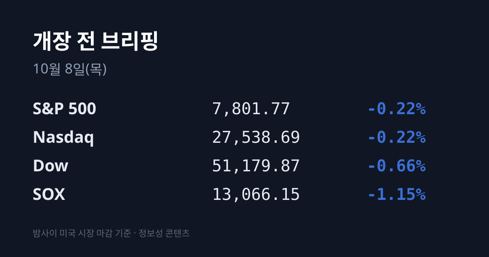
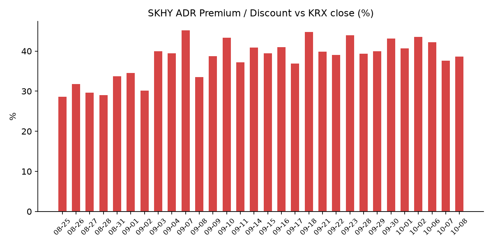
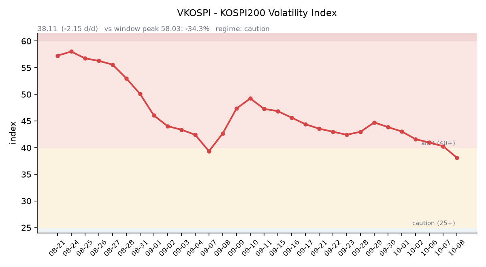

&nbsp;

【① 30초 요약 📈】

10/07 미국 증시는 장기금리 급등에 S&P500 7,801.77(−0.22%), 나스닥 27,538.69(−0.22%), 다우 51,179.87(−0.66%)로 전날 사상 최고 종가에서 물러났습니다.

<mark>미 10년물은 장중 5.36%로 2002년 이후 최고</mark>를 찍은 뒤 입찰을 무난히 마치며 5.28%로 마감했습니다. FOMC 의사록에는 "대부분 참석자가 연말까지 한 차례 더 인상이 적절하다"고 봤다는 내용이 담겼습니다.

반도체 지수(SOX)는 −1.15%였지만 마이크론은 **+4.06%로 반등했습니다.** 반면 SK하이닉스 ADR(SKHY)은 $178.25(−2.36%)였고, 괴리율은 +38.6%로 0.93%포인트 벌어졌습니다.

10/07 코스피는 외국인 약 2조6천억원 순매도에 6,803.90(−1.98%), 코스닥은 898.43(−2.34%)으로 900선을 내줬습니다.

오늘은 삼성전자 3분기 잠정실적, 옵션 만기, 반도체 ETF 정기 리밸런싱이 같은 날 겹치고, 내일(10/09)은 한글날 휴장입니다.

&nbsp;

【② 밤사이 미국 시장 🌙】

| 지수 | 종가 | 등락률 |
| :--- | ---: | ---: |
| S&P 500 | 7,801.77 | −0.22% |
| 나스닥 종합 | 27,538.69 | −0.22% |
| 다우 | 51,179.87 | −0.66% |
| 필라델피아 반도체(SOX) | 13,066.15 | −1.15% |

10/07(수) 미국 증시는 국채 금리 부담에 하락했습니다. 다우는 장중 550포인트 넘게 밀렸다가 금리 상승세가 진정되며 낙폭을 줄였습니다. 캐터필러는 투자의견 하향에 −5.75%였습니다. 반도체에서는 엔비디아 $237.47(−0.74%), AMD $645.86(−0.55%), TSMC ADR $472.20(−2.09%)이 내렸고 인텔은 +0.55%였습니다.

<mark>메모리는 지수와 반대로 움직였습니다.</mark> 마이크론은 $1,088.00(+4.06%)으로 사흘 만에 반등했고, 샌디스크도 +1.92%였습니다. DA데이비슨은 마이크론 목표가를 $2,100에서 $3,000으로 올렸습니다. 마이크론 대만 공장 노조의 성과급 분쟁과 파업 투표 예고는 이어지고 있습니다. 장 마감 뒤 반도체·빅테크 실적 발표는 없었습니다. 한국 시각 07:12 기준 미국 지수선물은 S&P500 +0.02%, 나스닥100 +0.09%입니다.

미 재무부 기준 10년물은 5.27%에서 **5.28%로** 1bp 올랐습니다. 장중 5.36%까지 올랐다가 390억 달러 규모 10년물 입찰이 무난히 끝나며 내려왔습니다. 30년물은 5.67%(+3bp), 2년물은 4.77%(−2bp), 10년물 실질금리(TIPS)는 2.92%(+1bp)이고, 10년물과 2년물의 차이는 0.51%p로 벌어졌습니다. FOMC 의사록(9/15~16 회의)은 추가 인상의 시점은 밝히지 않았습니다. CME FedWatch 기준 10/27~28 FOMC의 인상 확률은 20% 아래로, 일주일 전 37.6%에서 내려왔습니다. VIX는 15.08(+0.47%), 달러인덱스는 102.25(+0.41%)입니다.

브렌트유 12월물은 한국 시각 07:05 기준 $100.98(+0.40%), WTI 11월물은 $89.02(−0.47%)입니다. 한국석유공사 10/07 기준 두바이유는 $105.93으로 브렌트($100.20)보다 약 $5.7 비싸, 전날(약 $4.6)보다 차이가 다시 벌어졌습니다. 금 12월물은 $4,134.1(−1.27%)로 내렸고, 같은 날 실질금리와 달러인덱스는 올랐습니다.

&nbsp;

【③ 괴리율 트래커 — SK하이닉스 ADR】

| 항목 | 수치 |
| :--- | ---: |
| SKHY 종가 (10/07) | $178.25 (−2.36%) |
| 본주 환산가 (×10×환율 1,339.54원) | 2,387,730원 |
| 본주 직전 종가 (10/07) | 1,723,000원 |
| **괴리율** | **+38.6%** |

괴리율은 전일 +37.65%에서 **0.93%포인트 벌어졌습니다.** SKHY가 −2.36% 내린 폭이 같은 날 본주(−2.82%)보다 작았고, 원/달러가 1,336.82원에서 1,339.54원으로 올라 환산가를 받쳤습니다. SKHY 시간외 가격은 $179.12(+0.49%)입니다. 마이크론이 +4.06% 오른 밤에도 SKHY는 내렸습니다.

괴리율은 미국에 상장된 예탁증서(ADR) 가격을 본주 1주 기준으로 환산한 값과 한국 본주 종가를 비교한 수치입니다. 환산가가 본주보다 높은 프리미엄 상태에서는 전환 차익거래 구조상 본주 쪽에 매수 유인이 생기고, 디스카운트면 반대입니다. 오늘 값은 이 트래커 57거래일 기록에서 26위로 중간권이며, 전 구간 1위는 07/31의 +62.0%입니다.

한국 시장 전체를 담는 EWY(iShares MSCI South Korea ETF)는 $183.69(−1.45%)로 같은 날 코스피(−1.98%)보다 덜 내렸습니다. EWY 시간외는 $184.18(+0.27%)입니다.

&nbsp;

【④ 변동성 트래커 🌡️】

**판정 한 줄**: <mark>'경보'에서 '주의'로 — VKOSPI가 6거래일 연속 내려 40 아래(38.11)로 들어왔습니다.</mark> 코스피가 −1.98% 내린 날에도 내렸지만, 레버리지 ETF 비중은 다시 커졌습니다.

**기대 변동성**  VKOSPI **38.11**(10/07, 전일비 −2.15, −5.34%)으로 '주의'(25~40) 구간에 들어왔습니다. 6거래일 연속 하락이며, 6월 고점 96.94 대비 −60.7%, 평시 상단인 25의 1.52배입니다.

**실현 변동성**  최근 7거래일 코스피 일별 등락률은 09/28 −2.70%, 09/29 −0.27%, 09/30 −0.48%, 10/01 +1.95%, 10/02 +0.46%, 10/06 −0.89%, 10/07 −1.98%였습니다. ±3.5% 이상 등락일은 0일이고, 최근 5거래일 평균 일중 변동폭은 2.2%입니다. 10/07 장중에는 6,977.77(+0.52%)까지 올랐다가 저가 부근인 6,803.90에 마감했습니다.

**증폭 경로**  전체 ETF 거래대금 중 레버리지 ETF 비중은 **22.26%로** 직전(19.88%)보다 올라갔습니다. KODEX 레버리지 1조4,219억원(회전율 24.95%), KODEX 코스닥150레버리지 4,664억원(12.53%), KODEX 200선물인버스2X 4,428억원(57.80%), KODEX 반도체레버리지 3,002억원(24.21%), KODEX SK하이닉스단일종목레버리지 1,891억원(9.26%) 순입니다(네이버 ETF 목록, 10/08 07:17 스냅샷). 선물 베이시스는 +5.12(선물 1,078.75 − 현물 1,073.63)로 직전 +7.17에서 좁혀졌습니다.

**청산 압력**  신용융자 잔고는 마지막으로 확인된 09/23 기준 32조7,764억원입니다.

**하방 포지션**  공매도 순잔고는 T+2~3 공시 지연이 있어 개장 전 시점에는 확정치를 알 수 없습니다.

*미확인: 신용융자 잔고 최신치, 10월 반대매매 일별 금액, 공매도 순잔고 최신치, 오늘 개장 직전 밤의 코스피200 야간선물(한국거래소가 다음 날 아침 공개), DRAM·NAND 당일 현물가.*

&nbsp;

【⑤ 직전 거래일(10/07) 한국장 리뷰 📊】

| 지수 | 종가 | 등락 |
| :--- | ---: | ---: |
| 코스피 | 6,803.90 | −137.49 (−1.98%) |
| 코스닥 | 898.43 | −21.49 (−2.34%) |

코스피는 6,864.25로 내려 출발한 뒤 장중 6,977.77까지 반등했지만, 오후 들어 낙폭을 키워 이틀 연속 내렸습니다. 코스닥은 900선을 내줬습니다.

코스피에서 <mark>외국인은 약 2조6천억원을 순매도해 8거래일 연속 매도했고,</mark> 규모는 전날(1조7,509억원)보다 커졌습니다(보도에 따라 2조5,976억~2조6,314억원). 기관은 약 6,700억원 순매도, 개인은 약 2조5,600억원 순매수였습니다. 외국인은 반도체와 자동차 업종을 집중적으로 팔았고, 프로그램 매매는 1조8,793억원 매도 우위였습니다(서울신문). 코스닥에서는 외국인이 2,542억원을 순매도했습니다(핀포인트뉴스).

삼성전자는 268,500원(−1.29%), SK하이닉스는 **1,723,000원(−2.82%)으로** 마감했습니다. 외국인 순매도 1위는 SK하이닉스(1조3,633억원)였고, 기관은 삼성전자 2,034억원, SK하이닉스 1,764억원을 순매도했습니다(SBS Biz). 매체들은 삼성전자 잠정실적 발표를 앞둔 경계, 원화 강세에 따른 해외 매출 환산이익 감소와 대규모 성과급 충당금 우려(미래에셋증권 서상영 상무)를 이유로 꼽았습니다. 삼성전자·SK하이닉스 주가를 받쳐 온 자사주 매입이 마무리 단계에 들어선 점도 수급 부담으로 거론됐습니다(서울신문).

그 밖에 삼성전기 −4.24%, 현대차 −3.45%, 삼성바이오로직스 −2.52%였고 LG전자도 크게 내렸습니다. 코스닥에서는 전날 급등했던 에코프로·에코프로비엠·HLB와 레인보우로보틱스가 함께 내렸습니다. 동양고속·천일고속·국제약품은 상한가였습니다.

원/달러는 서울 외환시장 주간 마감 무렵(15:30) 1,340.4원으로 10/06(1,343.6원)보다 3.2원 내렸습니다. 한국 시각 07:20 현재 환율은 1,339.54원, 달러/엔은 158.01입니다.

아시아 증시는 10/07 대체로 약보합이었습니다. 닛케이225 70,035.71(−0.92%), 토픽스 4,154.11(−0.70%), 대만 가권 49,806.37(−0.03%), 항셍 24,130.50(−0.62%)이었습니다. 중국 본토 증시는 오늘 국경절 연휴를 마치고 다시 열립니다.

&nbsp;

【⑥ 오늘의 캘린더 & 관전 포인트 📅】

**오늘(10/08 목)** — <mark>삼성전자 3분기 잠정실적</mark>(영업이익 컨센서스: 연합인포맥스 105.4조원, 로이터 106.1조원, FnGuide 106.6조~108.1조원). **옵션 만기일.** 반도체 ETF 정기 리밸런싱(삼성증권 추정 반도체 18.1조원, 전체 23조원). 08:00 한국 8월 경상수지. 중국 본토·후강퉁 재개장. 14:30 TSMC 9월 매출. 엘리스그룹 공모 청약 마감. 19:00 펩시코 실적. 21:30 미국 신규 실업수당 청구.

**10/09(금)** — 한국 증시 휴장(한글날). 02:00 미국 30년물 국채 입찰. 10:30 중국 9월 CPI. 23:00 미시간대 10월 소비자심리 예비치. 델타항공 실적.

**10/12(월)** — 한국 증시 재개. 래블업·엠에스바이오 공모 청약(~10/13).

**10/14** 미국 9월 CPI, **10/15** PPI, **10/22** 한국은행 금통위, **10/27** SK하이닉스 3분기 실적, **10/27~28** FOMC, **10/30** 일본은행 회의.

골드만삭스는 오늘 삼성전자 주가 변동성이 커질 수 있으며 펀더멘털보다 당일 수급 요인이 주가를 더 흔들 수 있다고 봤습니다. 시장 참가자들이 주시하는 레벨은 삼성전자 잠정 영업이익 100조원 선, SK하이닉스 1,700,000원 선, 원/달러 1,350원 선, VKOSPI 40 선, 미 10년물 5.36% 선입니다.

&nbsp;

【⑦ 정책 워치 ⚡】

이란 페제시키안 대통령은 미국과의 협상이 "무의미하다"고 말했고(국영매체), 중재국 카타르는 양측의 메시지 교환이 계속되고 있다고 밝혔습니다. 예멘에서는 정부군과 후티의 교전이 이어지고 있습니다. 호르무즈 해협에서는 유조선 피격과 이란군 위협에 따른 회항 사례가 영국 해사무역기구(UKMTO)에 보고됐습니다. 러시아-우크라이나, 미·중, 북한 관련으로는 전일 대비 새 동향이 없었습니다.

공매도는 전면 재개 상태이며 10월 제도 변경 사항은 없었습니다.

&nbsp;

【⑧ 오늘의 질문 ❓】

삼성전자 잠정실적과 옵션 만기·ETF 리밸런싱이 한날에 겹친 연휴 전 마지막 거래일, 8거래일째 이어진 외국인 매도는 어떻게 움직이는가.

&nbsp;

#개장전브리핑 #미국증시마감 #하이닉스ADR #괴리율 #삼성전자실적 #옵션만기 #VKOSPI #코스피 #FOMC의사록 #마이크론

&nbsp;

*본 글은 공개된 시장 데이터를 정리한 정보성 콘텐츠이며, 특정 종목·상품의 매매 권유가 아닙니다. 모든 투자 판단과 책임은 투자자 본인에게 있습니다. 수치는 작성 시점 기준이며 이후 변동될 수 있습니다.*