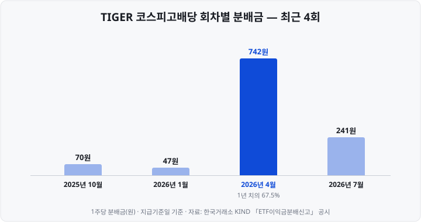

저도 배당 ETF를 처음 볼 때는 분배율이 높은 순서대로 고르면 된다고 생각했습니다. 그런데 지수 방법론 문서를 직접 읽어 보니 배당성장 ETF는 배당이 아니라 이익 성장률로 종목 순위를 매기고 있었고, <mark>분배율도 계산하는 기관마다 분모가 달랐습니다.</mark>

배당 ETF(Exchange Traded Fund, 상장지수펀드)는 이름이 비슷해도 **종목을 선정하는 기준이 서로 다릅니다.** 현재 배당수익률이 높은 종목을 편입하는 상품, 이익이 증가하는 기업을 편입하는 상품, 10년 이상 배당을 지속한 미국 기업을 재무 지표로 다시 선별해 편입하는 상품이 있습니다. 같은 '배당 ETF'라도 실제로 지급되는 분배금의 규모와 시기가 크게 다른 이유입니다.

이 글은 세 가지 유형의 기초지수가 종목을 어떻게 선정하는지 방법론 원문으로 비교하고, 상품 비교에 가장 많이 쓰이는 **분배율**의 계산 방법과 분배 주기·분배락·과세가 실제 수치로 어떻게 나타나는지 정리합니다. 분배금 수치는 2025년 10월~2026년 9월에 실제 지급된 금액이고, 기준 시점은 **2026년 10월**입니다.

본문의 상품명은 유형을 설명하기 위한 예시이며, 상품 간 우열을 판단하지 않습니다.

&nbsp;

【배당 ETF의 분배금은 어디서 나오나】

ETF는 기초지수가 정한 종목을 보유하고, 보유 종목에서 받은 배당금을 투자자에게 지급합니다. 이 돈을 **분배금**이라고 합니다. 따라서 배당 ETF의 분배금 규모는 **기초지수가 어떤 종목을 어떤 비중으로 편입하느냐**에 따라 결정됩니다.

배당 ETF를 비교할 때 먼저 확인할 것은 상품명이 아니라 **기초지수의 종목 선정 방법론**입니다. 방법론은 지수를 산출하는 기관(한국거래소, FnGuide, S&P 다우존스 지수 등)이 문서로 공개합니다. 투자설명서에서 기초지수를 확인하는 방법은 [ETF 투자설명서 읽는 법](https://blog.naver.com/hdglace/224421632113) 편에 정리했습니다.

&nbsp;

【세 가지 유형의 종목 선정 기준】

| 구분 | 고배당형 | 배당성장형 | 미국배당다우존스형 |
| :-- | :-- | :-- | :-- |
| 기초지수 예 | 코스피 고배당 50 (한국거래소) | 코스피 배당성장 50 (한국거래소) | Dow Jones U.S. Dividend 100 (S&P 다우존스 지수) |
| 기본 요건 | 3년 연속 배당, 3년 연속 순이익 | 7년 연속 배당, 배당 증가, 5년 연속 순이익 | 10년 연속 배당, 리츠 제외 |
| 순위 기준 | **배당수익률** | **주당순이익 성장률** | 재무 지표 4개 합산 점수 |
| 종목 수 | 50 | 50 | 100 |
| 비중 결정 | 배당수익률 비중(종목당 최대 3%) | 배당수익률 비중(종목당 최대 5%) | 시가총액 비중(종목당 4%·업종당 25% 상한) |
| 정기변경 | 연 1회(6월) | 연 1회(6월) | 연 1회(3월), 비중 조정은 분기마다 |

&nbsp;

【고배당형 — 현재 배당수익률이 높은 종목】

한국거래소는 방법론 문서에서 **코스피 고배당 50**을 "유가증권시장 상장종목 중 배당수익률이 높은 50종목을 구성종목으로 하여 개별 종목의 배당수익률 비중으로 가중하는 방식의 지수"로 정의합니다. 종목 선정은 두 단계로 이뤄집니다.

1. 일평균 시가총액과 거래대금이 각각 상위 80% 이내(시가총액 800억원 미만 제외)이고, **최근 3사업연도 연속 배당**을 실시했으며 평균 배당성향이 90% 미만이고, 3사업연도 연속 당기순이익을 낸 종목을 선별합니다. **배당성향**은 당기순이익 가운데 배당으로 지급한 금액의 비율입니다.
2. 매년 5월 첫 거래일부터 15거래일 동안의 평균 배당수익률(최근 사업연도 주당배당금 기준)이 높은 순으로 50종목을 선정합니다.

<mark>순위 기준이 현재의 배당수익률이므로, 주가 하락으로 배당수익률이 높아진 종목도 편입될 수 있습니다.</mark> 연속 배당·연속 순이익 요건은 이런 종목 가운데 실적이 뒷받침되지 않는 기업을 1단계에서 제외하는 기능을 합니다.

같은 고배당형이라도 지수마다 기준이 다릅니다. KODEX 고배당주가 추종하는 **FnGuide 고배당 Plus**는 직전 사업연도의 실제 배당이 아니라 **증권사 추정치를 집계한 예상 배당수익률로** 순위를 매기고, 업종당 10종목 이내로 제한합니다. 방법론에는 "최대 50종목"으로 적혀 있지만 2026년 10월 7일 삼성자산운용이 공개한 구성종목은 **20종목**이었습니다. <mark>지수 이름이나 최대 종목 수만으로 판단하지 말고 실제 구성종목을 확인해야 하는 이유입니다.</mark> 이 상품의 명칭은 2025년 6월 'KODEX 고배당'에서 'KODEX 고배당주'로 변경됐습니다.

&nbsp;

【배당성장형 — 순위 기준은 배당이 아니라 이익 성장】

**코스피 배당성장 50**은 기본 요건에서 요구하는 기간이 고배당형보다 깁니다. 최근 **7사업연도 연속 배당**, 최근 사업연도 주당배당금이 7년 평균보다 증가, 5사업연도 연속 당기순이익 등입니다.

그러나 50종목의 순위를 정하는 기준은 배당이 아닙니다. 방법론 원문은 "**주당순이익성장률**(최근 5사업연도의 평균 주당순이익 대비 최근 사업연도의 주당순이익)이 높은 순으로 50종목"을 선정한다고 규정합니다. 주당순이익은 EPS(Earnings Per Share, 당기순이익을 발행주식 수로 나눈 값)입니다. 이 지수를 추종하는 TIGER 배당성장의 상품 페이지도 이 점을 명시하고 있습니다.

> 기초지수를 구성하는 50종목은 '배당수익률'이 높은 종목이 아닌 '주당순이익 성장률'이 높은 종목으로 구성됩니다. 따라서 다른 배당주 ETF보다 (현금)배당수익률은 높지 않을 수 있습니다.

배당성장형은 **현재 배당수익률이 높은 기업이 아니라, 이익이 증가해 향후 배당을 늘릴 여력이 있는 기업에 투자하도록** 설계된 상품입니다. 아래 분배율 표에서도 이 차이가 확인됩니다.

&nbsp;

【미국배당다우존스형 — 재무 지표 4개로 다시 선별】

국내에 여러 상품이 상장된 **Dow Jones U.S. Dividend 100** 지수는 S&P 다우존스 지수(S&P Dow Jones Indices)가 산출합니다. 2026년 5월판 방법론에 따른 선정 절차는 다음과 같습니다.

1. Dow Jones U.S. Broad Stock Market 지수 구성종목 가운데 리츠(REITs, Real Estate Investment Trusts, 부동산투자회사)를 제외하고, **10년 이상 연속 배당**, 유동시가총액 5억 달러 이상, 3개월 일평균 거래대금 200만 달러 이상인 종목을 선별합니다.
2. 예정 연간 배당금(특별배당 제외) 기준 배당수익률이 상위 절반인 종목만 남깁니다.
3. 남은 종목을 네 가지 지표별로 순위를 매겨 합산합니다. ① 잉여현금흐름÷총부채 ② ROE(Return On Equity, 자기자본이익률) ③ 배당수익률 ④ 5년 배당성장률
4. 합산 점수 상위 100종목을 편입하고, 시가총액 비중으로 가중하되 한 종목은 4%, 한 업종은 25%를 넘지 못하도록 합니다.

④의 **5년 배당성장률**은 흔히 연평균 성장률로 소개되지만, 방법론 원문의 산식은 **최근 연도 주당배당금을 최근 연도를 포함한 5년간 주당배당금의 평균으로 나눈 값에서 1을 뺀 것**입니다. 매년 몇 %씩 증가했는지가 아니라, 최근 배당이 5년 평균보다 얼마나 높은지를 측정하는 지표입니다.

<mark>고배당형과 달리 배당수익률은 네 가지 지표 가운데 하나이고, 편입 비중은 시가총액으로 정합니다.</mark> 이에 따라 배당수익률이 가장 높은 종목보다 재무 구조가 안정적인 대형 배당주의 비중이 커집니다.

같은 지수를 추종하는 국내 상장 ETF는 여러 개이고, **분배금 지급기준일과 환헤지 여부**가 상품마다 다릅니다(2026년 10월 7일, 각 운용사 공식 자료).

| 상품 | 분배금 지급기준일 | 환헤지 | 총보수(연) |
| :-- | :-- | :-- | :-- |
| TIGER 미국배당다우존스 | 매월 마지막 영업일 | 환노출 | 0.01% |
| SOL 미국배당다우존스 | 매월 마지막 영업일 | 환노출 | 0.01% |
| SOL 미국배당다우존스(H) | 매월 마지막 영업일 | 환헤지 | 0.05% |
| ACE 미국배당다우존스 | 매월 15일(영업일이 아니면 직전 영업일) | 환노출 | 0.01% |
| KODEX 미국배당다우존스 | 매월 15일(영업일이 아니면 직전 영업일) | 환노출 | 0.0099% |
| SOL 미국배당다우존스2호 | 매월 15일(영업일이 아니면 직전 영업일) | 환노출 | 0.01% |

**환노출형은** 환율 변동을 헤지하지 않아 원·달러 환율의 변동이 수익률에 그대로 반영됩니다. TIGER 미국배당다우존스 투자설명서는 "이 투자신탁은 환헤지를 실행하지 않습니다"라고 적고 있습니다. 상품명 끝에 (H)가 붙은 **환헤지형은** 환율 변동의 영향을 줄이는 대신 헤지 비용이 발생합니다. 신한자산운용은 같은 지수에 대해 환노출형과 환헤지형을 모두 상장해 두고 있습니다.

SOL 미국배당다우존스2호는 다른 상품과 달리 배당을 포함한 **TR(Total Return, 총수익) 지수를** 추종하지만, 매월 15일을 분배금 지급기준일로 정해 분배금을 지급하고 있습니다. 관련 제도도 바뀌었습니다. 2025년 2월 소득세법 시행령 개정으로 2025년 7월 1일 이후 펀드에서 발생한 이자·배당은 분배를 유보할 수 있는 이익에서 제외됐습니다. 국내 주식 가격지수를 그대로 추적하는 ETF가 배당을 재투자하는 경우만 예외입니다.

지급기준일이 월말인 상품과 15일인 상품을 함께 보유하면 한 달에 두 차례 분배금을 받게 됩니다. 다만 같은 지수를 추종하는 상품에 투자금을 나눈 것이므로, 지급 횟수가 늘어난다고 연간 분배금 총액이 늘어나지는 않습니다.

&nbsp;

【분배율 — 기관마다 분모가 다르다】

배당 ETF를 비교할 때 가장 많이 참고하는 지표가 **분배율**입니다. 분배금을 가격으로 나눈 비율이며, 분모로 어떤 가격을 쓰는지가 기관마다 다릅니다.

| 기관 | 분배율 정의 | 분모 |
| :-- | :-- | :-- |
| 미래에셋자산운용(TIGER) | 주당분배금액 ÷ 분배락 전일 종가 × 100 | 시장 가격(종가) |
| 삼성자산운용(KODEX) | 주당분배금액 ÷ (분배락일 공시기준가 + 주당분배금액) × 100 | 기준가(NAV) |
| 삼성자산운용 '최근 1년 분배율' | 연간 분배금 ÷ 조회일 전일 NAV | 기준가(NAV) |
| 금융감독원(2025년 9월 유의사항) | 분배기준일의 ETF 순자산가치 대비 분배금 | 기준가(NAV) |

NAV(Net Asset Value, 순자산가치)는 ETF가 보유한 자산의 가치를 1주 단위로 환산한 값이고, 종가는 시장에서 실제로 거래된 가격입니다. 두 값은 대체로 비슷하지만 일치하지는 않습니다. 금융감독원은 분배율이 "투자원금 기준이 아닌" 순자산가치 대비 비율이라는 점도 강조했습니다. 투자자의 매수 가격 대비 비율이 아니라는 뜻입니다.

&nbsp;

【5개 상품의 분배율 계산】

최근 12개월(지급기준일 2025년 10월 31일~2026년 9월 30일) 분배금 합계를 2026년 9월 30일 종가로 나눠 계산하고, 공개된 수치와 비교했습니다.

| 상품 | 유형 | 12개월 분배금 | 9월 30일 종가 | 본 공부방 계산 | FunETF 1년 분배율 | 네이버 증권 |
| :-- | :-- | --: | --: | --: | --: | --: |
| TIGER 코스피고배당 | 고배당 | 1,100원 | 23,130원 | 4.76% | 4.75% | 4.77% |
| KODEX 고배당주 | 고배당 | 754원 | 17,330원 | 4.35% | 4.36% | 4.37% |
| TIGER 배당성장 | 배당성장 | 906원 | 34,285원 | 2.64% | 2.63% | 2.64% |
| TIGER 미국배당다우존스 | 미국배당다우존스 | 434원 | 14,155원 | 3.07% | 3.11% | 3.11% |
| SOL 미국배당다우존스 | 미국배당다우존스 | 408원 | 12,980원 | 3.14% | 3.19% | 3.18% |

세 수치가 0.01~0.05%p씩 다른 것은 분모가 다르기 때문입니다. FunETF는 12개월 합계를 10월 6일 기준가(NAV)로, 네이버 증권은 10월 6일 종가로 나눈 값이었고, 다섯 상품 모두 역산해 산식이 일치하는 것을 확인했습니다. 분모의 날짜가 바뀌면 같은 상품도 수치가 달라집니다. TIGER 배당성장의 분배율은 9월 23일 종가(34,700원) 기준으로는 2.61%입니다. <mark>분배율을 비교할 때는 같은 화면, 같은 날짜의 수치끼리 비교해야 합니다.</mark>

배당성장형(2.64%)이 고배당형(4.35~4.76%)보다 낮은 것은 앞에서 본 종목 선정 기준과 일치합니다.

&nbsp;

【분배율이 높다고 수익률이 높은 것은 아니다】

분배율과 기초지수의 배당수익률이 일치하지 않는 이유는 투자설명서에서 확인할 수 있습니다.

- **분배율은 운용사가 정합니다.** TIGER 투자설명서는 분배금을 "집합투자업자가 정하는 분배율을 기준으로 산출한 금액"으로 정의하고, 운용 목적에 따라 분배금을 지급하지 않을 수 있다고 적고 있습니다.
- **이익금을 초과해 분배할 수 있습니다.** KODEX 고배당주 투자설명서는 "이익금을 초과하여 분배금을 지급할 수 있습니다… 투자원금이 감소될 수 있습니다"라고 명시합니다.
- **해외형은 외국에서 원천징수된 이후의 배당을 받습니다.** 미국 주식의 배당은 현지에서 원천징수된 뒤 펀드에 입금됩니다.

또한 <mark>분배금은 ETF 순자산에서 지급되므로, 분배금을 지급한 만큼 ETF 가격이 하락합니다.</mark> 분배율만으로는 투자 성과를 판단할 수 없고, 분배금을 포함한 총수익률을 함께 확인해야 합니다. 이 과정은 아래 분배락 절에서 실제 수치로 확인합니다.

&nbsp;

【분배 주기 — 분기 분배는 4월에 집중된다】

TIGER 코스피고배당과 TIGER 배당성장은 1·4·7·10월 마지막 영업일에 분배하는 **분기 분배** 상품이고, KODEX 고배당주는 2024년 3월 분기 분배에서 **월 분배**로 전환했습니다. 분기 분배는 회차마다 금액 차이가 큽니다.

4월 분배금 1회가 연간 분배금의 **67.5%**(742원÷1,100원)를 차지했습니다. 12월 결산법인은 3월 정기주주총회에서 결산배당을 결의하고, 상법상 결의일로부터 1개월 안에 지급하므로 배당금이 4월에 집중적으로 입금됩니다. TIGER 배당성장은 4월 비중이 더 높아 4월 분배금(751원)이 12개월 합계(906원)의 **82.9%였고**, 2026년 1월에는 분배금 공시가 없었습니다.

따라서 **최근 1회 분배금에 연간 분배 횟수를 곱해 분배율을 추정하면 실제와 큰 차이가 납니다.** 9월 30일 종가 23,130원을 기준으로 계산하면 다음과 같습니다.

| 계산 방법 | 계산식 | 연 분배율 |
| :-- | :-- | --: |
| 4월 분배금 × 4회 | 742원 × 4 ÷ 23,130원 | 12.83% |
| 7월 분배금 × 4회 | 241원 × 4 ÷ 23,130원 | 4.17% |
| 최근 12개월 합계 | 1,100원 ÷ 23,130원 | 4.76% |

<mark>분기 분배 상품의 분배율은 최근 12개월 분배금 합계로 계산해야 합니다.</mark> 회차별 분배율이 표시된 화면에서 4월 회차의 수치만 보면 실제보다 약 2.7배 높게 보입니다.

&nbsp;

【월 분배 금액도 일정하지 않다】

월 분배 상품도 매월 같은 금액을 지급하지는 않습니다. 최근 12회 분배금은 다음과 같습니다.

| 지급기준일 | TIGER 미국배당다우존스 | KODEX 고배당주 |
| :-- | --: | --: |
| 2025년 10월 31일 | 30원 | 53원 |
| 2025년 11월 28일 | 38원 | 50원 |
| 2025년 12월 30일 | 40원 | 50원 |
| 2026년 1월 30일 | 32원 | 45원 |
| 2026년 2월 27일 | 38원 | 47원 |
| 2026년 3월 31일 | 36원 | 65원 |
| 2026년 4월 30일 | 33원 | 70원 |
| 2026년 5월 29일 | 36원 | 70원 |
| 2026년 6월 30일 | 45원 | 76원 |
| 2026년 7월 31일 | 37원 | 76원 |
| 2026년 8월 31일 | 30원 | 76원 |
| 2026년 9월 30일 | 39원 | 76원 |
| **합계** | **434원** | **754원** |

TIGER 미국배당다우존스는 30원에서 45원 사이에서 변동했고, KODEX 고배당주는 45~53원에서 3월 이후 65원·70원·76원으로 단계적으로 증가해 6~9월에는 76원을 4회 연속 지급했습니다. 국내 기업의 결산배당이 입금되는 3~4월 이후 금액이 증가한 것은 분기 분배와 같은 원인으로 볼 수 있습니다. 다만 그 금액을 여러 달에 걸쳐 같은 수준으로 나눠 지급하는 방식은 운용사가 공식적으로 밝힌 정책이 아닙니다. 투자설명서에는 평가이익·매매이익의 분배를 유보할 수 있다는 조항이 있고, 신한자산운용은 SOL 상품 페이지에 "운용사 정책에 따라 유보 및 지급률 변동 가능"이라고 적고 있습니다.

<mark>월 분배 상품이라고 연간 분배금 총액이 많은 것은 아닙니다.</mark> 총액은 기초지수가 편입한 종목의 배당으로 결정되고, 분배 주기는 연간 분배금을 몇 회로 나눠 지급하는지의 차이입니다.

&nbsp;

【분배락 — 분배금만큼 가격이 하락한다】

분배금을 받으려면 지급기준일 2영업일 전까지 매수해야 하고, 지급기준일 1영업일 전이 **분배락일**입니다. 날짜 계산은 [배당기준일·배당락일 계산법](https://blog.naver.com/hdglace/224384496256)과 같고, 공시를 찾는 방법은 [배당 캘린더 만드는 법](https://blog.naver.com/hdglace/224424475176) 편에 있습니다.

한국거래소는 분배락일 전날 「ETF 분배락 기준가격 안내」를 공시해, 직전 종가에서 분배금을 뺀 값을 분배락일의 기준가격으로 정합니다. TIGER 코스피고배당의 2026년 4월 분배(742원)를 단계별로 보면 다음과 같습니다.

| 단계 | 값 | 설명 |
| :-- | --: | :-- |
| ① 분배락 전일(4월 28일) 종가 | 26,870원 | 이날까지 매수해야 분배금을 받는다 |
| ② 분배금 | 742원 | 지급기준일 4월 30일 |
| ③ ① − ② | 26,128원 | |
| ④ 한국거래소 분배락 기준가격 | 26,130원 | ③을 호가가격단위(5원)에 맞춰 올린 값 |
| ⑤ 분배락일(4월 29일) 종가 | 26,140원 | |
| 종가 변화(⑤ − ①) | **−730원** | 분배금 −742원, 시장 등락 +10원 |

하루 동안 종가가 2.72% 하락했지만, 이 가운데 742원은 분배금 차감분이고 시장 등락에 따른 변화는 기준가격 대비 +10원(+0.04%)이었습니다. 분배금 742원을 받은 투자자의 자산 총액은 거의 변하지 않았다는 뜻입니다. 일반 계좌에서는 분배금에서 세금이 원천징수되므로, <mark>원천징수 세액만큼 자산이 감소합니다.</mark>

차트를 볼 때 주의할 점이 있습니다. 네이버 증권 일봉 데이터는 분배금을 반영해 과거 가격을 조정한 **수정주가**로 제공됩니다. TIGER 미국배당다우존스의 2026년 9월 28일 실제 종가는 14,440원이지만 수정주가는 14,404원입니다. 차트나 다운로드 데이터로 분배락일 전후를 비교하면 분배금만큼의 하락이 나타나지 않을 수 있으므로, 실제 체결 가격은 한국거래소 공시나 운용사 자료로 확인해야 합니다.

&nbsp;

【세금 — 국내 주식형과 해외형의 차이】

배당 ETF의 분배금에는 일반 계좌에서 배당소득세 15.4%(지방소득세 포함)가 원천징수됩니다. 매매차익의 과세 여부는 ETF의 보유 자산에 따라 달라집니다. 운용사 상품 페이지의 과세 표기는 다음과 같습니다(2026년 10월 7일).

| 구분 | 매매차익 | 분배금 |
| :-- | :-- | :-- |
| 국내 주식형 (TIGER 코스피고배당) | 비과세 | 현금 분배금 × 15.4% |
| 국내 상장 해외형 (TIGER 미국배당다우존스) | 매매차익과 과표기준가 증가분 중 적은 금액 × 15.4% | 현금 분배금과 과표기준가 증가분 중 적은 금액 × 15.4% |

과표기준가(과세표준 기준가격)의 의미와 계산은 [ETF 총보수와 세금](https://blog.naver.com/hdglace/224367512124) 편에 정리했습니다. 같은 편에서 다룬 것처럼, 2026년부터 시행된 **고배당기업 배당소득 분리과세는 ETF 분배금에 적용되지 않습니다.** 이 제도는 요건을 충족한 상장법인으로부터 직접 받은 배당소득이 대상입니다.

해외형은 펀드 단계에서 미국에 원천징수된 세금이 있습니다. 2025년 1월 1일부터는 펀드가 외국 세금을 환급받는 대신, 판매사가 투자자에게 배당소득세를 원천징수할 때 **외국에서 납부한 세금 가운데 인정된 금액을 공제**하는 방식으로 바뀌었습니다. TIGER 미국배당다우존스 투자설명서도 "원천징수의무자(판매사 등)가… 투자자별 외국납부공제 금액을 차감하여 원천징수 합니다"라고 적고 있습니다.

&nbsp;

【미국 주식을 직접 보유할 때와의 차이】

미국 배당주를 해외주식 계좌에서 직접 보유하면 배당금에서 한미조세조약의 제한세율에 따라 미국이 **15%를** 원천징수합니다. 국내 배당소득세율(14%)보다 높기 때문에 국내 증권사는 추가로 원천징수하지 않고, 차이 1%p도 환급되지 않습니다. 현지 원천징수세율이 14%보다 낮은 국가의 주식이라면 그 차액과 지방소득세가 국내에서 추가로 원천징수됩니다. 연간 금융소득이 2,000만원을 넘어 종합과세 대상이 되면 미국에 납부한 세금은 종합소득세 신고 때 외국납부세액공제로 한도 내에서 차감합니다.

국내 상장 ETF는 투자자가 아니라 펀드가 미국 배당을 받고, 투자자에게는 분배금 형태로 지급됩니다. 그래서 분배금의 과세 기준이 과표기준가 증가분과 연동되고, 직접 투자에서는 양도소득세(연 250만원 기본공제 후 22%) 대상인 매매차익도 ETF에서는 배당소득으로 과세된다는 점이 다릅니다.

<mark>국내 주식형 배당 ETF는 매매차익이 이미 비과세이므로, 절세 계좌의 효과는 주로 분배금에서 나타납니다.</mark> 해외형은 매매차익과 분배금 모두 과세되므로 절세 계좌의 효과가 더 큽니다. 계좌별 과세 방식과 해외 분배금의 이중과세 보완은 [절세 계좌에 담을 수 있는 상품](https://blog.naver.com/hdglace/224432750577) 편에 있습니다.

&nbsp;

【고를 때 확인할 항목】

| 확인 항목 | 확인 위치 | 확인하는 이유 |
| :-- | :-- | :-- |
| 기초지수와 순위 기준 | 투자설명서, 지수 산출기관 방법론 | 배당수익률·이익 성장·재무 지표 중 어떤 기준으로 종목을 선정하는지 |
| 실제 구성종목 수 | 운용사 상품 페이지 구성종목(PDF) | 방법론의 최대 종목 수와 다를 수 있다 |
| 최근 12개월 분배율 | 운용사·FunETF·증권사 화면 | 같은 화면, 같은 날짜의 수치끼리 비교해야 한다 |
| 분배 주기와 지급기준일 | 투자설명서 이익 배분 항목 | 분기 분배는 4월 집중, 월 분배는 월말·15일 기준일 구분 |
| 분배금 포함 총수익률 | 운용사 상품 페이지 기간 수익률 | 분배금만큼 가격이 하락하므로 분배율만으로는 성과를 알 수 없다 |
| 총보수·환헤지 여부 | 상품 페이지, 상품명의 (H) | 같은 지수를 추종하는 상품 간의 차이 |
| 과세 유형 | 상품 페이지 과세 항목 | 국내 주식형과 해외형은 매매차익 과세가 다르다 |

&nbsp;

【정리】

- **배당 ETF의 분배금은 기초지수가 편입한 종목의 배당에서 나옵니다.** 상품명보다 기초지수의 종목 선정 방법론을 먼저 확인해야 합니다.
- **고배당형은** 현재 배당수익률로 순위를 매기고, **배당성장형은** 7년 연속 배당 등의 요건을 충족한 종목을 주당순이익 성장률로 순위를 매깁니다. **미국배당다우존스형은** 10년 연속 배당 기업을 재무 지표 4개로 다시 선별하고 시가총액 비중으로 편입합니다.
- **분배율은 기관마다 분모가 다릅니다**(종가 또는 NAV). 같은 화면, 같은 날짜의 수치끼리 비교해야 하고, 분기 분배 상품은 최근 12개월 합계로 계산해야 합니다. TIGER 코스피고배당은 4월 분배금이 연간 분배금의 67.5%였습니다.
- **월 분배 상품이라고 연간 총액이 많은 것은 아니며**, 월 분배 금액도 매월 일정하지 않습니다.
- **분배락일에는 분배금만큼 가격이 하락합니다.** 분배율만으로는 성과를 판단할 수 없고, 분배금을 포함한 총수익률을 확인해야 합니다.
- **국내 주식형은 매매차익 비과세·분배금 15.4%, 국내 상장 해외형은 매매차익과 분배금 모두 15.4% 과세**입니다. 해외형의 외국 납부세액은 2025년부터 원천징수 단계에서 공제됩니다. 미국 주식을 직접 보유하면 배당금은 미국 원천징수 15%로 과세가 끝나고(종합과세 대상 제외), 매매차익은 양도소득세 대상입니다.

&nbsp;

【다음 편에서는】

다음 공부방 글에서는 **관리종목과 상장폐지 요건**을 다룹니다. 관리종목으로 지정되는 기준, 상장폐지 실질심사와 이의신청 절차, 거래정지의 종류, ETF가 순자산 미달로 상장폐지될 때 투자자가 받는 처리를 정리하겠습니다.

&nbsp;

【📊 데이터 출처 및 기준일】

| 항목 | 내용 | 출처·기준일 |
| :-- | :-- | :-- |
| 코스피 고배당 50 방법론 | 일평균 시가총액·거래대금 상위 80%(시가총액 800억원 미만 제외), 3사업연도 연속 배당·평균 배당성향 90% 미만·3사업연도 연속 당기순이익, 5월 첫 거래일부터 15거래일 평균 배당수익률 상위 50종목, 배당수익률 가중·종목 상한 3%, 연 1회 정기변경 | 한국거래소 「KOSPI 고배당 50 지수 방법론」(2022년 8월판), index.krx.co.kr 방법론 다운로드, 2026년 10월 7일 확인 |
| 코스피 배당성장 50 방법론 | 7사업연도 연속 배당·최근 주당배당금이 7년 평균 대비 증가·5사업연도 연속 당기순이익, 주당순이익성장률 상위 50종목, 배당수익률 가중·종목 상한 5% | 한국거래소 「KOSPI 배당성장 50 지수 방법론」(2022년 8월판), 2026년 10월 7일 확인 |
| TIGER 배당성장 안내 문구 | "'배당수익률'이 높은 종목이 아닌 '주당순이익 성장률'이 높은 종목으로 구성" | 미래에셋자산운용 TIGER 배당성장 상품 페이지, 2026년 10월 7일 확인 |
| FnGuide 고배당 Plus 방법론 | 예상 배당수익률(FY1 주당배당금 추정치 컨센서스) 기준, 업종당 10종목 이내, 최대 50종목, 예상 배당수익률 가중 | 「FnGuide High Dividend Plus Index Methodology Book」(2026년 3월 갱신) |
| KODEX 고배당주 | 실제 구성종목 20종목+현금, 명칭 변경(2025년 6월 25일), 월 분배 전환(2024년 3월 28일), 이익금 초과분배 조항, 분배 유보 조항 | 삼성자산운용 구성종목 공개(2026년 10월 7일), KODEX 고배당주 투자설명서(작성기준일 2026년 7월 9일) |
| Dow Jones U.S. Dividend 100 방법론 | Dow Jones U.S. Broad Stock Market 지수 구성종목 중 리츠 제외, 10년 연속 배당·유동시가총액 5억 달러·3개월 일평균 거래대금 200만 달러, 배당수익률 상위 절반, 4개 지표 합산 순위, 100종목, 종목 4%·업종 25% 상한, 3월 셋째 금요일 다음 월요일 정기변경, 5년 배당성장률 산식(최근 연도 주당배당금 ÷ 최근 연도 포함 5년 평균 − 1) | S&P Dow Jones Indices 「Dow Jones Dividend Indices Methodology」(2026년 5월판) 25~26쪽 |
| 미국배당다우존스 국내 상품 | 지급기준일·환헤지 여부·총보수. TIGER "이 투자신탁은 환헤지를 실행하지 않습니다"(투자설명서), SOL(H) 환헤지형, 나머지 환노출형 | 미래에셋(TIGER, 투자설명서 작성기준일 2026년 5월 21일)·신한(SOL)·한국투자(ACE, 투자설명서 2026년 8월 27일)·삼성(KODEX) 운용사 공식 페이지, FunETF 상품 정보, 2026년 10월 7일 확인 |
| 분배 유보 범위 개정 | 2025년 7월 1일 이후 발생한 이자수입·배당이익을 유보 가능 이익에서 제외, 국내 주식 가격지수를 그대로 추적하는 ETF가 배당을 재투자하는 경우는 예외 | 소득세법 시행령 제26조의2 제1항(2025년 2월 28일 개정), 삼성자산운용 공지(2025년 6월 20일) |
| 분배율 정의 | TIGER: 주당분배금 ÷ 분배락 전일 종가 / KODEX: 주당분배금 ÷ (분배락일 공시기준가 + 주당분배금), 최근 1년은 전일 NAV 기준 / 금융감독원: 분배기준일 NAV 대비 | 미래에셋 TIGER ETF 분배금 현황, 삼성 KODEX 분배금 페이지(2026년 10월 7일 확인), 금융감독원 ETF 분배금 유의사항(2025년 9월 9일, SBS Biz 보도로 확인) |
| 분배금 12개월 이력 | 5개 상품, 지급기준일 2025년 10월 31일~2026년 9월 30일 | 한국거래소 KIND 「ETF이익금분배신고(분배금안내)(일괄공시)」 원문과 FunETF 분배금 데이터를 대조(전 회차 일치), 2026년 10월 7일 조회. TIGER 배당성장 2026년 1월분은 두 출처 모두 기록 없음 |
| 분배율 계산 | 12개월 합계 ÷ 2026년 9월 30일 종가, TIGER 배당성장 9월 23일 종가 34,700원 기준 2.61% | 종가는 네이버 증권 시세(정규장 종가와 일치 확인), **본 공부방 계산**. FunETF 1년 분배율(10월 6일 NAV 기준)·네이버 증권(10월 6일 종가 기준)과 산식 역산 일치 확인 |
| 결산배당 지급 시기 | 주주총회 결의일로부터 1개월 안에 지급 | 상법 제464조의2 제1항 |
| 분배락 사례 | TIGER 코스피고배당 4월 28일 종가 26,870원, 분배락 기준가격 26,130원, 4월 29일 종가 26,140원. 같은 날 공시된 4개 상품 모두 기준가격이 5원 단위로 올림 처리됨 | 한국거래소 KIND 「ETF 분배락 기준가격 안내」(2026년 4월 28일, 근거 유가증권시장 업무규정 시행세칙 제30조), FunETF 원 종가 데이터 |
| 수정주가 사례 | TIGER 미국배당다우존스 2026년 9월 28일 실제 종가 14,440원·네이버 일봉 14,404원 | FunETF 원 종가, 네이버 증권 일봉 데이터, 2026년 10월 7일 조회 |
| ETF 과세 표기 | 국내 주식형: 매매차익 비과세·분배금 15.4% / 해외형: 매매차익·현금 분배금과 과표기준가 증가분 중 적은 금액 × 15.4% | 미래에셋 TIGER 코스피고배당·TIGER 미국배당다우존스 상품 페이지, 2026년 10월 7일 확인 |
| 고배당기업 분리과세 대상 | 요건을 충족한 고배당기업(주권상장법인)으로부터 받는 배당소득 | 국세청 「2026 달라지는 세금제도」(조세특례제한법 제104조의27) |
| 외국납부세액 공제 방식 | 2025년 1월 1일부터 펀드 단계 환급 대신 투자자별 원천징수 시 공제 | 삼성자산운용 공지(2025년 2월 4일), TIGER 미국배당다우존스 투자설명서, 소득세법 제57조의2 |
| 미국 주식 직접 보유 배당 과세 | 미국 원천징수 15%(한미조세조약 제한세율), 국내 추가 원천징수 = (14% − 현지 세율), 15%는 추가 징수·환급 없음, 종합과세 시 외국납부세액공제 | 삼성증권·한화투자증권 해외주식 세금 안내, 소득세법 제127조 제5항·제57조, 2026년 10월 7일 확인 |

&nbsp;

【🔗 함께 보면 좋은 글】

- [ETF 총보수와 세금 — 실제로 내 수익에서 얼마가 빠지나](https://blog.naver.com/hdglace/224367512124) — 과표기준가와 국내 주식형·해외형 ETF 과세
- [ETF 투자설명서 읽는 법 — 기초지수·PDF·보수·괴리율·분배금 확인하기](https://blog.naver.com/hdglace/224421632113) — 투자설명서에서 기초지수와 분배금 조항을 확인하는 방법
- [배당기준일·배당락일 계산법 — 언제까지 사야 배당을 받나](https://blog.naver.com/hdglace/224384496256) — 배당을 받기 위한 매수 마감일 계산
- [배당 캘린더 만드는 법 — 기준일·지급일을 공시에서 찾아 시트로 정리](https://blog.naver.com/hdglace/224424475176) — ETF 분배금 공시 시점과 매수 마감일
- [절세 계좌에 담을 수 있는 상품 — 연금저축·IRP·ISA 계좌별 정리](https://blog.naver.com/hdglace/224432750577) — 계좌별 과세와 해외 분배금 이중과세 보완

&nbsp;

⚠️ **면책 안내** — 이 글은공개된 지수 방법론·투자설명서·공시를 정리한 정보성 콘텐츠이며, 특정 ETF의 매수나 매도를 권유하거나 우열을 판단하지 않습니다. 본문의 상품명은 유형과 계산 방법을 설명하기 위한 예시입니다. 분배금은 운용사가 정하며 과거 분배금이 향후 분배금을 보장하지 않습니다. 지수 방법론·총보수·세법은 바뀔 수 있으므로, 실제 매매 전에는 해당 상품의 최신 투자설명서와 운용사 안내를 확인하고 본인 책임하에 결정하시기 바랍니다.

&nbsp;

#배당ETF #고배당ETF #배당성장ETF #미국배당다우존스 #ETF분배율 #월배당ETF #분기배당ETF #분배락 #분배금과세 #코스피고배당50 #ETF고르는법 #배당투자 #주식초보 #투자공부 #재테크
