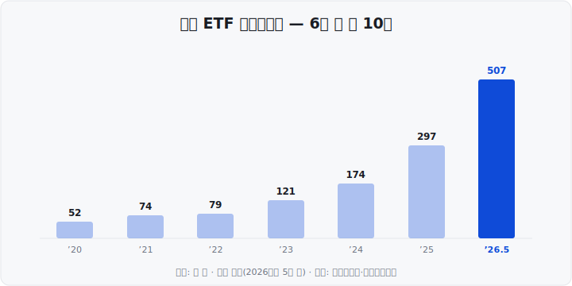

주식에 처음 관심을 가지면 가장 먼저 막히는 질문이 있습니다. "그래서, 대체 뭘 사야 하지?" ETF는 바로 이 고민에서 출발한, <mark>지금 한국에서 가장 빠르게 커지고 있는 투자 수단</mark>입니다. 오늘은 ETF가 정확히 무엇인지, 왜 초보에게 가장 쉬운 시작이라 불리는지 쉽게 풀어드립니다.

&nbsp;

【💡 ETF, 이름부터 뜯어보기】

ETF는 영어 Exchange Traded Fund의 약자, 우리말로는 <mark>상장지수펀드</mark>입니다. 세 조각으로 나누면 쉽습니다.

- 펀드 : 여러 사람의 돈을 모아 여러 종목에 나눠 담아 굴리는 것
- 지수 : 코스피200처럼 시장 묶음의 움직임을 하나의 숫자로 나타낸 것
- 상장 : 그 펀드를 주식시장에 올려 주식처럼 사고팔 수 있게 한 것

즉 ETF는 "여러 종목을 담은 펀드를, 주식처럼 실시간으로 사고팔 수 있게 만든 상품"입니다.

&nbsp;

【🛒 한 주 = 장바구니 하나】

개별 주식을 사는 건 마트에서 사과 하나를 집는 것과 같습니다. 상하면 손해는 온전히 내 몫이죠. ETF 한 주를 사는 건 여러 과일이 담긴 장바구니 하나를 통째로 사는 것과 같습니다.

예를 들어 코스피200 ETF 한 주에는 삼성전자·SK하이닉스를 비롯한 한국 대표 200개 기업이 조금씩 담겨 있습니다. <mark>한 회사가 휘청여도 나머지가 받쳐주니 충격이 작습니다.</mark> 이것을 <mark>분산투자</mark>라고 합니다.

&nbsp;

【📊 주식·펀드·ETF 비교】

| 구분 | 개별 주식 | 일반 펀드 | ETF |
| :--- | :--- | :--- | :--- |
| 담기는 것 | 한 회사 | 여러 종목 | 여러 종목 |
| 사고파는 법 | 실시간 | 하루 한 번 | 실시간 |
| 돈 찾는 속도 | 빠름 | 며칠 | 빠름 |
| 구성 공개 | - | 분기·월 | 매일 |
| 비용(보수) | 없음 | 높은 편 | 낮은 편 |

ETF는 <mark>펀드의 장점(분산)과 주식의 장점(실시간 거래)을 한 몸에 담은 상품</mark>입니다.

※ ETF가 매일 무엇을 담았는지 공개하는 목록을 PDF(Portfolio Deposit File, 납입자산구성내역)라고 합니다. 우리가 아는 그 문서 PDF와 이름만 같습니다.

&nbsp;

【🏷️ ETF 이름 읽는 법】

ETF 이름은 '맨 앞 = 운용사 브랜드', '뒤 = 담은 지수'로 읽으면 됩니다.

| 브랜드 | 운용사 |
| :--- | :--- |
| KODEX (코덱스) | 삼성자산운용 |
| TIGER (타이거) | 미래에셋자산운용 |
| ACE (에이스) | 한국투자신탁운용 |
| RISE (라이즈) | KB자산운용 |
| SOL (쏠) | 신한자산운용 |

그래서 'KODEX 200'은 <mark>"삼성자산운용이 만든 코스피200 ETF"</mark>라고 읽으면 됩니다.

&nbsp;

【✨ 왜 이렇게 인기일까】

- 실시간 거래 : 주식처럼 장중 아무 때나 매매
- 낮은 비용 : 지수를 그대로 따라가 운용 비용이 낮은 편
- 분산 효과 : 한 주로 수십~수백 종목에 분산
- 투명성 : 무엇을 담았는지 매일 공개

&nbsp;

【📈 숫자로 보는 한국 ETF】

순자산총액(= AUM, Assets Under Management, 운용자산)은 ETF가 굴리고 있는 돈의 총 규모입니다. 국내 ETF 시장은 최근 몇 년 새 폭발적으로 커졌습니다.

<mark>6년 새 약 10배</mark>로 커졌습니다. 하루 평균 거래대금도 약 30조 원(2026년 5월 기준)으로 1년 전의 두 배 가까이 늘었습니다. 가장 큰 ETF인 KODEX 200은 2026년 4월 국내 최초로 순자산 20조 원을 넘어섰습니다.

&nbsp;

【📊 데이터 출처 및 기준일】

- 순자산총액 추이 : 한국거래소 연간 결산 (2024년 말 173.6조, 2025년 말 297.2조 원 등). 돌파 시점 — 100조 2023.6, 200조 2024.6, 300조 2026.1, 400조 2026.4, 500조 2026.5.
- 시장 규모·거래대금·KODEX 200 20조 : 한국거래소·금융투자협회, 2026년 상반기 기준(언론 보도 종합).

&nbsp;

※ 본 글은 공개된 시장 데이터를 정리한 정보성 콘텐츠이며, 특정 종목·상품의 매매 권유가 아닙니다. 수치는 위에 밝힌 기준 시점의 값이며 이후 변동될 수 있습니다. 모든 투자 판단과 책임은 투자자 본인에게 있습니다.

&nbsp;

#ETF #ETF투자 #상장지수펀드 #ETF란 #주식초보 #투자공부 #재테크 #KODEX #TIGER #투자기초
