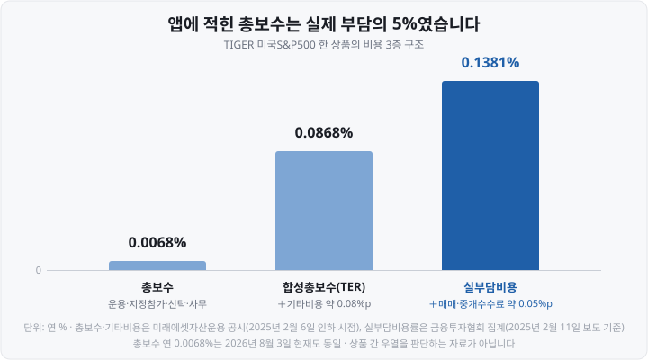
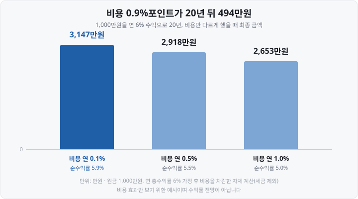

저는 처음 **ETF**(Exchange Traded Fund, 상장지수펀드)를 살 때 **총보수 연 0.0062%라는** 숫자를 보고 "이건 거의 공짜네" 하고 넘겼습니다. 1,000만원을 넣어도 1년에 620원이니까요. 그런데 한참 뒤에 같은 상품의 **실부담비용이** 연 0.2337%라는 걸 알게 됐습니다. <mark>37배였습니다.</mark>

숫자가 틀린 게 아니었습니다. **두 숫자가 애초에 다른 것을** 재고 있었을 뿐입니다. 그걸 몰라서 몇 년을 그냥 지나쳤던 게 아까워서, 오늘은 ETF 비용의 층층 구조와 세금을 한 번에 정리합니다.

&nbsp;

【💡 총보수는 네 곳에 나눠 주는 돈의 합계】

총보수는 하나의 요금이 아닙니다. ETF 하나를 굴리는 데 네 종류의 회사가 관여하고, 그 보수를 다 더한 것이 총보수입니다.

| 보수 항목 | 누가 받나 | 무슨 일을 하나 |
| :--- | :--- | :--- |
| 운용보수 | 자산운용사 | 지수대로 종목을 담고 리밸런싱 |
| 지정참가회사 | 증권사 | ETF 설정·해지로 물량 공급 |
| 신탁업자 | 신탁은행 | 담은 자산을 보관·관리 |
| 사무관리 | 일반사무관리회사 | 매일 기준가격 계산 |

용어 두 개만 미리 풀어 둡니다. 지정참가회사는 영어로 **AP**(Authorized Participant, 지정참가회사)라고 부르며, ETF를 새로 만들거나 없애면서 시장에 물량을 공급하는 증권사입니다. 사무관리회사가 매일 계산하는 값은 **NAV**(Net Asset Value, 순자산가치), 담고 있는 자산을 다 더해 발행 좌수로 나눈 '1주의 진짜 값'입니다.

실제 상품으로 쪼개 보면 이렇습니다. TIGER 미국S&P500의 총보수 연 0.0068%는 이렇게 구성됩니다(미래에셋자산운용 공시, 2025년 2월 6일 인하 시점).

| 항목 | 연 보수율 |
| :--- | ---: |
| 집합투자(운용) | 0.0002% |
| 지정참가회사 | 0.0001% |
| 신탁 | 0.0050% |
| 일반사무 | 0.0015% |
| 총보수 합계 | 0.0068% |

저는 이 표를 보고 좀 놀랐습니다. <mark>운용사가 받는 몫이 신탁은행 몫의 25분의 1</mark>이더라고요. 2025년 2월 보수 인하 경쟁 때 소수점 넷째 자리까지 내려간 것도, 깎을 수 있는 게 사실상 자기 몫인 운용보수뿐이었기 때문입니다.

※ 이 총보수 0.0068%는 **2026년 8월 3일 현재도 동일합니다.** 같은 지수를 따르는 RISE 미국S&P500은 연 0.0047%, KODEX 미국S&P500은 연 0.0062%입니다. 총보수는 공지로 수시로 바뀌니 투자 전 최신 공시를 꼭 보세요.

&nbsp;

【📊 비용은 3층 구조입니다】

총보수 위에 두 층이 더 있습니다.

- **2층 — 기타비용**: 지수사용료, 회계감사비, 해외자산 보관수수료 등. 총보수＋기타비용 = **합성총보수**(TER, Total Expense Ratio, 총보수비용비율)
- **3층 — 매매·중개수수료**: ETF가 지수를 따라가려고 종목을 사고팔 때 증권사에 내는 돈. 여기까지 더한 것이 **실부담비용**

뺄셈으로 정리하면 기타비용이 약 0.08%포인트, 매매·중개수수료가 약 0.05%포인트입니다. <mark>제가 앱에서 본 총보수는 실제 부담의 5%였습니다.</mark>

&nbsp;

【❓ 그런데 왜 청구서가 안 오나요】

제가 오래 헷갈렸던 지점입니다. 계좌 명세서를 뒤져도 ETF 수수료 항목이 없습니다.

이유는 <mark>이 비용들이 청구되지 않고 매일 ETF의 순자산에서 조금씩 미리 떼어 가기 때문</mark>입니다. 그래서 우리가 보는 기준가(NAV)와 주가에는 비용이 이미 차감돼 있습니다. 비용은 "따로 내는 돈"이 아니라 <strong>"수익률에서 사라진 몫"</strong>으로 나타납니다.

눈에 안 보이니, 공시를 찾아보지 않으면 평생 모르고 지나갑니다.

&nbsp;

【📈 국내 ETF 전체로 보면 평균 1.6배】

한 상품만의 얘기가 아닙니다. 금융투자협회 집계 기준 **2025년 8월 말** 국내 ETF 평균은 이랬습니다.

| 구분 | 평균 |
| :--- | ---: |
| 총보수율 | 연 0.3084% |
| 기타비용·매매중개수수료 포함 전체 비용 | 연 0.4982% |

<mark>실제 부담이 공시된 총보수의 약 1.6배</mark>입니다. 분포는 더 놀랍습니다.

- 숨은 비용(기타비용＋매매중개수수료)이 총보수보다 **더 큰 ETF**: 1,016개 중 **230개**(22.6%)
- 매매중개수수료를 빼고 **기타비용만으로도** 총보수보다 큰 ETF: **125개**(12.3%)

극단 사례도 있습니다. RISE 차이나H선물인버스(H)는 총보수 연 0.59%에 기타비용 연 0.75%, KIWOOM 미국ETF산업STOXX는 총보수 연 0.52%에 기타비용 연 1.05%·매매중개수수료 1.713%였습니다. **좁은 시장·해외자산·파생상품을 담을수록 숨은 비용이 커지는 경향이** 보입니다.

&nbsp;

【⚠️ 그래도 "실부담비용 낮은 게 정답"은 아닙니다】

균형을 하나 잡아 둡니다. 2025년 2월 삼성자산운용 ETF 컨설팅본부장은 웹 세미나에서 <mark>"실부담비용은 이미 발생한 비용이라 수익률에 다 반영돼 있다"</mark>고 설명했습니다. 비용을 따로 빼서 계산할 게 아니라, 비용까지 반영된 뒤의 성과(수정기준가 기준 수익률)를 비교하면 된다는 논리입니다.

매매·중개수수료가 크더라도 그만큼 지수를 정확히 따라갔다면 결과가 더 좋을 수 있고, 비용이 낮아도 추적을 못 하면 성과가 나쁠 수 있습니다. 그래서 비용은 혼자 보는 숫자가 아니라 **같은 지수 상품끼리 비용과 성과를 나란히 놓고 보는 숫자**입니다. 이 글은 어느 상품이 낫다고 말하지 않습니다.

&nbsp;

【🔍 실부담비용 확인하는 경로】

운용사 홈페이지는 대개 총보수만 큼직하게 씁니다. 세 층을 다 보려면 **금융투자협회 전자공시서비스**로 가야 합니다.

1. `dis.kofia.or.kr` 접속
2. 왼쪽 **펀드공시** 클릭
3. **펀드 보수 및 비용** 아래 **펀드별 보수비용비교** 클릭
4. 운용사 선택 → 펀드명(ETF명) 검색

여기서 총보수·기타비용·합성총보수·매매중개수수료율이 항목별로 나옵니다. 실제로 순서가 어떻게 뒤집히는지 보시면 이렇습니다.

| 상품명 | 총보수(연) | 실부담비용(연) |
| :--- | ---: | ---: |
| KODEX 미국S&P500 | 0.0062% | 0.2337% |
| ACE 미국S&P500 | 0.0676% | 0.1685% |
| RISE 미국S&P500 | 0.0026% | 0.1450% |
| TIGER 미국S&P500 | 0.0068% | 0.1381% |

※ **위 표는 2025년 2월 11일 보도 기준(금융투자협회 자료)이며 지금 값이 아닙니다.** 총보수만 봐도 RISE 미국S&P500은 그 뒤 연 0.0047%로 바뀌었습니다(2026년 8월 3일 확인). <mark>"총보수 순서와 실부담비용 순서가 다를 수 있다"</mark>는 사실만 읽는 용도로 봐주세요.

&nbsp;

【💸 0.1%와 1.0%가 20년 뒤 남기는 차이】

비용은 매년, 원금 전체에 붙습니다. 그래서 시간이 길어지면 복리로 벌어집니다.

연 0.1%와 연 1.0%의 차이가 20년 뒤 <mark>494만원</mark>, 원금의 절반 가까이입니다. 물론 수익률이 같다는 가정 아래의 계산이고 실제로는 비용과 성과가 함께 움직입니다. 그래도 "0.9%포인트쯤이야"라고 넘기기는 어려운 크기죠.

&nbsp;

【🧾 2부. 세금 — 무엇을 담았느냐로 갈립니다】

비용을 다 뺀 뒤에도 관문이 하나 더 있습니다. ETF 세금은 상품을 **세 갈래**로 나누는 것에서 시작합니다.

| 구분 | 매매차익 | 분배금 | 금융소득종합과세 |
| :--- | :--- | :--- | :--- |
| 국내주식형(코스피200 등) | 비과세 | 15.4% | 분배금만 합산 |
| 국내상장 해외형·기타(S&P500·채권·레버리지 등) | 15.4% | 15.4% | 둘 다 합산 |
| 해외 직접상장(미국 상장 ETF) | 양도세 22%(250만원 공제) | 15.4% | 분배금만 합산 |

- 국내주식형 ETF는 <mark>팔아서 남긴 차익에 세금이 없습니다.</mark> 분배금에만 15.4%가 붙습니다.
- 국내에 상장됐어도 해외 지수를 담았으면 매매차익에 15.4%가 붙습니다. 채권·원자재·레버리지·인버스도 같은 '기타 ETF' 취급입니다. 즉 <mark>"국내 상장이냐"가 아니라 "무엇을 담았느냐"가 기준</mark>입니다.
- 미국 직접상장 ETF는 해외주식 직접투자와 같이 양도소득세 22%(지방소득세 포함), 연 250만원 기본공제입니다.

가장 무서운 칸은 오른쪽입니다. 이자·배당소득이 <mark>연 2,000만원을 넘으면 금융소득종합과세</mark> 대상이 되는데, 국내상장 해외형 ETF의 **매매차익은 '배당소득'으로 분류돼** 이 2,000만원 계산에 그대로 들어갑니다. 같은 S&P500을 담아도 국내 상장품과 미국 직접상장품이 여기서 갈립니다.

&nbsp;

【📐 과세표준기준가격 — '둘 중 적은 금액' 규칙】

과세되는 ETF의 매매차익은 번 돈 전액에 붙지 않습니다. **과세표준기준가격**(과표기준가)이라는 가격이 매일 따로 공표되는데, ETF 수익 중 비과세 부분을 걷어내고 **과세 대상만 남긴 기준가격**입니다.

계산은 이렇습니다.

> 매수·매도 시점의 **과표기준가 상승분**과 **실제 매매차익** 중 **더 적은 금액**에 15.4% 원천징수

이 규칙 하나가 위 표를 설명해 줍니다. 국내 상장주식의 매매·평가차익은 애초에 과표에 안 들어가니, 국내주식형 ETF는 주가가 올라도 과표기준가가 거의 안 움직입니다. <mark>그래서 결과적으로 매매차익이 비과세가 됩니다.</mark> 특별히 봐주는 게 아니라 계산 구조상 과세 대상이 남지 않는 것이죠.

반대로 손실 구간에서는 유리하게 작동합니다. 과표기준가는 올랐는데 내가 산 가격이 나빠서 실제로는 손실이면, 둘 중 적은 금액(실제 손익)이 기준이라 세금이 안 붙습니다.

※ 주식형 ETF의 분배금 지급기준일은 보통 **1·4·7·10월의 마지막 거래일**입니다(상품마다 다름).

&nbsp;

【✅ ETF에는 증권거래세가 없습니다】

작지만 확실한 차이입니다. 개별 주식을 팔면 증권거래세를 냅니다. 2026년 1월 1일부터 코스피는 거래세 0.05%＋농어촌특별세 0.15% = **0.20%**, 코스닥은 농특세 없이 0.20%입니다(금융투자소득세 폐지로 2023년 수준 환원).

<mark>ETF를 팔 때는 이 증권거래세가 면제됩니다.</mark> 1억원을 팔면 주식은 20만원, ETF는 0원입니다.

&nbsp;

【🏦 절세 계좌 안에서는 규칙이 바뀝니다】

여기까지는 일반 위탁계좌 얘기입니다. 연금저축, **IRP**(Individual Retirement Pension, 개인형 퇴직연금), **ISA**(Individual Savings Account, 개인종합자산관리계좌)에 담으면 위 표가 다시 쓰입니다.

- **연금저축·IRP**: 계좌 안에서는 분배금·매매차익에 세금을 매기지 않고 미룹니다(과세이연). 연금으로 받을 때 연령에 따라 3.3~5.5%.
- **ISA**: 순이익 중 일반형 200만원까지 비과세, 초과분은 15.4%가 아니라 9.9% 분리과세이고 금융소득종합과세에 합산되지 않습니다.

단, <mark>국내주식형 ETF는 일반 계좌에서도 매매차익이 이미 비과세</mark>입니다. 그래서 절세 계좌의 효과는 **분배금과 국내상장 해외형 ETF에서 크게** 나타납니다.

&nbsp;

【🗓️ 2026년에 정해진 것 / 아직 아닌 것】

**① 이미 시행 중 — 고배당기업 배당소득 분리과세(2026년 1월 1일)**
배당성향 요건을 충족한 코스피·코스닥 상장 법인의 현금배당에 대해 종합과세 대신 14~30% 구간별 분리과세를 선택할 수 있게 됐습니다(2028년 말까지 3년 한시). 그런데 <mark>ETF·펀드·리츠 분배금은 이 분리과세 대상에서 제외</mark>됩니다. 같은 고배당 종목을 담아도 주식을 직접 사면 대상이고, ETF로 사면 아닙니다.

**② 아직 확정 아님 — '생산적금융 ISA' 신설안(2026년 8월 3일 발표)**
2026년 8월 3일 세제발전심의위원회에서 발표된 2026년 세법개정안에 **생산적금융 ISA** 신설이 담겼습니다. 국내 상장주식·국내 주식형 펀드·국민성장펀드·**BDC**(Business Development Company, 기업성장집합투자기구)에 투자하면 <mark>이자·배당소득을 전액 비과세</mark>한다는 내용이고, 연 납입한도 2,000만원, 금융소득종합과세자는 가입 불가로 보도됐습니다. ETF 투자자에게 중요한 건 **국내 상장 해외 ETF 등 해외 투자 성격 상품은 대상에서 제외**된다는 점입니다.

※ ②는 **정부 개정안일 뿐 아직 법이 아닙니다.** 국회 심의를 거쳐 연말에 확정되고, 총 납입한도·계약기간 같은 세부 수치는 보도마다 다르게 전해집니다. 2024년 세법개정안의 ISA 확대안이 국회에서 반영되지 않은 전례를 떠올리면, **확정 전 발표를 확정으로 읽지 않는 습관**이 필요합니다.

&nbsp;

【📌 정리 — 확인할 다섯 가지】

1. **총보수만 보지 말 것** — 총보수 → 합성총보수(＋기타비용) → 실부담비용(＋매매중개수수료)
2. **어디서 보나** — 금융투자협회 전자공시서비스 → 펀드공시 → 펀드 보수 및 비용 → 펀드별 보수비용비교
3. **비용은 청구서로 오지 않는다** — 매일 순자산에서 차감되어 기준가에 반영
4. **세금은 '무엇을 담았나'로 갈린다** — 국내주식형(비과세) / 국내상장 해외형·기타(15.4%) / 해외 직접상장(22%·250만원 공제)
5. **어느 계좌에 담나** — 절세 계좌에서는 과세이연·저율과세로 규칙이 바뀐다

비용과 세금은 예측이 필요 없는 영역입니다. 시장이 어디로 갈지는 아무도 모르지만, <mark>내가 얼마를 비용과 세금으로 내는지는 오늘 확인할 수 있습니다.</mark> 저는 1년에 한 번 실부담비용을 확인하는 걸 습관으로 만들었습니다.

&nbsp;

【🔗 함께 보면 좋은 글】

- [ETF란 무엇인가 — 주식도 펀드도 아닌, 초보에게 가장 쉬운 시작](https://blog.naver.com/hdglace/224350308437)
- [코스피200·S&P500·나스닥100 ETF 비교 — 지수를 통째로 산다는 것](https://blog.naver.com/hdglace/224358137869)
- [연금저축·IRP·ISA — 세금 아끼며 ETF 투자하는 절세 계좌 3종](https://blog.naver.com/hdglace/224357252306)
- [호가창 보는 법 — 매수·매도 잔량과 호가 단위가 뜻하는 것](https://blog.naver.com/hdglace/224364657994)

&nbsp;

【📊 데이터 출처 및 기준일】

- 총보수 4개 구성·기타비용·매매중개수수료의 정의와 합성총보수(TER)·실부담비용 계산 구조 : 금융투자협회 공시 기준 정의, 운용사·증권사 ETF 가이드 교차확인.
- TIGER 미국S&P500 총보수 구성(집합투자 0.0002%·지정참가 0.0001%·신탁 0.0050%·일반사무 0.0015%), 기타비용 연 0.08%, 합성총보수 연 0.0868% : 미래에셋자산운용 공시, **2025년 2월 6일 인하 시점 기준**.
- 미국S&P500 ETF 4종 실부담비용률(KODEX 0.2337%·ACE 0.1685%·RISE 0.1450%·TIGER 0.1381%) : 금융투자협회 자료 기반 언론 보도, **2025년 2월 11일 기준**.
- 2026년 8월 3일 현재 총보수(TIGER 미국S&P500 0.0068%, KODEX 미국S&P500 0.0062%, RISE 미국S&P500 0.0047%) : FunETF 상품 상세 페이지, **2026년 8월 3일 장 마감 기준**.
- 국내 ETF 평균 총보수 0.3084%·전체 비용 0.4982%, 1,016개 중 230개(22.6%)·125개(12.3%), 극단 사례 : 금융투자협회 집계 기반 언론 보도, **2025년 8월 말 기준**.
- "실부담비용은 이미 발생한 비용이라 수익률에 반영돼 있다" : 삼성자산운용 ETF 컨설팅본부장 웹 세미나, **2025년 2월 19일 보도**.
- 20년 복리 비용 효과(1,000만원·연 6% 가정, 3,147만원/2,918만원/2,653만원) : 위 가정에 따른 **자체 계산**(세금 제외). 수익률 전망이 아닙니다.
- ETF 과세 체계·과표기준가 '둘 중 적은 금액' 규칙·분배금 지급기준일·증권거래세 면제 : 국세청 기준 및 운용사·증권사 ETF 세금 안내 교차확인, **2026년 8월 기준**.
- 증권거래세율(코스피 0.05%＋농특세 0.15%, 코스닥 0.20%) : **2026년 1월 1일 시행 기준**.
- 연금소득세 3.3~5.5%·ISA 비과세 200만원·초과분 9.9% : 국세청 기준, **2026년 7월 기준**.
- 고배당기업 배당소득 분리과세(ETF·펀드·리츠 제외) : **2026년 1월 1일 시행 기준**.
- 생산적금융 ISA 신설안 : 2026년 세법개정안, **2026년 8월 3일 발표 기준**(국회 심의 전).

&nbsp;

※ 본 글은 공개된 공시·세법 자료를 정리한 정보성 콘텐츠이며, 특정 종목·상품의 매매 권유나 상품 간 우열 판단이 아닙니다. 수치는 위에 밝힌 기준 시점의 값이며 이후 변동될 수 있습니다. ETF 보수와 세법은 자주 바뀌므로 투자 전 최신 공시와 국세청 안내를 확인하세요. 세금은 개인 소득 구조에 따라 달라지므로 구체적인 사안은 세무 전문가와 상담하시기 바랍니다. 모든 투자 판단과 책임은 투자자 본인에게 있습니다.

&nbsp;

#ETF #ETF총보수 #실부담비용 #합성총보수 #ETF세금 #배당소득세 #금융소득종합과세 #과표기준가 #생산적금융ISA #증권거래세 #투자공부 #재테크 #주식초보
