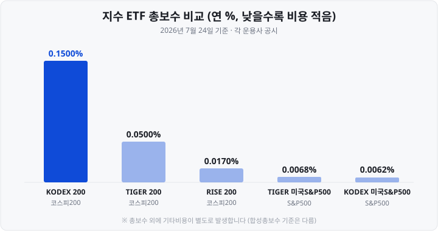
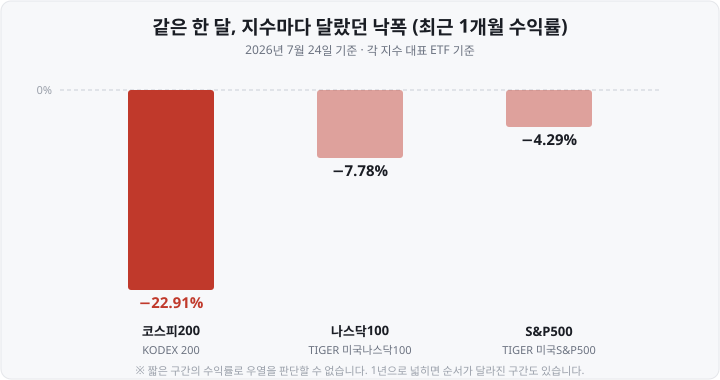

저는 처음 증권 앱을 열었을 때 ETF 목록에서 그냥 앱을 닫았습니다. `KODEX 200`, `TIGER 미국S&P500`, `KODEX 미국나스닥100`… 이름이 다 비슷한데 무엇이 어떻게 다른지 알 수가 없었거든요. 그때 누가 <mark>"이 셋만 구분하면 지수 ETF의 큰 그림은 끝난다"</mark>고 알려줬으면 좋았겠다는 마음으로 정리했습니다.

오늘은 가장 많은 돈이 몰려 있는 세 지수 — **코스피200**, **S&P500**, **나스닥100** — 을 나란히 놓고 사실만 비교합니다.

&nbsp;

【💡 '지수를 산다'는 말의 뜻】

지수는 특정 종목 묶음의 움직임을 하나의 숫자로 나타낸 것입니다. 뉴스의 "코스피 7,096" 같은 그 숫자죠.

그런데 지수는 그 자체로 살 수 있는 물건이 아닙니다. 온도계는 살 수 있어도 '기온'은 살 수 없는 것과 같습니다. 그래서 <mark>지수 구성 종목을 그 비중대로 담아 놓은 ETF</mark>가 만들어졌고, 그 한 주를 사면 사실상 지수를 통째로 사는 셈이 됩니다.

핵심은 <mark>어떤 지수냐에 따라 장바구니 내용물이 완전히 달라진다는 점</mark>입니다.

&nbsp;

【📊 세 지수가 담는 것】

| 구분 | 코스피200 | S&P500 | 나스닥100 |
| :--- | :--- | :--- | :--- |
| 시장 | 한국 코스피 | 미국 증시 | 미국 나스닥 |
| 종목 수 | 200개 | 503개 | 약 100개 |
| 선정 방식 | 대표성·유동성 | 위원회 심사 | 시가총액 순 |
| 제외 업종 | 없음 | 없음 | 금융업 제외 |
| 정기 변경 | 연 1회(6월) | 수시 | 연 1회(12월) |

- **코스피200은** 코스피 전체 시가총액의 80% 이상을 담은, 사실상 "한국 시장 그 자체"입니다.
- **S&P500은** 미국 상장기업 시가총액의 <mark>약 80%를 담습니다.</mark> 규칙만으로 자동 편입되지 않고 위원회가 심사해 뽑습니다(직전 4개 분기 합계 흑자 등 요건).
- **나스닥100은** 나스닥 상장 종목 중 <mark>금융업을 뺀</mark> 시가총액 상위 100개입니다. 1985년 지수를 만들 때부터 비금융용·금융용을 따로 출발시킨 설계가 지금까지 이어진 것이고, 우열의 의미는 없습니다.

&nbsp;

【⚠️ "200개에 나눠 담는다"의 실제】

제가 가장 크게 오해했던 부분입니다. 종목 수가 많으면 안전할 거라 생각했는데, <mark>지수는 종목 수가 아니라 비중으로 움직입니다.</mark>

| 지수 | 쏠림 정도 | 기준 시점 |
| :--- | :--- | :--- |
| 코스피200 | 상위 2종목이 51.5% | 2026.05.13 |
| 나스닥100 | 상위 10종목이 약 47% | 2026.05.15 |
| S&P500 | 상위 10종목이 약 38% | 2026년 자료 |

코스피200에서는 삼성전자 28%, SK하이닉스 23.5%로 두 종목 합산이 51.5%였습니다(2026년 5월 13일 기준). 연초 38.7%에서 넉 달 만에 12.8%포인트 오른 수치입니다. 3위 SK스퀘어는 2.64%였습니다.

※ 위 세 숫자는 상위 2종목 기준과 상위 10종목 기준이 섞여 있어 그대로 비교하면 안 됩니다. "몇 종목에 얼마나 기대고 있나"를 읽는 용도로만 봐주세요.

&nbsp;

【💰 국내 상장 대표 상품 (2026년 7월 24일 기준)】

| 상품명 | 지수 | 총보수(연) | 순자산 |
| :--- | :--- | ---: | ---: |
| KODEX 200 | 코스피200 | 0.1500% | 23조 8,848억 |
| TIGER 200 | 코스피200 | 0.0500% | 9조 8,563억 |
| RISE 200 | 코스피200 | 0.0170% | 4조 3,166억 |
| TIGER 미국S&P500 | S&P500 | 0.0068% | 19조 8,043억 |
| KODEX 미국S&P500 | S&P500 | 0.0062% | 9조 9,099억 |
| TIGER 미국나스닥100 | 나스닥100 | 0.0068% | 11조 1,985억 |
| KODEX 미국나스닥100 | 나스닥100 | 0.0062% | 8조 7,709억 |

읽을 포인트 세 가지입니다.

1. <mark>같은 지수를 따라가는 상품이 여러 개 있습니다.</mark> 코스피200만 국내 상장 상품이 15종 이상입니다.
2. 국내 전체 ETF 순자산 1·2·3위가 이 표 안에 있습니다(2026년 7월 21일 종가 기준 KODEX 200 → TIGER 미국S&P500 → TIGER 미국나스닥100 순).
3. **총보수가 상품마다 24배까지 벌어집니다.** 코스피200 안에서도 0.1500%와 0.0170%가 함께 있습니다.

눈에 걸리는 대목은 <mark>해외 지수 상품의 총보수가 국내 지수 상품보다 오히려 낮다</mark>는 점입니다. 2025년 2월 삼성·미래에셋이 미국 지수 상품 보수를 소수점 넷째 자리까지 내리는 경쟁을 벌인 결과입니다.

※ 단 **총보수가 부담 비용의 전부는 아닙니다.** 지수 사용료·해외 보관수수료 같은 기타비용이 붙습니다. KODEX 미국S&P500은 총보수 연 0.0062%지만 합성총보수는 연 0.0888% 수준으로 공시돼 있습니다.

&nbsp;

【📉 같은 한 달, 이만큼 달랐습니다】

같은 한 달인데 <mark>낙폭이 5배 넘게 벌어졌습니다.</mark> 2026년 7월 한국 시장은 하루 −6%대 급락과 +4%대 급등이 교차하는 극단적 변동 구간이었고(**VKOSPI**(Volatility Index of KOSPI200, 코스피200 변동성지수) 80선), 코스피200의 절반을 차지하는 반도체 두 종목의 등락이 지수에 그대로 실렸습니다.

반대로 직전 1년으로 넓히면 코스피200이 130% 오르며 미국 지수를 크게 앞섰던 구간도 있습니다. 즉 <mark>어느 지수가 더 좋다가 아니라, 각각 다르게 움직인다</mark>는 게 요점입니다.

&nbsp;

【💸 세금은 국내지수와 해외지수가 갈립니다】

똑같이 국내 증시에서 사는 ETF인데도, 담고 있는 게 국내 주식인지 해외 주식인지에 따라 세금이 달라집니다.

| 구분 | 매매차익 | 분배금 |
| :--- | :--- | :--- |
| 국내주식형(코스피200) | 비과세 | 15.4% |
| 국내상장 해외형(S&P500·나스닥100) | 15.4% | 15.4% |
| 해외 직접상장 | 양도세 22%(250만원 공제) | 15.4% |

- 코스피200 ETF의 매매차익에는 <mark>세금이 없습니다.</mark> 분배금에만 15.4%가 붙습니다.
- 국내상장 S&P500·나스닥100 ETF는 매매차익에도 배당소득세 15.4%가 붙습니다. 정확히는 과세표준 기준가격 상승분과 실제 매매차익 중 <mark>더 적은 금액</mark>에 부과됩니다.
- 그리고 여기서 끝이 아닙니다. 이자·배당소득이 <mark>연 2,000만원을 넘으면 금융소득종합과세 대상</mark>이 됩니다. 국내상장 해외형의 매매차익은 '배당소득'이라 이 2,000만원 계산에 들어갑니다.

&nbsp;

【✅ 정리 — 확인할 다섯 가지】

1. 그 지수가 무엇을 담나 (시장·종목 수·제외 업종)
2. 비중이 어디에 쏠려 있나 (종목 수가 아니라 상위 비중)
3. 총보수와 기타비용은 얼마인가
4. 국내형인가 해외형인가 (매매차익 과세가 갈림)
5. 순자산·거래량이 충분한가

이 글은 어느 상품이 더 낫다고 말하지 않습니다. 위 다섯 가지를 스스로 확인할 수 있게 되는 것이 목표입니다.

&nbsp;

【🔗 함께 보면 좋은 글】

- [ETF란 무엇인가 — 주식도 펀드도 아닌, 초보에게 가장 쉬운 시작](https://blog.naver.com/hdglace/224350308437)
- [괴리율이란 무엇인가 — ETF·ADR 가격이 '진짜 값'과 다른 이유](https://blog.naver.com/hdglace/224351030720)

&nbsp;

【📊 데이터 출처 및 기준일】

- 총보수·순자산·상장일 : 각 운용사 공시, **2026년 7월 24일 장 마감 기준**(FunETF 상품 페이지, KB자산운용 RISE ETF 공식 페이지).
- 1개월 수익률 : 각 상품 페이지 기간별 수익률, 2026년 7월 24일 기준.
- 순자산 순위·TIGER 2종 합산 30조 9,908억 원 : 2026년 7월 21일 종가 기준, 미래에셋자산운용 발표 및 언론 보도.
- 미국 지수 ETF 보수 인하(0.0099%→0.0062%, 0.0068%) : 2025년 2월 6~7일, 언론 보도.
- 코스피200 내 삼성전자 28%·SK하이닉스 23.5% : 2026년 5월 13일 기준, 한국거래소 자료 기반 언론 보도.
- 지수 구성 방법론 : 한국거래소, S&P Dow Jones Indices, 나스닥 공개 자료.
- ETF 과세 체계 : 국세청 기준, 운용사·증권사 세금 안내 자료 교차확인.

&nbsp;

※ 본 글은 공개된 시장 데이터를 정리한 정보성 콘텐츠이며, 특정 종목·상품의 매매 권유나 상품 간 우열 판단이 아닙니다. 수치는 위에 밝힌 기준 시점의 값이며 이후 변동될 수 있습니다. 세법과 보수는 변경될 수 있으니 투자 전 최신 공시를 확인하세요. 모든 투자 판단과 책임은 투자자 본인에게 있습니다.

&nbsp;

#ETF #코스피200 #S&P500 #나스닥100 #지수ETF #KODEX200 #TIGER미국SP500 #ETF비교 #ETF세금 #투자공부 #재테크 #주식초보
