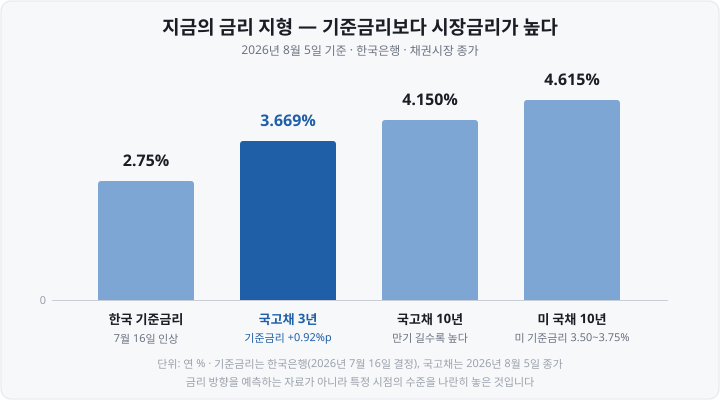
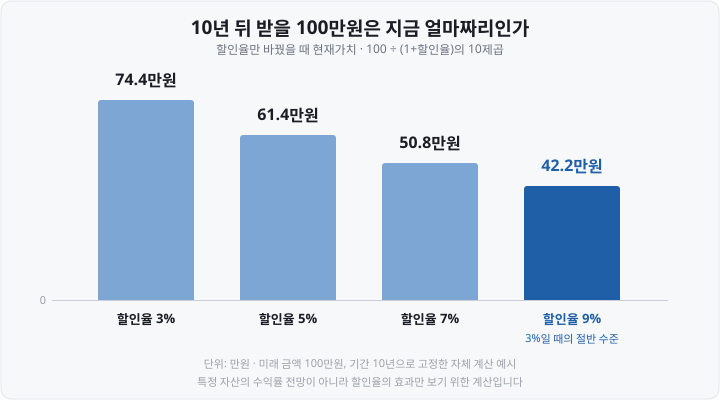
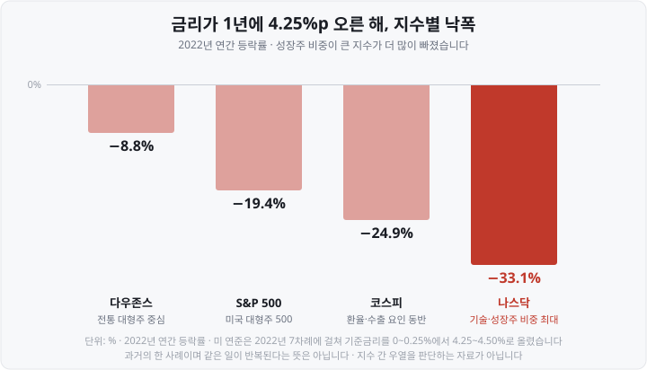

저는 투자를 처음 시작할 때 "금리 인상은 주식에 악재"라는 문장을 외우고만 있었습니다. **왜** 악재인지는 설명할 수 없었습니다. 금리는 은행 창구 이야기고 주가는 기업 이야기인데, 둘이 대체 어디서 만나는 건지 감이 안 잡혔거든요.

그래서 한동안 금리 뉴스를 그냥 넘겼습니다. 그러다 <mark>제가 들고 있던 기술주가 유독 많이 빠지는 걸 보고서야</mark> 이 연결선을 제대로 찾아봤습니다. 알고 보니 답은 중학교 수학 수준의 **나눗셈 하나**에 들어 있었습니다.

오늘은 제가 헤맸던 순서 그대로, ①기준금리 → 시장금리 ②할인율 ③유동성의 세 칸을 따라가 보겠습니다. 그리고 <mark>이 논리가 안 통하는 순간</mark>도 같이 짚겠습니다. 지금 우리 시장이 바로 그 예니까요.

&nbsp;

【📍 먼저, 지금 서 있는 자리】

숫자 없이 시작하면 남는 게 없어서 실제 수치부터 놓겠습니다.

**한국** — 한국은행 금융통화위원회가 <mark>2026년 7월 16일 기준금리를 연 2.50%에서 2.75%로 0.25%포인트 올렸습니다.</mark> 금통위원 7명 전원 찬성, 2023년 1월 이후 3년 6개월 만의 인상입니다. 근거로 6월 소비자물가 상승률 3.2%와 수출·투자 중심 성장세가 제시됐습니다.

**미국** — 연준은 2026년 7월 29일 회의에서 기준금리를 **연 3.50~3.75%로 5회 연속 동결**했습니다(적용 7월 30일). 표결이 9 대 3이었는데, 반대한 3명은 모두 **0.25%포인트 인상을** 주장했습니다.

정리하면 <mark>한국은 이미 한 번 올렸고, 미국은 올릴지 말지로 갈라져 있는 국면</mark>입니다.

&nbsp;

【① 기준금리는 신호탄일 뿐입니다】

제가 처음 헷갈렸던 게 여기입니다. **기준금리**(Base Rate, 중앙은행이 정하는 정책금리)는 우리가 대출·예금에서 만나는 금리가 아닙니다. 한국은행이 금융기관과 **7일 만기로** 돈을 주고받을 때 쓰는 기준일 뿐입니다.

주가에 실제로 닿는 건 그 신호를 받아 움직이는 <mark>시장금리</mark>입니다. 대표가 **국고채 금리**(정부 발행 채권의 유통 수익률)죠.

여기서 두 가지가 보입니다.

**첫째, 국고채 3년(3.669%)이 기준금리(2.75%)보다 0.92%포인트 높습니다.** 시장금리는 "지금"이 아니라 <mark>"앞으로 몇 년간의 평균"을 미리 반영</mark>하기 때문입니다. 이 간격은 시장이 추가 인상 가능성을 어느 정도 가격에 넣어 뒀다는 뜻으로 읽힙니다.

**둘째, 만기가 길수록 금리가 높습니다.** 돈을 더 오래 묶어 두는 대가입니다. 같은 날(2026년 8월 5일) 2년물 3.545%, 5년물 3.916%, 20년물 4.471%, 30년물 4.511%였습니다.

기업이 회사채를 찍거나 은행에서 빌릴 때 이자율도 이 국고채 금리 위에 신용도만큼 가산금리를 붙여 정합니다. <mark>국고채 금리가 오르면 기업 이자 부담도 함께 오릅니다.</mark> 가장 직관적인 경로죠. 그런데 이건 몸풀기입니다.

&nbsp;

【② 할인율 — 제가 놓쳤던 나눗셈】

주식의 값어치는 결국 <mark>그 기업이 앞으로 벌 이익</mark>입니다. 그런데 그 이익은 지금 통장에 없습니다. 미래에 들어옵니다. 그래서 **미래의 돈을 오늘 값으로 환산**해야 합니다.

이 나눗셈의 분모가 **할인율**(Discount Rate, 미래 금액을 현재가치로 바꿀 때 쓰는 비율)입니다.

▶ **현재가치 = 미래 금액 ÷ (1 + 할인율)의 기간 제곱**

말은 어렵지만 뜻은 단순합니다. **10년 뒤에 100만원을 받는 약속**은 오늘 100만원과 같지 않습니다. 그 사이 그 돈을 안전하게 굴려 얻을 수 있었던 이자를 포기한 셈이니까요. 그 포기의 크기가 할인율입니다.

할인율만 바꿔서 계산해 봤습니다.

**미래에 받을 금액은 100만원으로 똑같습니다.** 바뀐 건 할인율뿐인데 오늘의 값어치가 74.4만원 → 42.2만원으로 <mark>거의 반토막</mark>입니다.

이제 연결됩니다. **금리는 할인율의 출발점입니다.** 안전한 국고채가 4%를 준다면, 위험한 주식에 투자하는 사람은 최소한 그보다 높은 수익을 요구합니다. 그래서 <mark>시장금리가 오르면 할인율도 올라가고, 미래 이익을 오늘 값으로 환산한 금액 — 적정 주가 — 이 줄어듭니다.</mark>

제가 여기서 무릎을 쳤던 건 이 대목입니다. **기업이 돈을 더 못 벌게 된 게 아닙니다.** 같은 이익에 붙는 **가격표가 달라진** 것입니다.

&nbsp;

【🔥 왜 제 기술주가 유독 많이 빠졌나】

같은 할인율 상승인데 어떤 주식은 조금, 어떤 주식은 많이 빠집니다. 차이는 <mark>"이익이 언제 들어오나"</mark>입니다.

계산식에서 할인율은 **기간만큼 제곱**됩니다. 먼 미래의 돈일수록 타격이 기하급수로 커지는 구조죠.

| 구분 | 이익이 들어오는 시점 | 할인율이 올랐을 때 |
| :--- | :--- | :--- |
| 가치주·전통산업 | 지금 이미 벌고 있음 | 제곱 횟수가 적어 타격이 작다 |
| 성장주·기술주 | 대부분 먼 미래에 있음 | 제곱 횟수가 많아 타격이 크다 |

"지금은 적자지만 10년 뒤 크게 벌 회사"의 가치는 **거의 전부가 먼 미래에** 놓여 있습니다. 그래서 할인율이 조금만 올라도 크게 깎입니다. 반대로 "지금 꾸준히 배당을 주는 회사"는 받을 돈이 눈앞에 있으니 덜 흔들립니다.

이게 가장 극적으로 드러난 해가 **2022년**입니다. 미 연준이 그해 7차례에 걸쳐 기준금리를 0~0.25%에서 4.25~4.50%로, <mark>1년 만에 4.25%포인트</mark> 올렸습니다.

전통 대형주 중심 다우가 −8.8%였던 해에, 기술·성장주 비중이 가장 큰 나스닥은 −33.1%였습니다. <mark>같은 금리 인상 앞에서 낙폭이 약 4배</mark> 차이 난 겁니다. 코스피(−24.9%)는 여기에 환율·수출 요인까지 겹쳤습니다.

제가 "악재"라고만 외우고 있던 문장의 실체가 이거였습니다. 악재의 크기가 **내가 뭘 들고 있느냐에 따라 다르다**는 것.

&nbsp;

【③ 유동성 — 돈이 다른 곳으로 갈 수 있게 된다】

할인율이 "계산상의 값어치"를 건드린다면, 유동성은 **실제로 주식을 사는 돈의 양**을 건드립니다. 두 갈래입니다.

**첫째, 경쟁 상품이 매력적으로 변합니다.** 국고채 3년이 연 3.669%를 준다면, 원금 손실 위험이 사실상 없는 자산이 그만큼을 보장하는 셈입니다. 주식이 이보다 나은 기대수익을 주지 못한다고 판단하는 돈은 채권·예금으로 옮겨갈 이유가 생깁니다. <mark>이걸 상대 매력의 변화라고 부릅니다.</mark> 같은 날 CD 91일물은 2.93%였습니다.

**둘째, 빌려서 투자하는 돈의 비용이 오릅니다.** 신용융자든 기업 차입이든 이자가 늘어납니다. 기업은 투자·자사주 매입을 줄이고 개인은 레버리지를 줄입니다. 어느 쪽이든 **주식시장에 들어오는 돈이 줄어드는 방향**이죠.

정리하면 금리 인상은 <mark>①미래 이익의 값어치를 깎고 ②주식에 들어올 돈을 줄입니다.</mark> 두 경로가 같은 방향이라 "금리 인상은 주가에 부담"이라는 문장이 성립합니다.

&nbsp;

【⚠️ 그런데 — 금리만으로 설명되지 않습니다】

여기까지 읽고 "금리 오르면 팔아야 하나"로 넘어가면 안 됩니다. 제가 실제로 그렇게 판단했다가 헛발질한 적이 있어서 이 대목을 꼭 넣고 싶었습니다. 지금 우리 눈앞의 시장이 증거입니다.

**① 기준금리를 올렸는데 시장금리는 내려갔습니다.** 인상일은 7월 16일인데, <mark>국고채 3년 금리는 그 뒤에도 오히려 내려가</mark> 8월 5일 3.669%로 5월 26일(3.664%) 이후 가장 낮은 수준을 기록했습니다. 국제유가 급락으로 물가 압력이 누그러질 것이라는 기대가 반영된 결과였습니다.

**② 물가도 내려왔습니다.** 6월 3.2%였던 소비자물가 상승률이 <mark>7월 2.8%로</mark> 석 달 만에 2%대로 돌아왔습니다(2026년 8월 4일 발표).

**③ 주가는 금리가 아닌 다른 게 지배했습니다.** 코스피는 7월 15일 7,284.41에서 8월 5일 6,598.26으로 이 기간 약 −9.4%였는데, 그 사이 **코스피200 변동성지수(VKOSPI)가 85를 넘고** 하루 −6%대와 +3~6%대가 교차하는 극단 구간을 지났습니다. 중심에는 반도체·AI 실적이 있었습니다.

여기서 배운 게 세 가지입니다.

1. <mark>기준금리를 올려도 시장금리는 내려갈 수 있습니다.</mark> 시장금리는 인상을 이미 반영해 뒀고, 그 뒤엔 물가·유가 같은 새 정보에 반응합니다.
2. **분모(할인율)가 올라도 분자(기업 이익)가 더 크게 늘면 주가는 오릅니다.** 금리를 올리는 이유가 보통 "경기가 좋아서"라는 걸 떠올리면 이상한 일이 아닙니다.
3. **이미 알려진 인상은 대부분 가격에 들어 있습니다.** 시장은 결정 당일이 아니라 <mark>예상과 실제가 어긋날 때</mark> 크게 반응합니다.

그래서 금리는 **주가를 결정하는 스위치가 아니라, 모든 자산의 가격표에 함께 곱해지는 배경 변수**로 이해하는 게 정확합니다.

&nbsp;

【🔎 예측 대신 확인할 곳】

| 무엇 | 어디서 | 언제 |
| :--- | :--- | :--- |
| 한국 기준금리 | 한국은행 통화정책방향 | 연 8회 금통위 · 다음은 **2026년 8월 27일**(경제전망 동시) |
| 미국 기준금리 | 연준 보도자료·Implementation Note | 연 8회 FOMC · 한국시간 새벽 발표 |
| 시장금리 | 금융투자협회 채권정보센터, 한국은행 경제통계시스템 | 매 거래일 종가 |

특히 **FOMC**(Federal Open Market Committee, 미 연방공개시장위원회) 결과는 한국시간 새벽에 나옵니다. 우리는 자는 동안 결정된 걸 아침에 확인하게 되는 구조죠.

&nbsp;

【📝 오늘의 정리】

- **기준금리**는 신호이고, 주가에 닿는 건 **시장금리**(국고채 등)입니다.
- 금리는 두 경로로 작용합니다. <mark>**할인율**(미래 이익의 값어치를 깎는다)과 **유동성**(주식에 들어올 돈을 줄인다)</mark>입니다.
- 이익이 먼 미래에 있는 **성장주가 더 민감합니다.** 할인율이 기간만큼 제곱되니까요.
- 그러나 <mark>금리가 올라도 주가가 오르는 구간은 얼마든지 있습니다.</mark>
- 예측하려 하지 말고 **금통위·FOMC 일정과 국고채 금리 수준을 확인하는 습관**부터 만드는 게 낫습니다.

다음 편에서는 **해외주식 양도소득세 신고 방법** — 연 250만원 기본공제와 5월 확정신고 절차를 다루겠습니다.

&nbsp;

【🔗 함께 보면 좋은 글】

- [코스피200·S&P500·나스닥100 ETF 비교 — 지수를 통째로 산다는 것](https://blog.naver.com/hdglace/224358137869) — 어느 지수가 성장주를 많이 담고 있는지
- [미국 증시 시간 — 서머타임·프리마켓·애프터마켓 한국시간 총정리](https://blog.naver.com/hdglace/224365483110) — FOMC 발표가 새벽인 이유
- [괴리율이란 무엇인가 — ETF·ADR 가격이 '진짜 값'과 다른 이유](https://blog.naver.com/hdglace/224351030720) — '진짜 값'과 시장가격이 갈리는 또 다른 경우

&nbsp;

【📊 데이터 출처 및 기준일】

| 항목 | 수치 | 출처·기준일 |
| :--- | :--- | :--- |
| 한국 기준금리 | 연 2.75% (0.25%p 인상, 7인 만장일치) | 한국은행 통화정책방향, 2026년 7월 16일 결정 |
| 미 연방기금금리 목표범위 | 연 3.50~3.75% (동결, 9-3) | 연준 Implementation Note, 2026년 7월 29일 결정·7월 30일 적용 |
| 국고채 금리 | 2년 3.545% · 3년 3.669% · 5년 3.916% · 10년 4.150% · 20년 4.471% · 30년 4.511% | 채권시장 종가, 2026년 8월 5일 |
| CD 91일물 | 2.93% | 채권시장 종가, 2026년 8월 5일 |
| 미 국채 금리 | 10년 4.615% · 2년 4.185% | 2026년 8월 5일 종가 |
| 한국 소비자물가 상승률 | 6월 3.2% → 7월 2.8% (전년동월비) | 2026년 8월 4일 발표 |
| 코스피 종가 | 7,284.41(7월 15일) → 6,598.26(8월 5일) | 한국거래소, 각 일자 종가 |
| 2022년 지수 등락률 | 다우 −8.8% · S&P 500 −19.4% · 코스피 −24.9% · 나스닥 −33.1% | 2022년 연간, 각 지수 연말 종가 기준 |
| 2022년 연준 인상폭 | 7차례, 0~0.25% → 4.25~4.50% (누적 4.25%p) | 연준 FOMC 결정 이력 |
| 다음 금통위 | 2026년 8월 27일 (경제전망 동시 발표) | 한국은행 공표 일정 |

**현재가치 계산은** 미래 금액 100만원·기간 10년을 고정하고 할인율만 바꾼 자체 계산이며, 특정 자산의 기대수익률과는 무관합니다.

&nbsp;

⚠️ **면책 안내** — 이 글은 금리와 주가의 관계를 설명하기 위한 **교육·정보 제공 목적**의 자료이며, 특정 종목·상품·자산군의 매수·매도 권유가 아닙니다. 금리의 향방이나 주가 방향에 대한 예측을 담고 있지 않으며, 본문의 모든 수치는 위 기준일 시점의 값으로 이후 변동됩니다. 세부 제도와 최신 수치는 한국은행·연준·국가데이터처 등 원 출처에서 확인하시기 바랍니다. 투자 판단과 그 결과에 대한 책임은 투자자 본인에게 있습니다.

&nbsp;

#금리와주가 #할인율 #기준금리 #국고채 #금통위 #FOMC #성장주 #투자공부 #주식초보 #재테크
