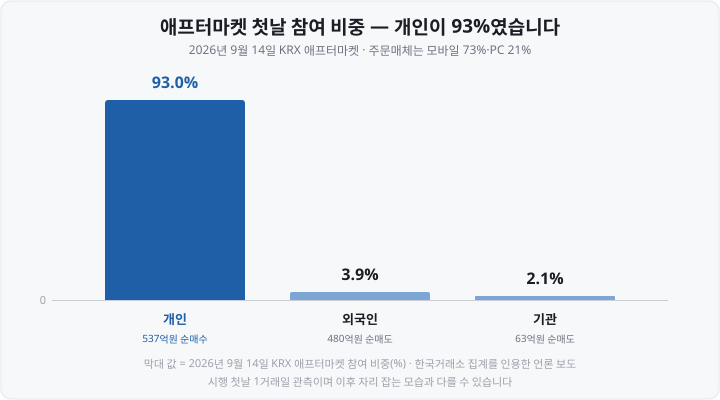

저는 직장을 다니면서 주식을 시작해서, 처음 몇 달 동안 가장 답답했던 게 <mark>"장은 내가 일하는 시간에만 열린다"</mark>는 사실이었습니다. 점심시간에 몰래 호가창을 보다가 오후 3시 30분이 지나면 그날은 끝. 저녁에 뉴스가 터져도 다음 날 아침까지 아무것도 못 했어요.

그런데 어제(2026년 9월 14일) 저녁, 국내 주식시장은 **밤 8시까지 두 곳이 동시에 열려 있었습니다.** 한국거래소(KRX)와 대체거래소 넥스트레이드(NXT)입니다.

사실 저녁에 실시간으로 주식을 사고파는 일 자체는 새롭지 않습니다. 넥스트레이드가 2025년 3월 출범한 뒤로 1년 반 동안 해 왔던 일이에요. 어제 바뀐 건 <mark>한국거래소도 같은 시간대에 들어왔다</mark>는 점입니다. 그러면서 2016년 8월 이후 10년 동안 이어져 온 「오후 4시~6시, 10분마다 한 번씩」의 시간외단일가매매가 사라졌습니다.

오늘은 같은 시간에 열린 두 시장이 뭐가 어떻게 다른지 정리해 보겠습니다. 어느 쪽이 좋은지 가리는 글이 아니라, **저녁에 주문을 내면 그게 어디로 가서 어떤 규칙을 적용받는지** 아는 글입니다.

⚠️ 먼저 밝힐 게 있습니다. 이 글을 쓰는 지금 <mark>새 제도가 실제로 돌아간 날은 9월 14일 하루뿐입니다.</mark> 아래 「첫날 성적표」의 숫자는 1거래일치 관측이라, 며칠·몇 달 뒤 자리 잡는 모습과는 다를 수 있어요. 규칙은 규칙대로, 관측은 관측대로 구분해서 읽어 주세요.

&nbsp;

【대체거래소(ATS)란 — 상장은 못 하고 거래만 시키는 시장】

**ATS**(Alternative Trading System, 대체거래소)는 상장·공시·시장감시 같은 일은 하지 않고 <mark>이미 상장된 종목의 매매를 체결하는 일만 하는 거래소</mark>입니다. 우리나라 첫 ATS인 넥스트레이드가 2025년 3월 4일 문을 열었습니다.

그래서 넥스트레이드에는 '넥스트레이드 상장 종목'이라는 게 없어요. 한국거래소에 상장된 종목 중 일부를 데려와 거래시킬 뿐입니다. 상장·폐지·공시·시장경보는 여전히 한국거래소가 담당합니다.

핵심은 <mark>두 시장의 호가창이 각각 따로 만들어진다</mark>는 점이에요. 한국거래소에 낸 주문은 넥스트레이드에서 유효하지 않고 그 반대도 마찬가지라, 같은 종목인데도 같은 순간 두 시장의 가격이 다를 수 있습니다.

▶ 호가창이 두 개라는 이야기: [호가창 보는 법 편](https://blog.naver.com/hdglace/224364657994)

&nbsp;

【하루 시간표 — 아침 8시부터 밤 8시까지】

2026년 9월 14일 이후의 하루 전체를 한 표로 놓으면 이렇습니다.

| 시각 | 한국거래소(KRX) | 넥스트레이드(NXT) |
| :--- | :--- | :--- |
| 08:00~08:30 | — | **프리마켓**(접속매매) |
| 08:30~08:40 | 시간외종가매매(전일 종가) | 프리마켓 |
| 08:40~08:50 | — | 프리마켓 |
| 08:50~09:00 | 시가 단일가(예상체결가 공표) | **휴장** |
| 09:00~15:20 | 정규장(접속매매) | 메인마켓(09:00:30~) |
| 15:20~15:30 | 종가 단일가 → **공식 종가 확정** | **휴장** |
| 15:30~15:40 | — | 애프터마켓 시가 단일가 |
| 15:40~16:00 | 시간외종가매매(당일 종가) | 애프터마켓(접속매매) |
| 16:00~20:00 | **애프터마켓**(접속매매) | 애프터마켓(접속매매) |

눈여겨볼 대목이 세 군데 있습니다.

▶ **아침 8시대는 아직 넥스트레이드만 있습니다.** 한국거래소도 오전 7시~7시 50분 프리마켓을 준비했는데 **2027년 말로** 연기됐어요. 원래 2026년 6월이던 일정이 9월로 한 번 밀렸다가 또 밀린 겁니다. 거래소는 증권사의 전산 개발 부담과 인력 운영 문제가 계속 제기됐다는 점을 사유로 들면서, 프리마켓 → 정규장 → 애프터마켓으로 미체결 주문이 그대로 넘어가는 '단일보드' 체계를 갖추는 시점에 함께 열겠다고 밝혔습니다.

▶ **넥스트레이드는 하루 두 번 10분씩 문을 닫습니다.** 08:50~09:00과 15:20~15:30, <mark>한국거래소가 단일가로 시가와 종가를 만드는 구간</mark>이에요. 공식 시가와 종가는 한국거래소에서만 만들어진다는 뜻입니다.

▶ **저녁 시장은 넥스트레이드가 20분 먼저 엽니다.** 넥스트레이드는 15:40부터, 한국거래소는 16:00부터예요. 그 20분 동안 한국거래소 쪽은 당일 종가로만 거래하는 시간외종가매매가 돌아갑니다. <mark>이 20분이 두 시장의 가격이 가장 크게 어긋날 수 있는 구간</mark>이에요 — 한쪽은 종가에 고정, 한쪽은 실시간이니까요.

▶ 단일가로 하나의 가격이 만들어지는 원리: [동시호가 뜻과 시간 편](https://blog.naver.com/hdglace/224387372100)

&nbsp;

【9월 14일에 바뀐 것 — 10분에 한 번에서 실시간으로】

한국거래소가 새로 만든 **애프터마켓**의 정식 이름은 **시간외접속매매**입니다. '접속매매'는 매수 호가와 매도 호가가 맞닿는 순간순간 체결되는 정규장 방식을 말해요. 종전 제도와 나란히 놓으면 이렇습니다.

| | ~2026년 9월 11일 시간외단일가매매 | 2026년 9월 14일~ 애프터마켓 |
| :--- | :--- | :--- |
| 시간 | 16:00~18:00 | **16:00~20:00** |
| 체결 방식 | 10분마다 한 번 단일가(하루 최대 12회) | **접속매매**(실시간) |
| 가격 범위 | 당일 종가 대비 ±10% 이내 | **전일 종가 대비 상하 30%**(정규장과 동일) |
| 호가 종류 | 지정가만 | 지정가·최우선지정가·최유리지정가 |
| 대상 | 주권 등(넥스트레이드 거래 종목은 제외) | 코스피·코스닥 주권과 DR(코넥스 제외) |

가장 크게 달라진 건 <mark>저녁 시간대에 쳐져 있던 ±10% 칸막이가 없어졌다</mark>는 점입니다. 이제 저녁 8시까지 상한가·하한가가 그대로 살아 있어요.

몇 가지 더 짚어 둡니다.

▶ **시장가 주문은 낼 수 없습니다.** 가격을 스스로 정하는 지정가 계열만 됩니다.
▶ **ETF와 ETN은 거래 대상에서 빠졌습니다.** ETF(Exchange Traded Fund, 상장지수펀드)와 ETN(Exchange Traded Note, 상장지수증권)은 저녁에 사고팔 수 없다는 뜻이에요. 도입을 검토했다가 미뤘어요. 정규장이 끝나면 주식·선물 같은 기초자산 시장도 닫혀 **유동성공급자**(LP)가 자기 위험을 덜어낼 방법이 없고, 거래가 적은 시간에는 ETF 가격이 실제 가치에서 벌어지는 **괴리율**이 커질 수 있다는 게 이유로 꼽혔습니다. <mark>저녁에 지수가 흔들려도 ETF로는 대응할 수 없다</mark>는 뜻이라 보유자는 알아 둘 필요가 있습니다.
▶ 거래 대상은 코스피·코스닥의 주권과 **DR**(Depositary Receipt, 주식예탁증서)이고, **관리종목·정리매매종목·투자경고 및 위험종목·초저유동성종목, 그리고 그날 정규장에서 한 번도 거래되지 않은 종목은 제외**됩니다. 코넥스 종목도 대상이 아니에요.
▶ **시간외종가매매(15:40~16:00)는 그대로 남습니다.** 당일 종가 하나로만 체결되는 시장이에요.
▶ **정규장에서 안 체결되고 남은 주문은 애프터마켓으로 넘어가지 않습니다.** 저녁에 거래하려면 다시 주문해야 해요.
▶ **결제는 종전과 같은 T+2입니다.** 저녁 8시에 사도 대금이 실제로 오가는 건 2영업일 뒤입니다.

▶ 상한가·하한가 계산법: [가격제한폭 30% 편](https://blog.naver.com/hdglace/224401345295)
▶ 지정가·최우선·최유리가 각각 뭔지: [주문 유형 편](https://blog.naver.com/hdglace/224391794715)
▶ 결제일이 왜 2영업일 뒤인지: [결제일 D+2 편](https://blog.naver.com/hdglace/224406855629)

&nbsp;

【같은 시간, 두 시장 — 무엇이 다른가】

16:00~20:00에는 두 시장이 같은 종목을 동시에 거래합니다. 차이를 한 표로 모으면 이렇습니다.

| 항목 | KRX 애프터마켓 | NXT 애프터마켓 |
| :--- | :--- | :--- |
| 시간 | 16:00~20:00 | 15:30~20:00(15:30~15:40은 시가 단일가) |
| 거래 종목 | 코스피·코스닥 주권과 DR **대부분** | **610종목**(2026년 3분기 기준) |
| 호가 종류 | 지정가·최우선지정가·최유리지정가 | 지정가·최유리·최우선지정가(중간가·스톱지정가는 메인마켓만) |
| 시장가 | 불가 | 불가 |
| 가격제한폭 | 전일 종가 대비 상하 30% | 전일 종가 대비 상하 30%(기준가격은 KRX 종가를 받아 씀) |
| 공매도 | 정규장과 같은 규제 적용 | 프리·애프터마켓 **전면 금지** |
| 거래소 수수료 | 0.0027209%(거래+청산결제) | 메이커 0.00134%·테이커 0.00182%(청산결제 수수료 없음) |
| 정규장 미체결 주문 | 이월되지 않음 | 세션이 바뀌어도 주문 유지 |

&nbsp;

【종목 수가 600여 개인 이유는 '한도'입니다】

넥스트레이드가 종목을 적게 고르는 건 취향이 아니라 규제 때문이에요. **자본시장법 시행령은 대체거래소의 6개월 평균 거래량이 같은 기간 한국거래소 거래량의 15%를 넘지 못하도록 정해 두었습니다**(제7조의3 제2항). 한도에 걸리지 않으려면 거래가 몰리는 종목을 덜어내야 하니까, <mark>종목 수가 분기마다, 때로는 분기 중에도 조정됩니다.</mark>

2026년 2월 12일~6월 30일은 650종목이었고 7월 1일부터는 610종목(유가증권 338·코스닥 272)인데, 9월 보도에는 606종목으로 적힌 것도 있어요. 실제로 거래 가능한지는 주문 직전 증권사 화면에서 확인하는 게 확실합니다.

한국거래소 애프터마켓에는 이 한도가 없습니다. 어제부터 <mark>넥스트레이드에서 거래되지 않던 중소형주도 저녁에 거래할 수 있게 된 것</mark>이 이번 변화의 실질적인 내용입니다.

&nbsp;

【수수료 차이는 '내가 내는 돈'과 다릅니다】

위 표의 수수료는 <mark>증권사가 거래소에 내는 매매체결·청산결제 수수료</mark>지, 투자자가 내는 위탁수수료가 아닙니다. 두 숫자를 그대로 빼서 "몇 % 싸다"고 말하기는 어려워요 — 한국거래소 쪽은 매매체결과 청산결제를 합친 값이고, 넥스트레이드는 청산결제 수수료가 따로 없어서 **재는 항목이 다릅니다.** 넥스트레이드 쪽이 낮다는 것까지가 분명하고, 투자자에게 얼마가 청구되는지는 증권사가 따로 정해요.

넥스트레이드 출범 이후 여러 증권사가 넥스트레이드 주문의 위탁수수료를 한시적으로 인하해 왔는데, **한시 조치라 적용 기간과 조건이 증권사마다 다릅니다.** 내 계좌의 실제 수수료는 거래 증권사 공지로 확인하셔야 해요.

&nbsp;

【그래서 내 주문은 어디로 가나 — SOR】

여기까지 읽으면 자연스레 드는 질문이 있죠. "그럼 저녁에 주문을 내면 어느 시장으로 가지?"

답은 <mark>대부분의 경우 증권사가 알아서 고른다</mark>입니다. 자본시장법상 증권사에는 **최선집행의무**(Best Execution)가 있어서, 두 시장이 함께 열려 있으면 가격·체결 가능성·수수료·주문 규모 등을 비교해 투자자에게 유리한 쪽으로 주문을 보내야 합니다. 이걸 자동으로 하는 장치가 **SOR**(Smart Order Routing, 최선주문집행 시스템)이에요.

| 시간대 | 주문이 가는 곳 |
| :--- | :--- |
| 08:00~08:50 | 넥스트레이드만 |
| 09:00:30~15:20 | SOR이 두 시장 중 유리한 쪽 선택 |
| 15:40~16:00 | 넥스트레이드(KRX는 시간외종가매매만) |
| **16:00~20:00** | **SOR이 두 시장 중 유리한 쪽 선택** |
| 그 밖의 시간 | 한국거래소 |

증권사 화면에서 거래소를 직접 지정할 수도 있지만, 특별한 이유가 없다면 기본값을 두는 쪽이 권장됩니다. 어제 두 시장의 거래대금이 거의 같게 나뉜 것도 <mark>SOR이 주문을 양쪽으로 갈라 보낸 결과</mark>로 풀이돼요.

⚠️ 다만 첫날은 그 배분이 한동안 멈췄습니다. 애프터마켓에 맞춰 SOR 적용 시간을 늘리는 과정에서 미래에셋증권과 삼성증권에 연동 오류가 나, 취소하거나 정정한 주문이 그대로 체결되고 예수금이 있는데도 주문 가능 금액이 0으로 표시되는 일이 생겼어요. 두 증권사는 SOR 배분을 멈추고 한쪽 시장으로만 주문을 보내는 방식으로 대응했습니다. 아래 첫날 숫자를 읽을 때 함께 감안할 대목이에요.

&nbsp;

【첫날 성적표 — 저녁을 두 시장이 거의 반씩 나눴습니다】

9월 14일 하루치 숫자입니다.

| 구간 | 거래량 | 거래대금 |
| :--- | ---: | ---: |
| **KRX 애프터마켓**(16:00~20:00) | 7,224만주 | 1조 8,177억원 |
| &nbsp;&nbsp;— 유가증권시장 종목 | 2,218만주 | 1조 3,252억원 |
| &nbsp;&nbsp;— 코스닥 종목 | 5,006만주 | 4,925억원 |
| **NXT 애프터마켓**(15:40~20:00) | 1,217만주 | 1조 7,896억원 |
| **저녁 시장 합계** | 8,441만주 | **3조 6,073억원** |
| (참고) KRX 정규장 | 9억 5만주 | 25조 8,082억원 |

두 거래소의 거래대금 차이는 **281억원**, 넥스트레이드 금액의 1.6%예요. 사실상 반씩 나눈 셈입니다. 다만 넥스트레이드가 20분 먼저 열었으니 같은 길이를 잰 값은 아니에요.

표에서 눈에 걸리는 대목이 하나 있습니다. <mark>넥스트레이드는 거래량이 한국거래소 애프터마켓의 6분의 1인데 거래대금은 거의 같아요.</mark> 거래대금을 거래량으로 나눠 보면 이유가 드러납니다 — 한 주당 평균 체결금액이 한국거래소 애프터마켓은 약 2만 5천원, 넥스트레이드는 약 14만 7천원이에요. 넥스트레이드가 600여 종목만 거래하는 사이, 한국거래소 애프터마켓에는 <mark>주당 1만원이 안 되는 코스닥 종목까지 들어왔기 때문</mark>으로 보입니다(코스닥 4,925억원 ÷ 5,006만주 ≈ 9,800원). 이 나눗셈은 제가 직접 한 것입니다.

애프터마켓 거래대금은 같은 날 한국거래소 정규장 거래대금(25조 8,082억원)의 **7.04%**, 거래량으로는 정규장 거래량(9억 5만주)의 **8.03%** 수준이에요. 정규장과 두 애프터마켓을 모두 합친 하루 전체 거래대금 37조 5,583억원에서 차지하는 비중은 한국거래소 애프터마켓 4.84%, 넥스트레이드 애프터마켓 4.76%였습니다.

거래가 한쪽에 몰린 것도 아니에요. 거래소 집계로 <mark>대상 2,501개 종목 가운데 2,413개에서 실제로 거래가 이뤄졌습니다.</mark>

누가 거래했는지가 특히 눈에 띕니다.

주문을 넣은 도구는 **MTS**(Mobile Trading System, 모바일 거래 시스템) 73%, **HTS**(Home Trading System, PC 거래 시스템) 21%였어요. <mark>저녁 주문 열 건 중 일곱 건이 휴대폰에서 나왔다</mark>는 뜻이고, 개인이 93.0%였던 참여비중과 같은 방향입니다.

&nbsp;

【조심할 것 ① 거래가 얇습니다 — 첫날 VI가 네 배 걸렸습니다】

가장 또렷하게 드러난 대목입니다. 9월 14일 오후 4시 이후 **VI**(Volatility Interruption, 변동성완화장치)가 **1,637회** 발동했어요. 같은 날 정규장의 약 400회와 견주면 네 배가 넘습니다.

VI는 주가가 짧은 시간에 급변하면 2분 동안 단일가매매로 바꿔 속도를 늦추는 장치입니다. <mark>거래가 적은 종목은 몇백만원어치 주문 하나에도 가격이 몇 %씩 움직이기 때문에</mark> 저녁에 VI가 훨씬 자주 걸려요.

실제로 첫날 어떤 종목은 네 시간 동안 VI가 18차례 발동했고, 다른 종목은 오후 4시 20분에 전일 종가보다 14.6% 오른 3,070원까지 갔다가 상승분을 빠르게 반납하며 정적 VI를 두 번 거쳤습니다.

그런데 <mark>같은 날 다른 지표 하나는 정반대를 가리킵니다.</mark> 종목마다 그날의 고가와 저가가 얼마나 벌어졌는지를 재면, 애프터마켓 쪽이 정규장보다 오히려 작았어요.

| | 애프터마켓(16:00~20:00) | 정규장(09:00~15:30) |
| :--- | ---: | ---: |
| VI 발동 | **1,637회** | 약 400회 |
| 종목별 고저 변동성 — 유가증권 | 2.9% | 4.1% |
| 종목별 고저 변동성 — 코스닥 | 4.6% | 5.8% |

두 줄이 서로 다른 말을 하는 것처럼 보이지만, 재는 대상이 달라요. **VI 횟수는 개별 종목이 순간적으로 얼마나 자주 튀었는지**를 세고, **고저 변동성은 하루 동안 값이 얼마나 벌어졌는지**를 잽니다. 시간 길이도 네 시간과 여섯 시간 반으로 다르고요. 첫날 모습을 한 문장으로 줄이면 <mark>시장 전체가 더 크게 출렁인 건 아니지만, 개별 종목이 순간적으로 튀는 일은 훨씬 잦았다</mark>가 됩니다.

넥스트레이드도 같은 문제를 겪어 왔습니다. 적은 수량의 주문으로 프리마켓 가격이 상·하한가까지 왜곡되는 일이 생기자, **9월 14일부터 정적 VI를 도입하고 VI가 걸리면 2분간 단일가매매로 전환**하도록 규정을 고쳤어요.

&nbsp;

【조심할 것 ② 사이드카·서킷브레이커는 작동하지 않습니다】

개별 종목을 붙잡는 VI는 저녁에도 돌아가지만, <mark>시장 전체를 멈추는 장치인 서킷브레이커와 사이드카는 애프터마켓에 적용되지 않습니다.</mark>

▶ 서킷브레이커·사이드카가 뭔지: [공매도와 서킷브레이커 편](https://blog.naver.com/hdglace/224381139813)

&nbsp;

【조심할 것 ③ 저녁 8시 가격은 그날의 종가가 아닙니다】

이걸 자주 헷갈립니다. **공식 종가는 오후 3시 30분 종가 단일가로 확정되고, 그 뒤 애프터마켓에서 아무리 거래돼도 바뀌지 않습니다.** 그래서

▶ 시세표·지수·ETF 기준가에 쓰이는 종가는 3시 30분 가격이고,
▶ **다음 날 상한가·하한가를 계산하는 기준가격도** 애프터마켓 가격이 아니라 그 종가입니다.
▶ 넥스트레이드 역시 <mark>자기 시장 가격이 아니라 한국거래소 종가를 기준가격으로 받아 씁니다.</mark> 두 시장의 상·하한가가 어긋나지 않는 이유예요.

저녁에 크게 오른 종목이 다음 날 아침 시세표에 그 가격으로 안 찍혀 있는 건 그래서입니다. 다만 저녁에 형성된 가격과 그 저녁에 나온 정보는 다음 날 시가 단일가를 만드는 재료가 되니까, <mark>기준가가 아니라 참고 자료로서는 의미가 있습니다.</mark>

&nbsp;

【조심할 것 ④ 오후 6시 이후는 '공시 공백'입니다】

한국거래소의 공시운영시간은 오전 7시 30분~오후 6시입니다. 애프터마켓은 오후 8시까지인데 공시는 6시에 닫히니, <mark>오후 6시부터 다음 날 오전 7시 30분 사이에는 회사가 공시를 낼 수 없는 시간대</mark>가 생겨요.

거래소는 이 공백을 메우려고 9월 14일부터 세칙을 고쳐서, 공시운영시간이 끝난 뒤 애프터마켓 도중에 **부도 발생·감사의견 미달·임직원 횡령과 배임·회계처리기준 위반에 따른 고발 또는 기소·회생절차 개시신청 기각**이 풍문이나 보도로 확인되면 매매거래를 정지할 수 있게 했습니다. 뒤집어 말하면 <mark>그 정도로 무거운 사안이 아닌 정보는 공시 없이 저녁 시장을 돌아다닐 수 있다</mark>는 뜻이기도 해요.

&nbsp;

【휴장일에는 저녁에도 열리지 않습니다】

가끔 "거래소가 쉬는 날에도 대체거래소는 열리지 않나" 하는 질문이 있습니다. **열리지 않습니다.** 넥스트레이드는 한국거래소와 같은 날 휴장해요. 2026년에는 지방선거일인 6월 3일(수)과 제헌절인 7월 17일(금)이 그런 날이었습니다. <mark>제헌절은 공휴일로 다시 지정되면서 2026년부터 휴장일에 들어왔어요.</mark> 휴장일에는 프리마켓·애프터마켓 포함 하루 전체가 쉽니다.

&nbsp;

【오늘 정리】

▶ **2026년 9월 14일부터** 한국거래소 애프터마켓(시간외접속매매, 16:00~20:00)이 열리고 시간외단일가매매(16:00~18:00, 10분 단위)는 폐지됐습니다. 저녁에도 전일 종가 대비 상하 30%가 그대로 적용됩니다.
▶ 넥스트레이드는 2025년 3월부터 같은 일을 해 왔고, 이제 **16:00~20:00에는 두 시장이 같은 종목을 동시에 거래합니다.** 주문은 증권사의 SOR이 유리한 쪽으로 자동 배분해요.
▶ 주요 차이는 **종목 수**(KRX 대부분 vs NXT 600여 종목), **개장 시각**(16:00 vs 15:40), **거래소 수수료**, **정규장 미체결 주문 이월 여부**입니다.
▶ **아침 08:00~08:50은 아직 넥스트레이드만** 운영합니다. 한국거래소 프리마켓은 2027년 말로 연기됐어요.
▶ 저녁 시장은 <mark>거래가 얇아 VI가 훨씬 자주 걸립니다</mark>(첫날 1,637회 대 정규장 약 400회). 다만 종목별 고저 변동성은 정규장보다 낮았어요 — 순간적으로 튀는 일이 잦았을 뿐 하루 폭이 더 벌어진 건 아닙니다. **사이드카·서킷브레이커는 적용되지 않고**, ETF·ETN은 거래할 수 없습니다.
▶ **애프터마켓 가격은 공식 종가가 아닙니다.** 종가도, 다음 날 기준가격도 오후 3시 30분에 확정된 값이에요.

다음 공부방 글에서는 **52주 신고가·신저가 종목을 찾는 법**을 다룹니다. 개별 종목의 52주 최고·최저는 어디서나 보이는데 <mark>"오늘 52주 신저가를 찍은 종목 목록"은 포털에 없어요.</mark> 증권사 조건검색으로 가는 실제 경로와, 종가 기준과 장중 기준이 왜 서로 다른 결과를 내놓는지 정리하겠습니다. [과거 주가 데이터 받는 법 편](https://blog.naver.com/hdglace/224404481437)과 짝이 되는 편이에요.

&nbsp;

【📊 데이터 출처 및 기준일】

| 항목 | 내용 | 출처 |
| :--- | :--- | :--- |
| KRX 애프터마켓 신설 | 2026년 9월 14일 시행, 16:00~20:00 접속매매, 시간외단일가매매(16:00~18:00) 폐지, 전일 종가 대비 상하 30%, 지정가·최우선지정가·최유리지정가만 허용, 코넥스 제외한 코스피·코스닥 주권과 DR 대상, 관리·정리매매·투자경고 및 위험·초저유동성 종목 제외, ETF·ETN 제외(정규장 종료 후 기초자산 시장이 닫혀 LP가 위험을 덜기 어렵고 괴리율이 커질 수 있다는 이유), 당일 정규장 미체결 종목 제외, VI 적용·사이드카 및 서킷브레이커 미적용, 공매도 규제는 정규장과 동일, 시간외종가매매(15:40~16:00) 유지, 정규장 미체결 주문 이월 없음, 결제 T+2 | 한국거래소 유가증권·코스닥시장 업무규정 개정(금융위원회 승인, 거래소 2026년 9월 9일 발표)을 다룬 언론 보도 다수(2026-09-09·09-11·09-13·09-14)로 **교차확인**, 2026년 9월 15일 확인. 거래소 규정 원문으로는 직접 확인하지 못했습니다 |
| 애프터마켓 첫날 실적 | 2026년 9월 14일 KRX 애프터마켓 7,224만주·1조 8,177억원(유가증권 2,218만주·1조 3,252억원, 코스닥 5,006만주·4,925억원), NXT 애프터마켓 1,217만주·1조 7,896억원, 차이 281억원, 합계 3조 6,073억원. KRX 정규장 9억 5만주·25조 8,082억원. 하루 전체 거래대금 37조 5,583억원 중 KRX 애프터마켓 4.84%·NXT 애프터마켓 4.76%. 대상 2,501개 종목 중 2,413개에서 거래 형성. 참여비중 개인 93.0%·외국인 3.9%·기관 2.1%, 순매수 개인 537억원·순매도 외국인 480억원과 기관 63억원, MTS 73%·HTS 21% | 한국거래소 정보데이터시스템 집계를 인용한 언론 보도(2026-09-14·09-15) **교차확인**, 2026년 9월 15일 확인. ⚠️ **1거래일 관측치입니다.** ⚠️ 정규장 대비 비중을 보도는 「거래량의 7.04%, 거래대금의 8.03%」 순서로 적었으나, 같은 보도가 실은 절대 수치를 직접 나누면 **거래대금 7.04%·거래량 8.03%로** 순서가 반대입니다. 본문은 계산 결과를 따랐습니다. 한 주당 평균 체결금액(약 2만 5천원·약 14만 7천원·약 9,800원)은 보도된 거래대금을 거래량으로 나눈 계산값입니다 |
| VI 발동 횟수와 변동성 | 2026년 9월 14일 애프터마켓 1,637회, 같은 날 정규장 약 400회. 한 종목 18회, 한 종목이 16시 20분 전일 종가 대비 14.6% 상승한 3,070원까지 상승 후 반납하며 정적 VI 2회. 종목별 고저 변동성은 애프터마켓 유가증권 2.9%·코스닥 4.6%로 **정규장의 유가증권 4.1%·코스닥 5.8%를 밑돌았음** | 언론 보도(2026-09-14), 2026년 9월 15일 확인. 정규장 VI 수치는 보도의 어림 표기를 그대로 옮겼습니다. 두 지표는 재는 대상(순간 급변 횟수 대 하루 고저 폭)과 시간 길이(4시간 대 6시간 30분)가 달라 한쪽만 인용하면 방향이 반대로 읽힙니다 |
| NXT 거래시간·호가 | 프리마켓 08:00~08:50(접속매매), 메인마켓 09:00:30~15:20, 애프터마켓 시가 단일가 15:30~15:40, 애프터마켓 접속매매 15:40~20:00, KRX 단일가 시간대(08:50~09:00·15:20~15:30) 휴장. 일반 시장가 주문 불가, 중간가·스톱지정가호가는 메인마켓만, 프리·애프터마켓 공매도 전면 금지, 가격제한폭 전일 종가 대비 상하 30%, 기준가격은 KRX 종가 사용 | 증권사 대체거래소 이용 안내(신한투자증권 NXT 제도 가이드 등), 2026년 9월 15일 확인 |
| NXT 매매체결대상 종목 | 2026년 3분기(7월 1일~) 610종목(유가증권 338·코스닥 272). 직전 기준 650종목(2026년 2월 12일~6월 30일). 2026년 9월 보도에는 606종목으로 적힌 것도 있어 분기 중에도 조정됩니다 — **정확한 종목 수는 넥스트레이드 공지로 확인해야 합니다.** 본문은 '600여 종목'으로 적었습니다 | 넥스트레이드 분기 공지 및 언론 보도(2026-06-26·09-13·09-14), 2026년 9월 15일 확인 |
| 거래량 15% 한도 | 대체거래소의 **6개월 평균 거래량**이 같은 기간 한국거래소 거래량의 15%를 넘을 수 없다는 자본시장법 시행령 제7조의3 제2항의 제한이 NXT 종목 수 관리의 이유. 2025년 11월 처음으로 한도를 넘겨(6개월 일평균 15.66%) 종목을 덜어낸 전례가 있음 | 언론 보도(2025-11-12·2026-09-14), 2026년 9월 15일 확인. 시행령 조문 원문으로는 직접 확인하지 못했고 조문 번호는 보도 표기를 따랐습니다 |
| 거래소 수수료 | KRX 0.0027209%(매매체결+청산결제 합산), NXT 메이커 0.00134%·테이커 0.00182%(청산결제 수수료 없음). **증권사가 거래소에 내는 수수료**이며 투자자 위탁수수료는 증권사가 별도로 정함 | 언론 보도 및 증권사 공지, 2026년 9월 15일 확인. ⚠️ 일부 보도는 "NXT가 20~40% 낮다"고 적는데, 그 비율은 KRX의 **매매체결 수수료 단독 요율(0.0023%)과** 견준 값으로 보입니다. 본문은 합산 요율과 단독 요율을 섞어 나누지 않고 두 요율을 그대로만 실었습니다. 참고로 KRX는 2025년 12월 15일~2026년 2월 13일 NXT와 같은 수준으로 **한시 인하**했다가 되돌렸습니다 |
| SOR 배분 | 08:00~08:50 NXT만, 09:00:30~15:20과 16:00~20:00은 두 시장 중 유리한 쪽 자동 선택, 그 밖의 시간은 KRX. 근거는 자본시장법상 최선집행의무 | 증권사 NXT 제도 가이드, 2026년 9월 15일 확인 |
| NXT 정적 VI 도입 | 2026년 9월 14일 시행. 정적 VI는 직전 단일가(없으면 기준가격) 대비 10% 이상 변동 시 발동, 동적·정적 VI 발동 시 2분간 단일가매매로 전환 | 넥스트레이드 업무규정 개정을 다룬 언론 보도(2026-08-31·09-01), 2026년 9월 15일 확인 |
| KRX 프리마켓 연기 | 오전 7시~7시 50분 프리마켓을 2027년 말로 연기(2026년 6월 19일 발표). 당초 2026년 6월 → 9월 → 2027년 말 | 언론 보도(2026-06-19), 2026년 9월 15일 확인 |
| 공시 공백·거래정지 기준 | 공시운영시간 오전 7시 30분~오후 6시. 2026년 9월 14일 시행 세칙으로, 공시운영시간 종료 후 애프터마켓 중 부도 발생·감사의견 미달·임직원 횡령과 배임·회계처리기준 위반에 따른 고발 또는 기소·회생절차 개시신청 기각이 풍문이나 보도로 확인되면 매매거래 정지 가능 | 언론 보도(2026-09-04), 2026년 9월 15일 확인 |
| 휴장일 | 한국거래소와 넥스트레이드는 같은 날 휴장. 2026년 지방선거일 6월 3일(수), 제헌절 7월 17일(금). 제헌절은 공휴일 재지정으로 2026년부터 정기 휴장일에 포함 | 한국거래소·넥스트레이드 휴장 안내 보도(2026-05-20) 및 넥스트레이드 공지(2026-05-20·07-10), 2026년 9월 15일 확인 |
| 참여 증권사 | KRX 애프터마켓 첫날 증권사 38곳 참여 | 언론 보도(2026-09-14), 2026년 9월 15일 확인 |
| 첫날 SOR 전산장애 | 2026년 9월 14일 미래에셋증권·삼성증권에서 SOR 연동 오류 — 취소·정정 주문이 그대로 체결되거나 주문 가능 잔고 0으로 표시. 두 증권사가 SOR 배분을 중단하고 단일 시장으로 주문을 보내도록 공지 | 언론 보도(2026-09-14), 2026년 9월 15일 확인. 장애가 첫날 거래대금 배분에 얼마나 영향을 줬는지는 공개된 자료로 계량하지 못했습니다 |

&nbsp;

⚠️ **면책 안내** — 이 글은 공개된 거래소 규정 안내와 증권사 이용 안내, 언론 보도를 정리한 **교육·정보 제공 목적**의 자료이며, 특정 거래소·종목·상품·매매 기법의 매매를 권유하거나 우열을 판단하지 않습니다. 본문에 언급된 개별 종목의 움직임은 저녁 시장의 변동성을 설명하기 위한 사례이고 매수·매도 권유가 아닙니다. **애프터마켓 관련 수치는 시행 첫날인 2026년 9월 14일 하루치 관측이며 이후 시장이 자리 잡는 모습과 다를 수 있습니다.** 거래시간·호가 종류·수수료·대상 종목은 제도 개정과 거래소 공지에 따라 수시로 바뀌므로, 실제 주문 전 거래 증권사 안내와 거래소 공지를 확인하시기 바랍니다. 모든 투자 판단과 그 결과에 대한 책임은 투자자 본인에게 있습니다.

&nbsp;

#대체거래소 #넥스트레이드 #NXT #애프터마켓 #시간외거래 #시간외단일가 #저녁주식거래 #한국거래소 #주식거래시간 #프리마켓 #변동성완화장치 #SOR #주식초보 #투자공부 #재테크
