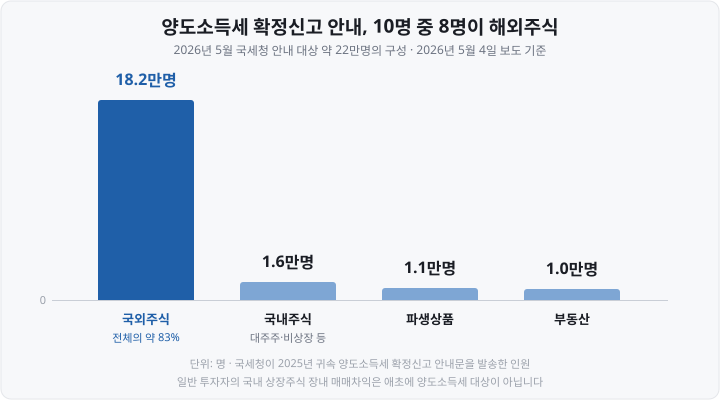
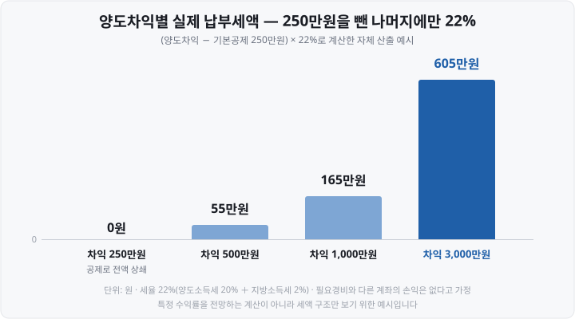
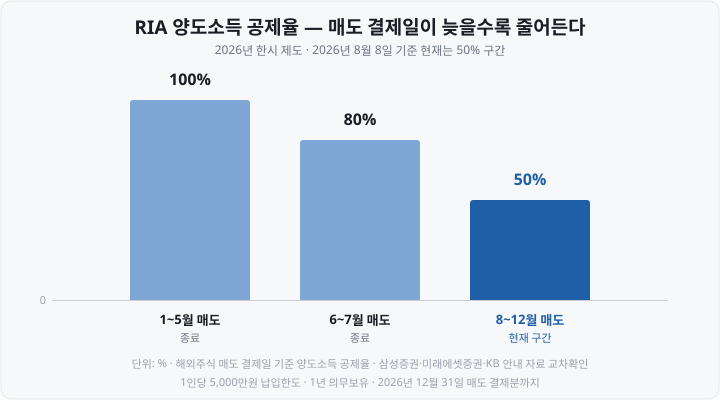

저는 미국 주식을 처음 팔았을 때 <mark>세금은 알아서 떼 가는 줄 알았습니다.</mark> 국내 주식을 사고팔 때 아무 신고도 안 해 봤으니까요. 그런데 해외주식은 다르더군요. **아무도 대신 계산해 주지 않고, 이듬해 5월에 내가 신고해야** 합니다.

다행히 그때는 차익이 크지 않아 넘어갔지만, "그럼 얼마부터 내는 거지? 환율은 언제 걸로 하지?"라는 질문이 계속 남았습니다. 오늘은 그때 제가 궁금했던 순서 그대로, 계산 → 250만원 공제 → 환율 → 신고 절차를 따라가 보겠습니다. 그리고 <mark>2026년 올해만 열려 있는 감면 제도</mark>도 함께 정리했습니다.

&nbsp;

【📍 해외주식은 '누구나' 신고 대상입니다】

숫자부터 놓고 시작하겠습니다. 2026년 5월, 국세청이 양도소득세 확정신고 안내문을 보낸 사람이 약 22만명이었는데 그 구성이 이랬습니다.

국내주식으로 안내를 받은 사람은 1만 6,000명뿐입니다. <mark>일반 투자자가 국내 상장주식을 장내에서 사고팔아 남긴 차익은 애초에 양도소득세 대상이 아니기 때문</mark>입니다.

반면 해외주식은 **금액이 크든 작든 이익이 났으면 누구나** 대상입니다. 여기서 말하는 해외주식에는 **ETF**(Exchange Traded Fund, 상장지수펀드)까지 포함되는데, 정리하면 이렇습니다.

| 무엇을 샀나 | 세금 |
| :--- | :--- |
| 미국·일본 등 해외 상장 개별 주식 | 양도소득세 22% |
| 해외 상장 ETF(미국 상장 S&P500 ETF 등) | 양도소득세 22% |
| 해외 상장 **DR**(Depositary Receipt, 주식예탁증서) | 양도소득세 22% |
| 국내 상장 해외지수 ETF | **양도세 아님** — 배당소득세 15.4% |

마지막 줄을 특히 짚고 싶습니다. 같은 S&P500을 담아도 <mark>미국에 상장된 ETF를 사면 양도소득세, 국내에 상장된 ETF를 사면 배당소득세</mark>로 세금의 종류가 바뀝니다.

참고로 납세 의무자에는 조건이 하나 있습니다. 소득세법 제118조의2는 "양도일까지 계속 5년 이상 국내에 주소 또는 거소를 둔 거주자"로 대상을 한정합니다. 국내에 쭉 살고 있다면 해당됩니다.

&nbsp;

【① 계산 — 네 번 빼고 22% 곱하기】

계산식 자체는 어렵지 않습니다.

▶ (**양도가액** − **취득가액** − **필요경비** − **기본공제 250만원**) × **22%**

**필요경비**는 매매수수료, 현지 거래세처럼 거래하느라 실제로 쓴 비용입니다. 증권사가 주는 양도소득 명세에 대개 이미 반영돼 있습니다.

**22%는** 양도소득세 20% ＋ 지방소득세 2%(양도세액의 10%)입니다. 국내주식과 다른 점이 하나 있는데, <mark>국외주식의 세율은 과세표준이 얼마든 20% 단일</mark>이라는 것입니다. 국내주식 대주주에게 붙는 "3억원 초과분 25%" 같은 누진 구간이 없습니다.

세율이 10%가 되는 예외 조항이 하나 있긴 한데, <mark>해외 증시에 상장된 국내 중소기업 주식</mark>일 때만 해당합니다. 애플·엔비디아처럼 외국 법인이 발행한 주식은 규모와 무관하게 20%입니다.

차익 규모별로 실제 세금이 얼마인지 계산해 봤습니다.

차익이 정확히 250만원이면 세금은 0원, 500만원이면 초과분 250만원에만 22%가 붙어 55만원입니다.

제가 처음에 헷갈렸던 게 이 부분인데요. <mark>250만원은 세금을 깎아 주는 금액이 아니라 과세 대상에서 빼 주는 소득</mark>입니다. "250만원을 안 내도 된다"가 아니라 "250만원어치 이익은 없던 걸로 친다"는 뜻이죠.

&nbsp;

【② 250만원 공제에 붙은 세 가지 규칙】

이 공제에는 놓치기 쉬운 규칙이 셋 있습니다.

**첫째, 국내주식과 합쳐 1년에 한 번입니다.** 2020년 귀속분부터 국내주식과 국외주식의 양도손익을 통산하게 되면서, 기본공제도 둘을 합해 연 250만원 한 번으로 정리됐습니다. 각각 250만원씩 500만원이 아닙니다. (파생상품·부동산은 별개 묶음이라 따로 250만원입니다.)

**둘째, 손실은 같은 해 안에서만 상계됩니다.** A에서 1,000만원 벌고 B에서 800만원 잃었다면 그 해 양도소득은 200만원입니다. 통산 대상에는 양도세 과세 대상인 국내주식(대주주 보유분·비상장·장외거래)의 손익도 함께 들어갑니다.

**셋째, 남은 공제도 남은 손실도 이월되지 않습니다.** 올해 차익이 100만원이라 공제를 다 못 썼어도 내년으로 넘어가지 않고, 올해 500만원 손실을 봤어도 <mark>내년 이익에서 빼 주지 않습니다.</mark> 해외주식에는 이월결손금 제도가 없습니다.

셋째 규칙 때문에 같은 1,000만원 차익이라도 한 해에 몰아 실현하느냐 두 해에 나누느냐로 세금이 달라집니다. 다만 이건 <mark>계산 구조가 그렇다는 설명이지, 세금에 맞춰 매도 시점을 정하라는 이야기가 아닙니다.</mark> 미루는 동안의 가격 변동이 세금보다 훨씬 클 수 있으니까요.

&nbsp;

【③ 환율 — 체결일이 아니라 '결제일'】

달러 거래를 원화 세금으로 바꾸려면 환율이 필요한데, 규칙은 하나입니다. <mark>기준은 체결일이 아니라 **결제일**입니다.</mark>

- **취득가액**: 매수 결제대금이 나간 날의 기준환율
- **양도가액**: 매도 결제대금이 들어온 날의 기준환율

국세청 질의회신(국제세원-229, 2010년 5월 10일)이 "증권회사를 통해 매매한 경우 결제대금이 입금·출금된 날의 환율을 적용한다"고 밝히고 있습니다.

여기서 두 가지가 따라옵니다.

**첫째, 내가 실제 환전한 환율은 세금과 무관합니다.** 매도대금이 들어온 뒤 원화로 바꿀 때까지의 환차익·환차손은 과세표준에 안 들어갑니다. 반대로 <mark>주가는 제자리인데 원/달러 환율이 오른 사이에 팔았다면, 원화 기준 차익이 생겨 세금이 나올 수 있습니다.</mark> 달러로는 본전인데 세금은 나오는 상황이죠.

**둘째, 연말 매도는 귀속 연도가 갈립니다.** 미국 주식은 2024년 5월 28일부터 결제 주기가 **T+1**(체결 다음 영업일)로 짧아졌지만, 12월 마지막 거래일에 팔면 결제가 해를 넘길 수 있습니다. 결제일 기준이니 <mark>12월 31일에 판 주식이 '내년 소득'이 되는 일</mark>이 생깁니다.

그래서 증권사들이 매년 12월에 "해외주식 양도소득 귀속 최종 매매일" 공지를 냅니다. 연말에 손익을 정리할 생각이라면 그 공지부터 확인하시는 게 안전합니다.

&nbsp;

【④ 신고 — 5월 한 번, 예정신고는 없습니다】

부동산은 판 뒤 두 달 안에 예정신고를 해야 하지만, <mark>해외주식은 예정신고가 없고 이듬해 5월 확정신고 한 번으로 끝납니다.</mark>

| 항목 | 내용 |
| :--- | :--- |
| 대상 기간 | 1월 1일 ~ 12월 31일(결제일 기준) |
| 신고·납부 | 다음 해 **5월 1일 ~ 5월 31일** |
| 2026년 | 5월 31일이 일요일이라 **6월 1일(월)까지** |
| 2027년 | 2026년 매도분을 **5월 31일(월)까지** |
| 방법 | 홈택스·손택스 전자신고 또는 세무서 서면 제출 |
| 분납 | 세액 2,000만원 이하는 1,000만원 초과분, 2,000만원 초과는 50%까지 2개월 내 |
| 지방소득세 | 국세보다 **2개월 뒤까지** 별도 신고·납부(위택스) |

표에서 하나 짚고 갑니다. <mark>양도소득세는 신고 기한과 납부 기한이 같은 날</mark>입니다. 신고만 해 두면 나중에 고지서가 오는 게 아니라, 내가 계산한 세액을 신고서와 함께 그날까지 내야 합니다. 2026년 신고분이면 **6월 1일에 신고와 납부를 동시에**, 분납분과 지방소득세가 **8월 3일**이었습니다. 분납도 따로 신청하는 게 아니라 <mark>확정신고서에 함께 적어 신청</mark>합니다.

**안 하면?** 무신고 가산세가 납부세액의 **20%**(부정한 방법이면 40%), 납부지연 가산세가 **1일 0.022%** 붙습니다. 다만 <mark>차익이 250만원 이하라 낼 세금이 0원이면 무신고 가산세도 0원</mark>입니다. 가산세가 납부세액에 비례하기 때문입니다.

실제로 신고하는 길은 두 가지입니다.

**① 증권사 대행** — 대부분의 증권사가 매년 3~4월경 무료 대행 신청을 받습니다. 여러 증권사를 썼어도 타사 거래내역까지 합산해 신고해 주는 곳이 많습니다. 신청 기간이 짧으니 4월 안에 공지를 봐야 합니다. 대행을 맡겨도 최종 책임은 본인에게 있습니다.

**② 홈택스 직접 신고** — 로그인 후 `신고/납부` → `양도소득세` → 국외주식 확정신고로 들어가, 국가·종목명·취득일·양도일·취득가액·양도가액을 입력합니다. 증권사 앱의 '양도소득세' 메뉴에서 받은 계산 내역을 증빙으로 첨부하면 됩니다. 이때 <mark>기본공제 250만원이 자동으로 안 들어가는 경우가 있어</mark> 입력값을 직접 확인하는 게 좋습니다.

&nbsp;

【🔥 2026년에만 열려 있는 창 — RIA 공제】

여기부터는 **올해에 한정된** 이야기입니다. 2026년 3월 17일 국회 기획재정위원회를 통과한 조세특례제한법 개정으로, <mark>해외주식을 팔아 국내 주식에 다시 투자하면 그 양도소득의 일부를 공제해 주는 제도</mark>가 생겼습니다. 계좌 이름이 **RIA**(Reshoring Investment Account, 국내시장 복귀계좌)입니다.

공제율은 **매도 결제일이 언제냐**에 따라 계단식으로 줄어듭니다.

제도의 뼈대는 이렇습니다.

| 항목 | 내용 |
| :--- | :--- |
| 대상 주식 | **2025년 12월 23일 기준 보유**분(이후 신규 매수분 제외) |
| 한도 | 1인당 **5,000만원** — 차익이 아니라 계좌에 넣는 **매도대금** 기준, 전 증권사 합산 |
| 계좌 | 금융회사별 1인 1계좌, 2026년 3월 23일 개설 시작 |
| 투자 대상 | 국내 상장주식·DR, 국내주식형 ETF·ETN, 국내주식형 펀드, 예탁금 |
| 의무 보유 | 납입일부터 **1년** — 그전에 인출하면 공제분을 다시 납부 |
| 기한 | 2026년 12월 31일 매도 결제분까지 |
| 농어촌특별세 | **비과세** |

표의 **ETN**(Exchange Traded Note, 상장지수증권)은 증권사가 발행해 지수를 따라가는 상장 증권으로, 운용사가 실제 자산을 담아 굴리는 ETF와 달리 발행 증권사의 신용위험이 따릅니다.

주의할 점도 분명합니다. <mark>2026년 중에 다른 일반 계좌에서 해외주식을 새로 사면 그 금액만큼 혜택이 줄어듭니다.</mark> "팔았다 다시 사는" 것을 막는 장치죠. 또 1년 의무 보유 중에 <mark>단 1원이라도 인출하면 혜택이 사라집니다.</mark>

시점도 정리해 둡니다. 이 공제는 2026년 매도분에 적용되니, 실제로 반영되는 자리는 <mark>2027년 5월 확정신고</mark>입니다.

⚠️ 이 제도는 국내 증시로 자금을 되돌리려는 한시 조치이고, 저는 이걸 이용하라고 권하지 않습니다. 1년간 돈이 묶이고 투자 대상이 국내 자산으로 제한됩니다. 세금 50%를 아끼는 대신 1년치 시장 위험과 기회비용을 지는 구조라, <mark>세금만 보고 결정할 일은 아닙니다.</mark>

&nbsp;

【💡 배당은 아예 다른 세금입니다】

마지막으로 자주 섞이는 것을 갈라 두겠습니다.

| | 매매차익 | 배당금 |
| :--- | :--- | :--- |
| 세금 | 양도소득세 | 배당소득세 |
| 세율 | 22% | 현지 원천징수(미국 15%) |
| 기본공제 | 연 250만원 | 없음 |
| 신고 | 다음 해 5월 본인 신고 | 원천징수로 종결 |
| 금융소득종합과세 | **합산 안 됨** | **합산됨**(연 2,000만원 초과 시) |

미국 주식 배당은 현지에서 15%가 떼입니다. 국내 배당소득세율이 14%(지방세 제외)라 현지에서 더 많이 뗀 셈이어서 국내에서 추가로 걷지 않습니다.

**한 가지 더** — 가족 간 증여를 활용한 계산도 2025년에 바뀌었습니다. 배우자·직계존비속에게 증여받은 자산을 일정 기간 안에 팔면 <mark>증여자의 원래 취득가액으로 차익을 계산</mark>하는 **이월과세**가 적용되는데, 2025년 1월 1일 이후 증여분부터 **주식도 대상에 포함**됐습니다(주식은 양도일 전 1년 이내 증여분 한정). 예전에 알려진 방법이 그대로 통하지 않습니다.

&nbsp;

【📝 오늘의 정리】

- **대상**: 해외 상장 주식·ETF·DR의 매매차익. 국내 상장 해외지수 ETF는 다른 세금입니다.
- **계산**: (양도가액 − 취득가액 − 필요경비 − 250만원) × 22%, 국외주식 세율은 단일입니다.
- **250만원**: 국내주식과 합해 연 1회, 공제도 손실도 이월 없음.
- **환율**: 체결일이 아니라 **결제일** 기준. 연말 매도는 귀속 연도를 확인하세요.
- **신고**: 예정신고 없이 이듬해 5월. 증권사 대행 신청은 3~4월입니다.
- **2026년 한정**: RIA 공제(8~12월 매도분 50%)는 내년 5월 신고에 반영됩니다.

세금은 시장처럼 예측할 대상이 아닙니다. <mark>규칙이 공개돼 있고 계산 결과가 정해져 있습니다.</mark> 12월과 5월에 한 번씩 자기 계좌의 해외주식 손익을 들여다보는 습관만으로도 충분합니다.

다음 편에서는 **주식 데이터를 무료로 보는 곳** — 한국거래소 정보데이터시스템·금융투자협회·**DART**(Data Analysis, Retrieval and Transfer System, 전자공시시스템)에서 무엇을 어떤 경로로 볼 수 있는지 다루겠습니다.

&nbsp;

【🔗 함께 보면 좋은 글】

- [ETF 총보수와 세금 — 실제로 내 수익에서 얼마가 빠지나](https://blog.naver.com/hdglace/224367512124) — 국내 상장 해외 ETF와 미국 직접상장 ETF의 세금 차이
- [연금저축·IRP·ISA — 세금 아끼며 ETF 투자하는 절세 계좌 3종](https://blog.naver.com/hdglace/224357252306) — 계좌를 바꾸면 세금이 어떻게 달라지나
- [미국 증시 시간 — 서머타임·프리마켓·애프터마켓 한국시간 총정리](https://blog.naver.com/hdglace/224365483110) — 연말 매도 시점을 잡을 때 함께 볼 거래·결제 일정
- [ADR이란 무엇인가 — 한국 주식이 미국에서 거래되는 법](https://blog.naver.com/hdglace/224360141124) — **ADR**(American Depositary Receipt, 미국주식예탁증서)도 해외주식이라 양도세 대상입니다

&nbsp;

【📊 데이터 출처 및 기준일】

| 항목 | 내용 | 출처·기준일 |
| :--- | :--- | :--- |
| 확정신고 안내 대상 | 약 22만명(국외주식 18.2만·국내주식 1.6만·파생상품 1.1만·부동산 1.0만) | 국세청 안내 관련 보도, 2026년 5월 4일 |
| 신고·분납 기한 | 2026년 6월 1일(5월 31일 일요일), 분납·지방소득세 8월 3일 | 국세청 안내, 2026년 5월 기준 |
| 세율·공제 | 22%(양도세 20%＋지방세 2%), 기본공제 연 250만원 | 국세청 및 증권사 안내 교차확인, 2026년 8월 |
| 국외주식 세율 구조 | 20% 단일, 누진 구간 없음(10% 예외는 해외 증시에서 거래되는 국내 중소기업 주식에 한정, 외국법인 주식은 제외) | 소득세법 제118조의5, 2026년 8월 |
| 납세의무자 | 양도일까지 계속 5년 이상 국내에 주소·거소를 둔 거주자 | 소득세법 제118조의2, 2026년 8월 확인 |
| 손익통산·기본공제 합산 | 국내주식＋국외주식 통산, 기본공제 합산 1회 | 2019년 개정세법(2020년 귀속분부터) |
| 환율 기준 | 매수·매도 결제일의 기준환율 | 국세청 질의회신 국제세원-229, 2010년 5월 10일 |
| 미국 결제주기 | T+1 | 미국 현지 결제제도 변경, 2024년 5월 28일 시행 |
| 가산세 | 무신고 20%(부정 40%), 납부지연 1일 0.022% | 국세청 안내, 2026년 5월 기준 |
| 지방소득세 기한 | 국세 신고기한 ＋ 2개월 | 2020년 1월 1일 이후 성립분 |
| RIA 제도 | 2026년 3월 17일 기재위 통과, 3월 23일 개설 시작, 2025년 12월 23일 보유분 대상, 한도 5,000만원, 공제율 1~5월 100%·6~7월 80%·8~12월 50%(매도 결제일 기준), 의무보유 1년, 농특세 비과세 | 기획재정부 발표(2025년 12월 24일·2026년 1월 20일), 세무 전문지 보도, 삼성증권·미래에셋증권·유안타증권 안내 및 약관, KB 자료 교차확인 — 2026년 8월 8일 확인 |
| 환헤지 파생상품 공제 특례 | 투자금액의 5%, 1인당 500만원 한도 | 같은 조세특례제한법 개정, 2026년 3월 17일 기재위 통과 |
| 해외 배당 과세 | 미국 현지 원천징수 15%, 국내 추가 원천징수 없음, 이자·배당 연 2,000만원 초과 시 금융소득종합과세 | 국세청 및 증권사·운용사 자료, 2026년 8월 |
| 증여자산 이월과세 | 2025년 1월 1일 이후 증여분부터 주식 포함(양도일 전 1년 이내 증여분) | 2025년 개정세법(양도소득세 분야) |
| 2026년 세법개정안 | 해외주식 양도세율·기본공제 개정 사항 없음 | 2026년 8월 3일 발표분 분석 자료 |

양도차익별 세액(0원/55만원/165만원/605만원)은 **(차익 − 250만원) × 22%의** 계산식으로 낸 자체 산출이며, 필요경비와 다른 계좌 손익은 없다고 가정했습니다.

&nbsp;

⚠️ **면책 안내** — 이 글은 해외주식 과세 제도를 설명하기 위한 **교육·정보 제공 목적**의 자료이며, 특정 종목·상품·계좌의 매매나 가입을 권유하지 않고 상품 간 우열을 판단하지 않습니다. 본문의 수치와 제도 내용은 위 기준 시점의 값으로 이후 변동될 수 있으며, 특히 RIA는 2026년 한시 제도라 세부 요건이 금융회사별 안내와 다를 수 있습니다. 세금은 개인의 거주 요건·소득 구조·거래 내역에 따라 달라지므로, 실제 신고 전 국세청 안내와 거래 증권사 자료를 확인하시고 구체적인 사안은 세무 전문가와 상담하시기 바랍니다. 투자 판단과 그 결과에 대한 책임은 투자자 본인에게 있습니다.

&nbsp;

#해외주식양도소득세 #250만원공제 #해외주식세금 #양도소득세신고 #RIA계좌 #서학개미 #미국주식세금 #투자공부 #주식초보 #재테크
